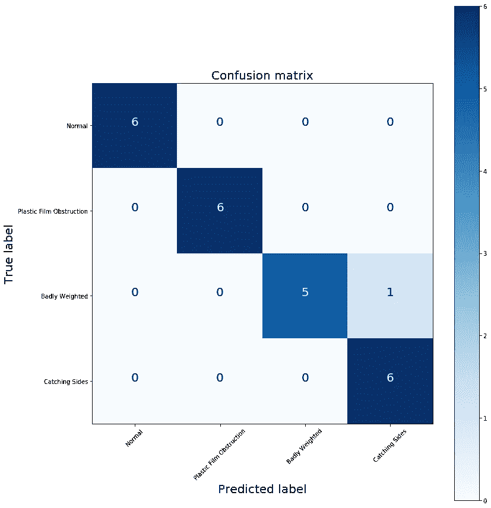

# 启动 ML 项目——使用声音对风扇故障进行分类

> 原文：<https://towardsdatascience.com/bootstrapping-an-ml-project-using-sound-to-categorise-fan-failures-9ce04694ee85?source=collection_archive---------30----------------------->

有时候，与其瞄准宏伟的计划，不如先做些简单有趣的事情来证明它是可行的。

Start a project to only cover the core essentials first. Photo by [LUM3N](https://unsplash.com/@lum3n?utm_source=medium&utm_medium=referral) on [Unsplash](https://unsplash.com?utm_source=medium&utm_medium=referral)

# 我什么意思？

任何开始数据科学项目的人通常都会对其潜力感到兴奋，并会伸手摘星星，在你知道之前，你已经有了一个极其雄心勃勃和复杂的项目，但你不知道从哪里开始。结果是你永远不会开始，因为你永远不会得到足够的“钩子”。

> **注意:**如果你想直接进入机器学习项目，那么可以随意跳过。

## 钩子？

就像你需要一条鱼咬住鱼钩，这样你才能成为一名成功的渔夫，在你认为你能成功之前，这些事情你都需要先咬上一口。因此，例如，如果您要制作一个仅在有人走过时(而不是车辆、宠物、树叶或野生动物)才打开的安全摄像头，那么过一会儿您就会看到以下列表:

*   夜视摄像头(因为安全灯关闭时它看不见)
*   一盏红外线灯照亮该区域，以便摄像机可以看到它
*   安全灯
*   能够以足够快的速度处理帧的便携式设备或计算机
*   一个特殊的额定电源电压开关，可以使用便携设备的 [GPIO](https://en.wikipedia.org/wiki/General-purpose_input/output) 引脚打开和关闭
*   外部配件，包括防水盒和处理设备的电源接口
*   相机上记录的大量数据可以用来训练你的模型
*   标记所有的数据，这样它就知道一个人是用来训练你的模型的

唷！这是一个很长的列表，这只是我从几分钟内得到的，我们甚至没有讨论我们将使用什么机器学习解决方案或输出或控制系统来设置它。

你现在可以看到为什么有人可能永远不会开始这样做，通常这种类似的想法是阻止公司投资数据科学的原因。给他们一个巨大的工作量估计来实现他们的宏伟愿景，他们可能会看起来[病得像条狗](https://www.dictionary.com/browse/sick-as-a-dog)并要求你离开。

让这种想法持续太久，你可能会陷入[工具箱谬误](https://medium.com/too-much-me/thetoolboxfallacy-883c4ff5f9b4)(见下文)，并且永远不会完成任何属于你自己的数据科学项目(可能会复制或跟随某人已经完成的项目)。造成这种情况的原因是:

> 你一下子目标定得太大了。太多的事情依赖于其他事情准备好了，这从来没有发生过。

将您的项目分解成您想要测试的关键概念，并从那里开始。其他的都是次要的。

# 工具箱谬误

这有点跑题，但在这里非常相关(而且通常是从不开始任何事情的原因)。这是我最近遇到的事情，我必须说这确实是我放弃许多爱好或从未完成我想做的事情的原因。

从本质上说，要做某事，你需要其他事情已经发生。例如，你需要 X 才能做 y。有一个非常好的视频(贴在这里)很好地解释了这一点。

因此，如果你想成为一名数据科学家，你需要研究数据科学并坚持下去，否则很快你就会成为一名数据科学家。

信不信由你，多年来我一直把装订书籍作为一种爱好，但我已经很多年没有这样做了。我还能认为自己是一个吗？也许不是。

# 回到核心，保持简单

回到我们关于安全灯的例子，把它分解成核心概念“我能通过我在摄像机上看到的东西来控制什么吗？”为了解释这一核心概念，您只需要来自开放数据集中的一些视频数据(或静态图片)，应用基于视觉的系统对物体进行分类，并根据它们在屏幕上的位置来决定是否打开 LED。你甚至可以让它变得简单，只需要把你的算法标记在一个。csv”文件，对于图像 X 或者在视频上的时间 X，它将打开某些东西。

这只需要:

*   一组免费的数据
*   一台计算机(你主要的数据科学一台就行)
*   核心算法(你可以在别人的作品上构建，或者研究并构建你自己的)
*   也许是一个发光二极管打开或关闭

这更可行，也更容易计划和分解到工作中。尝试从这一点，很快…

> V oila！你做过一些数据科学！

当然，它不会在晚上工作或经受住外面的天气，但你已经做了核心部分，其他部分是你以后可以添加的。没有这一核心功能，其他部分就毫无意义。

祝贺您完成了您的第一个[【概念验证】](https://www.dictionary.com/browse/proof-of-concept?s=t) (PoC)。

现在，让我们来谈谈我的迷你项目，看看球迷窃窃私语(因为善于倾听球迷，以确定他们的烦恼)。这是一个不错的小项目，涵盖了“可能吗？”，使事情变得简单，而且我能够以很少的成本做到这一点。我对扩展和填充它来覆盖我知道它薄弱的领域不感兴趣。

Yes, I am playing on the whole “horse whispering” thing. Photo by [richard savickas](https://unsplash.com/@richsavas?utm_source=medium&utm_medium=referral) on [Unsplash](https://unsplash.com?utm_source=medium&utm_medium=referral)

# 范窃窃私语？

有没有抱怨过你的家用电器坏了，客户服务部门让你拿着设备对着电话，这样他们就可以听了？或者你有没有遇到过这样的情况:你的车出了问题，机械师不用打开发动机罩就能诊断出问题所在？在这两种情况下，他们都在寻找与特定故障相关的特征噪音或声音。

电机和风扇故障的最大来源是轴承问题(例如缺乏润滑)。这通常会导致电机/风扇的声音轮廓发生变化(通常是典型的呜呜声或研磨声)。这实际上是一个很多地方都有兴趣通过听来探测的领域(这里和这里)。

但是为什么倾听有用呢？在第一个例子中，制造商可以快速诊断某些故障，而无需设备进入或维修工程师外出。这一切都节省了成本，因为呼叫在时间和金钱上可能是昂贵的。另一个优势是，如果您知道家用电器上的电机已经或即将出现故障，您可以确保服务工程师携带正确的部件(这对拥有大量不同产品组合的制造商来说非常重要),从而再次节省成本。

# 核心项目问题

> 对于一个人来说，可能需要很多年才能识别出机器发出的噪音是什么意思，但你训练机器学习做到这一点有多容易呢？

这是我希望通过 PoC 解决的指导性问题，因此我将重点放在诊断电风扇的故障上，因为它更容易安全地获取和诱发故障。

我在网上购买了一台风扇，然后让它出现了几个(可逆的，我不是钱做的)故障，它们是:

*   **正常**:风扇在正常状态下运行，没有故障(当我提到故障或类别时，我确实包括在那里)
*   **塑料薄膜阻塞**:一块塑料被引入旋转翅片的路径
*   (想想你小时候放在自行车辐条上的卡片)
*   **重量不佳**:一个重物被连接到一个鳍上，使其失去平衡
*   **捕捉侧**:一个小的延伸部分被添加到一个翅片上，因此它开始摩擦风扇外壳的内部

现在，所有这些故障听起来微不足道，但通常在严重故障之前，在恶化到故障点之前，首先会出现一个小麻烦，这应该说明，如果可以检测到一个小的不便，那么通过早期干预就可以完全避免一个更具破坏性的问题。

然后，我开始在三种可用的风扇速度(低速、中速和高速)下记录这些故障的十秒钟片段，以增加噪声水平和特征的可变性。我用我的手机来模拟录音设备的质量，类似于我的第一个例子(客户将设备放在手机上，以便客户服务可以听到它)。每个组合重复五次，产生 60 个样本。对于故障模式的每一次重复，我会移除故障并重新应用它，因此记录中会引入一点可变性。

我选择了五个重复，这样我可以在其中的三个上训练，剩下的两个将用于测试集(36 个训练和 24 个测试文件)。

当时的情况是:

*   执行[快速傅立叶变换](https://en.wikipedia.org/wiki/Fast_Fourier_transform)以将声音转换成模型可以被训练的频谱
*   通过使用大约 0.1 kHz 宽的滚动平均值平滑得到的频谱以减少噪声
*   然后，我只以 0.01 kHz 的步长从 1 到 18 kHz 取数据点
*   这样做是为了标准化和减少数据集的大小
*   然后我可以训练一个[随机森林](https://en.wikipedia.org/wiki/Random_forest)分类器，看看它是否能区分这四个类别
*   记得我也改变了风扇速度，所以希望分类器不会受到影响
*   然后，我在模型上使用了测试集，这样我就可以得到一些结果来比较它在看不见的数据上的表现
*   预测值和实际值显示在[混淆矩阵](https://en.wikipedia.org/wiki/Confusion_matrix)中
*   这些将实际值(真实值)与预测值进行对比
*   如果模型是完美的，那么所有的值都在一条对角线上
*   任何偏差都会告诉你它错误地标注了哪些类，以及它们应该属于哪个组
*   在分类问题中，这通常是一个非常强大的调试工具

Photo by [Josh Kahen](https://unsplash.com/@jpphotosla?utm_source=medium&utm_medium=referral) on [Unsplash](https://unsplash.com?utm_source=medium&utm_medium=referral)

# 哒哒！

看看下面的结果，他们还不算太差！考虑到模型的基础，我们没有对噪声做任何复杂的处理(比如背景噪声的去除)。

A [confusion matrix](https://en.wikipedia.org/wiki/Confusion_matrix) (or [contingency table](https://en.wikipedia.org/wiki/Contingency_table) depending who you talk to) of results. Perfect classification is to have all items on the diagonal.

# 但是等等，还有更多！

关于随机森林的一个有趣的事情是能够查询它使用什么特性来做决定。对我们来说，这些是模型用来分配类别的频率，更有趣的是，你可以确定哪些频率对于识别某些类别比其他类别更重要。(注意:这个特性重要性做得有点粗糙，但传达了主要观点)。

为了显示这些重要性，我绘制了一个图表，其中包含每个类别的示例，并为每个被归类为重要的频率画了一条垂直虚线。这给出了:

Feature importances for classifying fan classes

现在你可以明白为什么这个模型可以很容易的区分出不同的类，因为它们的形状和能力都很不同。您还可以查看每个类别的重要频率(如上图所示):

*   “抓边”(红色):低频
*   “正常”(蓝色):中频
*   “加权差”(绿色):中频和高频
*   “塑料薄膜障碍”(黄色):频率跨越整个可用范围

# 拿走

使用简单的技术，可以训练机器学习算法来几乎完美地区分每个故障类别(95.8%的准确率)，而且还可以确定哪些频率对于分类每个故障是重要的。

这个例子的缺点是只使用了一个风扇，背景噪声被最小化并保持一致，并且分析/数据准备是基本的。一个更严格的模型将涵盖这些领域，并可以发展成为一个有趣的小演示(也许当我有更多的空闲时间)。

我希望您喜欢使用机器学习来解决实际问题的短暂尝试！