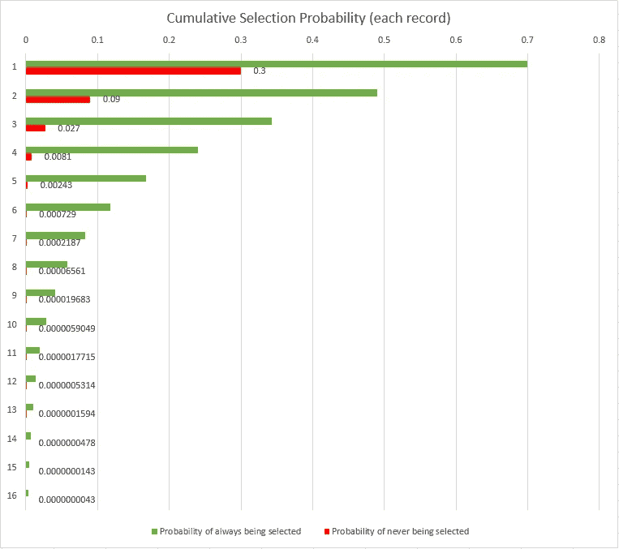
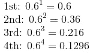
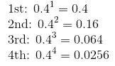
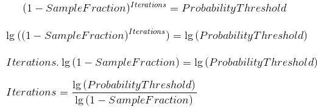
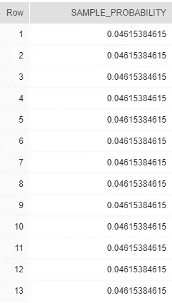
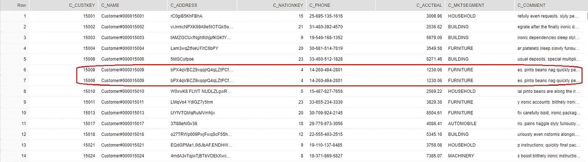

# 雪花中的规模自举

> 原文：<https://towardsdatascience.com/bootstrapping-at-scale-in-snowflake-3e04a225ff5e?source=collection_archive---------30----------------------->

有时候，当统计学家在抽样数据时，他们喜欢在获取下一个数据之前先把每一个数据放回去。这被称为带有替换的随机抽样**，相对于没有**替换的随机抽样**，这是更常见的事情。**

一个在野外这样做的例子是在一个随机森林的训练中，这是我写这篇文章的原因。

所有的雪花内置采样功能都是围绕采样而进行的，没有替换。这意味着您只需对每一行做一次决定——根据情况决定是进还是出。

自举的困难在于，这有点像把骑自行车作为一种爱好；正确地做它是相当昂贵的。

一种简单但完全准确的引导 10，000 行的方法是:

这使得源表中的所有 150，000 个客户每次都有均等的机会被选中，不管他们已经被选中了多少次。

一定有更好的办法！答案当然是我们需要一个“足够好”的替代方案。毕竟我们是在采样，所以如果这意味着性能的提高，精度水平通常是灵活的。

所以让我们看看我们是否能想出一个不同的方法。

目标是引导“雪花 _ 样本 _ 数据”中 150，000 条记录的 60%。“TPCH_SF1”。“客户”表。

我们希望在表上进行一次迭代(从算法的意义上来说)，因此如果可能的话，在每一行上只做一次决策。我们需要想出一种方法来多次选择它，但要保持在样本的参数范围内。

一个简单的修改，如果我们任意地决定十次扫描表就足够了，那么我们可以每次只选择 6%,就像这样:

这一点都不好。首先，我们对每一行都处理了十次，我们根本没有真正量化不准确性，我们只是编造了一个数字。

所以让我们看看每次迭代时每一行发生了什么，我们将考虑两个极端:总是被选中，从不被选中。



经过一定次数的迭代后，不可避免地会有一个点(就像我们在澳大利亚说的那样)，每个记录都有一个“公平的结果”。所以我们需要一种划定界限的方法。出于本练习的目的，让我们允许用户指定两件事:

1.  样本的所需大小，以原始表的百分比表示
2.  一个百分比值，当永远不会被选中的概率低于它时，我们停止迭代。想象这是一条水平线，你可以放在上面图表的某个地方。

# 方程式时间！

提醒一下，目标是 60%的样本。

暂时忘记“替换”部分，每次选择一行的概率:



或者**没有**被选中，只是翻转一下:



1–0.6 = 0.4

右边的值是我们希望用户指定的。正如你所看到的，它总是减少，我们将不断增加迭代，直到我们达到它。

因此，我们可以概括地表达这一点，然后求解它，以计算出我们应该进行多少次迭代:



太好了，现在我们有公式可以用了。

现在，让我们回到雪花。请记住，我们实际上并不想进行多次迭代。但是棘手的是，没有任何方法可以让一行在一个结果集中出现不止一次… ***还是有？！？！？！***

# 输入 UDTFs

我真的很喜欢[udtf](https://docs.snowflake.net/manuals/sql-reference/udf-js-table-functions.html)，他们有办法实现优雅的解决方案，而不是糟糕的样板文件。

看看这个:

我们可以用这个来一举两得。首先，它将应用该公式，根据我们发明的阈值计算出一个很好的迭代次数(即被选择的机会数)。

然后，礼貌地将样本分数除以该数，并写出该行数。

为了进行演示，UDTF 的输出本身如下所示:

```
select * from table(SAMPLE_PROBABILITY(0.6::double,0.00001::double))
```



公式说我们应该做 13 次迭代，0.6/13 = 0.0465384615

换句话说，我们将给予每行 13 次机会，每次尝试的概率为 0.04615384615。

我们需要做的就是像这样加入这个 UDTF:

的原始结果:

```
SELECT customer.*
FROM "SNOWFLAKE_SAMPLE_DATA"."TPCH_SF1"."CUSTOMER" customer,table(SAMPLE_PROBABILITY(0.6::double,0.00001::double))
```

实际上是 150，000 * 13 = 1，950，000 行，但是我们添加了 WHERE 子句:

```
where uniform(0::float, 1::float, random()) < SAMPLE_PROBABILITY
```

这会生成一个介于 0.0 和 1.0 之间的随机数，并删除低于阈值的行。

一个 100%正确的实现应该给我们 90，000 行(150，000 * 0.6)。这个(使用我选择的输入)似乎每次都能产生 89，000 到 91，000 之间的结果。

当然，正如我们所希望的那样，有可能出现重复。你甚至可以在搜索结果的第一页看到:



在我们的 150，000 表上，返回大约 90，000 条记录，在一个 x-small 仓库上是一秒多一点。