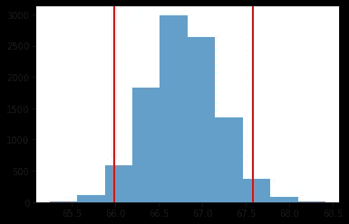
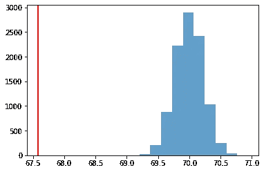

# 推断统计的自举

> 原文：<https://towardsdatascience.com/bootstrapping-for-inferential-statistics-9b613a7653b2?source=collection_archive---------21----------------------->

## 数据科学家的工具包—引导、采样、置信区间、假设检验


Photo by [Nathan Dumlao](https://unsplash.com/@nate_dumlao?utm_source=medium&utm_medium=referral) on [Unsplash](https://unsplash.com?utm_source=medium&utm_medium=referral)

Bootstrap 是一种强大的基于计算机的统计推断方法，它不依赖于太多的假设。仅仅从一个样本数据中形成一个抽样分布是很神奇的。我的统计推断不需要公式。不仅如此，事实上，它还广泛应用于其他统计推断如置信区间、回归模型，甚至机器学习领域。

在这篇文章中，我们将主要讨论两件事

1.  建立置信区间
2.  假设检验

[链接到 github 获取代码和数据集。](https://github.com/samarth-agrawal-86/data_scientist_toolkit)

# 一.置信区间

在现实世界中——我们并不真正了解我们的真实人口。因为这可能是地球上的全部人口，也可能是一家公司过去、现在和未来的交易。 ***我们只是不知道参数的真实值。*** 所以我们依靠抽样分布来推断这些大群体的一些参数。

假设检验和我们建立置信区间的方式有许多不同的名称:

*   t 检验
*   双样本 t 检验
*   z 检验
*   卡方检验

**可以使用自举方法来代替这些**。我们将通过一个示例来了解如何使用抽样分布为我们感兴趣的参数建立置信区间。

目标:假设我们想知道喝咖啡的人的平均身高是多少

## 方法 1:使用自举方法

我们有所有喝咖啡者的数据集。` coffee_full.csv

```
coffee_full = pd.read_csv(‘coffee_dataset.csv’)
```

由此，我将创建一个包含 200 个数据点的样本数据集。让我们称它为红色咖啡。这是因为在现实中我们从来没有得到完整的人口

```
coffee_red = coffee_full.sample(n=200)
```

在我们的数据集中喝咖啡的人的比例

```
[coffee_red[‘drinks_coffee’]==True].mean()---Output---
0.595
```

在我们的数据集中，喝咖啡的人的平均身高

```
coffee_red[coffee_red[‘drinks_coffee’]==True]['height'].mean()---Output---
68.119 inches
```

让我们从样本中引导出一个置信区间

```
# Let's first create an empty list for storing means of bootstrapped samples
boot_means = []# Let's write a loop for creating 1000 bootstrapped samples
for i in range(1000):
    bootsample = coffee_red.sample(200, replace=True)
    bootsample_mean = bootsample.[bootsample[‘drinks_coffee’]==True]['height'].mean()
    boot_means.append(bootsample_mean)boot_means = np.array(boot_means)
```

对于 95%的置信区间，我们从每一侧截取 2.5%，然后从抽样分布中截取这些值，这将给出我们认为参数“具有 95%置信度”的范围

```
# we build 95% in the middle portionnp.percentile(boot_means, 2.5), np.percentile(boot_means, 97.5)---Output---
(66.00, 67.59)
```

我们可以将这些值解释为我们认为人群中所有喝咖啡者的平均身高有 95%置信度的界限

为了形象化这一点，让我们看下图

```
plt.hist(boot_means, alpha=0.7);
plt.axvline(np.percentile(boot_means, 2.5), color='red', linewidth=2) ;
plt.axvline(np.percentile(boot_means, 97.5), color='red', linewidth=2) ;
```



Confidence Interval from our boot-sample mean

## 置信区间解释

我们有 95%的把握认为所有喝咖啡的人的平均身高在 66.0 到 67.59 英寸之间

让我们回过头来看看人口的实际意义是什么

```
coffee_full[coffee_full[‘drinks_coffee’]==True][‘height’].mean()---Output---
66.44 inch
```

我们可以看到我们最初的平均身高在 95%的置信区间内

## 方法 2:传统的内置方法(T 检验)

python 中已经内置了许多构建置信区间的传统方法。 [*这里有一个不错的 stackoverflow 链接*](https://stackoverflow.com/questions/31768464/confidence-interval-for-t-test-difference-between-means-in-python)

```
import statsmodels.stats.api as smX1 = coffee_red[coffee_red['drinks_coffee']==True]['height'] 
X2 = coffee_red[coffee_red['drinks_coffee']==False]['height']cm = sm.CompareMeans(sm.DescrStatsW(X1), sm.DescrStatsW(X2))print (cm.tconfint_diff(usevar='unequal'))
```

请注意，自举方法和使用传统方法内置的时间间隔几乎相同

# 二。假设检验

作为一名数据科学家，你必须首先将问题转化为所谓的假设。然后你需要用数据来证明哪个假设可能是真的。

假设我们想问一个问题，所有喝咖啡的人的平均身高是否大于 70 英寸。

这里我们将不得不定义什么叫做零假设和交替假设。零假设是在我们收集数据之前就被默认为真的东西。替代假设是我们试图用数据来证明的东西


Null and Alternate hypothesis for our use case

## 方法 1:检查是否可能为空(引导)

我们可以引导一组样本数据，反复计算样本均值，建立样本分布和置信区间，以确定在一定置信水平下总体均值的合理值

```
means = []for i in range(10000):
   bootsample = sample_df.sample(n=150, replace = True)
   bootsample_mean = bootsample[bootsample['drinks_coffee']==True]
   means.append(bootsample_mean['height'].mean())means = np.array(means)np.percentile(means, 2.5), np.percentile(means, 97.5)---Output---
(66.00, 67.59)
```

我们可以看到我们 95%的置信区间是(66.0，67.59)。值 70 超出了 95%的置信区间，因此可以肯定地说替代假设不成立。我们未能拒绝我们的无效假设

## 方法 2:模拟零假设

我们从假设零假设为真开始。如果我们要模拟最接近零假设的值，我们就会知道抽样分布是什么样的

在这种情况下，我们将从正态分布进行模拟

```
null_vals = np.random.normal(loc = 70, scale = np.std(means), size =10000)
```

70 是我们假设的平均值

这里的每个模拟图都代表了零假设的一个可能的平均值。我们现在可以问这样一个问题，样本均值落在这个分布的什么位置

```
plt.hist(null_vals, alpha=0.7);
plt.axvline(sample_mean, color = 'red', linewidth=2);
```



我们可以看到，它远远低于这个分布，我们不认为它可能来自这个零假设值。因此我们可以说我们的零假设是正确的

```
p_value = (null_vals > sample_mean).mean()
p_value--Output--
1.0
```

大 p 值表明我们不能拒绝我们的零假设。这意味着我们的人口平均数确实小于或等于 70

*   我们将 p 值计算为大于样本均值的模拟抽奖的比例
*   在此，p 值以图形方式表示大于突出显示红线的所有值的曲线下面积。基本上是所有的数据

## 结束语:

*   请随意写下您的想法/建议/反馈
*   一篇关于自举基础的内容丰富的文章- [自举方法介绍](/an-introduction-to-the-bootstrap-method-58bcb51b4d60)
*   T 检验的 Stackoverflow 链接-[T 检验的置信区间](https://stackoverflow.com/questions/31768464/confidence-interval-for-t-test-difference-between-means-in-python)
*   [Github 链接](https://github.com/samarth-agrawal-86/data_scientist_toolkit)