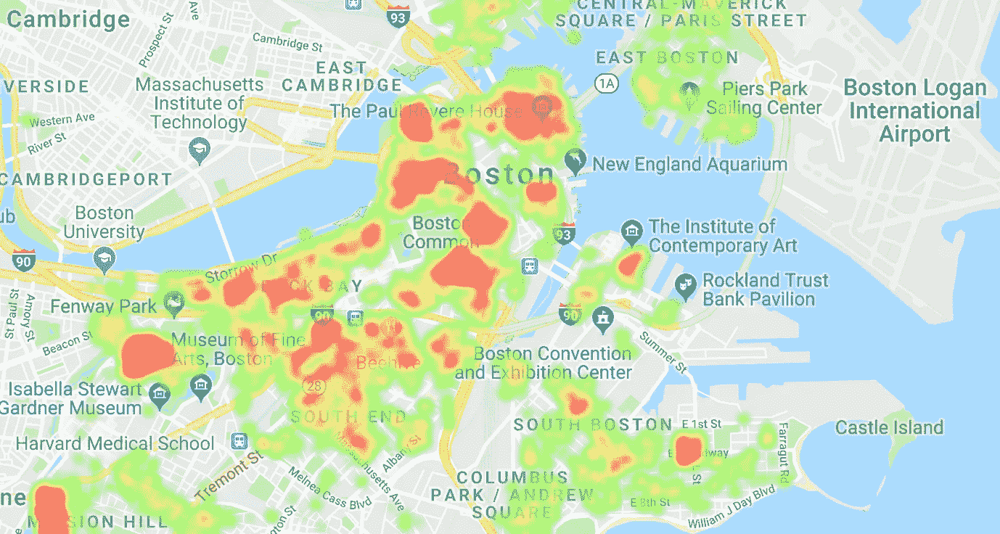
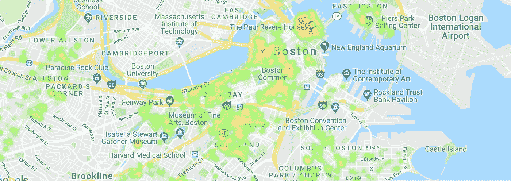
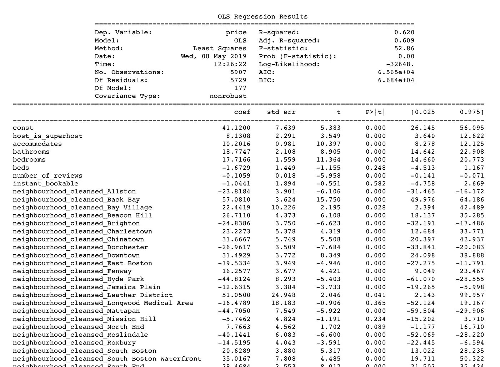

# 波士顿 Airbnb 分析

> 原文：<https://towardsdatascience.com/boston-airbnb-analysis-f46bcda1713a?source=collection_archive---------16----------------------->

波士顿到处都是历史名胜和古迹，充满了爱国主义精神。让自由之声响起来！下面简单分析一下波士顿 Airbnb。为了更详细的分析，这里是我的[笔记本](http://nbviewer.ipython.org/github/salitr/boston_airbnb_analysis/blob/c4d1559c8ca8b6ba7c0cfe6aa21d6f3bb27cb89b/boston_airbnb_analysis.ipynb)的 [Github 库](https://github.com/salitr/boston_airbnb_analysis)以及所有需要的代码。

Original photo by [Anthony Delanoix](https://unsplash.com/@anthonydelanoix) on [Unsplash](https://unsplash.com/)

# 介绍

答 irbnb 已经成为许多旅行者的首选，不仅是在世界各地寻找住宿的时候，也是在到达一个城市之前探索这个城市的时候。当考虑在目的地过夜时，人们会想要一个“家外之家”。因此，Airbnb 为市场重塑了一个独特的、鼓舞人心的蓝海，“蓝海战略是同时追求差异化和低成本以开辟新的市场空间和创造新的需求。”在蓝海，需求是创造出来的，而不是争夺出来的。Airbnb 为顾客和主人提供了双赢的局面；虽然顾客可以以较低的价格获得住宿，但主人可以通过出租他们的房产来赚钱。

为了进一步了解波士顿如何利用 Airbnb，我分析了波士顿 Airbnb 从 2019 年 2 月到 2020 年 2 月的房源。本分析中使用的数据集是根据*Creative Commons CC0 1.0 Universal(CC0 1.0)“公共领域专用”*许可证从 Airbnb 数据库内部获取的。该数据集报告了波士顿寄宿家庭的列表活动。该数据集包含超过 6150 个物业列表，包括但不限于主机信息，价格，邻里，设施，取消政策和评论。

分析及其结果只是观察性的，不是正式研究的结果。下面列出了一些常见的业务问题，引导我们通过分析来创建一个模型，该模型可以根据一些特征来预测租赁价格。

# 商业问题

1.波士顿所有 Airbnb 的价格在 2019 年全年如何波动？
2。波士顿 Airbnb 租赁价格的高峰/非高峰时间是什么时候？
3。Airbnb 房源最多的主机是谁？
4。波士顿哪些社区的挂牌数量最多？
5。波士顿最贵的社区是哪些？
6。哪些是基于平均评论数的热门社区
7。波士顿 Airbnb 的房源大部分是哪种类型的房间？
8。波士顿 Airbnb 有哪些影响价格的功能？我们可以根据预测模型预测新房源的租赁价格吗？

# 数据准备和探索

B 在深入研究数据集之前，应该清理数据，并为探索和建模做好准备。因此，删除了几个特征，以确保最终的数据集只包含为我们的分析增值的特征(变量)。以下质量和整洁问题已得到解决；例如，**价格**列中有美元符号($)和逗号(，)的地方被清理了。另外，**日期**列被转换为日期时间，并且删除了许多缺少值的列。虽然删除了一些有缺失值的行，但是**cleaning _ fee**特性只有少量的空值；因此，这些字段被赋予了最常见的值。

1.  质量问题
    -某些功能
    中的数据缺失-***中的数据类型错误*** 和 ***日期*** 功能
    -***便利设施*** 中的源类型，其中字段与符号错综复杂
2.  整洁问题
    -具有多个表示的特征: ***房间类型、便利设施和邻里清洁*** 。
    -***注释*** 和***reviewer _ name***中的源类型，其中有些字段用符号表示，有些用不同的语言编写。

接下来，我们将调查价格分布，以确保我们删除离群值，或主机，他们列出了每晚的合理价格。

根据显示所有列表中价格分布的直方图，每晚 500 美元的最高价格是合理的。每晚超过 500 美元的列表是异常值。虽然我们可能认为 500 美元很高，没有反映 Airbnb 的概念，但在波士顿的一些社区，这是可以接受的。

如上所述，虽然 500 美元是一个合理的租金价格，但该地块表明，大多数房源价格在每晚 50 美元至 200 美元之间，这比 500 美元更有意义。然而，出于更广泛的分析目的，每晚 500 美元将是我们进一步分析中每晚最高房价的分界点。

> 波士顿所有 airbnb 的价格在 2019 年全年如何波动？

时间序列图显示了 Airbnb 房源价格迅速上涨的两个时期。阴影区域显示价格上涨的日期。*水平线代表全年的平均租金*。

*   从 2019 年 4 月 8 日到 2019 年 4 月 21 日的期间，平均价格的增长高于整体平均价格。经过进一步的调查，这种增长是由于波士顿马拉松，世界上最古老和最具挑战性的比赛之一。马拉松比赛于 4 月 15 日星期一举行。
*   2019 年 12 月 25 日至 2020 年 2 月 7 日期间，价格有所上涨，这是意料之中的，因为它将迎来圣诞节和新年前夜。
*   2019 年 2 月和 2020 年 2 月之间平均价格的显著差异。虽然 2019 年是房价最低的时期，价格范围在每晚 136 美元至 200 美元之间，但 2020 年的价格从每晚 234 美元开始。
*   总体而言，波士顿 Airbnb 的非高峰期出现在 2019 年 2 月和 3 月，高峰期出现在 2019 年 4 月至 10 月。价格在 11 月份下降，直到 12 月份趋势再次上升。

> 波士顿 airbnb 租赁价格的高峰/非高峰月份有哪些？

每月价格趋势图显示了波士顿 Airbnb 房源价格的高峰和非高峰月份。红色区域表示每晚平均价格高于每晚所有列表的总体平均价格的月份，而绿色区域表示每晚平均价格低于每晚所有列表的总体平均价格的非高峰月份。

*   2019 年的 2 月、3 月、4 月初、11 月和 12 月的大部分时间是价格低于每晚 215 美元的非高峰月。
*   2019 年 4 月下半月、5 月、7 月、8 月、9 月、10 月上半月、12 月底以及 2010 年 1 月和 2 月是价格高于每晚 215 美元的高峰月份。

> 波士顿 airbnb 的房源大部分是哪种类型的房间？

Airbnb 房东可以列出这些房间类型中的一种或全部:整个家庭/公寓、私人房间或共享房间。该图显示，整个住宅/公寓占波士顿周围 3775 个列表中的 63.91%。其次是有 2061 个房源的包房和只有 71 个房源的合租房，仅占 1.2%

> airbnb 房源最多的主机是谁？

正如我们从条形图中看到的，Sonder 在 6140 个列表中占有大约 10%的份额，其次是 Kara，155 个，Bluebird，154 个，Mike，142 个。这四个主机约占全部列表的 25%。其他主机的列表数量范围从 1 到 89 个列表。

根据 Inside Airbnb 的说法，注意到“主人可能会列出同一公寓中的独立房间，或者多个公寓或住宅的整体情况”是至关重要的。拥有多个房源的房东更有可能在经营一家企业，不太可能住在该房产内，而且违反了旨在保护住宅的大多数短期租赁法律。”

> 波士顿哪些社区的挂牌数量最多？波士顿哪些社区被认为是最贵的？
> 根据平均评论数，哪些是热门街区？

下面生成的热图将进一步阐述这些数字，因为它不仅显示了每晚房价较高的区域，还显示了大多数房源所在的区域。

Heat Map of Boston airbnb properties based on price

虽然条形图显示多切斯特和牙买加平原是数据集中房源数量最多的两个街区，但箱线图显示了最昂贵的两个街区之间的完整比较，其中不包括提到的前两个街区。

Art by [Carrie Wagner](https://www.etsy.com/shop/SepiaLepus?ref=simple-shop-header-name&listing_id=208367563) on [Etsy](https://www.etsy.com)

*   唐人街的平均房价最高，约为 226 美元，而在六个最贵的社区中，“芬威”的平均房价为 200 美元。
*   大多数房源的价格在每晚 289 美元到 131 美元之间，这表明了这些社区的合理价格。

此外，根据平均评论数得出的热门街区的结果用下面生成的热图进行了修饰，因为它显示虽然 ***North End*** 不占房源的最高数量，但它在 2019 年对波士顿 Airbnb 房源的平均评论数最高。

Heat Map of Boston airbnb properties based on number of review

# 数据建模

C 创建一个预测租金价格的模型需要更多的数据准备和清理工作，以确保数据集不包含任何分类变量和缺失值。由于缺失值已经被丢弃或估算，这里最重要的步骤是评估分类特征:哪些是二元的，哪些是多层次的。然后，通过为每个唯一值获取虚拟对象来重新编码这些特征。便利设施栏需要对其领域进行更多的评估，将所有的便利设施分成单独的栏。

该模型旨在说明波士顿 Airbnb 租赁价格的驱动因素。*波士顿 Airbnb 中有哪些影响价格的功能？此外，我们能否根据预测模型来预测新房源的价格？*因此，数据集被分为解释变量和响应变量，其中价格作为目标，所有其他特征作为独立变量。在预测和获得普通最小二乘法的概要之前，数据集被分成 80%训练和 20%测试，包括具有 4725 个样本的训练集和具有 1182 个样本的测试集。

## 评估和结论

Complete results can be found [here](https://www.dropbox.com/s/4y0fovmm8e58ixu/statsmodels.regression.linear_model.RegressionResultsWrapper.pdf).

根据回归结果，调整后的 R(选择调整后的 R 而不是 R，因为它考虑了功能的数量)表明，列出的功能可以解释波士顿 Airbnb 价格中 61%的可变性。接下来，我们将了解哪些功能比其他功能具有更大的权重和影响，然后确定模型中的功能之间是否存在显著的关系。如果每个特征的 p 值小于 0.05，我们得出结论，有足够的证据表明，我们有 95%的信心认为价格和特征之间存在显著的线性关系。

> 波士顿 Airbnb 有哪些影响价格的功能？
> 我们能否根据预测模型来预测新房源的价格？

条形图细化了价格和最有影响的功能之间的关系。我们可以得出结论，一些特征与波士顿 Airbnb 的租赁价格呈强正相关，而其他特征则呈负相关。此外，该模型验证了我们之前关于最广阔、最受欢迎的社区的发现。

根据之前的调查，我们得出结论，以下列出的功能通过提高或降低租赁价格，对预测波士顿 Airbnb 房源的价格具有更大的影响:

1.  便利设施:
    —电动仿形床
    —楼梯门
    —洗衣机/烘干机
    —热水壶
    —卫生间固定扶手
    —私人浴室
    —房间遮光帘
2.  物业类型:
    —平房
    —酒店式公寓
    —小房子
    —酒店
    —房子
3.  街区:
    —后湾
    —皮革区
    —南波士顿海滨
    —唐人街
    —市区
    —马特潘
    —海德公园
4.  其他房屋规则和特点:
    —取消政策:严格
    —房型:全屋/公寓

# 精神食粮

*   回归结果具有调整后的 R，表明列出的特征可以解释波士顿 Airbnb 价格中 61%的可变性。

> 我们能找到更好的模型，有更高的准确度和更高的 R 来解释大部分的变异吗？

*   根据 OLS 回归结果，某些要素不具有统计显著性，因为它们的 p 值(用于确定模型中要素之间是否存在显著关系)高于 0.005。牢记在心；线性关系可能具有统计显著性(p 值低)，但是，它不能解释因变量的大部分可变性(调整后的 R 值不高)。

> 这是否意味着移除这些独立变量会改善我们的模型？

# 参考

1.  价值创新|蓝海工具和框架。【https://www.blueoceanstrategy.com/tools/value-innovation/】