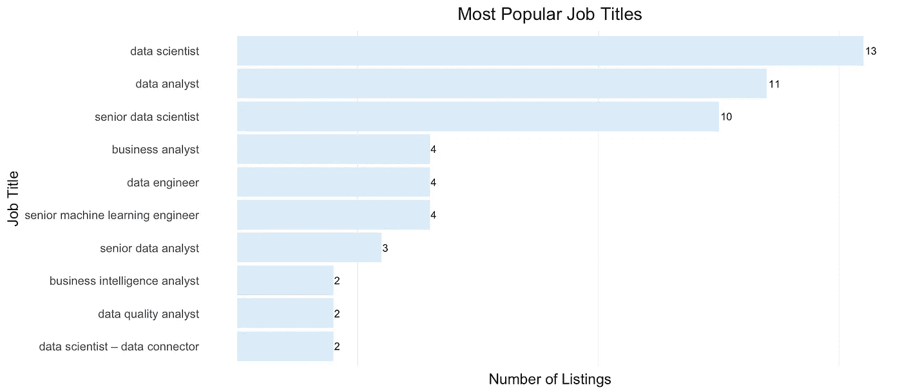
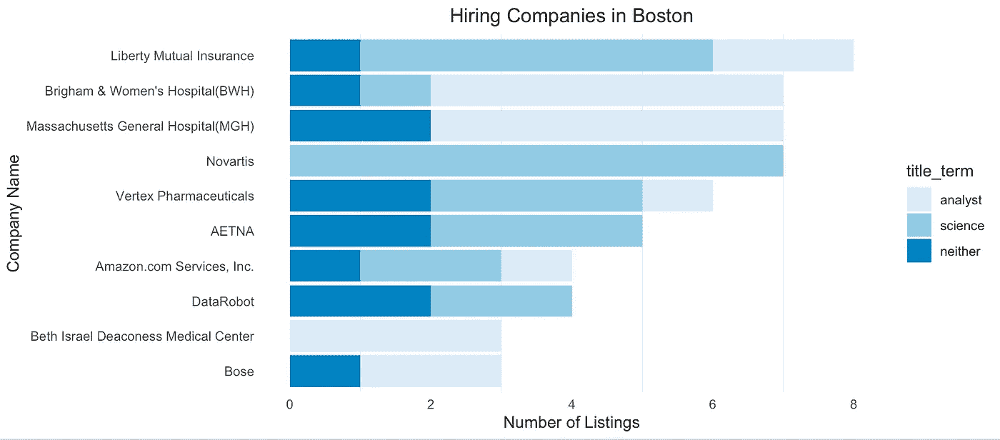
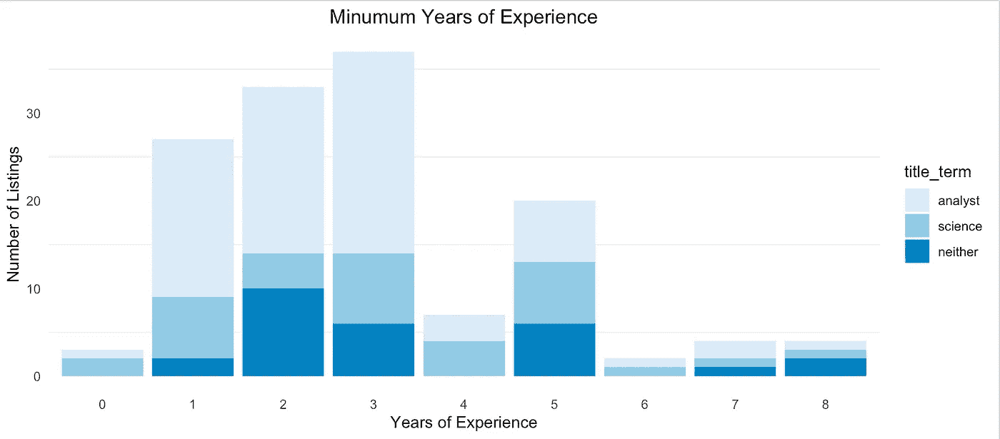
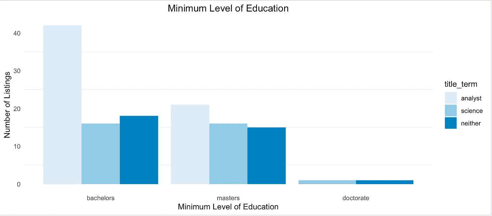
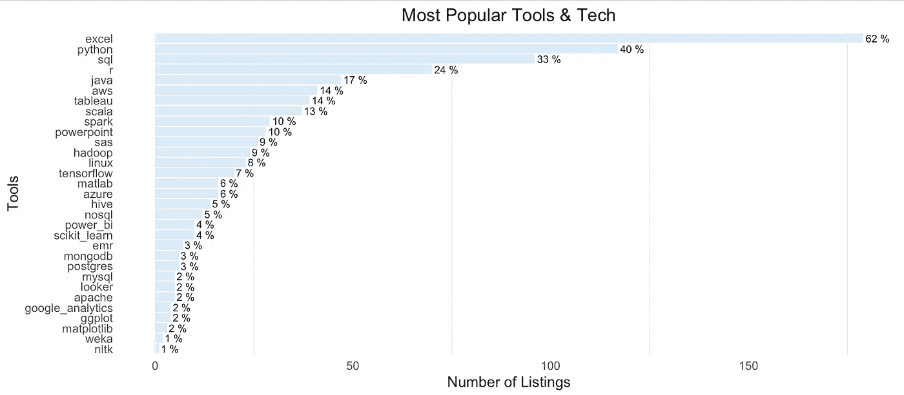

# 波士顿数据分析师和科学家就业市场:2019 年 8 月更新

> 原文：<https://towardsdatascience.com/boston-job-market-for-data-analysts-and-scientists-august-2019-update-1e057bb7bca?source=collection_archive---------27----------------------->

大多数招聘公司、顶级工具和技术等

## 介绍

这是我的[原始项目](https://medium.com/@brianward1428/exploring-the-job-market-for-data-scientists-and-data-analysts-in-boston-new-york-and-9b3c32210334)的 2019 年 8 月更新，我的目标只是探索大波士顿地区数据分析师和数据科学家的就业市场。

这些图片仅来自在 Indeed 上发布的职位列表，搜索条件为“数据分析师”或“数据科学”,因此仅代表选择在 Indeed 上发布的公司。因为这是上一篇文章的更新，所以我在这里只展示视觉效果。要详细了解所采取的步骤和所做的假设，请查看我在[的原始项目中的完整演示。](https://medium.com/@brianward1428/exploring-the-job-market-for-data-scientists-and-data-analysts-in-boston-new-york-and-9b3c32210334)

## 最受欢迎的职位

这里我们简单列出了 10 个最常见的职位。当然，最普通的头衔在最上面，比如“数据科学家”和“数据分析师”。这里需要注意的一点是，波士顿市场上有大量的“高级”图书。

# 波士顿招聘数据分析师和科学家最多的公司

这是波士顿就业市场的一个有趣的代表。总部位于波士顿的 Liberty Mutual 在数据科学领域占据了 8 个不同的领先位置。而大多数工作是在医疗保健和制药行业，这更符合波士顿的情况。

# 最低工作经验年限

这大概是你所期望的最常见的最低工作经验年限在 1-3 年的范围内。有趣的是，在 4 中看到同样的下降(这是我在我的原始帖子中看到的)表明人们宁愿使用漂亮的 round 5+而不是 4。分析师职位和科学职位之间似乎没有太大的区别。

# 最低教育水平

这就是你所期望的。然而，我认为数据科学岗位更需要硕士学位，甚至学士和硕士学位也是如此。

# 最受欢迎的工具和技术

超过 60%的职位列表中仍然需要(或提到)Excel。当然，python 和 sql 紧随 excel 之后，R 比我预期的(希望的)多一点，只在四分之一的清单中被提及。

## 感谢阅读！

同样，要详细了解所采取的步骤和所做的假设，请查看我在[的原始项目中的完整演示。](https://medium.com/@brianward1428/exploring-the-job-market-for-data-scientists-and-data-analysts-in-boston-new-york-and-9b3c32210334)我真的很想对这里的一些描述数据做更多的工作，所以如果你有任何我可以问的更多问题的想法，或者要添加到列表中的工具/技术，请在下面评论。