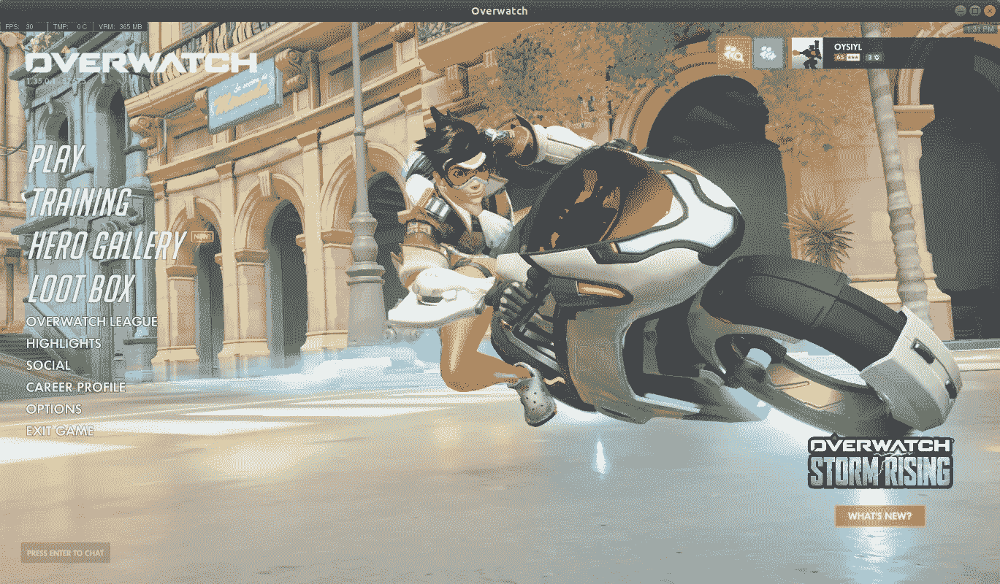
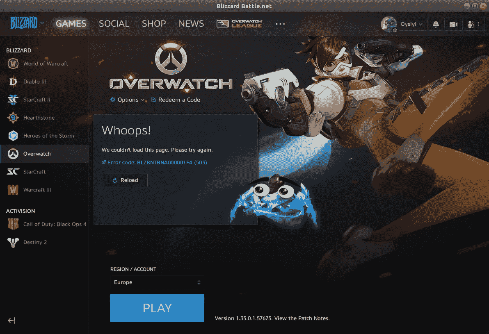
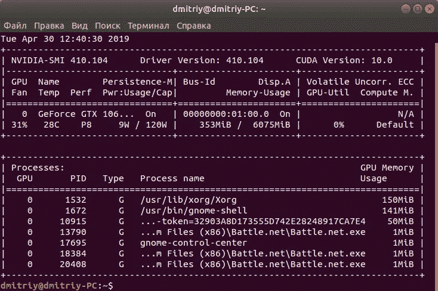
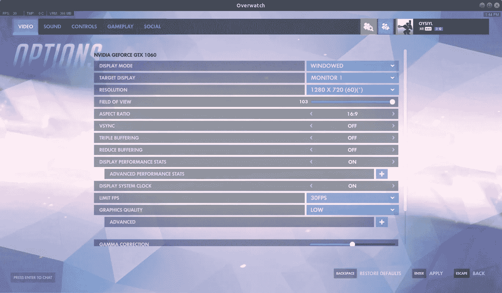
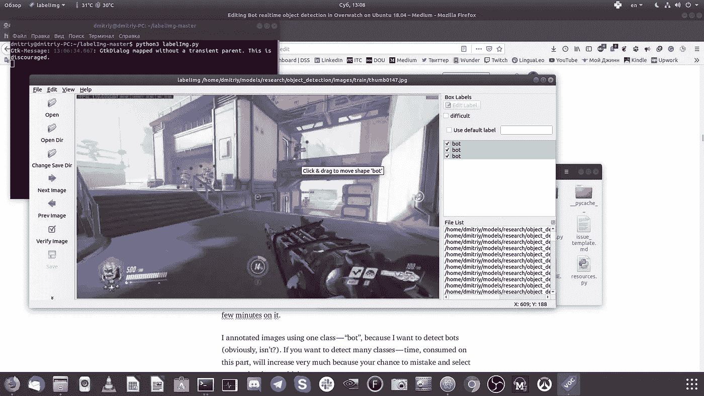
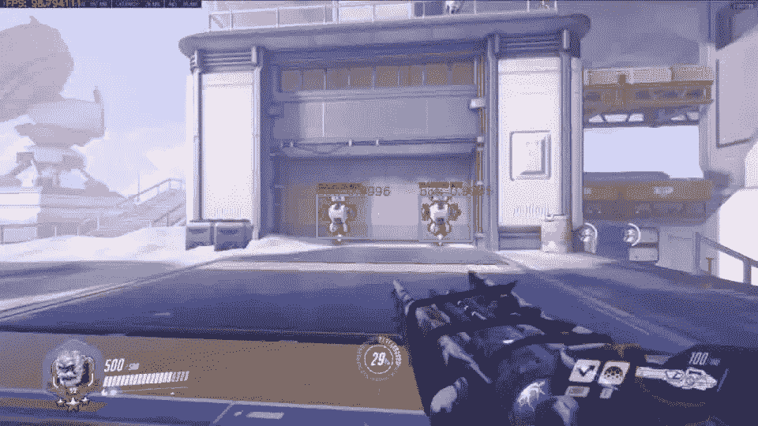
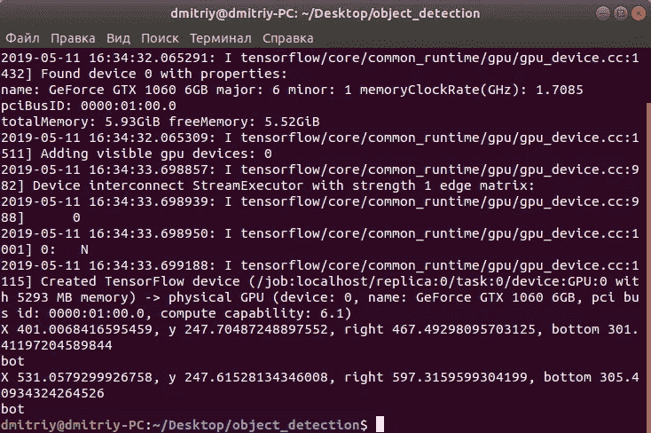
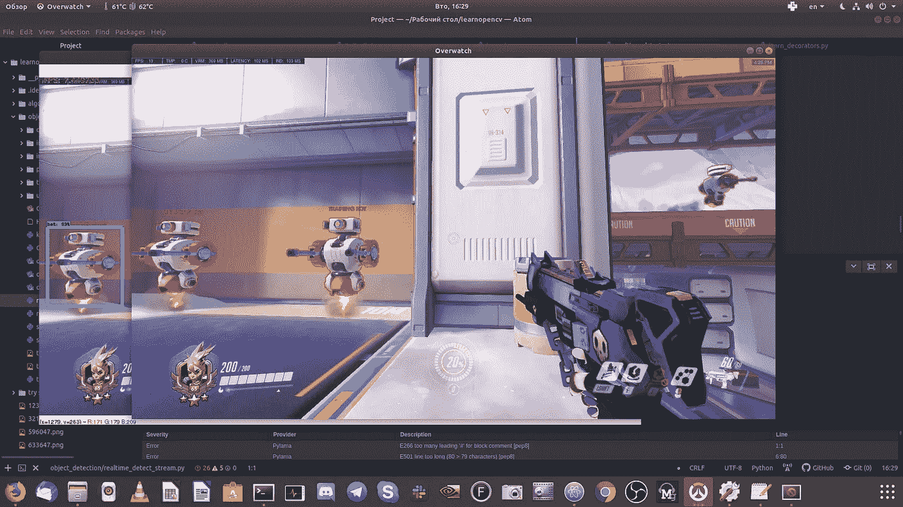
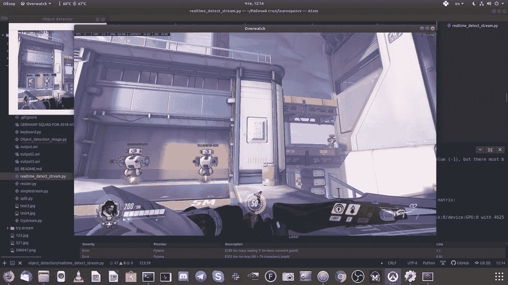
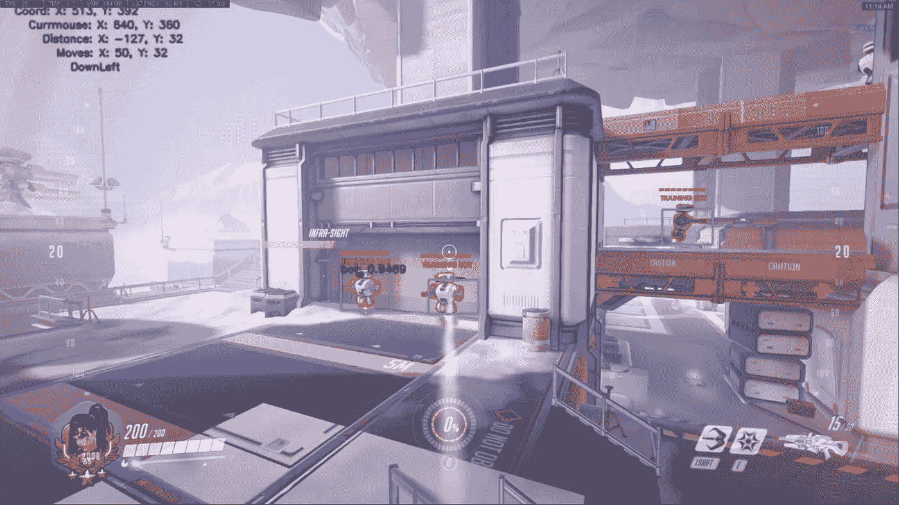

# Ubuntu 18.04 上的机器人实时物体检测

> 原文：<https://towardsdatascience.com/bot-realtime-object-detection-in-overwatch-on-ubuntu-18-04-5571c4c85ec6?source=collection_archive---------17----------------------->

## 在本教程中，我会告诉你，如何安装 Overwatch，从你的实际游戏中收集图像数据，在上面训练模型，并将这个模型应用于实时物体检测。



为此，请确保您已经安装了 Tensorflow。最好有 GPU 支持，以获得更快的速度。没有它，你将会有更小的 fps，训练模型将会花费相当多的时间，并且实时性能可能无法实现。

**Part1:在 Ubuntu 18.04 上安装 Overwatch**

在几次使用 Wine 和 DXVK 安装 Overwatch 的失败尝试后，我开始使用 Flatpak，它似乎很容易在 Linux 上运行 Windows 应用程序。事实也的确如此，除了驱动程序版本的特殊时刻。稍后将详细介绍。

在已安装的 Flatpak 和 Battle.net 启动器上运行这些命令:

```
sudo apt install flatpak gnome-software-plugin-flatpak
sudo flatpak remote-add --if-not-exists flathub https:**//**dl.flathub.org**/**repo**/**flathub.flatpakrepo
sudo flatpak remote-add --if-not-exists winepak https:**//**dl.winepak.org**/**repo**/**winepak.flatpakrepo
sudo flatpak install winepak com.blizzard.Overwatch
```

重新启动电脑后，键入:

```
sudo flatpak run com.blizzard.Overwatch
```

你会看到:



Niiiice, aren’t?

为了更多的 FPS 和流畅的体验，你需要安装额外的 nvidia 驱动程序(因为现在游戏使用 OpenGL 引擎)。在少数情况下，没有图形驱动，游戏根本无法运行。

**重要提示:**您当前从 nvidia-smi 命令输出的版本和 flatpak 版本必须相同。否则，你会得到错误时，点击播放在看守部分在 Battle.net 发射器。请注意，你需要两个版本的 Flatpak 驱动程序。

例如，目前我有这个版本的 nvidia 驱动程序:



Version of drivers: 410.104

下一步:我检查 Flatpak 中是否有该版本的驱动程序:

```
flatpak remote-ls flathub | grep nvidia
```

是的，在 FlatHub 有 410-104 版本的 Nvidia 运行时包(不要在这里放屏幕，因为输出很大)。

这样我就可以使用这些命令在 Flatpak 中安装 32 位和 64 位版本(提醒，您需要这两个版本！):

```
flatpak install flathub org.freedesktop.Platform.GL32.nvidia-410–104
flatpak install flathub org.freedesktop.Platform.GL.nvidia-410-104
```

如果一切顺利，你就可以开始游戏了！


Yeaaah!

最后:为了录制和获得更舒适的 fps，进入选项-视频，选择窗口模式，1280*720 分辨率，30 fps 锁定和低设置。当你在玩警戒时，当模型一起工作时，这允许你在游戏中达到大约 30/3 = 10 fps 性能。是的，运行模型是一个详尽的过程，你的 GPU 会 100%的工作。实际上取决于你的 GPU。但在我的 1060 上这是真的。



在本教程的下一部分，我将向你展示如何为你的模型获取训练数据，训练模型(如果你想的话)，并在游戏时进行实时检测。

**附言:**如果你坚持选择正确的驱动程序，请查看这篇小文章(你也可以找到更多解释)如何克服这个问题:

[](https://www.linuxuprising.com/2018/06/how-to-get-flatpak-apps-and-games-built.html) [## 如何让使用 OpenGL 构建的 Flatpak 应用和游戏与专有的 Nvidia 显卡一起工作…

### 一些用 OpenGL 支持构建并打包成 Flatpak 的应用程序和游戏无法用专有的 Nvidia 启动…

www.linuxuprising.com](https://www.linuxuprising.com/2018/06/how-to-get-flatpak-apps-and-games-built.html) 

**第二部分:记录游戏过程并准备训练图像**

让我们安装这些库，它允许我们捕获游戏:

```
pip3 install --user pyscreenshot
pip3 install --user mss
```

安装 Overwatch 后，你可以使用 simplestream.py 实时记录游戏过程(大约 80-100 fps)

请看第 17 行:在这里您选择屏幕的一部分来捕获。你需要用显示器字典中的值来适应你的窗口游戏。请随意用值替换这一行代码，这样您会感觉最舒服。例如，我对它们进行了硬编码，并在屏幕中央设置了监视窗口；你可能更喜欢把窗口放在左上角等等。花几分钟在上面；你只能做一次。

只需在控制台中键入:

```
python3 simplestream.py
```

回到游戏中。当你完成后，点击窗口框架，并按下 q。脚本完成，你可以在这里看到输出. avi 文件。那是你的玩法，会在哪个模型上训练。

**重要提示:**您第一次可以使用 my repo 中的训练模型，不要制作图像、训练模型等(请跳过这一步，进入下一部分)。如果你会从结果中得到启发，欢迎使用你自己的数据来训练你自己的模型。

**获取图像**

为了从 output.avi 中提取帧，你需要 ffmpeg:所以让我们安装它吧！

```
pip3 install --user ffmpeg
```

使用 ffmpeg 从创建的视频中获取帧(首先创建文件夹/图像！):

```
ffmpeg -i output.avi -vf fps=10 images/thumb%04d.jpg -hide_banner
```

这让我们每秒钟从视频输出. avi 中获得 10 帧，并将这些帧(图像)保存在图像文件夹中。

**用 python3 resizer.py 调整大小**

你可以用 now resizer.py 让图片比现在更小。

```
python3 resizer.py
```

我评论了第 20 行，因为发现，分辨率 960*540 最适合初始分辨率在 1280*720 左右的图片。嘶！第 20 行和第 21 行做的东西一样，所以你可以用你最喜欢的那一行)。但是不要忘记评论另一行——否则你会破坏你的图像！(开个玩笑——在这种情况下，你将每张图片的大小调整两次，结果会非常糟糕)。

**用标签标注**

我们来注释图像。为此，我建议使用标签。

```
git clone [https://github.com/tzutalin/labelImg.git](https://github.com/tzutalin/labelImg.git)
cd labelImg
sudo apt-get install pyqt5-dev-tools
sudo pip3 install -r requirements/requirements-linux-python3.txt
make qt5py3
python3 labelImg.py
```

pip3 为什么不装 labelImg？因为我已经试过了，不能启动这个程序。所以从源代码安装只是一种方式，对我来说很有效。你可以试着从 pip3 安装，也许你可以启动它并节省几分钟。

我使用一个类“bot”来注释图像，因为我想检测 bot(显然，不是吗？).如果你想检测很多类，这部分消耗的时间会增加很多，因为你出错和选择错误类的机会很高(特别是当你在帧上有很多对象的时候)。



因此，现在您需要注释 images/train 和 images/test 文件夹中的每个图像。这是耗时的部分，所以要冷静，专心，不要动作太快。

**重要:**删除至少没有一个类的坏帧。如果您丢失了至少一个文件，您将无法为此图像创建注释。而且模型训练还没有开始，因为你将没有等量的图像和 xml 文件(注释)！

**创建测试和训练目录**

为此，使用 split.py:

```
python3 split.py
```

此脚本中的代码:

Place this script in place, where exists images as subdirectory

之后，将 images 文件夹放在 object_detection 文件夹中，进入 tensorflow 部分(第 3 部分)。

**第三部分:张量流部分**

你可以跳过这一部分，第一次使用我训练过的模型(我在一个 github repo 上提供了所有文件)。在这两种情况下，您都需要安装这些库:

```
pip3 install pillow
pip3 install lxml
pip3 install jupyter
pip3 install matplotlib
pip3 install opencv-python opencv-contrib-python
sudo apt install protobuf-compiler
```

这部分是最费时间的，在这个过程中你会遇到很多问题。我的指南基于来自[的精彩教程。它适用于 windows 10，但区别并不太大。只有当你想用你自己的数据训练你自己的模型时(比如从 quickplay match 中检测 Hanzo ),你才可以做下面所有的步骤。](https://github.com/EdjeElectronics/TensorFlow-Object-Detection-API-Tutorial-Train-Multiple-Objects-Windows-10)

下载模型，重新加载原型，重新加载变量(别忘了把/home/Dmitry 改成/home/*your_username*/):

```
git clone [https://github.com/tensorflow/models.git](https://github.com/tensorflow/models.git)
cd models-master/research
protoc object_detection/protos/*.proto — python_out=.
export PYTHONPATH=$PYTHONPATH:`pwd`:`pwd`/slim
sudo gedit ~/.bashrc 
export PYTHONPATH=$PYTHONPATH=/home/dmitriy/models/research:/home/dmitriy/models/research/slim
source ~/.bashrc
```

来自研究目录:

```
sudo python3 setup.py build
sudo python3 setup.py install
```

然后运行(在注释完所有图像后):

```
python3 xml_to_csv.py
```

这将在\object_detection\images 文件夹中创建一个 train_labels.csv 和 test_labels.csv 文件。在 generate_tfrecord.py 中进行更改。例如，我的文件:

如您所见，您需要在第 30–35 行修改所有的类(在我的例子中是“bot”)。其他的你都不需要改变。之后(从 object_detection 文件夹):

```
python3 generate_tfrecord.py --csv_input=images/train_labels.csv --image_dir=images/train --output_path=train.record
python3 generate_tfrecord.py --csv_input=images/test_labels.csv --image_dir=images/test --output_path=test.record
```

它们在\object_detection 中生成一个 train.record 和一个 test.record 文件。这些将用于训练新的对象检测分类器。

从 tensorflow zoo 下载模型作为配置，并放入 object_detection/training 文件夹:

```
wget [http://download.tensorflow.org/models/object_detection/faster_rcnn_inception_v2_coco_2018_01_28.tar.gz](http://download.tensorflow.org/models/object_detection/faster_rcnn_inception_v2_coco_2018_01_28.tar.gz)
tar xvzf faster_rcnn_inception_v2_coco_2018_01_28.tar.gz
```

在 labelmap.pbtxt 中进行更改。例如，我的文件:

所以，比如你想检测半藏类，就把 bot 改名为半藏。

然后在 fast _ rcnn _ inception _ v2 _ pets . config 中进行更改。

代码:

我们开始吧:

将第 9 行的 num_classes 更改为您的类的总数。例如，如果我只想检测一个机器人，它将是 1；

在第 106 行将 fine_tune_checkpoint 更改为放置 fast _ rcnn _ inception _ v2 _ pets . config 的路径；

在第 112 行 nums_steps 更改为你想要训练模型的多少(通常 10–20k 就够了)；

在第 122 行 input_path 处切换到您的 train.record 所在的位置；

在第 124 行 label_map_path 更改为您的 labelmap.pbtxt 所在的位置；

将第 128 行的 num_examples 更改为\images\test 目录中的图像数；

在第 136 行 input_path 处切换到您的 train.record 所在的位置；

在第 138 行 label_map_path 更改为 labelmap.pbtxt 所在的位置。

请注意正确地更改这些路径！

并将这些文件(labelmap.pbtxt 和 faster _ rcnn _ inception _ v2 _ pets . config)放在 training 文件夹中。

将 train.py 从旧文件夹移到主文件夹。

之后，你可以开始训练:

```
python3 train.py --logtostderr --train_dir=training/ --pipeline_config_path=training/faster_rcnn_inception_v2_pets.config tensorboard --logdir=’training’
```

请确保 inference_graph 为空或未创建。

```
python3 export_inference_graph.py --input_type image_tensor --pipeline_config_path training/faster_rcnn_inception_v2_pets.config --trained_checkpoint_prefix training/model.ckpt-10000 --output_directory inference_graph
```

请随意将 model.ckpt-number_of_epochs 更改为您的号码。因此，如果您训练了 1000 个历元，请将 trained _ check point _ prefix training/model . ckpt-10000 更改为 trained _ check point _ prefix training/model . ckpt-1000。

这将在\ object _ detection \ inference _ graph 文件夹中创建一个 freezed _ inference _ graph . Pb 文件。的。pb 文件包含对象检测分类器。

对于教程的下一部分，您需要来自\object_detection\training 文件夹的 freezed _ inference _ graph 和 labelmap.pbtxt。还有 fast _ rcnn _ inception _ v2 _ pets . config，文件夹 protos，utils，training 和 core。

因此，在某个地方创建 object_detection 文件夹，并将其全部移入其中。现在，您已经准备好了最后一部分(第 4 部分:实时检测)。

**第四部分:运行实时检测**

经过上述所有的艰苦工作，这一步成为最容易的一步。

如果你只是想测试训练模型，然后下载我的回购使用以下命令:

```
git clone [https://github.com/Oysiyl/Bot-object-detection-in-Overwatch.git](https://github.com/Oysiyl/Bot-object-detection-in-Overwatch.git)
```

然后将此文件夹重命名为 object_detection，并移动到此文件夹。

我建议你第一次运行 Object_detection_image.py，以确保一切正常。所以运行这些:

```
python3 Object_detection_image.py
```

在等待初始化 Tensorflow 并将模型加载到 GPU 内存中大约 5-10 秒后，您将看到此图片，其中包含两个已识别的框(按 Q 退出):



I think, we might customize text on boxes later

以及检测到的箱子的坐标:



So, bots are successfully detected. Niiice!

我们将在(realtime_detect_stream.py)之后运行的脚本代码:

运行 realtime_detect_stream.py(要退出，请单击框架窗口并按 Q 键):

```
python3 realtime_detect_stream.py
```

如果你有超宽显示器或者只有第二台显示器，体验会更舒服。你会看到实时对象检测！我不能在这里显示一个漂亮的屏幕，因为我只有一个全高清显示器，实际上游戏窗口和识别游戏的窗口都不合适。



Such that

小提示:您可以将 123 行更改为 cv2.resize(img，(300，300))并获得更健壮的图片(或选择更多少量的像素):



You are almost see the whole picture

退出后，您会看到 output2.avi 文件已经创建。在这里，您可以观看视频，了解模型的表现:

**额外部分:使用训练过的模型击败机器人**

嘶！确定谁是你的敌人后，你就可以打败他。所以，opencv 可以用机器人检测盒子的坐标。您可以使用 pyautogui 来击败他们！

```
pip3 install --user pyautogui
sudo apt-get install python3-tk python3-dev
```

不同的距离对精确度有很大的影响。请看这个演示:

这是从更大的距离(我使用 WASD 接近目标):

我在鳏夫制造者身上测试过。所以，一秒钟的延迟让她可以毫无延迟地瞄准并打出有力的一击，而不是无力的一击。你只要向机器人走去，opencv 就会检测到机器人，并在他周围建一个盒子，然后程序就会尝试投篮。我用盒子中头部的可能位置来表示这一点，所以程序将继续移动相机到这一点，并在达到这一点后单击。

请注意，使用 time.sleep(1.0)会导致在录制视频时损失 1 秒，因为程序暂停了 1 秒(10 fps)。你可以用 time.sleep(1.0)把这一行改成 pyautogui。PAUSE=1.0 并在单击返回到默认 pyautogui 设置后添加(通过以下方式— pyautogui。暂停=0.01)。我不建议你这么做，因为 programm accuracy 会做出一些奇怪的动作(比如向目标点移动时开枪)。使用这些方法的好处——当你瞄准时，你记录的视频将是完整的，不会丢失 10 fps (1 秒)。

**重要提示:**要从 pyautogui 中获得正确的操作，您需要在游戏选项-视频-显示模式中进行更改，并设置为“无边框窗口”。如果没有这个程序，每次都不能正确的点击和移动你的相机到任意的位置。不要忘记，如果你想记录这个，你需要改变显示器字典(看第 116 行)，因为你的游戏窗口现在将是无边框窗口，而不是之前的窗口。

这段代码插入 realtime_detect_stream.py 中的名称定义之后。如果你不知道在哪里添加，看看这个完整的例子:

重要代码行的简短说明:

在行 152 中，我们仅选择通过 90%极限检测的盒子；第 167–181 行—找到盒子的坐标；使用 if 语句(第 183-185 行)每帧只需要选择和跟踪一个框。这很重要，因为如果模型检测到两个或更多的盒子，她会从一个跳到另一个，没有任何动作(但它的工作并不完美，有些问题)。

然后我们找到了中心 x 和中心 y 坐标——我们的模型将移动到这一点。用于移动计算的 moveX 和 moveY。如果移动得很大(第 191-194 行),我们将使这个移动变得更小——提高移动精度(第 195-198 行):如果模型接近目标(5 px 或更小),使下一个移动等于 0(因此不允许在这个轴上移动，在大于 5 的另一个轴上移动)。如果我们达到了“中心”，模型将执行我们假设的一组动作(第 204-212 行)。在这里你可以尝试使用 pyautogui。没有时间的暂停。睡眠(1.0)。如果我们还没有到达“中心”，那么根据当前摄像机位置的坐标执行移动(第 214-226 行)。

在每一帧的下一行画一个圆(我们要移动的点)，并输出许多文本，直接放在你的帧上以便进一步监控(这非常非常有用，当出错时)。例如，当 defeat_bots.py 移动不是你无法理解的时候，那些监视输出可以帮助你看到，在下一帧中什么模型将做，哪些移动选择，接下来在哪个方向移动，多少像素...您可以注释这些输出(第 232–237 行)。

在第 240 行，opencv 将给定的帧保存到视频中，然后向您展示这一帧(第 241 行)。像往常一样，按键盘上的 Q 将停止程序，保存视频(第 250 行)后，opencv 将关闭(第 251 行)。



Monitoring outputs in upper left corner

正如你从下面的图像中看到的，模型在中心射击机器人，并开始向下一个目标移动。这是我激活的 ult，程序现在不能这样做。我只是好奇 ult 是否在模型准确性上有所努力(但没有发现任何努力)。我用 WASD 组合按角色表演所有的动作。

运行 defeat_bots.py:

```
python3 defeat_bots.py
```

像往常一样，去训练室值班。如果 opencv 检测到至少一个机器人——程序将使用鼠标移动相机到这个识别的边界框，并点击直到框消失(机器人被击败)。耶希！

**加成:**在训练室其他英雄 vs bots 上测试并不难。例如，将第(204–212)行的动作更改为仅 pyautogui.click()允许您使用这样的字符，其主要攻击是左键单击:

Such as bastion (Beep-beep!)

正如你所看到的，侦查并不依赖于所选的英雄，考虑到英雄的游戏性和他/她拥有的能力的差异，你可以为几乎任何你想要的英雄采用脚本。

**重要:**本文中的所有内容，尤其是额外部分，都是出于科学目的和我的好奇心。我不建议你用模型对抗其他玩家，因为:

零:当物体远离或者英雄只看到物体的一部分时，模型无法检测到。你需要训练模型理解效果(比如每个英雄的莱因哈特盾或者最后通牒能力)。

第一:因为你需要在大约一千个(！！！)类认每个英雄(现在 30 左右)每个皮肤(不知道多少)。

第二:你需要在许多不同的地图上训练(因为不同的环境，在绿洲上训练的模型在南极洲几乎不工作)。

第三:我的数据集有近 600 张图片，经过 1000 步训练，应该足以在一张没有任何皮肤的地图上检测一个类(机器人)(但你看这种检测远远不够理想)。想象一下，你需要创建和注释多少图像才能达到好的效果。以及训练时需要多少计算能力才能得到好的结果并达到至少每秒 60 帧的实时速度。

第四:模特不能动！我不知道逻辑如何实现这一点。

此外，因为这是作弊，你可能应该被禁止，当与真人，而不是机器人玩。

希望你成功，这项工作将激励你从这个游戏或另一个(你最喜欢的)更有趣的模型。

祝你愉快，这是你应得的！