# 机器人罗斯:教电脑画画

> 原文：<https://towardsdatascience.com/bot-ross-teaching-a-computer-to-paint-f5a9c9ef908?source=collection_archive---------12----------------------->

我承认，我不是一个非常好的艺术家。至少不用刷子和颜料。我可以用钢笔或铅笔做出可信的努力，前提是你不是在寻找像人手或马这样棘手的东西。但是打开油彩，一切都结束了——我能做的最好的就是用花哨的颜色画出一些难以辨认的斑点。尽管，或者可能是因为完全没有绘画能力，我发现电视名人画家鲍勃·罗斯非常迷人。他温和的表达和轻松的方式是忙碌世界中的安慰。罗斯的演讲更迷人的一面是他保证，只要有足够的练习，任何人都可以学会画画。

> “天赋是一种追求的兴趣。任何你愿意练习的事情，你都可以做到。”— *鲍勃·罗斯*

这是一个非常吸引人的想法，也是我想要分享的观点。我坚信努力工作和实践会超越一些模糊的“天赋”概念。罗斯在绘画时看起来如此平静，如此沉浸在他在画布上创造的阿拉斯加小乡村荒野中。我也想探索那片荒野。但是我很忙。我有很多工作要做，还有很多论文要写。我能走捷径吗？鲍勃·罗斯说如果我愿意练习，我可以画得像他一样。但是我能找到一个算法来帮我做这个练习吗？我可以教电脑画画吗？

这对人工智能来说是个棘手的问题。我们能不能把这个问题组织成计算机可以解决的形式？教电脑画画是什么意思？我想要实现的是一个系统，在这个系统中，我可以用最少的投入，用最少的努力创作出一幅新颖的画。我想缩短练习的过程。我想要的是能把我花哨的斑点变成类似鲍勃·罗斯画作的东西，而不用自己去学。

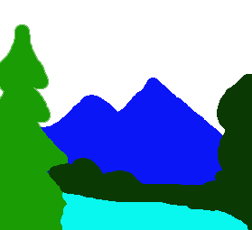

I call it “Toothpaste Mountain”

在很大程度上，人工智能算法的工作原理是*预测*。给定一个输入，他们预测一个最有可能满足一些期望标准的输出，以最小化误差。在这种情况下，我们需要一种算法，给定我的一个 blobby 创作，它可以预测(并显示)这幅画是鲍勃·罗斯自己画的会是什么样子。它需要*在我半无能的输入和鲍勃·罗斯式的输出之间有效地转换*。

我们越来越接近把这个问题变成一个可解决的问题。我们需要的是一组训练数据——一组与真正的鲍勃·罗斯对等物配对的 blobby 绘画。为了实现这一点，我们需要经历一个艰苦的逆向工程过程——获取完整的鲍勃·罗斯画作，并为每一幅画创建一个 blobby 等价物。我们将鲍勃·罗斯绘画中的所有元素——雄伟的山脉、安静的河流、舒适的小屋、飘动的云彩和快乐的小树——用模糊的正确形状将它们渲染成简单的彩色斑点。我称这种风格为“Blob Ross”。

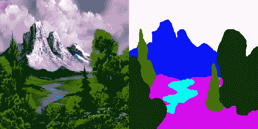

(The original is on the left)

在一个好朋友的帮助下，我制作了 250 多幅 Blob Ross 画作，并与鲍勃·罗斯原作配对，这是一个很小但希望足够的训练数据集。这是计算机将学习的数据，例如，推断一片皇家蓝色应该被渲染为一些戏剧性的阿拉斯加山脉，而一条青色应该成为一条蜿蜒的河流。

现在我们只需要一个可以学习解决这个问题的算法。在这种情况下，我在过去几篇文章中介绍的神经网络不会成功。正如我们所了解的，这些算法(像大多数机器学习算法一样)，基于最小化错误的原则工作。他们产生的结果将是整个训练集中*错误最少的*，平均*。但这是个问题。我来解释一下原因。*

*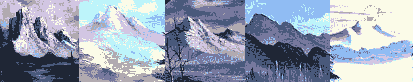*

*So majestic*

*这是一些鲍勃·罗斯画作中的山脉。虽然他们都是他的风格，但他们也有很大的不同——他们有不同的颜色，他们有不同的明暗图案，他们的形状也非常不同。试图预测这一点的传统算法会试图分割差异——它会试图准确地在所有罗斯山脉的中间找到颜色和形状。很可能会产生卡其色污迹。但是有更好的方法。*

*相对而言，人工智能中使用的大多数技术和算法都非常古老。神经网络，比如我用来识别中世纪杆臂的神经网络，(可以说)是在 20 世纪 40 年代首次描述的。现代机器学习中使用的许多其他技术甚至更古老。但我们在这篇文章中使用的技术是一个真正的新发明:“生成对抗网络”或“GAN”。*

*GAN 仅在几年前的 2014 年首次提出。GANs 负责一些最令人兴奋和最令人恐惧的计算机生成图像的最新创新，包括“deepfake”技术，它可以无缝地将一张新面孔粘贴到演员的身体上(通常是裸体的)。*

*虽然 GANs 建立在神经网络的概念上，但他们也引入了一个非常有趣的创新。GAN 不仅仅使用一个神经网络，而是使用两个，以一种相互竞争的方式工作。*

*第一个网络是“发电机”。对于给定的输入数据——在我们的例子中是我们的 Blob Ross 画作——它会产生一个预测图像——它认为鲍勃·罗斯会从该输入中得到什么。我叫它“机器人罗斯”。像其他神经网络一样，生成器开始随机做出选择，随着时间的推移，通过获得成功的反馈，学习做出更好的选择。但是它的不同之处在于它从哪里得到反馈。*

*第二个网络是一个“鉴别器”，它是发电机网络的反馈源。鉴别器被给予生成器的预测图像和真实的鲍勃·罗斯画作，并被要求猜测哪个图像是哪个。换句话说，它学会了区分由生成器生成的“假”鲍勃·罗斯画作和真品。*

*在鉴别器正确地检测到假货的情况下，这作为负反馈被提供给生成器，并且它调整它的过程，直到它能够更成功地欺骗鉴别器。通过以这种方式训练，生成器学会避免“卡其色污迹”问题。虽然它的第一次尝试非常模糊，但它很快就知道鉴别器可以很容易地检测到这一点。它变得更加狡猾，产生更清晰的图像，试图模仿真正的鲍勃·罗斯画作中的形状。结果是，经过足够长时间的训练后，生成器可以生成一幅有点令人信服的鲍勃·罗斯画作的复制品。*

*让我们看看实际情况是怎样的。*

*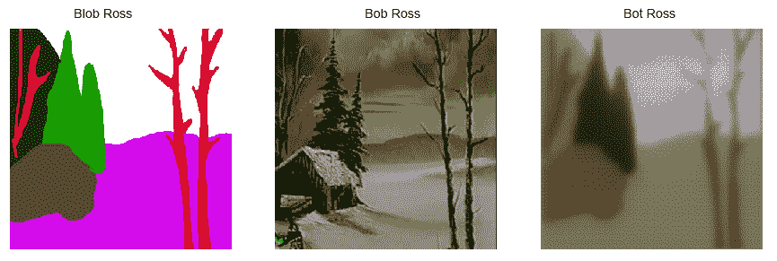*

*上面是一个输入图像(Blob Ross)，它所基于的真实绘画(鲍勃·罗斯)，以及生成器第一次尝试从该输入进行预测(Bot Ross)。在这个例子中，生成器从未见过真正的鲍勃·罗斯的画——它必须从它见过的其他画中进行归纳。不出所料，我们到处都是卡其色污迹。没有明确的细节，通过取每个区域的平均颜色，我们得到了一个模糊的中间地带。但是就像原来鲍勃·罗斯说的，通过练习，它可以做得更好！随着时间的推移，有了鉴别者的反馈，机器人罗斯学会了做得更好。*

*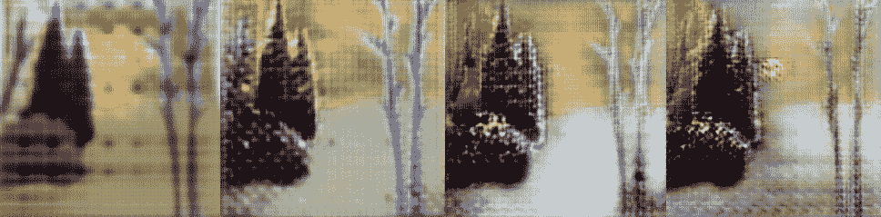*

*上面的图片是在训练过程中从这个模型的更高级版本中截取的。您可以看到生成器正在学习添加更多细节。树干得到了一些阴影，天空呈现出更多的纹理，松树开始形成它们特有的锯齿状边缘。但是我们也看到了其他一些有趣的发展。图像中有奇怪的线条和重复的斑点。这些是生成器的人工制品——它努力为大面积的空白空间创造细节，并倾向于重复相同的模式。*

*最终，经过数百轮训练后，生成器学会了避开这些赝像中最糟糕的部分，其结果即使人眼无法分辨，至少也变得可信得多。*

*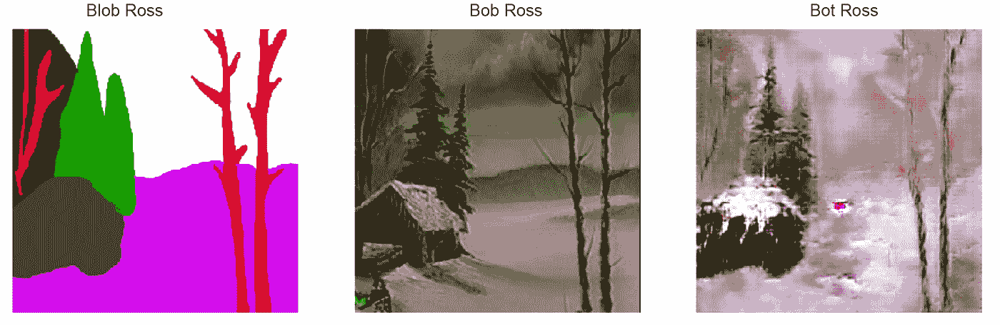*

*它在绘画的某些区域比其他区域表现得更好。罗斯几乎在他的每一幅画中都用几笔娴熟的笔触描绘了标志性的松树，这些松树被精细地再现出来——斑点被赋予了锯齿状的松针边缘和锋利的尖端。因为松树出现在许多训练数据中，每次看起来都或多或少相同，所以 Bot Ross 能够很好地复制它们。这幅画的天空是令人愉悦的云彩和阳光的模糊——因为这里没有太多的细节，Bot Ross 已经知道他可以用任何他喜欢的模糊污迹填充天空，而鉴别者不会知道。*

*但是这个舒适的小木屋有点乱。这对机器人罗斯来说是一场完美的挑战风暴。在训练数据中，小木屋远不如山脉或松树常见。更糟糕的是，每幅画中的小屋看起来都非常不同。因此，机器人罗斯努力学习如何画它们。他提出了一个被雪覆盖的屋顶的建议，但大部分仍然只是一个斑点。*

*有意思的是，Bot Ross 把这个渲染成了雪景。他不是简单地平均训练画的颜色，而是根据构图——可能是光秃秃的树木等等——决定这应该是一个白雪皑皑的场景还是郁郁葱葱的场景，并给画适当地着色。看看其他例子，可以看出 Bot Ross 做出的一些有趣的选择。*

*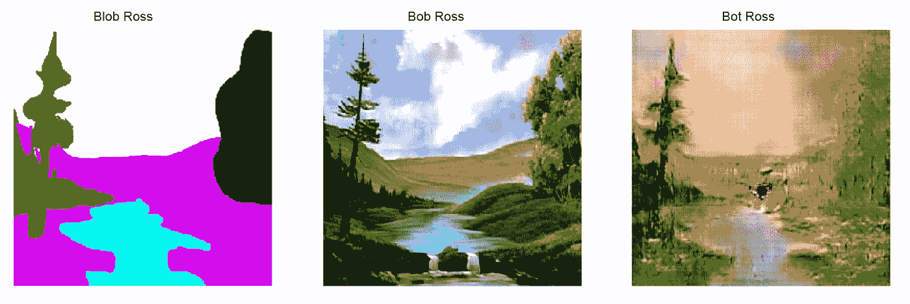**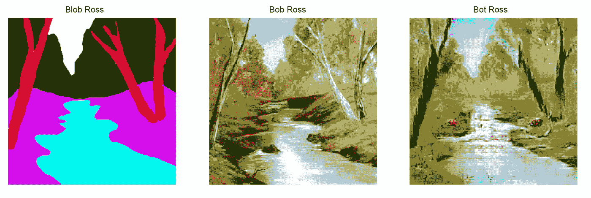**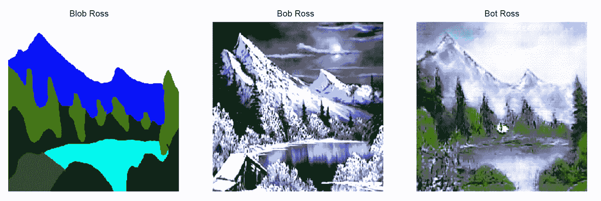**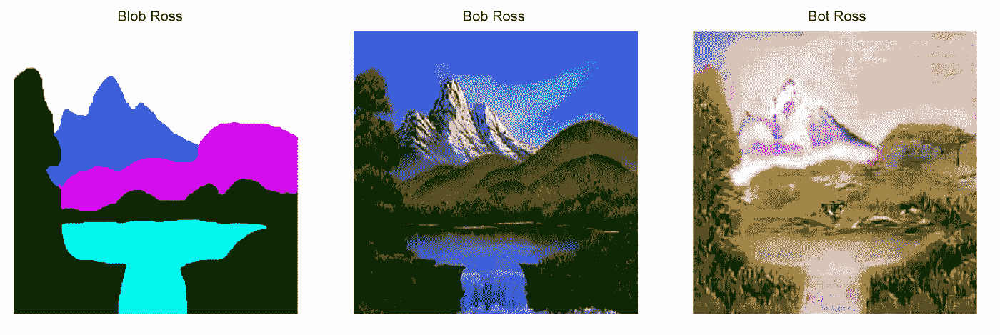**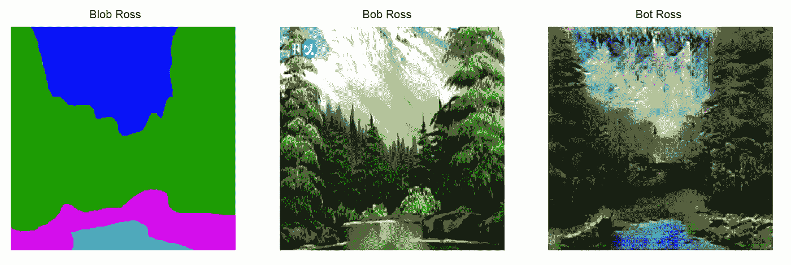*

*你可以看到他有时很好，有时很坏。更多约定俗成的元素表现得相当好，但任何不寻常的东西都变成了模糊形状的混乱。*

*然而，对博特·罗斯来说，真正的挑战是看他如何与我的一件原创作品交易。这是我早期的画，“牙膏山”，旁边是它的“机器人罗斯”解释。*

*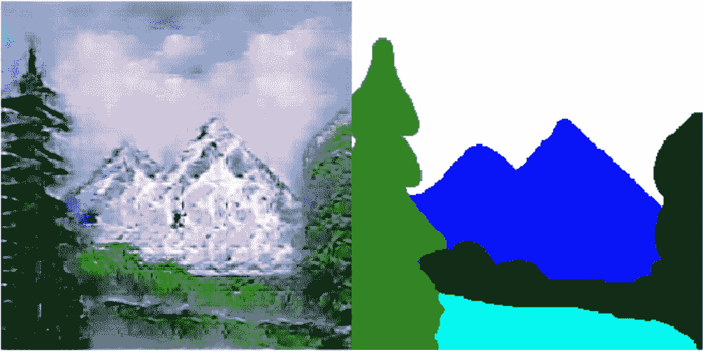*

*还不错！虽然没有完全达到原版鲍勃·罗斯的标准，但只要练习几个小时，肯定比我能做到的要好。现在没有必要让任何人浪费无数的时间在画架前埋头苦干，把刷子上的魔鬼打出来，或者寻找更多的酞青。有了这个机器人罗斯模型，任何人都可以立即像鲍勃·罗斯一样画画！*

*对我来说，Bot Ross 和 GANs 最有趣的一点是“假装”做某事和实际做那件事是一样的。我们的模型通过学习*假装*绘画来学习绘画，通过学习使自己的输出与真实的东西无法区分。这与图灵在 1950 年的论文《计算机械与智能》中提出的“模仿游戏”有明显的相似之处，这也是“图灵测试”概念的起源。简而言之，这个想法不是试图回答“机器能思考吗？”，这导致了毫无意义的哲学思考，我们应该解决一个更实际的问题:“一台机器*能假装以一种足以说服人类观察者的方式思考*吗？”换句话说，不要问“机器能思考吗？”，问“如果我分不清，又有什么关系？”*

*图灵写得比我在这里的篇幅更详细，说明了为什么这是一条富有成效的探究路线。但我认为机器人罗斯为这一论点提供了耐人寻味的支持。在图灵发表关于这个主题的论文半个多世纪后，我们继续了解学习和模仿之间复杂而密切的关系，以及*假装*做某事和实际上能够做某事之间微小的、可能不存在的差异。正如鲍勃·罗斯所描述的，博特·罗斯从未体验过绘画的快乐。它从未想象过自己行走在自己创造的微小景观中。但是看它的画，能看出区别吗？有关系吗？*

**感谢阅读！本系列上一篇文章，关于文本生成，可用* [*此处*](/i-fed-a-bot-eight-hundred-burgers-and-this-is-what-it-threw-up-b78202ca39f9) *。这个系列的结论将于下个月出版。**