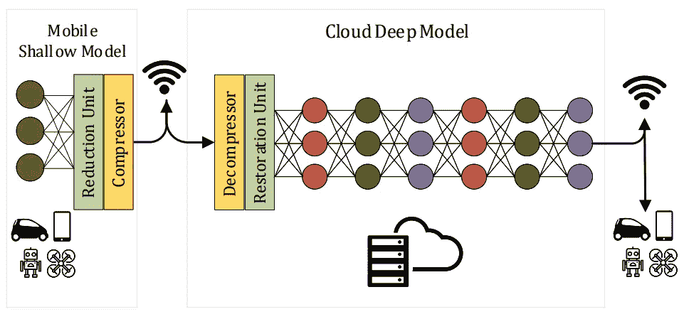
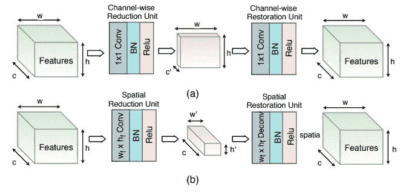
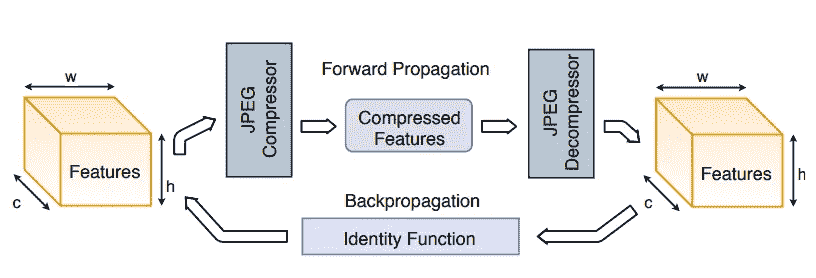
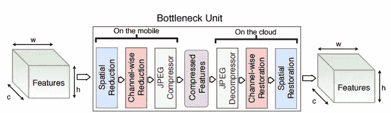
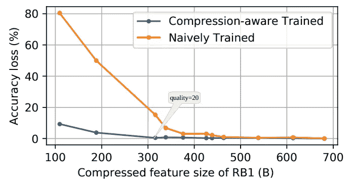

# 瓶颈:加速边缘智能的可学习特征压缩

> 原文：<https://towardsdatascience.com/bottlenet-1d93b9393dd8?source=collection_archive---------38----------------------->

## 仅将 316 字节的数据上传到云中用于 ImageNet 分类

神经网络要么部署在本地设备上，要么部署在云服务器上。如果它非常大，那么唯一的选择就是云服务器。使用云服务的缺点是你需要上传一个比较大的输入的通信成本。将有价值的原始数据交给云所有者也会损害隐私。所以问题是为什么不卸载特性而不是原始输入呢？特征通常是稀疏的，我们可以在特征空间中实现更高的压缩比。BottleNet 是一篇介绍特征压缩方法的论文，该方法只需要将 316 字节的数据卸载到云服务器，以便在 ImageNet 数据集上进行推理。

BottleNet adds two extra units into an existing neural network. 1\. A convolutional layer for reducing the channel/spatial dimensions 2\. A lossy compressor (e.g. JPEG). Photo by author.

给定一个深度神经网络(DNN)，我们插入一个减少空间和信道维度的卷积层。然后，我们将卷积的简化特征传递给 JPEG 压缩。这导致平均大小为 316 字节的数据需要上传到云中，以便进行其余的推理！比 JPEG 压缩的 224x224 图像少很多(平均 26667 字节)！在云上使用卷积层来恢复原始特征尺寸，然后进行 JPEG 解压缩。

Learnable dimension reduction and restoration units along the (a) channel and (b) spatial dimension of features. Photo by author.

但是如何训练一个中间有不可微层(JPEG)的神经网络呢？近似！因为一对压缩器和解压缩器可以用一个恒等函数来近似，所以我们简单地把它导数设为 1。

Embedding non-differentiable compression (e.g., JPEG) in DNN architecture. We approximate the pair of JPEG compressor and decompressor units by identity function to make the model differentiable in backpropagation. Photo by author.

因此，总之，我们在神经网络中添加了一组层(瓶颈单元),以减少将原始输入图像传输到云服务器的通信成本。如果我们有一个边缘设备，最好在初始层中插入瓶颈单元，以避免边缘设备的高计算成本:

Bottleneck Unit — all the reduction, compression, decompression, restorations units altogether. Photo by author.

如果我们简单地在中间特性上应用 JPEG 压缩，并将其卸载到云上用于下游层的其余计算，会发生什么？巨大的精度损失！但是如果在训练神经网络的同时意识到中间存在 JPEG 压缩单元，那么精度损失会变得更小。下图显示了这两种方法之间的精确度差距:

Accuracy loss will be much lower if the network is aware of the presence of JPEG compression on its features. RB1 in this figure refers to the first residual block of the ResNet-50 model. Photo by author.

在 https://arxiv.org/abs/1902.01000 找到更多关于 BottleNet 的信息。

这项工作已发表在 2019 年低功耗电子与设计国际研讨会(ISLPED)上。https://ieeexplore.ieee.org/document/8824955/