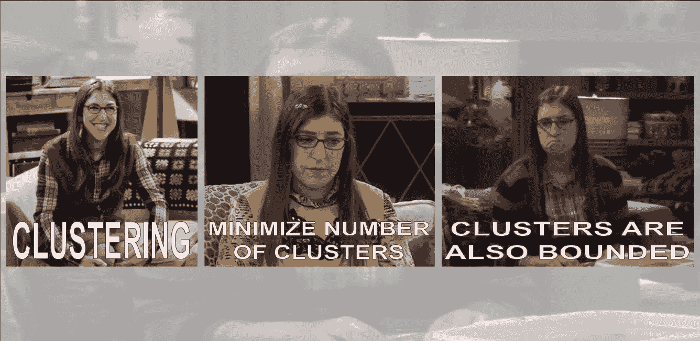
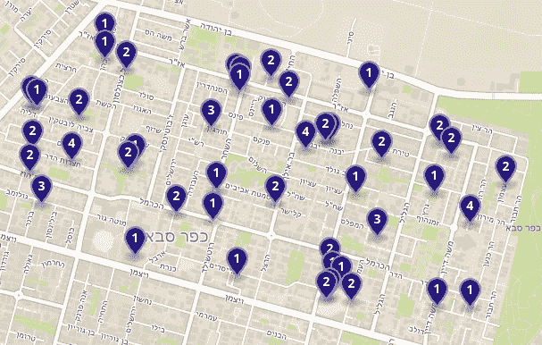
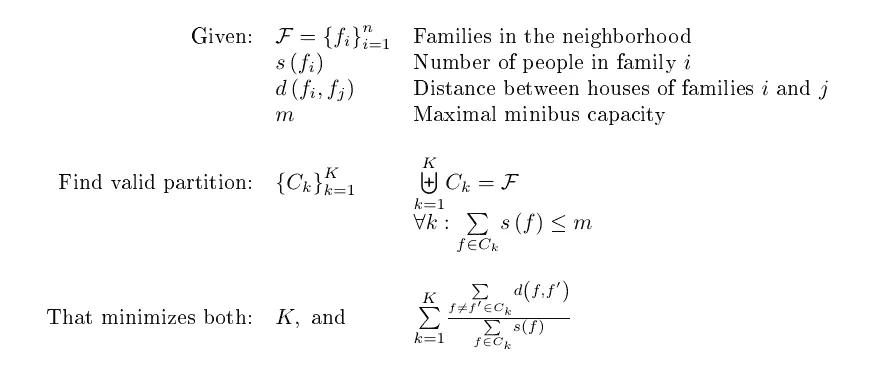
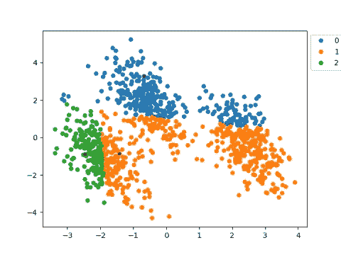
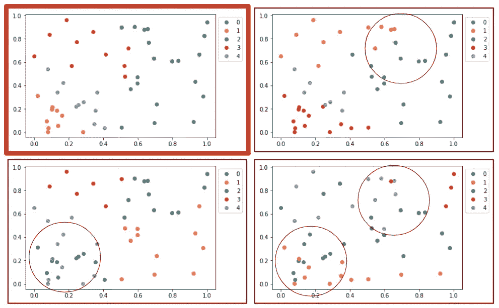
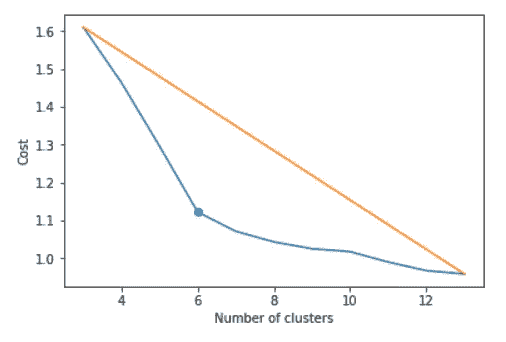
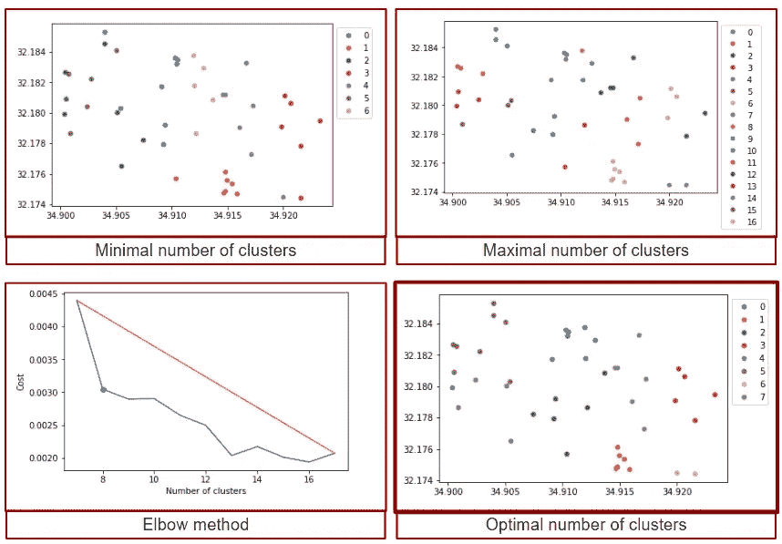
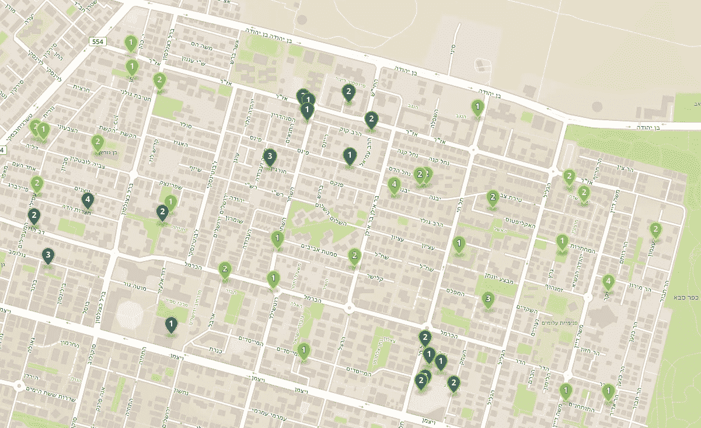

# 有界聚类

> 原文：<https://towardsdatascience.com/bounded-clustering-7ac02128c893?source=collection_archive---------23----------------------->



## 一种适用于有限规模聚类的聚类算法

想象一个非常现实的场景，你所在城镇的几个家庭计划一起去旅行。


为了节省运输费用，他们想租几辆小型公共汽车。当然，越少越好。为了使交通安排高效和愉快，他们希望每个家庭都呆在同一辆小巴上，并根据地理位置将这些家庭分开，以避免多余的弯路。



Our input data of families, each pin indicates location and number of people who want to join the roadtrip.

用数学的方法来说，我们有`n`个家庭，每个家庭`f`的家庭成员数量是`s(f)`，每辆小型货车的座位数量是`m`。`n`至`k`小巴中家庭的有效划分是指每辆小巴中家庭成员的总数不超过小巴的载客量。一个**好的**隔断是指每辆小型货车经过的距离最小。一个**大的**分区，是一个在最小化小客车数量和最小化每辆小客车行驶距离之间进行权衡的优化分区。



> **本帖包含伪代码。对于真正的代码你可以去** [**这里**](https://github.com/DalyaG/CodeSnippetsForPosterity/tree/master/BoundedClustering) **。**

# 听起来相当困难，是吗？

确实如此。一辆小型公共汽车的情况可以很容易地简化为[背包](https://en.wikipedia.org/wiki/Knapsack_problem)，使得手头的问题在计算上是 NP 困难的(更准确地说，是 NP 完全的，但是谁在计算)。因此，很明显，如果我们想大规模解决这个问题，我们并不是在寻找一个精确的解决方案。

我们能做什么？

让我们把它分成两步:

1.  给定一个常数`k`，找到一个`k`小型公共汽车家庭的(启发式)最佳划分。
2.  找最好的`k`。

步骤(1)将为我们构建好的分区，而步骤(2)将帮助我们找到一个好的分区。

# 步骤 I -有界 K-均值聚类

顾名思义，要为给定的`k`找到一个分区，我们将使用著名的 [K-Means 聚类](https://en.wikipedia.org/wiki/K-means_clustering)算法的一个变体，该算法受本文中[的启发。](https://core.ac.uk/download/pdf/61217069.pdf)

类似于 K-Means，我们将实现迭代算法，该算法在寻找每个聚类的质心(*更新*步骤)和将点分配到最近的质心(*分配*步骤)之间交替。在这个变体中，*分配*步骤也将确保集群保持它们的有界大小。

让我们更精确些，从头开始。经典的 K 均值算法大致是这样的:

```
1    centroids <- random *k* points
2    do *n_iter* times:
2.1     clusters <- each point assigned to closest centroid
2.2     centroids <- point closest to center in each cluster
3    return clusters
```

现在，考虑到有界簇的变化，我们将以如下方式修改步骤`2.1`，即*分配*步骤:

```
(2.1).1   points <- sort points by weight, in descending order
(2.1).2   for each point in points:
(2.1).2.1    centroids <- sort centroids by distance from point
(2.1).2.2    centroid <- first centroid in centroids for which total
                         weight + point's weight does not exceed *m*
(2.1).2.3    add point to cluster corresponding to centroid
```

你可以在这里看到代码。



Iterative process of updating clusters, starting from random guess of centroids.

K-Means 需要记住的另一件事是，这个过程容易不稳定，它可能终止的局部最小值高度依赖于第一次随机猜测。
因此，习惯上要重复执行几次算法，并选择最佳结果。根据 `sklearn.cluster.KMeans`的[默认是 10 次重复，我们也跟着做。](https://scikit-learn.org/stable/modules/generated/sklearn.cluster.KMeans.html)



Example of 4 different repetitions of the algorithm, with 4 different random initial centroids. In bold is the best outcome. Circled are areas where clusters are not well separated, indicating the suboptimality of the outcome.

# 第二步-选择最佳 K 值的肘法

好了，现在我们知道了如何为固定数量的小巴`k`找到一个**好的**分区，那么我们如何才能找到“最好的”`k`？

在最小化小公共汽车的数量和最小化每辆小公共汽车行驶的距离之间做出适当的权衡并不容易。

幸运的是，有些聪明人已经想了很多，常见的做法是用[肘法](https://en.wikipedia.org/wiki/Elbow_method_(clustering))，大致是这样的:

```
1   min_k <- sum(weights) / max cluster size
2   max_k <- min_k + number of sizes to try
3   for each k between min_k and max_k:
3.1    cost_k, clustrs_k <- Bounded K-Means Clustering
4   l <- line between (min_k, kcost_min_k) and (max_k, cost_max_k)
5   opt_k <- (k, cost_k) of maximal distance from l
```



Elbow Method: (i) perform K-Means Clustering for a range of different values of k, (ii) draw line between edge values, (iii) find value of k that its cost is furthest from the line.

让我们看看我们的家庭旅行数据是什么样的:



Partitioning our input data into the optimal number of clusters, *k=8\. In our input we had 45 families, with total 82 people, and minibuses of size 12.*

# 复杂性分析

让我们分析我们的有界 K 均值聚类的一次迭代。记住我们表示:`n`家庭数量，`m`小型公共汽车最大尺寸，`k`小型公共汽车数量。

*   在每个*赋值*步骤中，我们有:
    ➪按权重排序点:`n*log(n)`
    ➪对于每个点:排序质心`k*log(k)`，添加到第一个有效质心`k`
    ➪总计`O(n*log(n) + n*(k*log(k) + k)) = O(n*log(n)*k*log(k))`
*   在每个*更新*步骤中:
    每个聚类中的最大点数为`n`，或者当权重为整数时为`m`。
    所以，对于每个集群我们需要:
    ➪计算集群的中心:`n`
    ➪找到离中心最近的点:`n`
    所以对于所有集群:`O(k*n)`
*   因此，每次迭代都有`O(n*log(n)*k*log(k))`复杂度

如果我们在每次聚类运行中执行`x`迭代直到收敛，并且`y`以不同的随机初始状态运行，我们得到`O(x*y*n*log(n)*k*log(k))`。

现在记住，我们要对不同数量的`k`进行此操作。让我们将`K`表示为我们想要尝试的最大值，将`z`表示为不同`k`的数量，然后我们得到总数`O(x*y*z*n*log(n)*K*log(K))`。

肘方法在`K`中具有线性复杂度，这不会改变我们的最终结果😅。


# 收场白

我个人在这个问题上的经历是，我真的不得不在工作中解决类似的问题。我的第一反应是使用贪婪的局部搜索，我知道这在类似的几何问题中非常有效。

然而，我挑战自己走出自己的舒适区，并向一些同事和同行寻求建议。很高兴， [Orian Sharoni](https://www.linkedin.com/in/orian-sharoni/) 很快作出回应，向我推荐了两篇论文(有界 K 均值聚类+肘方法),这两篇论文总结了所有内容。比我想象的多花了几个小时，但是我设计的解决方案更优雅，而且很可能更接近最优(没有测试过，但是我的直觉告诉我)。

总之，作为一名算法开发人员，尤其是在快节奏的初创企业中工作的人，当我只想完成某件事时，使用 go-to-methods 会有所帮助。但是，偶尔，它甚至更有助于探索新的想法，学习新的方法，并扩大我的大脑“去算法”库。

希望你喜欢和我一起踏上这段旅程，也希望你今天拓展了你的心智图书馆🤓