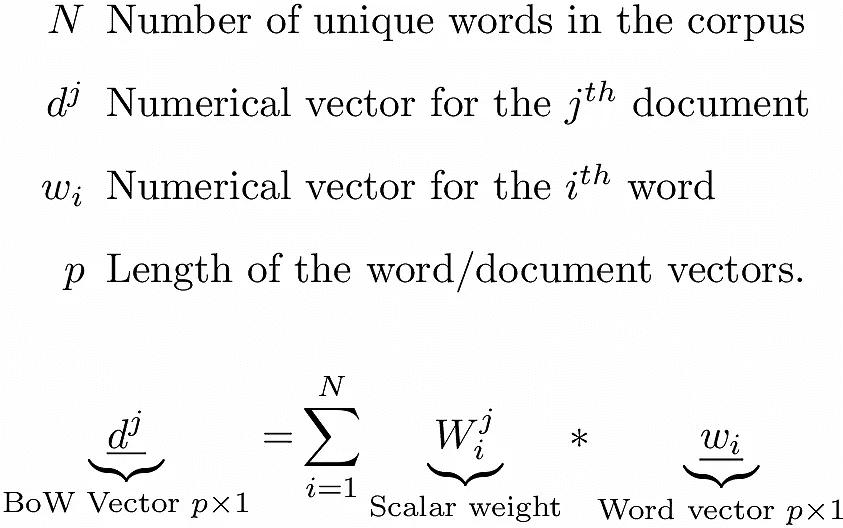
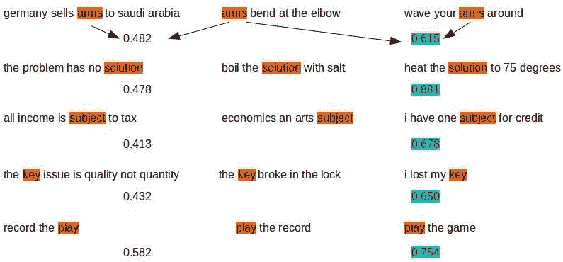

# 向伯特鞠躬

> 原文：<https://towardsdatascience.com/bow-to-bert-2695cdb19787?source=collection_archive---------36----------------------->

单词向量经过多年的发展，已经知道了“记录剧本”和“播放唱片”之间的区别。它们已经从一个每个单词都与其他每个单词正交的世界，发展到一个单词向量根据上下文变化的地方。给单词向量打上蝴蝶结是为分类等任务构建文档向量的常用方式。但是伯特不需要弓，因为从顶部[CLS]记号射出的向量已经为特定的分类目标准备好了…


自然语言处理(NLP)在过去十年中经历了一次复兴。人们对能够像人一样理解和处理语音/文本的嵌入、变形和语言模型感到非常兴奋。这种进步是不折不扣的。像总结文档、机器翻译、完成句子和对话这样的功能，现在正在尝试并取得了一些成功。事实上，这是一个从自然语言处理到 NLU(自然语言理解)的演变过程。伯特(来自变压器的双向编码器表示)模型归因于[德夫林等人。艾尔](https://arxiv.org/abs/1810.04805)。恰好是这个领域目前的领导者。

传统的自然语言处理毫不犹豫地让*理解它正在处理的单词/文本。它甚至没有尝试。但这并不意味着它完全无用。事实上，在对通用文档进行分类时，一个热词向量用一个蝴蝶结(词袋)绑在一起，这些年来做得还不错。当然，理解单词的语义/上下文并相应地对文档进行分类会更好。这就是像 BERT 这样的新语言模型带来的东西——尽管有一些花费。*

这篇文章的目的是看看单词向量从一个热点到上下文的演变。我们从没有朋友的单词开始，作为一个热点向量，它是一个正交单词空间的基础，其大小与词汇表的大小一样。我们转到单词嵌入，它结合了同现统计，使单词有一个固定的朋友圈。最后是考虑到上下文的 BERT 嵌入，从而根据情况让单词交新朋友或解除当前朋友的好友关系。友谊是用余弦相似度来衡量的。我们从不同的句子/上下文中提取相同和相似的单词，并查看它们对应的单词向量的余弦相似性是否与我们对这些单词在这些句子中的含义的理解相吻合。这基本上是这篇文章的主旨。

最后，这里的重点是单词嵌入的这些进步对我们意味着什么，我们如何应用它们并从中受益，而不是这些进步如何实现的技术细节。我们在这里浏览一些代码片段，但是完整的代码可以在 [github](https://github.com/ashokc/Bow-to-Bert-Similarity) 上重现结果。

在讨论单词向量之前，我们先简要回顾一下 BoW。在即将发布的帖子中，我们也需要它来从 one-hot 和 fastText 单词向量构建文档向量。在本系列的下一篇文章中，我们将针对几个分类任务，针对伯特[CLS]令牌向量来评估这样的文档向量。

## 1.一袋单词

在单词袋(BoW)方法中，文档向量是组成文档的单词的数字向量的加权和。权重可以简单地是该单词在该文档中的频率计数、一个 [tf-idf](https://en.wikipedia.org/wiki/Tf%E2%80%93idf) 值或其他变化。



Equation 1: The BoW vector for a document is a weighted sum of word-vectors When w_i is one-hot then p = N. When w_i is obtained from fastText, Glove, BERT etc… p << N

弓形向量的一个明显缺点是文档中单词的顺序没有区别，如下图所示。


Figure 1\. [source](http://xplordat.com/2019/01/13/word-bags-vs-word-sequences-for-text-classification/)

## 2.词向量

等式 1 中有字向量 *w_i* 的选项。传统的 NLP 从使用一个热点向量开始，而最近(从 2003 年开始)的参与者使用其他向量进行实验，以解决这些一个热点向量的缺点。

## 2.1 长而一热

在传统的 NLP 中，每个单词都是一个与其他单词正交的向量。单词向量长度 *p* 等于 *N* ，即单词空间的维数。第*个*字的向量在第*个*位置为 1，在其他位置为 0。因此得名一热矢量。简单来说，第*个*字向量是第*个*个维度的字空间中第*个维度的基向量。*

那么文档就是这个 n 维单词空间中的一个点/向量，坐标是{ *W^j_i* }。实际上，等式 1 中的 *W^j_i* 可以是 *jth* 文档中带字的*的频数，也可以是类似 [tf-idf](https://en.wikipedia.org/wiki/Tf%E2%80%93idf) 的变体。下图演示了 [shred-bag-tag](http://xplordat.com/2018/01/23/stacks-of-documents-and-bags-of-words/) 操作，该操作将文档转换为单词空间中的向量。*


Figure 2\. In word space, a BoW vector for a document is a point. It is a weighted (the word count in this case) sum of the one-hot word vectors making up the document.

**一键词向量的一些问题**

1.  **太长**:和正在处理的文本语料库中的词汇量一样长。这是一个计算上的缺点
2.  **无意义的记号**:单词被当作只是没有意义的记号，与其他单词没有关系。您可以将语料库中的单词 *good* 替换为一些垃圾单词，如*gobbeek*和 BoW care——只要这个新单词*gobbeek*还没有出现在语料库中。事实上，您可以将语料库中的每一个 *N-* 单词替换为一些随机的不冲突的单词，BoW 将为您提供相同的文档向量。
3.  **没有上下文/位置感知**:每个单词只有一个向量，并且每个单词向量都与所有其他向量正交。因此不存在上下文/位置相关单词向量或与其他单词的关系的问题。但在现实中，我们知道文字是复杂的存在。

*   一个给定的词有不同程度的同义词和反义词。*好/更好/最好* & *好/不好/更差*例如
*   句子中同一个词的位置相关意义。*记录播放*vs*播放记录*。*播放*和*记录*的含义随着位置的转换而变化
*   多义——*明亮的*可以表示*闪亮的*，或者例如*智能的*
*   谐音— *run* 可以是棒球中的名词 *run* ，也可以是动词 *run*

## 2.2 短、密、固定

对更好的单词数字向量的努力始于 2013 年的 [word2vec](https://arxiv.org/abs/1301.3781) ，随后是 [Glove](https://nlp.stanford.edu/projects/glove/) 和 [fastText](https://fasttext.cc/) 。我们在这里的例子中使用了 fastText 单词嵌入，但是结论同样适用于其他例子。所有这些单词嵌入都是基于*分布假设*得出的，该假设陈述:

> 语义相关的单词将具有与其他单词相似的共现模式

根据这一假设，如果两个词通常保持相同的公司(其他词)，那么这两个词是语义相关的。这些算法利用维基百科等大量文本来计算每个单词与所有其他单词的共现模式。这样获得的单词的数字向量表示作为优化过程的一部分对此进行编码。这里获得的字向量在两个方面比一键向量有所改进。

## 2.2.1 词向量现在更短了

这里得到的单词向量的长度 *p* 比 *N* 小很多很多。虽然 *N* (一个热词向量的长度)可以达到几十万，但是 *p* 更像是 50 或者 100 或者 300。这是一个巨大的计算优势。

## 2.2.2 单词现在有朋友了

在这个一热的世界里，所有的单词都是相互独立的——这不是一个有用的场景。单词*好的*与*坏的*和*更好的*都正交。在分布假设下获得的单词向量在某种程度上弥补了这一点。它们使单词能够相互联系，在某种程度上模仿对文本的理解。

以*假期*、*休假*和*论文*这些词为例。单词*假日*和*休假*与其他单词如*旅行*、*海滩*等一起出现。它们拥有相似的单词组合——因此它们与其他单词有相似的共现模式。所以他们的词向量通过更加相似/平行来反映这一点。超过什么？比他们更相似/平行的是一个像*纸*一样的词。这也符合我们对这些词的自然理解。从 [fastText](https://fasttext.cc/docs/en/english-vectors.html) 中读取 300 维( *p* = 300)单词向量，我们可以很容易地计算这些单词的余弦相似度。运行[fast text _ word _ similarity . py](https://github.com/ashokc/Bow-to-Bert-Similarity/blob/master/fasttext_word_similarity.py)与

```
pipenv run python ./fasttext_word_similarity.py holiday vacation paper
```

显示出*假期*和*假期*之间的相似性比预期的大得多。

```
Cosine Similarity: holiday & vacation : 0.7388389
Cosine Similarity: holiday & paper : 0.2716892
Cosine Similarity: vacation & paper : 0.27176374
```

从诸如文档分类的更大任务的角度来看，使所有的词向量都正交是没有帮助的。BoW 文档向量是从等式 1 中的单词向量构建的。当使用一个热门单词向量时，具有相似但不同单词的两个句子将表现出零余弦相似性。而是与快速文本单词向量的非零相似度。例如，与类似于“*研究论文*”的句子相比，句子“*享受假期*”将具有更类似于“*享受你的假期*”的弓形向量。运行[fast text _ sentence _ similarity . py](https://github.com/ashokc/Bow-to-Bert-Similarity/blob/master/fasttext_sentence_similarity.py)我们看到前两个句子的余弦相似度更大。

```
pipenv run python ./fasttext_sentence_similarity.py

# words not found in fasttext.. 0
Cosine Similarity: enjoy your holiday & have a fun vacation : 0.72311985
Cosine Similarity: enjoy your holiday & study the paper : 0.5743288
Cosine Similarity: have a fun vacation & study the paper : 0.51478416
```

## 2.2.3 但是仍然没有上下文意识

与单词的上下文和位置相关的问题没有通过分布假设来解决。这是我们在 2.1 节中列出的唯一热门词向量的最后一个缺点。即使一个单词已经有利地获得了与其他单词的一些关系，一个单词仍然由单个**相同的*向量表示，无论它出现在文本中的什么地方。*

*例如，板球中的*音高*与音乐中的*音高*不同。与音乐中的 *pitch* 相比，板球中的 *pitch* 这个词与众不同。所以他们真的没有很多共同的朋友，所以应该有不同的表现。如果板球球场的训练语料来自体育部门，音乐球场的训练语料来自艺术部门，他们会的。但事实并非如此，考虑到上下文和词汇的多样性，这种方法也无法扩展。这里为一个单词获得的嵌入是它出现的所有上下文的平均值，因此失去了上下文…这导致了 BERT 所属的最新一批语言模型。*

## *3.简短、密集且上下文敏感*

*诸如 [ELMO](https://arxiv.org/pdf/1802.05365.pdf) 、 [GPT-2](https://d4mucfpksywv.cloudfront.net/better-language-models/language_models_are_unsupervised_multitask_learners.pdf) 和[伯特](https://arxiv.org/abs/1810.04805)的语言建模工具允许获得知道它们的位置和环境而变形的词向量。请参考杰·阿拉姆马的优秀系列文章[、插图伯特、ELMO 等人的文章(NLP 如何破解迁移学习](http://jalammar.github.io/illustrated-bert/)、[注释转换器](http://nlp.seas.harvard.edu/2018/04/03/attention.html)等……了解这是如何实现的。我们直接跳到使用 BERT 来观察它生成的上下文，以及有意义的单词的位置感知向量。*

*预先训练好的 BERT 模型可以[下载](https://github.com/google-research/bert)，它们有运行 BERT 的脚本，并从任何和所有层获取单词向量。我们在这里使用的基本情况 BERT 模型采用了 12 层(变换器块)，并且产生具有 *p* = 768 的字向量。下面的脚本[getbertwodvectors . sh](https://github.com/ashokc/Bow-to-Bert-Similarity/blob/master/getBertWordVectors.sh)读入一些句子，为每个句子中的每个单词生成单词嵌入，并且从 12 层中的每一层生成。*

*Script to obtain BERT embeddings*

*我们从第 11 层提取嵌入(为什么是第 11 层？你也可以试试其他的。 [Bert As a Service](https://github.com/hanxiao/bert-as-service) 使用第 11 层:)用于我们的工作并计算余弦相似度。*

*Process BERT embeddings and compute cosine similarity*

*我们的目标是展示 BERT 单词向量是基于上下文变化的。以下面三句话为例。*

*   *录制*播放**
*   ****播放*** 记录*
*   ****玩*** 游戏*

*第二句话里的*玩*这个词应该和第三句话里的*玩*比较像，和第一句话里的*玩*比较不像。我们可以想出任何数量的像上面这样的三元组来测试 BERT 嵌入做得有多好。这里有一堆这样的三元组，结果显示伯特能够找出这个单词的上下文。*

**

*Figure 3\. BERT embeddings are contextual. Each row show three sentences. The sentence in the middle expresses the same context as the sentence on its right, but different from the one on its left. All three sentences in the row have a word in common. The numbers show the computed cosine-similarity between the indicated word pairs. BERT embedding for the word in the middle is more similar to the same word on the right than the one on the left.*

*当分类是更大的目标时，不需要从 BERT 嵌入中构建 BoW 句子/文档向量。文档开头的[CLS]标记包含一个为特定分类目标而微调的表示。但是对于一个聚类任务，我们确实需要处理单个的 BERT 单词嵌入，并且可能在顶部使用 BoW 来产生我们可以使用的文档向量。我们将在以后的文章中讨论这些问题。*

## *3.结论*

*我们跟踪了词向量从长/稀疏/一键到短/密集/动态的演变。这是一个从一个单词没有朋友的地方(one-hot，orthogonal)，到有朋友圈的地方(例如 fastText)，以及目前可以适应和找到朋友的地方(例如 BERT)的旅程。这些进步逐步提高了我们对文本建模的能力。*

*就这样，我们结束了这篇文章。在下一篇文章中，我们将继续评估这些词向量，以完成几个分类任务。*