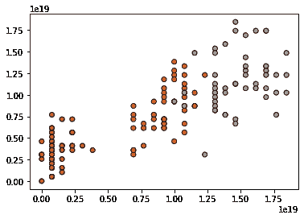
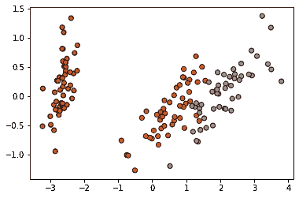

# BPDR:一种新的降维技术

> 原文：<https://towardsdatascience.com/bpdr-a-new-dimensionality-reduction-technique-f570eea3fc65?source=collection_archive---------14----------------------->

## 一种新的降维方法介绍。

# 介绍

LDA、PCA 或 t-SNE 等降维算法是分析未标记(或标记)数据并获得更多有关其结构和模式信息的强大工具。降维使我们能够可视化高维数据集，这对模型选择非常有帮助。我认为，机器学习的这一子集——称之为数据探索——与其对手(如监督学习或深度学习)相比，还远远不够发达。

**我的观点:** *如果有人开始一个新的机器学习项目，他们做的第一件事将是对数据进行探索性分析。不同的研究人员对这一步应该有多深入有他们自己的想法，然而，数据探索的结果是关于手边的数据集获得的知识。当研究人员遇到各种问题，如模型选择和超参数调整时，这些知识被证明是非常有价值的。*

通过从根源开始，开发漂亮的数据探索算法，为用户提供关于数据集底层模式的质量信息，我们可以从整体上开发更好的机器学习管道。


Some binary numbers. (Photo Credit: Fotomay/Shutterstock)

BPDR 背后的想法是受我在大学里为一个班级写的图像压缩器的启发。这个想法就是位打包:将不同的数据点编码成一个长二进制字符串。

我将省略算法是如何构造的许多细节。对于那些对这个算法的“幕后”感兴趣的人来说，代码可以在我的 GitHub [这里](https://github.com/jamie-weiss/BPDR/blob/master/bitpack.py)查看。

# 该算法

该算法的概述如下:原始数据列(必须都是数字)首先按重要性排序。然后将数据归一化，以 0 为中心。接下来，构建了 N 个 128 位的字符串来表示我们试图减少到的 N 个组件。规范化数据按照其功能重要性的顺序被二进制打包成 128 位字符串。最后，我们剩下的是可以转换回整数的压缩二进制数。

对于将减少到 2 列的 4 列数据集，二进制打包如下所示:

```
binary string 1 -> 0 0 0 0 0 0 0 0 ... 0 0 0 0 0 0 0 0  (128-bits)
                  | most important  |2nd important col|
                   -----------------------------------binary string 2 -> 0 0 0 0 0 0 0 0 ... 0 0 0 0 0 0 0 0  (128-bits)
                  |3rd important col|4th important col|
                   ------------------------------------> repeat this packing for each row
```

再一次，这部分是作为算法如何工作的一般概述，然而，它不是很深入。

# 如何使用 BPDR

我构建了 BPDR 模块，以便它模仿 Scikit-Learn 包中其他维度算法的工作方式。下面是它在 iris 数据集上的一个使用示例。

首先， [BPDR 仓库](https://github.com/jamie-weiss/BPDR)需要从 GitHub 中克隆出来。导航到 BPDR 目录后，运行`pip install -r requirements.txt`以获得运行算法的正确包。现在，我们终于准备好打开一个新文件，并开始探索数据。

首先，我们必须将所需的包导入到我们的模块中:显然，我们将使用 BPDR，以及所有流行的 iris 数据集和 matplotlib 进行一些可视化:

```
from bitpack import BPDR
from sklearn import datasets
import matplotlib.pyplot as plt
```

接下来，我们加载数据集:

```
iris = datasets.load_iris()
iris_data = iris.data
iris_targets = iris.target>>> iris_data[0]
[5.1 3.5 1.4 0.2]
```

我们看到有 4 列(都是数字)。让我们将这个数据集减少到 2 列，以便我们可以用图形显示减少的组件。我们首先需要创建一个 reduction 对象的实例，并初始化它的参数。

```
bpdr = BPDR(n_components=2)
```

接下来，通过调用 fit_transform 函数，传入的数据将被减少并返回到一个新数组中:

```
bpdr_data = bpdr.fit_transform(iris_data, iris_targets)>>> bpdr_data[0]
[7.686143364045647e+17, 4.0992764608243425e+18]
```

因为我们传入了标签，所以我们可以查看一些方差度量，这些度量评估缩减的数据对原始数据的解释程度:

```
>>> print(bpdr.variances)
[3.476833771196913e+36, 4.83034889579370e+36, 9.75667133492751e+36]>>> print(bpdr.scaled_variances)
[0.5774239158754918, 0.8022123454852088, 1.6203637386392993]>>> print(bpdr.mean_variance)
6.021284667306044e+36
```

有关如何计算这些差异的更多信息，请访问存储库的文档。

最后，我们现在有了一个 2 列宽的数据集，可以用图表显示出来。当组件 1 绘制在 X 轴上，组件 2 绘制在 Y 轴上时，图形如下所示:



Iris dataset after BPDR reduction

图中不同的颜色代表了花的不同标签。很明显，每个标记组都有不同的聚类。这种结构表明该算法很好地在较低的维度中表示了完整的数据。作为比较，我们看同样的图，但是使用主成分分析:



Iris dataset after PCA reduction

BPDR 归约实际上创建了一个比 PCA 更具线性可分性的数据集。这并不意味着 BPDR 算法对所有数据都是更好的算法，它只是意味着它值得研究，尤其是在执行线性回归类型的模型时。

本文的所有代码都可以在 [GitHub 库](https://github.com/jamie-weiss/BPDR)的 Jupyter 笔记本中找到。