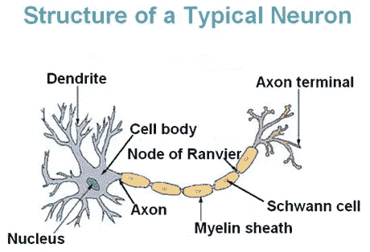

# 大脑:一个谜

> 原文：<https://towardsdatascience.com/brain-a-mystery-5b1511e56f88?source=collection_archive---------34----------------------->

“我们能拥有的最美丽的经历是神秘的。”——阿尔伯特·爱因斯坦

# 介绍

人类拥有最密集的神经元(860 亿)。这赋予了我们所拥有的智慧，我们辨别抽象概念、做出跨领域决策和进行天马行空式思考的能力。如果你只是观察自己每天的行为，很有可能你会感到惊讶。最棒的是，当你试图对大脑实际上是如何工作的提出自己的假设，并审视这些预先存在的框架时，这不亚于欣赏一件宁静的艺术品。在这篇文章中，我将试图展示是什么让大脑如此强大，以及理解大脑的一些框架和方法，以及它是如何学习的。

# 是什么让大脑如此特别

Picture taken from [https://commons.wikimedia.org/wiki/File:Neuron.jpg](https://commons.wikimedia.org/wiki/File:Neuron.jpg)

1.  根据神经元学说，神经元是大脑的基本结构和功能单位。
2.  神经元通过细胞体将信息以电脉冲的形式从树突传递到轴突。这需要维持体内和体外之间的离子电势差，这占据了身体每日葡萄糖消耗的大约 20 %。
3.  髓鞘通过缠绕轴突来辅助电脉冲尖峰的快速无损长距离通信。这是通过一种称为跳跃传导的机制发生的，在这种机制中，尖峰从 Ranvier(髓鞘间隙)的一个节点跳跃到另一个节点。这表明大脑是如何完美地包含了无损信号传输的概念。
4.  两个神经元之间的连接被称为突触，它可以具有电和化学性质。电用于反射等功能的快速传输，化学用于学习和记忆。
5.  激发神经元是一个能量密集型过程，因此所有神经元不会同时激发。这表明大脑中可能有一种惊人的能量优化调度算法。
6.  神经网络中权重的概念可能是受赫比可塑性概念的启发，赫比可塑性通常被理解为一起放电的*细胞*。
7.  大脑有各种各样的重要组成部分，并且每一个都是相互联系的。对我来说最有趣的是丘脑，它就像一个基站，从我们的感觉器官接收输入信号，然后将其传递到大脑皮层，大脑皮层通常被称为这场表演的明星。
8.  说到资源管理，大脑是很棒的。大脑执行的许多任务都是无意识完成的，因此我们可以进行多任务处理，如大规模并行计算。
9.  有许多神经元的子网络，它们也构成了一个更大网络的一部分，并与更小的网络相连。
10.  说到学习和记忆，大脑有不同的方式。

*   短期或工作记忆是我们有意识的、动态的记忆。
*   长期记忆或情景记忆是我们能够回忆起的过去的记忆。有趣的是，它是有偏见的，这在跟踪相关信息而不是所有信息时非常有用。
*   操作性条件反射是一类学习，其中奖励或惩罚会影响学习过程。这可能启发了强化学习领域。
*   我们记忆和学习的本质是语义的。它不仅仅是基于过去经验存储的纯粹信息，而且在形成概念的各种记忆片段之间也存在相互依赖。

# 惊人的想法和作品

虽然有许多伟大的作品旨在模拟大脑的活动，但这些是我最喜欢的。

## 人工神经网络

这些网络受到神经元生物网络的启发。每个节点代表一个神经元，权重表示来自该节点的信号有多重要。有一个激活函数作为信号通过的阈值，并且通过相对于真实标签反向传播损耗来进行学习。神经网络的许多伟大的变种有 CNN，RNN，甘，自动编码器等等。

## 神经图灵机

图灵机是一个杰出的数学模型，由艾伦·图灵发明，由程序、磁带和寄存器组成。本文由 *DeepMind*

> 神经图灵机

使用类似于图灵机的架构，但保持一切差异，以便学习可以通过梯度下降进行，但附加了一个附加的内存组件，可以使用注意机制进行交互。这是数字计算机设计和生物学结合的一个独特的交叉点。

## 持续学习

如果我们从某个发行版中学到一些概念，我们实际上可以在不同的发行版中使用这些概念。这就好像一个人学会了如何在特定的环境中用特定的菜肴吃饭，也可以在别的地方吃不同的菜肴。因此，任务保持不变，但分布发生了变化。在这种情况下，神经网络需要在整个数据集上再次训练。这是由 *Friedemann Zenke 等人*在本文中提出的

> 通过突触智能不断学习

如该文件所述

*“在这项研究中，我们引入了智能突触，将这种生物复杂性引入人工神经网络。“每个突触都会随着时间的推移积累与任务相关的信息，并利用这些信息快速存储新的记忆，而不会忘记旧的记忆。”*

## 迁移学习

原则是通过执行特定任务获得的知识被用来解决不同的问题，而这些问题在某种程度上是相似的。这在计算机视觉和自然语言处理中非常流行，其中使用预先训练的模型，然后进行微调以执行特定的任务，通常会产生很好的结果。谈到计算机视觉，有 ResNet、InceptionNet，对于 NLP，有 BERT、GPT-2 等等。

## 深度强化学习

AlphaGo、AlphaStar、MuZero 都是令人震惊的创新，它们使用不同味道的深度强化学习来展示特定任务中的超人智能，如玩星际争霸、围棋、象棋、雅达利游戏等，主要使用基于深度神经网络架构的奖励机制来优化奖励功能。强化学习的主要变体是基于模型的、基于价值学习的和基于策略梯度的。

## 使用统计不变量的学习

这是由 Vladmir Vapnik 等人在论文中提出的。

> *重新思考统计学习理论:使用统计不变量学习。*

如该文件所述

*‘在 LUSI 范式中，为了构造期望的分类函数，学习机计算特定于问题的统计不变量，然后以保持这些不变量的方式最小化期望误差；因此，这既是数据驱动的学习，也是不变量驱动的学习。*

*‘在这个新的范例中，首先选择(使用不变量)一个包含所需解决方案的容许函数子集，然后使用标准训练程序选择解决方案*’

*‘LUSI 方法可用于提高所得解的精度，并减少必要的训练样本数量。’*

## 蛋白质折叠分析和基因组编辑

虽然这并不直接模拟人脑或其任何活动，但旨在利用先进技术更深入地分析构成大脑的生物成分。像 AlphaFold 这样的最新创新可以预测体内特定蛋白质的结构，这可以帮助科学家了解它在体内的作用。由于蛋白质是每个细胞的重要组成部分，对它的深入了解可以解开许多关于大脑行为方式的秘密。

同样，基因组编辑也被科学家普遍用于研究细胞和理解它们的基本工作，最著名的技术是 CRISPR-Cas9。对基因序列的更深入了解可以回答许多关于我们的大脑如何世代进化的问题。

## 大脑器官样

这是一个在实验室环境中使用人体干细胞人工开发的迷你大脑。这对于理解大脑发展的不同阶段非常有用，并可能提供关于大脑的更深入的见解。

# 结论

作为人类，我们发展概念，从更少的数据中学习。这可能是由于嵌入我们基因中的进化信息。尽管如此，每次我遇到一个新想法时，模拟大脑活动的工作量都让我震惊。对我来说，理解大脑的动机不是人工智能，而是欣赏这样一个奇妙的创造。更令我惊讶的是，计算机科学、数学、生物学、心理学和其他领域是如何走到一起，用一种共同的语言进行交流，试图解释自然。

这个难题可能会有缺失的部分，也许将大脑建模为一个独立的单元可能不是一个好主意，因为大脑的功能在很大程度上取决于感觉器官如何感知环境以及各种内部器官作为一个整体系统如何立即行动。

然而，正如艾伦·图灵所说

*“发明一台可以用来计算任何可计算序列的机器是可能的。”*

也许我们已经有了那台机器。