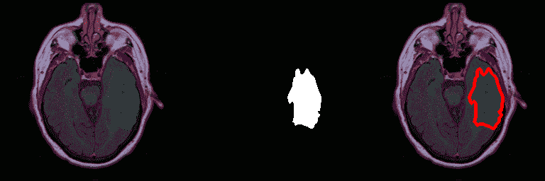

# 基于金字塔场景分析的脑肿瘤分割

> 原文：<https://towardsdatascience.com/brain-tumour-segmentation-using-pyramid-scene-parsing-pspnet-198168d22235?source=collection_archive---------17----------------------->

*用数据做酷事！*

# **简介**

癌症是自古以来人类面临的最致命的疾病之一。[全世界每年有近 30%的人口死于癌症。如果肿瘤在早期被发现，存活的机会会大大增加。深度学习(CNN)已经改变了计算机视觉，包括对医学图像的诊断。在这篇文章中，我们将利用 CNN 的力量从脑 MRI 图像中检测和分割肿瘤。](https://www.cancer.ca/en/cancer-information/cancer-101/cancer-statistics-at-a-glance/?region=on)

见下图中带有肿瘤的脑部 MRI 图像示例和分割结果。左图是绿色肿瘤的脑部核磁共振扫描。右图用红色显示了肿瘤的机器预测。这是惊人的准确！


Tumor prediction example

我们已经与初创公司合作，使用语义分割构建各种应用程序。请联系我们，了解更多信息。

# **语义分割**

语义分割是将图像中的像素标记为一类。在上图中，我们将图像中的所有像素标记为肿瘤或背景类。已经公布了许多基于深度学习的高效语义分割方法，例如(按时间顺序) :

1.  [FCN](https://people.eecs.berkeley.edu/~jonlong/long_shelhamer_fcn.pdf)
2.  [UNet](https://lmb.informatik.uni-freiburg.de/people/ronneber/u-net/)
3.  [SegNet](http://mi.eng.cam.ac.uk/projects/segnet/)
4.  扩张的回旋
5.  深度实验室(v1 和 v2)
6.  精制网
7.  金字塔场景解析网络
8.  [DeepLab v3](https://arxiv.org/abs/1706.05587)

对于这个博客，我们选择了 PSP-Net，因为它非常有效，并且比许多先进的方法如 U-net，FCN，DeepLab (v1，v2)和扩张卷积等都要好。

DeepLabV3 是另一个流行且强大的模型。我最近写了一篇关于如何使用 DeepLabV3 以 30 FPS 进行[语义分割的博客](https://deeplearninganalytics.org/semantic-segmentation/)

要了解以上列出的不同分段架构的更多信息，请参考这篇[帖子](http://blog.qure.ai/notes/semantic-segmentation-deep-learning-review)。

# **金字塔场景解析网**

最新的场景解析框架大多基于全卷积网络(FCN)。基于深度卷积神经网络(CNN)的方法促进了动态对象理解，但仍然面临着考虑不同场景和无限制词汇的挑战。一个例子是船被误认为汽车。这些错误是由于对象的相似外观造成的。但是当查看关于场景被描述为河边的船屋之前的上下文的图像时，应该产生正确的预测。

准确的场景分类依赖于对全局场景类别的先验知识。**金字塔池模块**通过应用具有大内核的池层来帮助捕获这些信息。使用膨胀卷积(参考:[膨胀卷积论文](http://blog.qure.ai/notes/semantic-segmentation-deep-learning-review#dilation))对 Resnet 进行修改，并增加了一个金字塔池模块。该模块将来自 ResNet 的特征映射与并行池层的上采样输出连接起来，其中内核覆盖整个图像、图像的一半和一小部分。

下图描述了 PSPNet 架构。你可以在他们的论文[这里](https://arxiv.org/pdf/1612.01105.pdf)中读到更多关于 PSPNet 的内容。


PSPNet Architecture

# 利用 PSPNet 建立脑图像分割模型

## **数据集**

数据集是从 [Kaggle](https://www.kaggle.com/mateuszbuda/lgg-mri-segmentation/version/2) 获得的。之所以选择这种方法，是因为标记的数据是二进制掩模图像的形式，易于处理并用于训练和测试。或者，这款来自 VGG 集团的基于网络的注释工具可以用来标记自定义数据集。

数据集遵循以下文件夹层次结构:

资料组

| _ images—png 格式的 RGB 图像

| _ masks 屏蔽 png 格式的 RGB 图像，其中区域填充有各自的标签值。

我们的标签是:1 代表肿瘤，0 代表其他

例如:

假设像素(10，10)属于肿瘤，它包含值 1。

## **培训框架**

虽然存在许多令人惊叹的框架来使用 Keras 培训和评估语义分割模型，但以下 repo 因其易用性、支持的不同模型数量以及最新的文档而脱颖而出:

[https://github.com/divamgupta/image-segmentation-keras](https://github.com/divamgupta/image-segmentation-keras)

我们选择了“vgg_pspnet”，这是一个在预训练的 vgg 主干网上实现的 pspnet。

要遵循的步骤是:

*   https://github.com/divamgupta/image-segmentation-keras.git
*   按照 repo 自述文件中的说明进行安装

一旦安装了回购，就可以开始培训了！

```
# Navigate to the **Semantic_segmentation/image-segmentation-keras** folder**import keras****from keras.models import model_from_json****import keras_segmentation as ks**# Initialise the pretrained model .# Note that the input height and width need not be same as image height and width since the network takes care of the input sizes.**model = ks.models.pspnet.vgg_pspnet( n_classes=2,****input_height=384,****input_width=384)**# Training**model.train(****train_images = “datasets/brain/images”,****train_annotations = “datasets/brain/masks”,****checkpoints_path = “ckpts/brain” , epochs=50 ,****auto_resume_checkpoint = True,****steps_per_epoch = 50****)**
```

## 通过训练好的模型运行推理

```
# Load Neural Network**model = ks.predict.model_from_checkpoint_path(‘ckpts/brain’)**# Predicted output will be a mask image similar to the mask images specified in the input**pred_mask = ks.predict.predict( model = model , inp = ‘image.png’ )**
```

下面是我们在数据集的一个小子集上获得的结果。虽然数据集很容易过拟合，但高精度的结果显示了这种方法的潜力。

图像顺序:原始图像(左)、预测遮罩(中)、覆盖遮罩边界(右)



# **结论**

希望你喜欢这个博客，并尝试自己的代码。这个博客表明，我们可以使用预训练的模型在半天的工作中获得良好的分割结果！它真正展示了基于深度学习的计算机视觉的力量。

我们可以将该代码扩展到任何具有待分割特征的医学图像。例子包括不同种类的癌症肿瘤、微生物、骨折、洞等。

我有自己的深度学习咨询公司，喜欢研究有趣的问题。我已经帮助许多初创公司部署了基于人工智能的创新解决方案。在 http://deeplearninganalytics.org/的[入住我们的酒店。如果你有一个我们可以合作的项目，那么请通过我的网站或者在**info@deeplearninganalytics.org**联系我](http://deeplearninganalytics.org/)

你也可以在[https://medium.com/@priya.dwivedi](https://medium.com/@priya.dwivedi)看到我的其他作品

**参考文献:**

*   [PSPNet](https://arxiv.org/abs/1612.01105)
*   [Kaggle 脑部 MRI 数据集](https://www.kaggle.com/mateuszbuda/lgg-mri-segmentation/version/2)
*   [语义分割](/semantic-segmentation-popular-architectures-dff0a75f39d0)