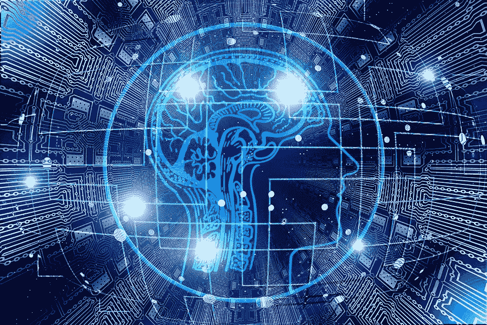
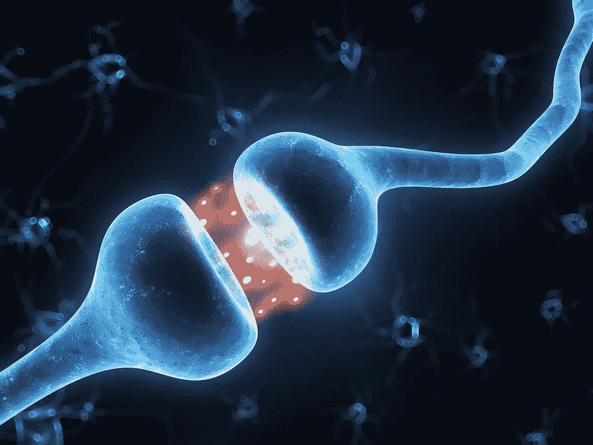
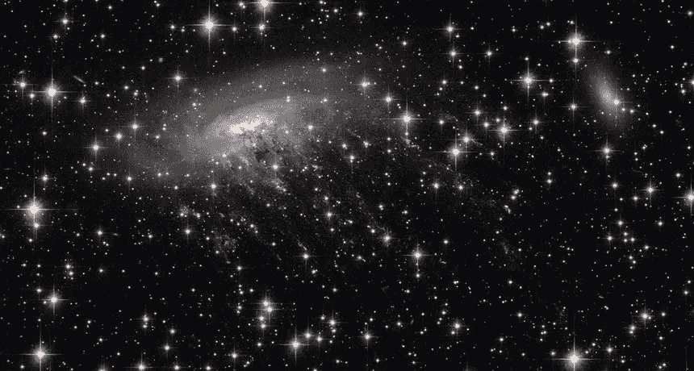
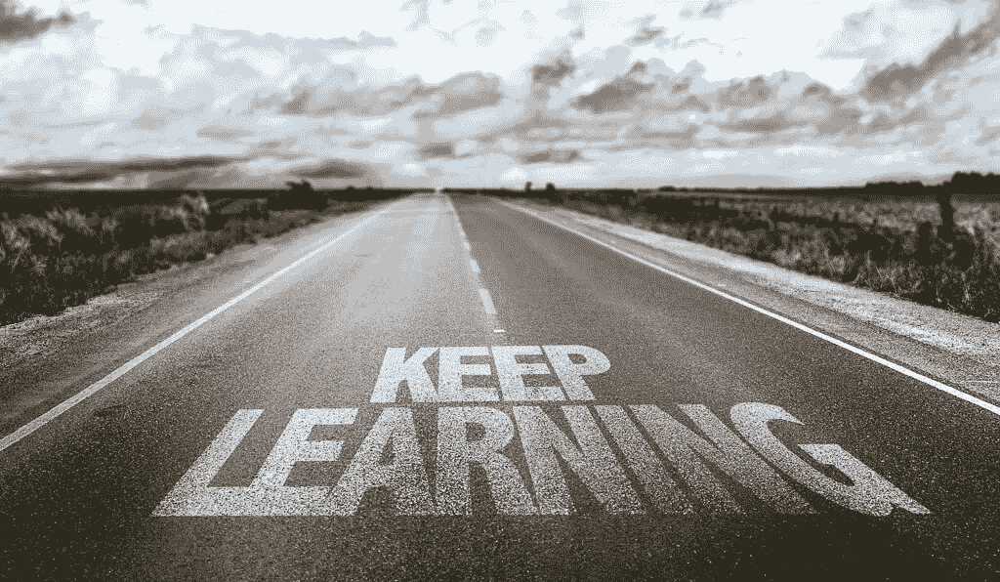

# 大脑 1:0 人工智能

> 原文：<https://towardsdatascience.com/brains-1-0-ai-190091808760?source=collection_archive---------16----------------------->

## 为什么生物大脑仍然领先于任何已经建立的人工智能…或者未来许多年将要建立的人工智能。

Brains are still way ahead of any AI available today

当阿尔伯特·爱因斯坦说“深入观察自然，然后你会更好地理解一切”时，他脑海中没有人工智能(AI)。他提醒我们，每一种理论都需要与它应该解释的现实“保持联系”。人工智能也是如此，这是一项基于脑科学的数十年科学研究产生的技术，从基础神经科学到其计算神经科学表弟，经过数学，物理和计算机科学。

如果我们遵循爱因斯坦的建议，并像他建议的那样“研究自然”，我们将会被生物智能如何将当前(和可预见的未来)的人工智能甩在身后而震惊。

自然智能充满了计算杰作，使学习和适应不断变化的世界变得如此流畅和无缝，以至于对机器的所有者，我们人类来说，它实际上是不可见的。

据说*“科技在看不见的时候处于最佳状态”*。

只有揭开这个难以看到的生物技术及其奇迹的面纱，我们才能真正与人工智能进行有意义的比较，并真正认识到它的局限性。

# 我们大脑中不断发生而我们却没有意识到的事情是什么？

让我们更仔细地看看我们的大脑每天都在发生什么。

自然智能的“计算核心”是神经元，在典型的大脑中，人类平均拥有大约 100 个神经元。

Humans have around 500 trillion learning synapses

神经元通过尖峰信号(低压电流的小脉冲)相互通信，其中神经元尖峰信号可以参与表示图像特征的存在(例如，苹果中的“红色”)。当神经元倾向于被一起激活时，它们之间的连接，称为突触，倾向于得到加强。这就是为什么“红色”往往与“苹果”联系在一起:它们的重复出现导致编码这些特征和物体的神经元之间的突触联系在一起——这是一种解释我们倾向于统计的大脑如何工作的机械基底:它帮助我们在我们原本混乱的世界中找到规律性。

这些“连线”——或学习——事件从形成的那一刻起，就一直在我们的大脑中发生。让我们估计一下这些个体学习事件在人的一生中会发生多少次。

假设一个典型的人平均有 1000 亿个神经元，500 万亿个突触，平均 20 亿秒的寿命，并假设大脑中的每个神经元每秒发出一个尖峰信号(这是一个较低的估计…我们的神经元比这更活跃！)，它使大脑中能够改变突触(阅读:引起学习)的棘波总数达到惊人的 700 亿次！

There are as many learning episodes in a typical brain life as there are stars in the universe

也就是说，我们大脑中一个学习片段的次数至少等于，或者多于 1 后面跟着 24 个 0…..巧合的是这也是宇宙中恒星的估计数量。

这意味着当你读完这篇文章时，你的大脑已经学习了数千次。

为什么？如果不是这样，请想一想！以技能学习为例，技能学习被定义为通过训练获得和提高感知、认知或运动能力的能力。技能学习是所有动物生存的一种基本能力，这一事实证明了人类可以通过实践来提高迄今为止认知和行为心理学测试的几乎每一项任务。

虽然学习发生的时间尺度在几分钟到更长的时间尺度之间变化，但是上面概述的基本神经和突触机制是潜在学习机制的基础。我们的神经元不停地激活和重组我们大脑中的突触。

让我们举一个平凡的例子:学习个体的视觉身份。一个人可能会错误地认为，你所需要做的就是看和学习一张脸的图片，你就完成了。但是，不出所料，人会随着时间而改变(见图)。

Face are not only learned once….

在这个例子中，如果你遇到了 30 出头的唐纳德·特朗普，而不是在他担任美国总统的日子里，你可能会有片刻的停顿和不和谐，但你的大脑会迅速适应并“封装”这个新的、进化的唐纳德·特朗普形象，以你个人的名义描绘美国总统。

这个不断调整一个人的表象的例子——这些表象是感性的，但也是运动的和认知的——在我们的大脑和生活中是规律而不是例外。我们的家、工作场所、我们交往的人、我们需要使用和更新的技能，都在随着时间而变化:没有什么是真正稳定的。

虽然生物进化已经想出了如何设计我们的自然智能来应对现实，但今天的人工智能肯定没有。

设计可以展示这种“持续”(或终身，或持续)学习的人工智能是一个未解决的问题，其中人工智能可以在预定数据集的情况下被训练以实现高水平的性能，但不能在人类居住的典型世界中持续学习。在我们的世界中，来到我们面前的数据并不是整齐地准备在数据集中，而是出乎意料地、毫无预警地来到我们面前。没有人告诉我们‘听着，鲍勃，我将向你展示 300 幅西红柿的图片，学会它’。西红柿会毫无预兆地来来去去……我们需要把它们都学会！

No AI will be successful without lifelong (continual) learning

最终，需要在具有挑战性的部署场景中与人类共存的机器以及更多通用人工智能系统，将需要展现出与人类相同的惊人学习能力。

目前，传统设计的人工智能无法做到这一点，这不仅限制了机器与人类一起工作的能力，还限制了机器挑战人类智能最高台阶的能力。