# 基于统计分析的脸书品牌营销

> 原文：<https://towardsdatascience.com/brand-marketing-on-facebook-using-statistical-analysis-7ec4210999b0?source=collection_archive---------19----------------------->


Photo by [Carlos Muza](https://unsplash.com/@kmuza?utm_source=medium&utm_medium=referral) on [Unsplash](https://unsplash.com?utm_source=medium&utm_medium=referral)

**推广品牌和从数据中获取洞察力的技巧和诀窍**

假设有一天你想开一家公司。在这个时代，最重要的事情之一就是你公司的影响力。如果公司是基于人们日常生活中使用的某些产品而成立的，那么很可能你在市场上已经有很多竞争对手了。现在，重要的是战胜激烈的竞争。所以，现在人们可以接触到你的公司的地方不仅仅是广告牌。这是一个社交媒体，人们一天要浏览三次他们的新闻。平均而言，一个美国人每年在社交媒体上花费 705 个小时。失败的几率微乎其微，即使你真的失败了，你也没什么可失去的。

所以，让我们假设你的公司正式参与社交媒体上的品牌营销。你已经建立了一个脸书或 Instagram 页面，因为要营销的品牌是一个化妆品品牌(不是化妆品的大粉丝，但使用的数据集是化妆品品牌的)。您回复客户问题，关注粉丝，发布重要新闻，并感谢您的支持者的支持。除此之外，你是否采取了足够的行动来监控和分析你的工作结果？如果你从事社交媒体，那么你当然应该衡量这些活动。有没有更好的了解方式？说起来容易做起来难，听起来很讽刺，是吧？


Source:[https://infigosoftware.in/facebook-as-a-marketing-platform/](https://infigosoftware.in/facebook-as-a-marketing-platform/)

社交媒体指标是让你深入了解你的[社交媒体营销](https://sproutsocial.com/social-media-marketing)表现的数据和统计。下面的博客解释了其中的一些指标。

为了满足本博客的目的，我们将指标分为四个不同的类别:

*   知名度:这些指标阐明了你当前和潜在的受众。
*   参与度:这些指标显示了受众如何与你的内容互动。
*   **转化**:这些指标展示了你社交参与的有效性。
*   **消费者**:这些指标反映了活跃客户对你的品牌的想法和感受。

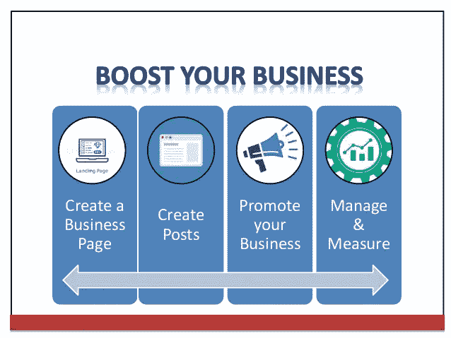

Source: [https://www.slideshare.net/SidharthGuleria/boost-your-business-using-facebook-instagram](https://www.slideshare.net/SidharthGuleria/boost-your-business-using-facebook-instagram)

我将概括地介绍所有类别，而不会深入每个类别的具体细节。因此，为了更好地理解整个事情，以下是你需要知道的一些指标:

**到达**:帖子到达的不同人群或用户总数。

**浏览量**:一个帖子被用户看到的次数。一个帖子可以被 n 个人看到 m 次。因此，总浏览量变成了 m*n。一篇文章在你的新闻订阅源中显示的次数，不考虑这篇文章被点击的次数。人们可能会看到同一帖子的多个印象。例如，某人可能会在新闻订阅源中看到一次页面更新，如果他的朋友分享了它，就会看到第二次。

**页面点赞总数:**点赞显示你在脸书的受众规模。随着时间的推移，这个数字应该会增加。如果你几个月来一直有相同数量的喜欢，这意味着两种情况之一:
1)你失去的喜欢和你得到的一样多。新朋友没有关注你

**参与度**:表示用户在帖子上执行一个动作的次数。敬业度是你可以追踪的最重要的脸书指标之一。主观上，参与是人们确实喜欢你分享的内容的标志。但参与度如此重要的另一个原因是，它可能会让你的帖子更多地暴露给你的受众。这包括喜欢、评论、分享以及观看过你的视频或点击过你的链接和照片的人。它还包括点击评论者姓名、喜欢某条评论、点击你的页面名称，甚至通过举报你的帖子给出负面反馈的人。

**消耗:**这一指标类似于参与度，但消耗并不一定会产生故事**。** *消费=链接点击量+照片浏览量+视频播放量+其他点击量(其中一些确实会产生故事)*

**总交互:**正如我们所知，主要动机是增加查看帖子的人数，并增加与帖子的交互(如，评论，分享)次数，以便创建一个故事，它会自动出现在查看者的朋友的新闻提要中。总互动量是根据终身后参与用户(故事已创建)和终身后消费者(故事未创建)执行的操作计算的。请注意这些指标，稍后会用到它们。
*总互动=喜欢+评论+分享*

帖子类型:脸书上有四种类型的帖子:视频、照片、状态、链接。人类的普遍倾向是看图像，阅读和分享它们。状态通常较长，人们不愿意阅读。因此，人们自然倾向于观看视频、图片和状态，并对其做出反应。

> 去年(2018 年)，[脸书承认在其算法](https://blog.hootsuite.com/facebook-algorithm/)中优先考虑视频，特别强调直播视频。如果你能创建视频内容，你就有更好的机会获得新闻源。所以，你会看到后来的可视化有点偏向视频帖子。

**付费点赞**:通过脸书的广告活动，有多少人喜欢你的页面。

脸书页面分析提供了与这些指标相关的数据和统计信息。所以，我所做的是我有一个名为 Morto 等人的数据集，它给出了脸书特定化妆品匿名品牌的广告指标。数据集总共有 500 条记录，其中有 19 列定义了这样的指标值。现在，回到这个博客的下一部分，开始 R 编程。

R **是一种统计编程语言。R 拥有大量的统计和图表方法。它包括机器学习算法，线性回归，时间序列，统计推断。R 中有各种各样的包，可以轻松地完成数据科学领域的任务。关于 R 理论上的详细信息，请访问[https://en . Wikipedia . org/wiki/R _(programming _ language](https://en.wikipedia.org/wiki/R_(programming_language))和[https://www.tutorialspoint.com/r/index.htm](https://www.tutorialspoint.com/r/index.htm)获得 R 编程语言语法的帮助。
我在项目中绘制了各种数据可视化，这将有助于任何外行做出决定，即什么实际上有助于将广告拉近最终用户。
**注**:以下观察和数据分析是凭直觉完成的，然后做了一些修改以从中获得最佳结果。**

1.  **首先，页面总点赞数取决于以下脸书邮报指标** :
    总浏览量
    总浏览量
    帖子类型(照片、状态、视频、链接)
    工作日
    一天中的某个小时

在多元回归分析的帮助下，我们获得了所有上述指标的系数，这将帮助我们确定每个指标的重要性，这有助于增加我们的页面喜欢。

> **为什么要多元回归？**多元回归是线性回归在两个以上变量之间关系的延伸。在简单线性关系中，我们有一个预测变量和一个响应变量，但在多元回归中，我们有不止一个预测变量和一个响应变量。

我们使用 r 中的 **lm()** 函数创建回归模型。该模型使用输入数据确定系数的值。接下来，我们可以使用这些系数预测一组给定预测变量的响应变量的值。

```
data<-read.csv("Morto_Et_Al.csv")input<-read.csv(file = "facebook.csv", sep = ",")[ ,c('PTL','LPTReach','LPTImpressions','Type','Weekday','Hour')]model<-lm(PTL~LPTReach+LPTImpressions+Type+Weekday+Hour,data=input)a <- coef(model)[1]
XLPTReach <- coef(model)[2]
XLPTImpressions <- coef(model)[3]
XTypePhoto <- coef(model)[4]
XTypeStatus <- coef(model)[5]
XTypeVideo <- coef(model)[6]
XWeekday <- coef(model)[7]
Xhour <- coef(model)[8]
```

**2。**
预测分析:这里，使用通过多元回归分析获得的系数来生成一个方程，其中，将变量的值代入该方程，根据帖子的类型来预测喜欢的数量。

```
x1 <- readline("What is the total reach?")
x1 <- as.numeric(x1)
x2 <- readline("What is the value for total impressions?")
x2 <- as.numeric(x2)
x6 <- readline("What is weekday?")
x6 <- as.numeric(x6)
x7 <- readline("Which is the hour of the day?")
x7 <- as.numeric(x7)x<-c("Photo","Status","Video")
type<-readline("What is the type of post?")if("Photo" %in% type) {
Y = a + XLPTReach*x1+XLPTImpressions*x2+XTypePhoto*2.5+XWeekday*x6+Xhour*x7Z = a + XLPTReach*x1+XLPTImpressions*x2+XTypePhoto*3+XWeekday*x6+Xhour*x7} 
else if ("Status" %in% x) {
Y = a + XLPTReach*x1+XLPTImpressions*x2+XTypeStatus*1.4+XWeekday*x6+Xhour*x7
Z = a + XLPTReach*x1+XLPTImpressions*x2+XTypeStatus*2+XWeekday*x6+Xhour*x7} 
else if ("Video" %in% x) {
Y = a + XLPTReach*x1+XLPTImpressions*x2+XTypeVideo*4+XWeekday*x6+Xhour*x7
Z = a + XLPTReach*x1+XLPTImpressions*x2+XTypeVideo*5+XWeekday*x6+Xhour*x7
}
```

3.**后工作日 v/s 总到达量，后工作日 v/s 总展示量:**
这里，我绘制了一个线形图来显示后工作日如何影响总到达量和展示量的关系。结果显示，在工作日 3 发布的帖子在 reach 上给出了最好的结果，并且同一帖子在第二天有最大的展示次数。有道理，不是吗？

```
day1<- subset(data,Weekday==1)
mean1R <- mean(day1$LPTReach)
mean1I <- mean(day1$LPTImpressions)day2<- subset(data,Weekday==2)
mean2R <- mean(day2$LPTReach)
mean2I <- mean(day2$LPTImpressions)day3<- subset(data,Weekday==3)
mean3R <- mean(day3$LPTReach)
mean3I <- mean(day3$LPTImpressions)day4<- subset(data,Weekday==4)
mean4R <- mean(day4$LPTReach)
mean4I <- mean(day4$LPTImpressions)day5<- subset(data,Weekday==5)
mean5R <- mean(day5$LPTReach)
mean5I <- mean(day5$LPTImpressions)day6<- subset(data,Weekday==6)
mean6R <- mean(day6$LPTReach)
mean6I <- mean(day6$LPTImpressions)day7<- subset(data,Weekday==7)
mean7R <- mean(day7$LPTReach)
mean7I <- mean(day7$LPTImpressions)v<-c(mean1R,mean2R,mean3R,mean4R,mean5R,mean6R,mean7R)
t<-c(mean1I,mean2I,mean3I,mean4I,mean5I,mean6I,mean7I)png(file = “Weekday_TotalReach.png”)
plot(v,type = “o”,col = “red”, xlab = “Weekday”, ylab = “Total Reach”,
main = “Chart for analysis of total reach”)
dev.off()png(file = “Weekday_TotalImpressions.png”)
plot(t,type = “o”,col = “blue”, xlab = “Weekday”, ylab = “Total Impressions”,
main = “Chart for analysis of total impressions”)
dev.off()
```

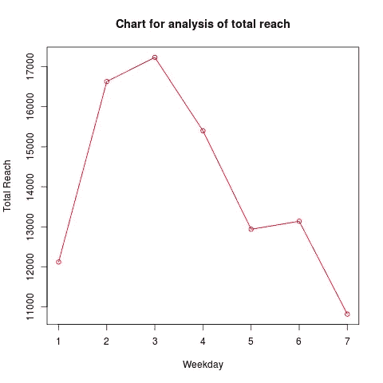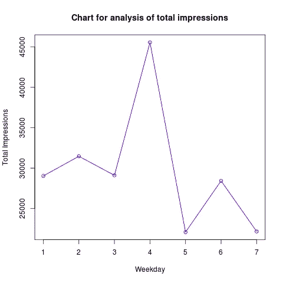

**4。帖子类型总浏览量，帖子类型总浏览量**
这里用一个条形图来表示帖子类型和浏览量、浏览量之间的关系。它有助于比较每种文章类型的影响。结果显示，“视频”比其他类型的帖子更能提升你的品牌。

```
photodf <- subset(data,Type=="Photo")
meanPR <- mean(photodf$LPTReach)
meanPI <- mean(photodf$LPTImpressions)
#meanPLikesP <- mean(photodf$PTL)statusdf <- subset(data,Type=="Status")
meanSR <- mean(statusdf$LPTReach)
meanSI <- mean(statusdf$LPTImpressions)
#meanPLikesS <- mean(statusdf$PTL)videodf <- subset(data,Type=="Video")
meanVR <- mean(videodf$LPTReach)
meanVI <- mean(videodf$LPTImpressions)
#meanPLikesV <- mean(videodf$PTL)linkdf <- subset(data,Type=="Link")
meanLR <- mean(linkdf$LPTReach)
meanLI <- mean(linkdf$LPTImpressions)
#meanPLikesL <- mean(linkdf$PTL)ValueR <- c(meanPR,meanSR,meanVR,meanLR)
ValueI <- c(meanPI,meanSI,meanVI,meanLI)Post <- c("Photo","Status","Video","Link")png(file = "barchart_reach&postType.png")
barplot(ValueR,names.arg = Post,xlab = "Post Type",ylab = "Total Reach",col = "blue", main = "Total Reach v/s Post Type",border = "red")
dev.off()png(file = "barchart_Impressions&postType.png")
barplot(ValueI,names.arg = Post,xlab = "Post Type",ylab = "Total Impressions",col = "red", main = "Total Impressions v/s Post Type",border = "blue")
dev.off()
```

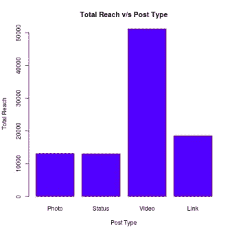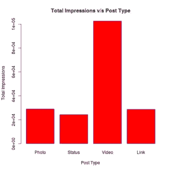

**5。总交互 v/s 总到达次数，总交互 v/s 总印象数**
使用线性回归，绘制一个图表，显示总交互对总到达次数、印象数的依赖性，这反过来实际上会允许许多观众访问页面。

```
ReachInt<-data$LPTReach
ImpressionInt<-data$LPTImpressions
LikesInt<-data$PTL
TotalInt<-data$Total.Interactionsrelation <- lm(TotalInt~ReachInt)
png(file = "linearregression(ReachvsInteractions.png")
plot(ReachInt,TotalInt,col = "blue",main = "Reach v/s Interactions",cex = 1.3,pch = 16,ylab = "Total Interactions",xlab = "Total Reach")
dev.off()relation <- lm(TotalInt~ImpressionInt)
png(file = "linearregression(ImpressionsvsInteractions.png")
plot(ImpressionInt,TotalInt,col = "red",main = "Impressions v/s Interactions",cex = 1.3,pch = 16,ylab = "Total Interactions",xlab = "Total Impressions")
dev.off()relation <- lm(LikesInt~TotalInt)
png(file = "linearregression(LikesvsInteractions.png")
plot(TotalInt,LikesInt,col = "violet",main = "Likes v/s Interactions",cex = 1.3,pch = 16,xlab = "Total Interactions",ylab = "Total Page Likes")
dev.off()
```

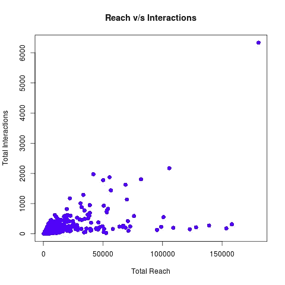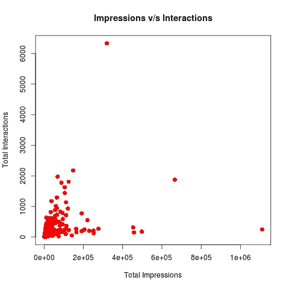

**6。付费帖子总影响力:**
当你付钱给脸书来提升一个帖子时，该帖子的总影响力会增加。因此，为了确定一个帖子是否有报酬，我们使用了一个决策树，该决策树显示如果总数达到> 10470，则该帖子是一个有报酬的帖子。因此，根据目前的数据集，如果你必须让帖子达到大约 1 万人，你需要为此付费，脸书最终会推广它。

```
data1<-read.csv(“facebook.csv”)
library(party)
png(file = “Paid(FullData).png”)
output.tree <- ctree(Paid[1:100] ~ ReachInt[1:100] +                          ReachInt[1:100],data = data1)
plot(output.tree)
dev.off()
```

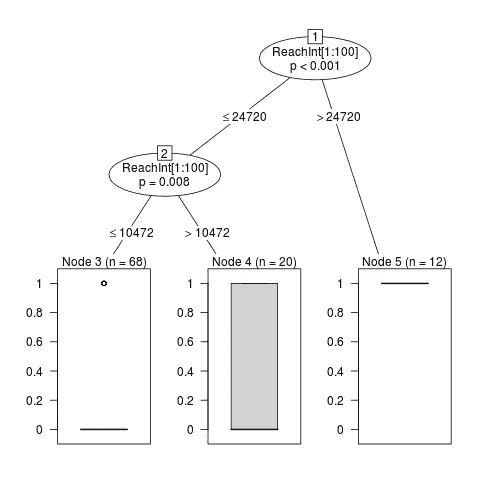

7.**有多少参与帖子的用户已经喜欢上了该页面？我绘制了饼图来显示分布情况。结果显示，70%参与帖子的人是已经喜欢该页面的人。现在，这个统计有助于在他们的朋友中传播帖子，也激发他们喜欢帖子或者页面。**

```
LPEuser1<-data$LPEuser
LEngaged1<-data$LEngaged
divi.result <- (LPEuser1/LEngaged1)*100
LPEuser1mean<-mean(divi.result)
LEngaged1mean=100-LPEuser1mean
x<-c(LPEuser1mean,LEngaged1mean)
piepercent<- round(100*x/sum(x), 1)png(file = “Engaged_users.png”)
pie(x,labels=piepercent, main = “Engaged users %”, col = rainbow(length(x)))
legend(“topright”, c(“Users already liked the page”,”Others”), cex = 0.8,fill = rainbow(length(x)))
dev.off()
```

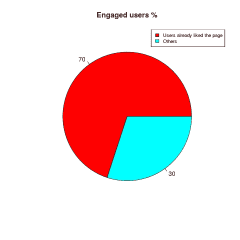

**8。参与用户，消费占印象的比例:**
到目前为止，我们一直专注于直接影响页面总点赞的参数。现在，间接影响总页面喜好的因素，即参与用户、消费者、消费被考虑在内。这里，统计数据被绘制在一个饼状图上，这有助于确定每种类型帖子的消费者百分比、总覆盖范围中的参与用户百分比以及总印象中的消费百分比和参与用户百分比。

这有助于显示特定的帖子类型是否适合增加互动次数和推广帖子。

```
LPConsumptions<-photodf$LPConsumptions
LPTimpressions<-photodf$LPTImpressions
LEngaged2<-photodf$LEngaged
divi.result<-(LPConsumptions/LPTimpressions)*100
divi.result2<-(LEngaged2/LPTimpressions)*100
LEngaged2mean<-mean(divi.result)
LPConsumptionsmean<-mean(divi.result2)
others<-100-(LEngaged2mean + LPConsumptionsmean)
x<-c(LEngaged2mean,LPConsumptionsmean,others)
piepercent<- round(100*x/sum(x), 1)
png(file = "Impressions_Engaged_Consumptions(photo).png")
pie(x,labels=piepercent, main = "Engaged Users,Consumptions from total impressions(photo)%", col = rainbow(length(x)))
legend("topright", c("Engaged users%","Lifetime Post Consumptions%","Others%"), cex = 0.8,fill = rainbow(length(x)))
dev.off()LPConsumptions<-statusdf$LPConsumptions
LPTimpressions<-statusdf$LPTImpressions
LEngaged2<-statusdf$LEngaged
divi.result<-(LPConsumptions/LPTimpressions)*100
divi.result2<-(LEngaged2/LPTimpressions)*100
LEngaged2mean<-mean(divi.result)
LPConsumptionsmean<-mean(divi.result2)
others<-100-(LEngaged2mean + LPConsumptionsmean)
x<-c(LEngaged2mean,LPConsumptionsmean,others)
piepercent<- round(100*x/sum(x), 1)
png(file = "Impressions_Engaged_Consumptions(status).png")
pie(x,labels=piepercent, main = "Engaged Users,Consumptions from total impressions(status)%", col = rainbow(length(x)))
legend("topright", c("Engaged users%","Lifetime Post Consumptions%","Others%"), cex = 0.8,fill = rainbow(length(x)))
dev.off()LPConsumptions<-videodf$LPConsumptions
LPTimpressions<-videodf$LPTImpressions
LEngaged2<-videodf$LEngaged
divi.result<-(LPConsumptions/LPTimpressions)*100
divi.result2<-(LEngaged2/LPTimpressions)*100
LEngaged2mean<-mean(divi.result)
LPConsumptionsmean<-mean(divi.result2)
others<-100-(LEngaged2mean + LPConsumptionsmean)
x<-c(LEngaged2mean,LPConsumptionsmean,others)
piepercent<- round(100*x/sum(x), 1)
png(file = "Impressions_Engaged_Consumptions(video).png")
pie(x,labels=piepercent, main = "Engaged Users,Consumptions from total impressions(video)%", col = rainbow(length(x)))
legend("topright", c("Engaged users%","Lifetime Post Consumptions%","Others%"), cex = 0.8,fill = rainbow(length(x)))
dev.off()LPConsumptions<-linkdf$LPConsumptions
LPTimpressions<-linkdf$LPTImpressions
LEngaged2<-linkdf$LEngaged
divi.result<-(LPConsumptions/LPTimpressions)*100
divi.result2<-(LEngaged2/LPTimpressions)*100
LEngaged2mean<-mean(divi.result)
LPConsumptionsmean<-mean(divi.result2)
others<-100-(LEngaged2mean + LPConsumptionsmean)
x<-c(LEngaged2mean,LPConsumptionsmean,others)
piepercent<- round(100*x/sum(x), 1)png(file = "Impressions_Engaged_Consumptions(link).png")
pie(x,labels=piepercent, main = "Engaged Users,Consumptions from total impressions(link)%", col = rainbow(length(x)))
legend("topright", c("Engaged users%","Lifetime Post Consumptions%","Others%"), cex = 0.8,fill = rainbow(length(x)))
dev.off()
```

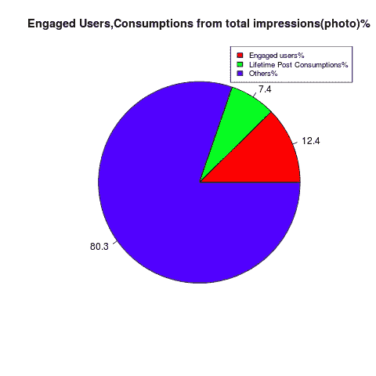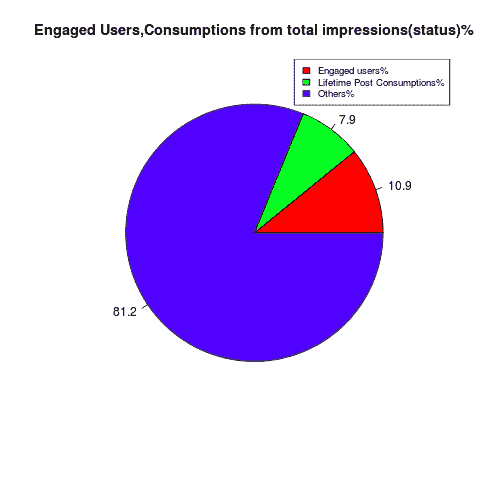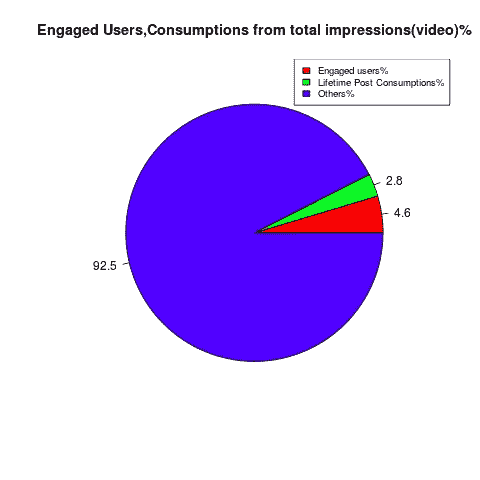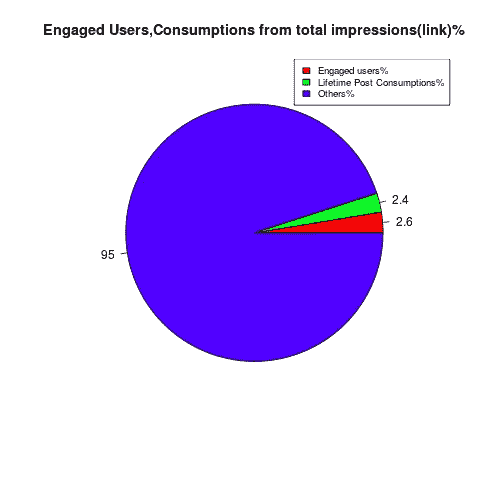

因此，以上是作为一名业余爱好者在 R 中完成的统计数据分析，以获得对真实世界数据集的实际操作经验。所以，下次你开始营销你的品牌时，在脸书上做，看着它像野火一样蔓延。此外，一定要检查这些指标，它们会帮助你评定你的营销技巧😊