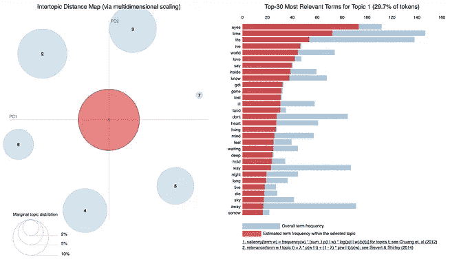

# 巴西重金属:使用 NLP 和 LDA 的探索性数据分析

> 原文：<https://towardsdatascience.com/brazilian-heavy-metal-an-exploratory-data-analysis-using-nlp-and-lda-f92324d0381e?source=collection_archive---------21----------------------->

## 对巴西两大重金属乐队歌词的分析:Angra 和塞普尔图拉

Let’s see how to get there

# 动机

在我的大部分时间里，我习惯于试验一些 NLP 技术，我注意到即使有过多的可用资源，也很难找到一些与数据分析相关的 NLP 技术内容，*即*与文本挖掘等数据的一般知识相关。

在 Github 中有很多脚本、应用博客文章、带代码的存储库是非常酷的，但至少对我来说，分析是这项技术最出彩的地方，因为任何人都可以编写脚本，但只有少数人可以提取数据知识。

这里的想法是得到我喜欢的两个乐队的歌词，检查他们的文学特征，并试图找到他们之间的一些联系或区别。

对于关于 NLP、LDA 等非常深入和技术性的帖子，请随意直接跳到这篇帖子的末尾，并选择许多关于这些主题的非常好的参考资料。

这就是这篇文章的内容，它深深地启发了[机器学习加](https://www.machinelearningplus.com/nlp/topic-modeling-visualization-how-to-present-results-lda-models/)的伟大工作。

# 为什么是 Angra 和坟墓？

重金属是世界上最无国界的音乐风格之一，我想用 Python、LDA、NLP 和一些想象力以简单的方式展示我的国家最具标志性的两个乐队及其文学特征(你会在主题的“解读”中看到。

# 关于乐队

## 坟墓

[Sepultura](https://en.wikipedia.org/wiki/Sepultura) 是一支来自贝洛奥里藏特的巴西重金属乐队。该乐队于 1984 年由兄弟马克斯和伊戈尔·卡瓦拉组建，是 20 世纪 80 年代末和 90 年代初凹槽金属、鞭挞金属和死亡金属流派的主要力量。Sepultura 也被认为是 20 世纪 80 年代末和 90 年代初至中期的第二波重金属乐队之一。

Source: [Jamie Martinez](https://www.pinterest.com/pin/538883911633286076/)

[官方网站](https://www.sepultura.com.br/)—[Spotify 中的坟墓](https://open.spotify.com/artist/6JW8wliOEwaDZ231ZY7cf4)

## Angra

[Angra](https://en.wikipedia.org/wiki/Angra_(band)) 是一支成立于 1991 年的巴西重金属乐队，自成立以来经历了一些阵容变化。在 Rafael Bittencourt 的带领下，这支乐队在日本和欧洲获得了一定程度的知名度。

Source: [sztachetki](http://sztachetki.info/banda-angra-logo-6ce92c6/)

[Angra 官方网站](http://www.angra.net/)——[Spotify 中的 Angra](https://open.spotify.com/artist/7IAXZaLTb6nkJr8RmVPn5y)

# 问题

我一直对这些乐队有一些私人问题，我将尝试用这个笔记本来回答:

*   1)Angra 和《坟墓》的文学特征是什么？
*   2)他们谈论的是哪种类型的主题？
*   3)谁的话题更具多样性？

# 一些限制

*   NLP 这仍然是一个未解决的问题，即使所有的[都对此承诺过多。由约夫·戈德堡](https://openai.com/blog/better-language-models/)[和](https://medium.com/@yoav.goldberg/an-adversarial-review-of-adversarial-generation-of-natural-language-409ac3378bd7)[创作的这两部人类学作品《梯度](https://thegradient.pub/frontiers-of-generalization-in-natural-language-processing/)透视了这一点；
*   创作过程甚至包括一些模式，这是一个非常复杂的过程，可能涉及许多诗意的许可。[在这个视频](https://www.youtube.com/watch?v=G8eqnWVY_rU)中，Rafael Bittencourt 解释了为新专辑创作一首歌词的整个过程，而在[这个视频](https://www.youtube.com/watch?v=kYf6GgkGfzA)中，Max Cavalera 讲述了 1996 年经典专辑[【Roots】](https://www.youtube.com/watch?v=KuMlv7hmrFg&list=PLfUV806q_Ri4WN5omBcgzDxHcWMaHL_i1)背后的创作过程。

# 应用技术

## 自然语言处理

[自然语言处理(NLP)](https://en.wikipedia.org/wiki/Natural_language_processing) 是计算机科学、信息工程和人工智能的一个子领域，涉及计算机和人类(自然)语言之间的交互，特别是如何对计算机进行编程以处理和分析大量自然语言数据。

## 主题建模

在机器学习和自然语言处理中，[主题模型](https://en.wikipedia.org/wiki/Topic_model)是一种统计模型，用于发现文档集合中出现的抽象“主题”。主题建模是一种常用的文本挖掘工具，用于发现文本中隐藏的语义结构。主题模型也被称为概率主题模型，它指的是用于发现大量文本主体的潜在语义结构的统计算法。

## 潜在狄利克雷分配

在自然语言处理中，[潜在狄利克雷分配](https://en.wikipedia.org/wiki/Latent_Dirichlet_allocation) (LDA)是一种生成统计模型，它允许通过未观察到的组来解释观察集，从而解释为什么数据的某些部分是相似的。例如，如果观察是收集到文档中的单词，那么它假设每个文档是少量主题的混合物，并且每个单词的出现都归因于文档的一个主题。LDA 是主题模型的一个例子。

## 代码和数据

所有代码、数据集和图像都存储在 [**这个 Github repo**](https://github.com/fclesio/metalbr) 中。

# 数据提取和加载

为了提取歌词，我使用了`[PyLyrics](https://github.com/geekpradd/PyLyrics)`库和[脚本](https://github.com/fclesio/metalbr/blob/master/data-extraction.py)。重要提示:自去年以来，本库没有任何更新/错误修复。下面我们可以导入一些库，并开始对我们的数据进行小的预处理。

包装器获取了 325 首歌曲，包括艺术家、歌词和专辑。

一个主要的挑战是，这些乐队通常用多种语言(英语和葡萄牙语)创作歌曲。为了简单起见，我们将只关注英语。

为了过滤 PT-BR 歌曲，我将使用使用 Google API 检查语言的`textblob`库。主要的警告是，如果你重新运行很多次，你可能会收到代码`HTTP Error 429: Too Many Requests`。

这里我们可以看到，在 325 首歌词中，38%来自 Angra，62%来自坟墓。Angra 有 96% (119) 的歌词在 EN 中，而 Sepultura 有 **96% (194)** 的歌词在 EN 中。

来自 Angra 的 PT-BR 中最出色的歌曲是[CAA e caador](http://www.darklyrics.com/lyrics/angra/huntersandprey.html#8)专辑《猎人与祈祷》中的一首歌。在阴影之殿专辑中的歌曲[迟到的救赎](http://www.darklyrics.com/lyrics/angra/templeofshadows.html#12)是 EN/PT-BR 中的一首好歌。

Sepultura 在 PT-BR 中有一些歌曲，如《野蛮的毁灭》中的 [Filhos do Mundo](http://www.darklyrics.com/lyrics/sepultura/bestialdevastationsculoxx.html#7) ，and 中的 [Prenuncio](http://www.darklyrics.com/lyrics/sepultura/against.html#17) 和《遗骸》专辑中的 [A Hora E A Vez Do Cabelo Nascer](https://www.letras.mus.br/sepultura/844256/) ，这是 Mutantes 的一首[翻唱歌曲。](https://www.youtube.com/watch?v=87vwhDPA8Z4)[PT-BR 中最引人注目的](https://www.youtube.com/watch?v=4CWrVCAgcjg)是 [Policia](http://www.darklyrics.com/lyrics/sepultura/bloodrooted.html#3) 宋。

删除了所有 PT-BR 歌词后，让我们快速检查一下这些乐队的所有专辑。

乍一看，考虑到我们的数据框架，我们可以看到这两个乐队之间的第一个区别，Sepultura 有一个更大的唱片集和更多的歌曲。

这可以用这样一个事实来解释，即使两个乐队在更换他们的主要歌手时都面临着中断(Angra 的[安德烈·马托斯](https://pt-br.facebook.com/AndreMatosOfficial/)和[edu·法拉斯基](https://en.wikipedia.org/wiki/Eduardo_Falaschi)和塞普尔图拉的[马克斯·卡瓦拉拉](https://en.wikipedia.org/wiki/Max_Cavalera))塞普尔图拉在中断后发行了 8 张专辑(都是与[德里克·格林](https://en.wikipedia.org/wiki/Derrick_Green)一起发行的)，同时 Angra 发行了 6 张；而 Sepultura 是一支多产的乐队。

让我们记住这个信息，因为也许在这个分析的第二个瞬间，它可以被解释。

我们来看看每张专辑的平均歌曲数。

当我们目测 Sepultura 甚至没有更多的专辑，但每张专辑有更多的歌曲。

开始我们的分析文本分析的一个重要方面是 [**数据预处理**](https://en.wikipedia.org/wiki/Data_pre-processing) 。在这里，我们实际上可以忽略所有的分析，因为预处理负责去除数据中的所有噪声，并对所有数据进行归一化，以获得有意义的结果。卡维塔·加内桑对这个话题做了很好的分析，我强烈推荐这本书。

第一步将是删除所有歌词的所有英文停用词。

PS:我个人不喜欢使用现成的停用词表，因为每个领域都需要特定的词子集来定义某个词是否重要。但是为了简单起见，让我们保持这种方式。马蒂娜·普列塞的这篇好文章详细解释了这一点。就实现而言，ML 专家的这篇文章可能是互联网上最好的资源。

在停用词移除之后，让我们对这两个带使用的最频繁的词进行快速的视觉检查。换句话说:他们作文中用得最多的词是什么？

如果我可以在这里进行一些分类，根据最常见的表达方式来定义 Angra 歌词，将会是这样的:

*   时间关系:`Time`、`Day`、`Wait`、`Night`
*   感受:`Like`、`Heart`、`Soul`、`Lie`
*   移动和距离:`Come`、`Way`、`Away`、`Carry`
*   生活与心灵:`Life`、`Let`、`Know`、`Dream`、`Mind`、`Live`、`inside`、`Leave`
*   世界的绝对状态:`Die`
*   典型的重金属陈词滥调:`Oh`

现在，快速验证一下《坟墓》的歌词:

现代世界的状态:`Death`、`War`、`Hate`、`Die`、`Lie`、`Pain`、`Lose`、`Fear`、`Blood`、`World`

动作、距离、时间:`Way`、`Come`、`Stop`、`Make`、`Rise`、`Time`、`Think`、`Hear`、`Know`

思想问题:`Live`、`Mind`、`Feel`、`Want`、`Look`、`Inside`

## 潜在的差异

《坟墓》和《Angra》讨论的主题存在一些潜在的差异，如:

*   **Sepultura 的创作文学轴集中于与死亡**相关的事物/情感主题、痛苦、战争、仇恨(如果你已经不知道，Sepultura 在 PT-BR 中的意思是“坟墓”)相关的主题，这些主题被认为是最具攻击性/沉重的主题；
*   **Angra** 有一个更轻松的主题，更多地谈论涉及时间流逝的**存在主义问题，**以及一些与梦有关的感觉和与**内部冲突有关的感觉的歌曲**。

我们来看一下相对于两个乐队最常用词的词云，只根据乐队使用的所有词汇做一个小对比。

主要词汇 Angra:

*   `life`、`time`、`know`、`heart`、`day`、`away`、`know`、`dream`

主要词汇 Sepultura:

*   `way`、`life`、`death`、`world`、`mind`

# 词汇多样性

根据 [Johansson](https://journals.lub.lu.se/LWPL/article/view/2273) (2009)的说法，词汇多样性是*在一篇文章*中使用了多少不同单词的一种度量。词汇多样性的实际应用由 [McCarthy 和 Jarvis](https://link.springer.com/article/10.3758%2FBRM.42.2.381) (2010)给出。他们说 LD 是*文本中使用的不同单词的范围，范围越大表明多样性越高*。

这里需要特别考虑的是，重金属歌曲不应该包含太多不同的词，*也就是说，*词汇丰富。这是因为在大多数情况下，每个乐队可以遵循一个单一的艺术概念，并针对一些主题形成他们的创作努力，当然也因为大多数时候这种歌曲有许多合唱。

例如(关于乐队概念) [Avatasia](https://en.wikipedia.org/wiki/Avantasia) 这是一个重金属的超级组合，谈论小说、幻想和宗教；而在另一边[梦幻剧场](https://en.wikipedia.org/wiki/Dream_Theater)谈论从[宗教](https://genius.com/Dream-theater-in-the-name-of-god-lyrics)到[现代政治](https://www.azlyrics.com/lyrics/dreamtheater/thegreatdebate.html)的几乎一切。

有了这个免责声明，让我们检查这个乐队的词汇多样性。

这两个乐队在词汇多样性上几乎没有差异，*即*即使使用不同的词汇来塑造他们的主题，他们在主题出现的频率上也没有实质性的词汇差异。

# 单词 N-Grams

根据维基百科， [n-gram 是来自给定文本或语音样本的 n 个项目的连续序列。根据应用](https://en.wikipedia.org/wiki/N-gram)，项目可以是音素、音节、字母、单词或碱基对。

在其他情况下，n-gram 是包含 n 个单词的序列，可以用来模拟某个序列出现在语料库中的概率，在我们的情况下，n-gram(s)可以在他们的文学词典中检查 n 个单词的最频繁组合。

为了简单起见，我们将集中讨论二元模型和三元模型的组合。

# N-Grams Angra

在这里我们可以看到一些东西:

*   “*你是*”是`n=2`中的顶级组合。这表明，除了 Angra 的全部歌曲外，还有一些歌词包含了传递给另一个人的某种信息。
*   最常见的二元模型之一是`carry on`，但这是有数据原因的:在这个数据集中，我们有包含歌曲 [Carry On](https://www.azlyrics.com/lyrics/angra/carryon.html) 的`Angels Cry`和`Holy Live`磁盘，这导致了*重复计数*；
*   `me cathy`和`cathy come`重唱背后的原因似乎是因为来自[凯特·布什](https://en.wikipedia.org/wiki/Kate_Bush)的一首名为 [*呼啸山庄*](https://www.azlyrics.com/lyrics/angra/wutheringheights.html) 的翻唱歌曲大量重复了这一合唱；
*   我们有传统的重金属歌曲合唱填料陈词滥调`oh oh`出现

*   在`carry on time`、`on time forget`、`remains past carry`中再次出现进位，
*   `Cathy`这个词出现在三字组:`heathcliff me cathy`、`me cathy come`、`cathy come home`
*   一些类似`ha ha ha`的奇怪模式，可能是因为数据清理

# N-Grams 坟墓

在这些双图中，我们已经可以看到更多关于《坟墓》的主题，和我之前提到的残忍相关的主题。一些提及:

*   歌曲“ [Choke](https://www.youtube.com/watch?v=MJI96zJm9G0) ”有一个非常重复的合唱，这有助于这个双字母组合的组成。
*   经典的“T29”词根“T30”也是如此，它有一个非常引人注目的合唱

让我们来看看三个字母:

在这里，我们看到基本相同的模式，部分三元组面对一些非常惊人的合唱。

现在我们对这两个乐队的主题有了一些了解，然而，随之而来的一个问题是:*在这个主题中，每首作品背后潜在的主题是什么？*，也就是说，乐队理念中的主题具有多样性？，如果我们能把这些歌曲按照它们的文学成分分组会怎么样？

这里是我们要使用 LDA 的地方。

# 皱胃向左移

首先，我们将在各自的数据框架内过滤每位艺术家:

为了区分主题，我会为每个艺术家任意选择 7 个主题(可以多一点或少一点)，这只是为了教学和保持简单。

换句话说:**给定所有 Angra 和 Sepultura 的歌词，他们通常写得最多的前 7 个主题是什么？**

## 主题 Angra

## 话题坟墓

# 主题分布

## 主题分布 Angra

我们可以看到，Angra 的大部分主题都集中在主题 4，0，2 上，我称之为主题*随着时间的推移观察和了解世界(#4)* ，*随着时间的推移面对痛苦(#0)* ，*在生活中梦想来来去去(#2)*

*   `Topic #4: eyes time life ive world love say inside know got`
*   `Topic #0: time dont day away way youre face pain just cause`
*   `Topic #2: let come like away day life wont wonder cold dreams`

现在让我们检查一下墓地:

## 主题分布图

《坟墓》聚焦于一些主题，如*生命与恐惧时光流逝(#3)* ，*活在痛苦与死亡的世界(#5)，活在战争与流血的世界*

*   `Topic #3: dont just away time fear youre know life right look`
*   `Topic #5: end theres dead world death feel eyes pain left alive`
*   `Topic #0: war live world hear trust feel walk believe blood kill`

# 每个主题的字数

这里只是一个表格，供我们查看这两个乐队的文学部分渗透的主题中的单词顺序。

这里特别强调的是，在这个数据框架中，还考虑了该词在主题中的频率和普通性。

## Angra 每主题字数

## 每个主题的字数

# 带单词分布的主题绘图

这里有了`pyLDAvis`库，我们可以通过视觉检查来看看主题是如何分布的。由`pyLDAvis`展示的图表被称为主题间距离图，它存在于一个[二维平面中，其中心通过计算主题间的距离来确定，然后通过使用多维缩放将主题间距离投影到二维平面上](http://www.kennyshirley.com/LDAvis/#topic=1&lambda=1&term=)。

这样，我们就能够解释每个主题的组成，以及哪些术语在某个主题中最有用。

关于 LDAVis 最全面的介绍可以在 c .[Sievert、& Shirley，K. (2014)中找到。LDAvis:一种可视化和解释主题的方法。交互式语言学习、可视化和界面研讨会论文集(第 63-70 页)](https://nlp.stanford.edu/events/illvi2014/papers/sievert-illvi2014.pdf)。

# Angra 所有主题的 LDA 图

# 所有坟墓主题的 LDA 图

# 结论

最初，我脑子里有 3 个问题，关于使用 NLP 和 LDA 的整个旅行，我个人认为我有一些答案。

**1)Angra 和坟墓有什么文学特征？**

Sepultura 有一个更具侵略性的文学作品，他们谈论死亡、战争和痛苦，他们唱了几次面对死亡的歌词。他们大部分时间都在抗议一个失落或病态的世界。

他们谈论的是哪种类型的主题？
**答案** : **Angra:** 时间，灵魂，命运。死亡、战争和痛苦的世界。

谁的话题更具多样性？
**回答**:使用任意数量的 7 个话题我们可以看到，Sepultura 在话题分布方面更具多样性。

# 更多想法和待办事项

*   包括曲目名称
*   比较墓地时代(马克斯—德里克)
*   比较 Angra 时代(马托斯—法拉斯基—廖尼)
*   曲目之间的相似性(基于内容)
*   Angra·LSTM 音乐歌词生成器
*   话题演变
*   每张专辑的主题
*   使用 LSTM 的歌词生成

# 参考资料和有用的链接

**机器学习加**——[Python 中的 LDA 如何网格搜索最佳主题模型？](https://www.machinelearningplus.com/nlp/topic-modeling-python-sklearn-examples/)

**Susan Li** — [为西雅图的酒店建立一个基于内容的推荐系统](/building-a-content-based-recommender-system-for-hotels-in-seattle-d724f0a32070)

**Susan Li** — [自动生成与](/automatically-generate-hotel-descriptions-with-lstm-afa37002d4fc)的酒店描述

**Shashank kapa dia**—[Python 中的端到端主题建模:潜在狄利克雷分配(LDA)](/end-to-end-topic-modeling-in-python-latent-dirichlet-allocation-lda-35ce4ed6b3e0)

**Meghana Bhange**——[数据增强的北极猴子歌词生成器](/arctic-monkeys-lyrics-generator-with-data-augmentation-b9b1f7989db0)

**格雷格·拉弗蒂**——[LDA 关于哈利·波特的文本](/basic-nlp-on-the-texts-of-harry-potter-topic-modeling-with-latent-dirichlet-allocation-f3c00f77b0f5)

**代码学院**——[利用机器学习分析泰勒·斯威夫特的歌词](https://news.codecademy.com/taylor-swift-lyrics-machine-learning/)

**亚历山大·贝尔** — [音乐歌词分析:利用自然语言处理创建基于歌词的音乐推荐器](https://medium.com/@alexwbell/music-lyrics-analysis-using-natural-language-processing-to-create-a-lyrics-based-music-recommender-43e35896a4de)

**卡车和啤酒**——[令人惊叹的项目与歌词刮刀](https://github.com/johnwmillr/trucks-and-beer)

**安德斯·奥尔森-斯旺森**——[自然语言处理和说唱歌词](/natural-language-processing-and-rap-lyrics-c678e60073fb)

**布兰登·彭图罗**——[德雷克——利用自然语言处理理解他的歌词](/drake-using-natural-language-processing-to-understand-his-lyrics-49e54ace3662)

**简并态** — [重金属与自然语言处理—第一部分](http://www.degeneratestate.org/posts/2016/Apr/20/heavy-metal-and-natural-language-processing-part-1/)

**简并态** — [重金属与自然语言处理—第二部分](http://www.degeneratestate.org/posts/2016/Sep/12/heavy-metal-and-natural-language-processing-part-2/)

**简并态** — [重金属与自然语言处理—第三部分](http://www.degeneratestate.org/posts/2017/Jun/13/heavy-metal-and-natural-language-processing-part-3/)

**Packt _ Pub**——[使用深度(多层)LSTM 生成歌词](https://hackernoon.com/generating-lyrics-using-deep-multi-layer-lstm-b28ee8124936)

**穆罕默德·马阿马里**——[人工智能生成泰勒·斯威夫特的歌词](/ai-generates-taylor-swifts-song-lyrics-6fd92a03ef7e)

**笔记本泰勒·斯威夫特的歌词**——[Colab 中的链接](https://colab.research.google.com/drive/1wlZXZBvOo93pAmTtEUeTlPsgAP4D1bLA)

**恩里克 a.** — [单词级 LSTM 文本生成器。用神经网络创建自动歌词](https://medium.com/coinmonks/word-level-lstm-text-generator-creating-automatic-song-lyrics-with-neural-networks-b8a1617104fb)

**Ivan Liljeqvist** — [利用人工智能生成歌词](https://medium.com/@ivanliljeqvist/using-ai-to-generate-lyrics-5aba7950903)

**Sarthak Anand** — [音乐发生器](https://github.com/isarth/generating_lyrics)

**富兰克林王**——[作词生成](https://github.com/frankxwang/song-lyrics-generation)

托尼·贝尔特拉梅利——[深度歌词](https://github.com/tonybeltramelli/Deep-Lyrics)