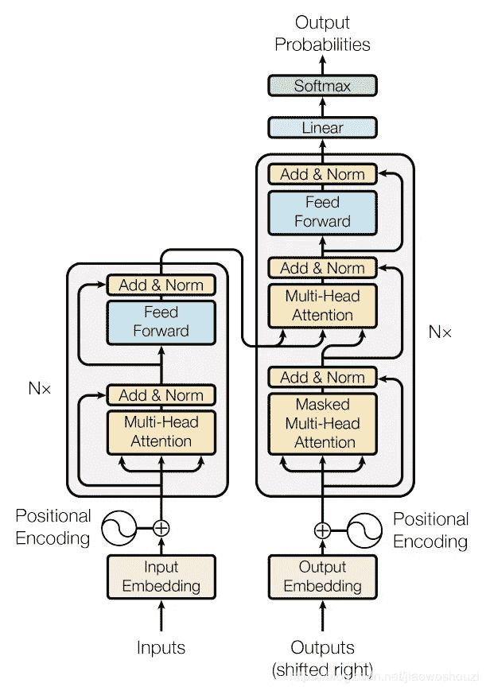
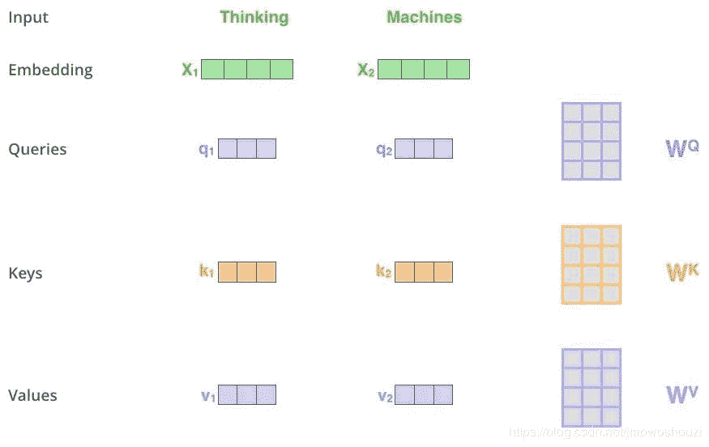
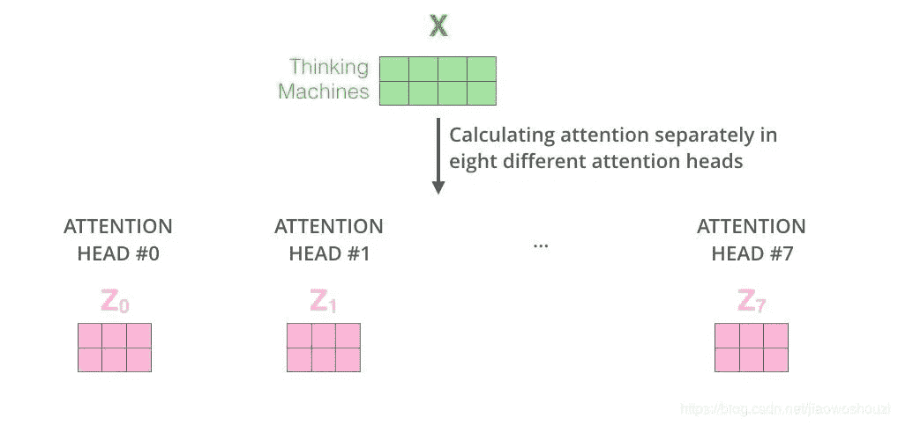
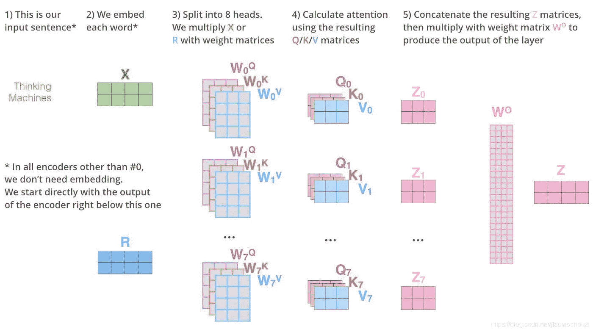
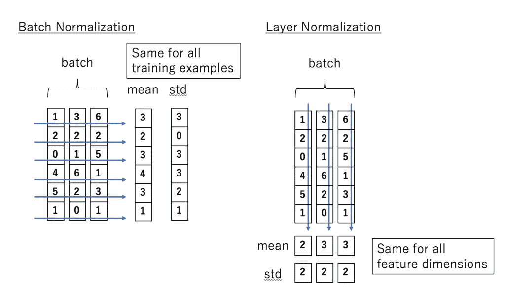
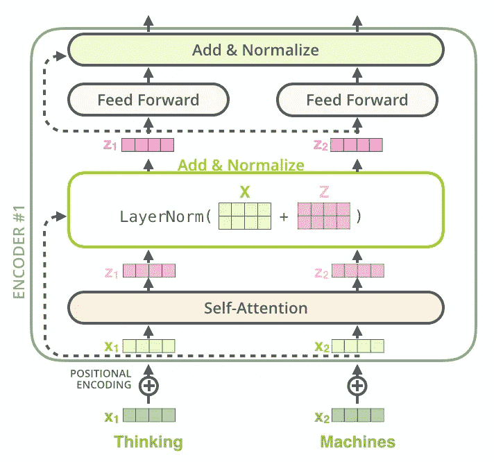
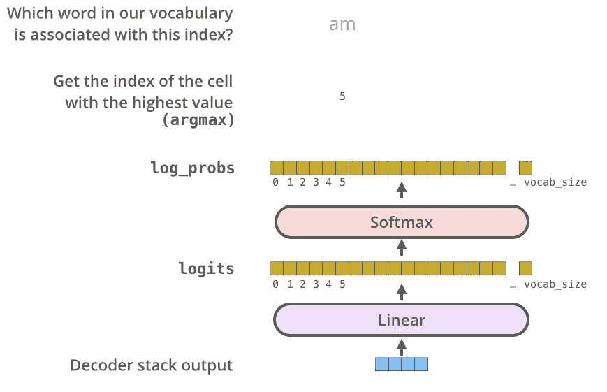
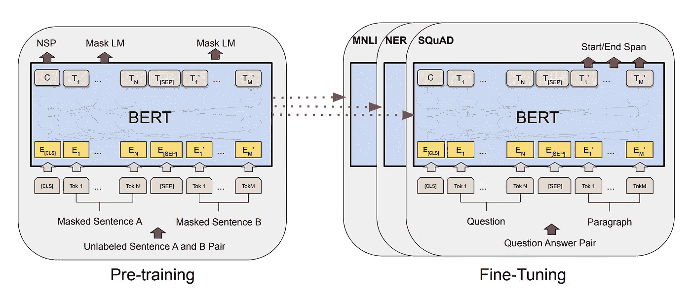
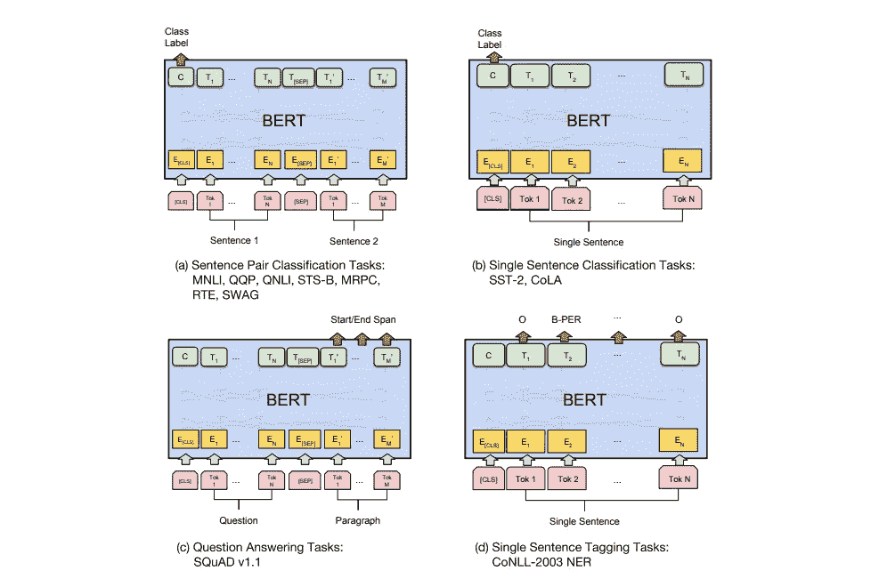

# 让伯特崩溃

> 原文：<https://towardsdatascience.com/breaking-bert-down-430461f60efb?source=collection_archive---------2----------------------->

## NLP 中最新里程碑的完全分解

# 伯特是什么？

BERT 是来自变压器的双向编码器表示的缩写。它是谷歌在 2018 年末开发并发布的一种新型语言模型。像 BERT 这样的预训练语言模型在许多自然语言处理任务中起着重要的作用，如问题回答、命名实体识别、自然语言推理、文本分类等。

BERT 是基于微调的多层双向变压器编码器。在这一点上，引入变压器架构是很重要的。

# 什么是变压器？

2017 年，谷歌发表了一篇题为《注意力就是你所需要的一切》的论文，提出了一种基于注意力的结构来处理序列模型相关问题，比如机器翻译。传统的神经机器翻译大多使用 RNN 或 CNN 作为编解码的模型库。然而，谷歌基于注意力的变压器模型抛弃了传统的 RNN 和 CNN 公式。该模型高度并行工作，因此在提高翻译性能的同时，训练速度也极快。

让我们退一步理解注意力。

# 什么是注意力？

注意机制可以被视为模糊记忆的一种形式。内存由模型的隐藏状态组成，模型选择从内存中检索内容。在我们深入研究注意力之前，让我们简单回顾一下 Seq2Seq 模型。传统的机器翻译基本上是基于 Seq2Seq 模型。该模型分为编码器层和解码器层，由 RNN 或 RNN 变体(LSTM、GRU 等)组成。).编码器向量是从模型的编码器部分产生的最终隐藏状态。该向量旨在封装所有输入元素的信息，以帮助解码器做出准确的预测。它充当模型解码器部分的初始隐藏状态。Seq2Seq 模型的主要瓶颈是需要将源序列的全部内容压缩到一个固定大小的向量中。如果文本稍长，很容易丢失文本的一些信息。为了解决这个问题，注意力应运而生。注意机制通过允许解码器回顾源序列隐藏状态，然后将其加权平均值作为附加输入提供给解码器，从而缓解了这个问题。顾名思义，使用注意力，该模型在解码阶段选择最适合当前节点的上下文作为输入。注意力和传统的 Seq2Seq 模型主要有两个区别。第一，编码器向解码器提供更多的数据，编码器会向解码器提供所有节点的隐藏状态，而不仅仅是编码器最后一个节点的隐藏状态。

[https://jalammar.github.io/images/seq2seq_7.mp4](https://jalammar.github.io/images/seq2seq_7.mp4)

第二，解码器不直接使用所有编码器提供的隐藏状态作为输入，而是采用一种选择机制来选择与当前位置最匹配的隐藏状态。为此，它试图通过计算每个隐藏状态的得分值并对得分进行 softmax 计算来确定哪个隐藏状态与当前节点最密切相关，这允许隐藏状态的较高相关性具有较大的分数值，而较不相关的隐藏状态具有较低的分数值。然后，它将每个隐藏状态乘以其 softmaxed 分数，从而放大分数高的隐藏状态，淹没分数低的隐藏状态。这种评分练习在解码器端的每个时间步进行。

[https://jalammar.github.io/images/attention_process.mp4](https://jalammar.github.io/images/attention_process.mp4)

现在让我们把整个事情放在一起，在下面的视觉化中，看看注意力过程是如何工作的:

1.  注意力解码器 RNN 接受<end>令牌的嵌入，以及一个初始的解码器隐藏状态。</end>
2.  RNN 处理它的输入，产生一个输出和一个新的隐藏状态向量(h4)。输出被丢弃。
3.  注意步骤:我们使用编码器隐藏状态和 h4 向量来计算这个时间步骤的上下文向量(C4)。
4.  我们将 h4 和 C4 连接成一个向量。
5.  我们将这个向量通过一个前馈神经网络(一个与模型联合训练的网络)。
6.  前馈神经网络的输出表示该时间步长的输出字。
7.  重复接下来的时间步骤

[https://jalammar . github . io/images/attention _ tensor _ dance . MP4](https://jalammar.github.io/images/attention_tensor_dance.mp4)

# 回到变形金刚

变压器模型使用编码器-解码器架构。在 Google 公布的论文中，编码器层由 6 个编码器堆叠而成，解码器层也是如此。每个编码器和解码器的内部结构如下-

该编码器由两层组成，一个自注意层和一个前馈神经网络。自我关注帮助当前节点不仅关注当前单词，而且获得上下文的语义。解码器也包含了编码器提到的两层网络，但在两层中间还有一个关注层，帮助当前节点获取需要关注的关键内容。

以下是变压器架构的详细结构-

让我们来分解一下各个组件。

## 自我关注

自我关注是 Transformer 把对其他相关词的“理解”转化为我们正在处理的词的一种方式。

首先，自我关注计算出三个新的向量。在本文中，向量的维数是 512 维。我们分别称这三个向量为查询、键和值。这三个向量是通过将字嵌入向量与一个随机初始化的矩阵(在该论文中维数是(64，512))相乘而产生的，该矩阵的值在反向传播过程中被更新。

接下来，我们计算自我注意的分数值，它决定了当我们在某个位置对一个单词进行编码时，对输入句子的其余部分的注意程度。该小数值的计算方法使用查询和键向量。然后我们把结果除以一个常数。这里我们除以 8。这个值一般是上面提到的矩阵第一维的平方根，也就是 64 的平方根 8。然后我们对所有分数进行 softmax 计算。结果是每个单词与当前位置的单词的相关性。自然，当前职位的词相关度肯定会大。最后一步是将值向量与 softmax 结果相乘并相加。结果是当前节点的自我关注值。

这种通过查询和关键字之间的相似度来确定值的权重分布的方法被称为比例点积注意力。

## 多头注意力

这篇论文更强大的部分是在自我关注中添加了另一种机制，称为“多头”关注，它不只是初始化一组 Q，K，V 矩阵。而是多组初始化，transformer 用了 8 组，所以最后结果是 8 个矩阵。

前馈神经网络不能接受 8 个矩阵，所以我们需要一种方法将 8 个矩阵减少到 1 个。为此，我们首先将 8 个矩阵连接在一起，得到一个大矩阵，然后将这个组合的矩阵乘以一个随机初始化的矩阵，得到一个最终的矩阵。我们来看一下整个过程。

变压器以三种不同的方式使用多头注意力:

1.  在“编码器-解码器注意”层中，查询来自前一个解码器层，存储器键和值来自编码器的输出。这允许解码器中的每一个位置关注输入序列中的所有位置。这模仿了序列到序列模型中典型的编码器-解码器注意机制。
2.  编码器包含自我关注层。在自关注层中，所有的键、值和查询都来自同一个地方，在这种情况下，是编码器中前一层的输出。编码器中的每个位置可以关注编码器的前一层中的所有位置。
3.  类似地，解码器中的自关注层允许解码器中的每个位置关注解码器中的所有位置，直到并包括该位置。我们需要防止解码器中的向左信息流，以保持自回归特性。我们通过屏蔽(设置为 softmax 输入中与非法连接相对应的所有值，在比例点积注意中实现这一点。这将在解码器部分更详细地讨论，我们将讨论掩蔽。

## 位置编码

到目前为止，我们还没有办法解释 transformer 模型中输入序列中单词的顺序。为了解决这个问题，转换器向编码器和解码器层的输入添加了一个额外的矢量位置编码。尺寸与嵌入尺寸相同。这个位置编码的值被加到嵌入的值上，并作为输入发送到下一层。位置编码有很多选项，既有学习的，也有固定的。

## 剩余连接和层标准化

在编码器和解码器中，在两个子层的每一个周围使用残差连接，随后进行层归一化。跳过连接或剩余连接用于允许梯度直接流过网络，而不经过非线性激活函数。非线性激活函数本质上是非线性的，导致梯度爆炸或消失(取决于权重)。跳跃连接在概念上形成了一条“总线”,它直接穿过网络，反过来，梯度也可以沿着它反向流动。标准化有助于解决称为内部协变量移位的问题。内部协变量移位是指在神经网络内发生的协变量移位，即从(比方说)第 2 层到第 3 层。这是因为，随着网络的学习和权重的更新，网络中特定层的输出分布会发生变化。这迫使更高层适应这种漂移，从而减慢学习速度。在神经网络中对输入进行归一化处理后，我们就不必担心输入特征的规模会有很大差异。为了理解层规范化，将其与批规范化进行对比是很有用的。小批量由具有相同数量特征的多个实例组成。小批量是矩阵，如果每个输入是多维的，则是张量，其中一个轴对应于批量，另一个轴对应于特征尺寸。批量归一化将输入要素跨批量维度进行归一化。图层归一化的关键特征在于它对要素间的输入进行归一化。在批次规范化中，统计数据是跨批次计算的，并且对于批次中的每个示例都是相同的。相比之下，在图层规范化中，统计数据是跨每个要素计算的，并且独立于其他示例。

将剩余连接和层规范化结合在一起。

## 解码器

回到 Transformer 架构图，我们可以看到解码器部分和编码器部分类似，只是底部有一个被屏蔽的多头注意力。Mask 表示屏蔽某些值的掩码，以便它们在参数更新时不会产生影响。Transformer 模型中有两种遮罩—填充遮罩和序列遮罩。填充掩码用于所有缩放的点积关注，而序列掩码仅用于解码器的自关注。

填充掩码解决了输入序列长度可变的问题。具体来说，我们在一个较短的序列后填充 0。但是如果输入序列太长，左边的内容被截取，多余的直接丢弃。因为这些填充的位置其实是没有意义的，我们的注意机制不应该聚焦在这些位置上，所以需要做一些处理。具体做法是在这些位置的值上加一个非常大的负数(负无穷大)，这样 softmax 之后这些位置的概率就会接近 0！填充掩码实际上是一个张量，每个值都是一个布尔值，false 的值就是我们要处理的地方。

序列掩码被设计成确保解码器看不到未来的信息。也就是说，对于一个序列，在 time_step t，我们的解码输出应该只取决于 t 之前的输出，而不是 t 之后的输出，这是特定于变压器架构的，因为我们没有 rnn 可以顺序输入序列。这里，我们一起输入所有内容，如果没有掩码，多头注意力将考虑每个位置的整个解码器输入序列。我们通过生成一个上三角矩阵来实现这一点，其中上三角的值全部为零，并将该矩阵应用于每个序列。

对于解码器的自关注，使用缩放的点积关注，并且添加填充掩码和序列掩码作为 attn_mask。在其他情况下，attn_mask 等于填充掩码。

另一个细节是解码器输入将向右移动一个位置。这样做的一个原因是，我们不希望我们的模型学习如何在训练期间复制我们的解码器输入，但是我们希望学习给定编码器序列和特定的解码器序列，这已经被模型看到，我们预测下一个单词/字符。如果我们不移动解码器序列，模型学习简单地“复制”解码器输入，因为位置 *i* 的目标单词/字符将是解码器输入中的单词/字符 *i* 。因此，通过将解码器输入移动一个位置，我们的模型需要预测位置 *i* 的目标单词/字符，在解码器序列中只看到单词/字符 *1，…，i-1* 。这阻止了我们的模型学习复制/粘贴任务。我们用句首标记填充解码器输入的第一个位置，因为这个位置会因为右移而为空。类似地，我们将一个句子结束标记附加到解码器输入序列，以标记该序列的结束，它也被附加到目标输出句子。

## 输出层

在完全执行解码器层之后，为了将结果向量映射到词汇表中的单词，在末尾添加了完全连接层和 softmax 层。

线性层是一个简单的完全连接的神经网络，它将解码器堆栈产生的矢量投影到一个更大的矢量中，称为 logits 矢量。让我们假设我们的模型知道 10，000 个独特的英语单词(我们模型的“输出词汇”)，这些单词是从它的训练数据集学习来的。这将使 logits 向量有 10，000 个像元宽，每个像元对应一个唯一单词的分数。这就是我们如何解释线性层之后的模型输出。然后，softmax 层将这些分数转化为概率(全部为正数，总和为 1.0)。选择概率最高的像元，并产生与之相关的单词作为该时间步长的输出。

# 回到伯特

BERT 基于变压器架构。它是一个深度的、双向的深度神经网络模型。BERT 的关键技术创新是将 Transformer 的双向训练应用于语言建模。这与以前从左到右或者结合从左到右和从右到左训练来查看文本序列的努力形成对比。BERT 采用了一种叫做屏蔽语言建模的新技术(我们将在后面看到)，这种技术允许在模型中进行双向训练，这在以前是不可能的。一般来说，Transformer 包括两个独立的机制——一个读取文本输入的编码器和一个为任务生成预测的解码器。由于 BERT 的目标是生成一个语言模型，所以只有编码器机制是必要的。

谷歌最初发布了两个版本，如下图所示。这里 L 代表变压器的层数，H 代表输出的维度，A 代表多头关注的数量。在这两个版本中，前馈尺寸被设置为 4 层。

BERTBASE: L=12，H=768，A=12，总参数=110M

伯特拉奇:L=24，H=1024，A=16，总参数= 340 米

使用 BERT 有两个阶段:预训练和微调。在预训练期间，模型在不同的预训练任务中在未标记的数据上被训练。对于微调，首先用预先训练的参数初始化 BERT 模型，并且使用来自下游任务的标记数据微调所有参数。每个下游任务都有单独的微调模型，即使它们是用相同的预训练参数初始化的。BERT 的一个显著特征是跨不同任务的统一架构。预训练架构和最终的下游架构之间的差异很小。在微调过程中，所有参数都会被微调。

## BERT 预培训流程

BERT 预训练阶段由两个无监督的预测任务组成，一个是掩蔽语言模型，另一个是下一句预测。

掩蔽语言模型——由于 BERT 使用的双向功能(双向)和多层自我注意机制的影响，为了训练深度双向表示，输入标记的某个百分比(论文中为 15%)被简单地随机掩蔽，然后预测那些被掩蔽的标记。与标准 LM 中一样，对应于掩码标记的最终隐藏向量被馈送到词汇表上的输出 softmax 中。与从左到右的语言模型预训练不同，MLM 目标允许表示融合的左侧和右侧的上下文，这使得预训练深度双向变换器成为可能。虽然这允许获得双向预训练模型，但缺点是预训练和微调之间存在不匹配，因为[MASK]标记在微调期间不会出现。为了减轻这一点，作者并不总是用实际的[MASK]标记替换“被屏蔽”的单词。训练数据生成器随机选择 15%的标记位置进行预测。如果选择了第 I 个令牌，则它被替换为(1)80%时间的[掩码]令牌(2)10%时间的随机令牌(3)10%时间的未改变的第 I 个令牌。BERT 损失函数只考虑屏蔽值的预测，而忽略非屏蔽字的预测。因此，该模型比方向模型收敛得更慢，这一特性被其增强的上下文感知所抵消。

下一句预测--。为了训练理解句子关系以及单词之间的语义关系的模型，BERT 还为二进制化的下一句预测任务进行了预训练，该任务可以非常容易地从任何文本语料库中生成。为 A 和 B 选取一些句子，其中 50%的数据 B 是 A 的下一句，剩下 50%的数据 B 在语料库中随机选取，学习相关性。增加这种预训练的目的是很多自然语言处理任务如问答和 NLI 需要理解两个句子之间的关系，这样预训练的模型才能更好地适应这类任务。

为了帮助模型在训练中区分这两个句子，输入在进入模型之前以下列方式处理:

1.  在第一个句子的开头插入一个[CLS]标记，在每个句子的结尾插入一个[SEP]标记。
2.  指示句子 A 或句子 B 的句子嵌入被添加到每个记号。句子嵌入在概念上类似于词汇为 2 的标记嵌入。
3.  向每个标记添加位置嵌入，以指示其在序列中的位置。Transformer 论文中介绍了位置嵌入的概念和实现。

为了预测第二个句子是否确实与第一个句子相关联，执行以下步骤:

1.  整个输入序列经过变压器模型。
2.  使用简单的分类层(权重和偏差的学习矩阵)，将[CLS]令牌的输出转换成 2×1 形状的向量。
3.  用 softmax 计算 IsNextSequence 的概率。

在训练 BERT 模型时，屏蔽 LM 和下一句预测一起训练，目标是最小化两种策略的组合损失函数。

记号化——BERT 不把单词看作记号。相反，它着眼于单词块。这意味着一个单词可以分解成多个子单词。这种标记化在处理词汇之外的单词时是有益的，并且它可以帮助更好地表示复杂的单词。

## 伯特模型输入

BERT 的输入可以是单个句子，也可以是单词序列中的一对句子(例如，[问题，答案])。对于给定的单词，其输入表示可以由三部分嵌入求和组成。嵌入的可视化表示如下所示:

令牌嵌入表示单词向量。第一个词是 CLS 标志，可用于后续分类任务。对于非分类任务，可以忽略 CLS 标志。片段嵌入用于区分两个句子，因为预训练不仅是一个语言模型，而且是一个以两个句子作为输入的分类任务。位置嵌入编码词序。

## 针对下游 NLP 任务的 BERT 微调

对于每个下游 NLP 任务，我们只需将任务特定的输入和输出插入到 BERT 中，并端到端地微调所有参数。在输入端，来自预训练的句子 A 和句子 B 可以类似于释义中的句子对、蕴涵中的假设-前提对、问题回答中的问题-段落对等。在输出端，记号表示被馈送到输出层用于记号级任务，例如序列标记或问题回答，而[CLS]表示被馈送到输出层用于分类，例如蕴涵或情感分析。相比于前期训练，微调相对便宜。

BERT 可以用于各种各样的语言任务，同时只在核心模型中增加了一个小的层:

1.  通过在[CLS]令牌的转换器输出之上添加分类层，类似于下一句分类来完成诸如情感分析的分类任务。
2.  在问题回答任务中(例如，SQuAD v1.1)，软件接收关于文本序列的问题，并被要求在序列中标记答案。使用 BERT，可以通过学习标记答案开始和结束的两个额外向量来训练问答模型。
3.  在命名实体识别(NER)中，软件接收文本序列，并被要求标记文本中出现的各种类型的实体(人、组织、日期等)。使用 BERT，可以通过将每个令牌的输出向量馈送到预测 NER 标签的分类层来训练 NER 模型。

## 用于特征提取的 BERT

微调方法并不是使用 BERT 的唯一方法。您可以使用预先训练的 BERT 来创建上下文化的单词嵌入。然后，您可以将这些嵌入内容添加到您现有的模型中——本文展示的这个过程产生的结果与在诸如命名实体识别等任务上微调 BERT 相差不远。

哪一种向量最适合作为情境化嵌入？这取决于任务。该文件检查了六个选项(与得分为 96.4 的微调模型相比):

希望你喜欢读这篇文章，就像我喜欢写它一样！我要承认并感谢网上一些非常惊人的资源(列在参考文献中)，它们帮助我提炼了 BERT 背后的概念，我在编写这篇文章时广泛借鉴了这些资源。

# 参考

 [## 可视化神经机器翻译模型(Seq2seq 模型的机制，注意)

### 翻译:中文(简体)，韩文观察:麻省理工学院的深度学习艺术讲座引用此贴…

jalammar.github.io](https://jalammar.github.io/visualizing-neural-machine-translation-mechanics-of-seq2seq-models-with-attention/)  [## 图示的变压器

### 讨论:黑客新闻(65 分，4 条评论)，Reddit r/MachineLearning (29 分，3 条评论)翻译…

jalammar.github.io](https://jalammar.github.io/illustrated-transformer/)