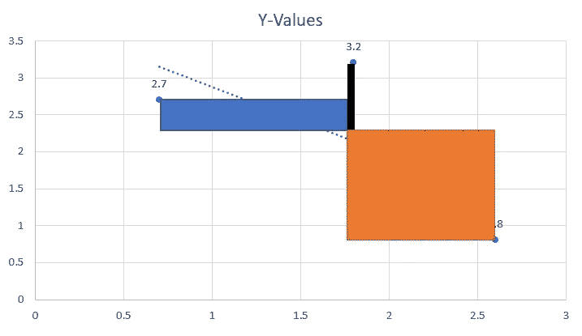
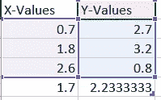
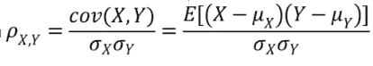
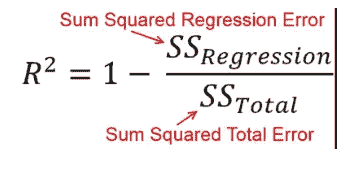

# 分解相关性

> 原文：<https://towardsdatascience.com/breaking-down-correlation-2067628e29a0?source=collection_archive---------18----------------------->

相关性是发现数量关系的第一步，值得注意。相关性被定义为数量之间的关联，例如，当人们的收入增加时，销售额可能会增加

在我们深入研究数学之前，我们需要理解协方差。协方差是变量之间关联的统计度量

**Cov(x，y)= E[(x—E[x])(y—E[y])]]**

上面的等式是协方差的等式，让我们来分解它

e 表示一个变量的期望值，这个值就是平均值。x-E[x]只不过是从平均值中减去 x 值，最终得到平均值的偏差。我们对 y 做同样的事情，乘以 x 和 y 相对于各自平均值的偏差。这可以被认为是一堆像这样的矩形

对于 x 和 y 的每个值，我们得到这样的矩形，平均矩形的对角向量给出了这样的关系，如果数据点沿着相同的方向，它可以是大的和正的，如果它们沿着相反的方向，我们得到一个大的和负的对角向量

如果变量是不相关的，对角线向量应该平均抵消，我们得到的量值是 0

这和相关性有什么关系？协方差值仍然与 x 和 y 处于相同的范围内，例如，cov(x，y) = 7.8 和 cov(a，b) = 6.4，我们可以看到两者正相关，但不能说哪一个强相关。相关性通过测量可变性来标准化该值，以便在一致的范围内获得值

**皮尔逊相关系数**

皮尔逊方法是使用最广泛的相关系数，它涉及用 x 和 y 的单个标准偏差的乘积来标准化协方差。这导致变量之间的线性关联，这意味着它用一条线来描述关系，听起来熟悉吗？是的，这听起来像是最合适的路线。让我们回到这一部分

可以看出，分子是协方差，分母使用标准偏差将值从-1 标准化到 1，这使得解释更容易。

如果变量 x 和 y 是独立的，系数接近于 0，而不是相反，让我们来看看为什么

回归线和相关系数之间有明显的相似性。通过最小化点之间的距离来计算最佳拟合线，这在数学上等同于相关方程分子中的偏差。所以相关性可以安全地写成

ρ = b (sx/sy)

其中 b =斜率

说了这么多，相关性并不等同于斜率。通过可变性测量标准化的斜率给出了相关系数！瞧啊。。换句话说，因为最佳拟合线没有考虑变量的可变性，所以我们可以得到具有高相关系数的较小斜率

所以下次当你遇到这两种方法的相似之处时，请注意这一点。使用相关性的缺点是它对异常值很敏感，因为它使用平均值，标准差来计算关系

另一种解释相关系数的方法是，把它平方，我们得到的是 x 变量解释的 y 的方差比例，听起来很熟悉吧？是的，这是用于衡量线性 ML 模型性能的 R2 指标

对于 eg，相关的平方= (-0.85)给出大约 72%

这是因为在最小二乘法中，我们从总数中计算误差平方和的比例，并减去 1，以获得正确解释的可变性，这在数学上等同于相关系数的平方，这也解释了数据的可变性

这些是看待相关性的一些方式，事实上，还有 13 种方式，所以下次我们学习一个指标时，作为数据科学家，我们应该愿意以多种方式看待它们，因为每个指标都以某种方式与其他指标相关联

干杯！