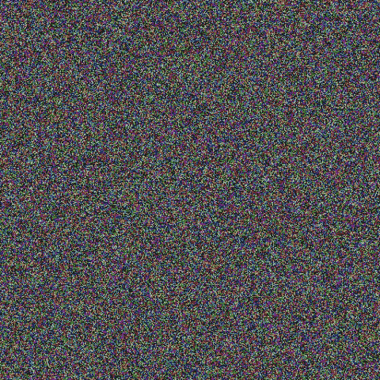

# 在《PyTorch》中分解莱昂·加蒂斯的神经风格转移

> 原文：<https://towardsdatascience.com/breaking-down-leon-gatys-neural-style-transfer-in-pytorch-faf9f0eb79db?source=collection_archive---------13----------------------->

Neural Style Transfer performed on an image of a cat.

2015 年 Leon Gatys 等人在他们的论文“艺术风格的神经算法”(arXiv:1508.06576v2)中提出了一种神经风格转移的方法。我总是着迷于神经网络模型能够进行风格转移，当时结果对我来说就像魔术一样。在这篇短文中，我想详细介绍使用 PyTorch 实现原始的神经类型转换算法。

我知道网上有很多教程。然而，我发现它们都很令人困惑，而且对于这项任务来说过于复杂。在有些沮丧之后，我决定自己实现原始论文中的方法，试图将技术分解到最小的部分，而不使用任何花哨的东西。这个实验的目标更多的是理解这个方法的理论，而不是在产品中实现这个模型，我希望这篇文章对你理解神经风格转移模型有所帮助。

首先，我想回顾一下 NST 方法的基础——特征提取。卷积神经网络享有完全连接或递归神经网络都无法享有的东西——可解释的提取特征。如果你熟悉卷积层如何传播信号，你最有可能看到激活图和滤波器可视化。如果没有，Francois Chollet 的《用 Python 进行深度学习》5.4 节是很好的参考。另外，Ian Goodfellow 等人的《深度学习》中的图 1.2 是一个很好的参考。

为什么这很重要？我们知道更深层次的神经网络提取更多的一般特征。在卷积神经网络的情况下，网络的较低层提取非常局部的特征，例如边、角和颜色。在更深的层中，这些边和角被组合在一起以表示越来越多的全局特征，例如形状、面部，有时甚至是整个物体，例如计算机键盘。

Gatys 等人的方法基于卷积网络的独特能力，能够在网络的不同层提取不同尺度的特征。他们认为，网络较低层的混合可以提取纹理和配色方案，而较深层的一层可以提取图像的整体结构，我们可以在一幅图像中以某种方式组合这些特征，以实现风格转移。他们在实验中表明这确实是可能的，为进一步研究打开了神经类型转移的整个领域。

我希望你在这一点上不要太迷茫(如果有的话),因为神经类型转移的方法论一开始有点混乱，但是，最终，非常简单明了。

我们从 2 个图像开始:第一个图像是我们希望提取内容的图像。我用的是在网上找到的一只猫的图片，所以想把猫的内容提取出来。

The image of a cat I wish to stylize.

第二个图像是我们希望提取样式的图像。通常情况下，我们希望使用具有强烈风格的图像，这样风格的转换将在美学上令人愉快。实验表明艺术品的效果最好。但是，您可以从任何图像中提取您想要的样式。我确信如果我们想的话，我们可以提取上面这张图片的风格。

以下是我用于神经风格转移模型的一些作品:

The style images we are going to transfer the style from.

# ***实现***

我们将使用 VGG19 模型进行风格转换。VGG19 常用于原始风格转换实现，但这不是必需的。有可能许多其他较新的模型可以提供更好的特征提取结果，但是社区将它们留给实验。VGG19 是一个简洁、紧凑的模型，在原始论文中也使用了它。因此，我们也将使用它，试图获得尽可能接近原始论文的结果。

Gatys 等人提出使用 VGG19 模型提取 2 组特征。使用模型的“block4_conv2”层，从**内容图像**中提取第一组特征，即内容特征。第二组特征，即风格特征，使用“block1_conv1”、“block2_conv1”、“block3_conv1”、“block4_conv1”、“block5_conv1”层从**风格图像中提取。**

为什么我们从 5 层而不是 1 层中提取样式？本文中的图 1 很好地比较了使用 VGG19 模型不同层的样式和内容重建。所以，答案是:从经验上来说，如果我们使用这五层，这种风格看起来更有吸引力。层数和其他因素的实验会产生特定的结果，我们会根据经验选择最佳结果，就像神经机器学习中的任何其他模型一样。请注意，如果我们使用不同的模型而不是 VGG19，几乎可以肯定的是，我们将不得不为内容和样式提取选择一些其他的图层集。

因此，我定义了自定义 VGG 导数，如下所示:

现在，当我们定义了 VGG 特征提取器网络后，我们就可以继续了。

Gatys 等人提到，为了获得更好的结果，他们将最大汇集层替换为平均汇集层:

Replacing the Max Pooling layers with the AVG Pooling layers.

理解我们的 VGG19 网络作为静态特征提取器执行，并且*权重在训练过程中不会改变，这一点很重要。*因此，让我们把梯度计算锁定在网络参数上:

Turn off the gradient computation in the VGG parameters.

好了，现在，当我们的网络被锁定时，我们可以从内容和样式图像中提取内容和样式特征。

我们可以通过 VGG 网络传递内容图像并收集“block4_conv2”层的输出来提取内容特征。现在，产生的激活是 CxHxW 尺寸。Gatys 建议将激活图展开成二维张量 CxH*W，因此我们也将这样做:

Extracting the content features and unrolling them.

请注意，我们必须将激活从计算图中分离出来，因为我们不希望梯度流过它们。让我们先把内容特性放在一边，我们稍后会用到它们。

现在，我们需要从样式图像中提取样式。我们通过我们的 VGG 网络传递样式图像，并采集“block1_conv1”、“block2_conv1”、“block3_conv1”、“block4_conv1”、“block5_conv1”层的输出来实现这一点。然后，我们将“展开”它们，就像我们处理内容激活一样。

有一个额外的步骤涉及到从样式图像中提取样式。特征本身不足以提取图像的风格。然而，Gatys 等人提出计算每一层激活的空间相关性。我们可以通过计算每层的格拉米矩阵来做到这一点。格拉米矩阵是输入张量的列和这些列的转置的点积。在格拉米矩阵中，我们可以看到哪些空间特征支配着其他空间特征:

Gram matrix calculation.

将样式提取放在一起会产生:

我们分离激活的原因与我们分离内容图像的激活的原因相同:我们将在损失计算中使用它们作为目标值。因此，我们不希望梯度流过它们。

这是该方法的关键思想。我们将从高斯噪声中定义一个图像，然后*我们将在图像空间中执行参数搜索，其中参数是这个噪声图像的像素*。当我们在我们的假设空间中找到一个图像，并且这个图像在内容图像的激活和风格图像的激活的 Gram 矩阵中具有最小的损失时，我们将会感到满意。结果图像将具有内容图像的内容和样式图像的样式。

也就是说，原始论文中的等式(1)和(4–5)定义了损耗。我使用 Adam optimizer 在图像空间中执行搜索。我们可以按照以下方式定义噪声图像和优化器:

The noise image and the optimizer definition.

注意，许多实现建议使用 L-BFGS 优化算法。然而，为了使事情更容易理解，并表明我们使用哪个优化器并不重要，我使用 Adam 优化器。

现在，我们开始优化循环。该过程可总结如下:

1.  从 VGG 中获取噪声图像的内容激活
2.  “展开”噪声图像的内容激活
3.  计算内容图像的内容激活和噪声图像的内容激活之间的内容损失:SSE
4.  从 VGG 中获取噪声图像的样式激活
5.  “展开”噪声图像的样式激活
6.  计算噪声图像的风格激活的每一层的 Gram 矩阵
7.  将每个图层的加权样式损失相加
8.  将加权的风格和内容损失加在一起
9.  反向传播

10.更新噪声图像的像素

11.重复 1–10

基本上，在每次迭代中，我们都要提取噪声图像的内容和风格。然后，我们将通过计算损失来比较噪声图像的内容和风格与内容图像的内容和风格图像的风格。然后，我们将这些损失加在一起，但我们将在此之前对它们进行加权，以引入一种风格-内容平衡机制。该损失将为我们提供当前噪声图像在内容上离内容图像有多远以及在风格上离风格图像有多远的估计。然后，当我们执行反向传播时，我们计算总损失相对于图像像素的梯度，因此我们知道应该在哪个方向上调整当前噪声图像中的像素，以在内容和风格上更接近参考图像。

这是模型的训练循环，请注意，我省略了一些通过阅读本文可以容易理解的次要细节。：

The main training loop for the Neural Transfer Model.

添加变化损失是为了使图像看起来更好，其定义如下:

*值得一提的是，内容、风格和变化损失之间的平衡非常重要*。每一次风格转换都需要你调整每一次损失的贡献，这可以根据经验来衡量。

# ***结果***

以下是我通过运行原始的神经类型转移模型获得的一些结果。

***样式提取***

Style (right) extracted out of the original image (left).

Style (right) extracted out of the original image (left).

Style (right) extracted out of the original image (left).

Style (right) extracted out of the original image (left).

***风格转移***

Style transferred to the cat image.

最初的方法有一个主要缺点:每次我们想要执行样式转换时，我们都必须运行优化算法。此外，使用原始方法执行样式转换在计算上非常昂贵(至少对于 Adam 优化器来说是这样)，因此它不太适合在线使用或生产。

存在一些使用神经网络参数搜索代替图像参数(像素)搜索的其他神经类型转移方法。这些模型允许为每种想要提取的样式训练一个单独的网络，然后许多内容图像可以在一次转发中被风格化。这样的车型更适合生产。事实上，我正计划研究一些这样的模型，并希望在不久的将来写下它们，这样我们就可以将结果与 Leon Gatys 等人的原始论文进行比较。

我在本文中使用的代码可以在这里免费获得。回购还包括打包模型，您可以在 2 个图像上运行，以执行神经风格转移。

感谢您的阅读！

***编辑*** :下面是我在训练中记录的一些形成噪音的有趣 gif:

