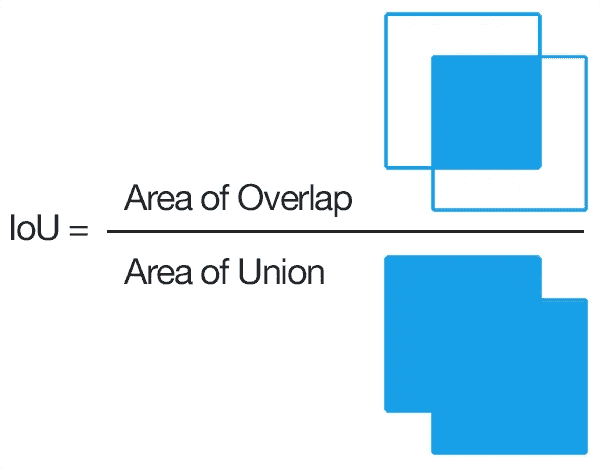
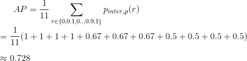

# 分解平均精度(mAP)

> 原文：<https://towardsdatascience.com/breaking-down-mean-average-precision-map-ae462f623a52?source=collection_archive---------1----------------------->

## 数据科学工具包的另一个指标

Photo by [Şahin Yeşilyaprak](https://unsplash.com/@byadonia?utm_source=unsplash&utm_medium=referral&utm_content=creditCopyText) on [Unsplash](/s/photos/mean-average-precision?utm_source=unsplash&utm_medium=referral&utm_content=creditCopyText)

如果你遇到过 [PASCAL 视觉对象类(VOC)](http://host.robots.ox.ac.uk/pascal/VOC/index.html) 和 [MS 上下文中的公共对象(COCO)](http://cocodataset.org/#home) 挑战，或者涉足过涉及信息检索和重新识别(ReID)的项目，那么你可能会非常熟悉一种叫做 mAP 的度量标准。

平均精度(mAP)或有时简称为 AP 是一种流行的度量标准，用于测量执行文档/信息检索和对象检测任务的模型的性能。

一组查询的平均精度(mAP)由[维基百科](https://en.wikipedia.org/wiki/Evaluation_measures_(information_retrieval)#Mean_average_precision)定义如下:

Mean average precision formula given provided by Wikipedia

其中 *Q* 是集合中查询的数量，AveP(q)是给定查询 Q 的平均精度(AP)。

该公式本质上告诉我们的是，对于给定的查询 q，我们计算其相应的 AP，然后所有这些 AP 得分的平均值将为我们提供一个称为 mAP 的数字，它量化了我们的模型在执行查询方面的表现。

这个定义让在这个领域刚刚起步的人(比如我)感到困惑。我有一些问题，比如这组查询是什么？还有 AP 是什么意思？只是精度的平均值吗？

本文希望解决这些问题，并为目标检测和信息检索任务计算 mAP。本文还将探讨为什么 mAP 是信息检索和对象检测任务的一个合适且常用的度量。

# 概述

1.  [初级读本](#bde1)
2.  [用于信息检索的 AP 和 mAP](#f9ce)
3.  [用于对象检测的 AP 和 mAP](#1a59)

# 1.底漆

查准率和查全率是两个常用的度量标准，用来判断给定分类模型的性能。为了理解 mAP，我们需要首先回顾一下精度和召回率。

## 越是“有名”的精确和回忆

在统计学和数据科学领域，分类中给定类别的**精度，即所谓的阳性预测值**，是指真阳性(TP)与预测阳性总数的比值。公式给出如下:

Precision formula of a given class in classification

类似地，**召回，也称为分类中给定类别的真阳性率或灵敏度，**被定义为 TP 与真实阳性总数的比率。公式给出如下:

Recall formula of a given class in classification

仅仅通过查看公式，我们就可以推测，对于一个给定的分类模型，在它的精确度和召回性能之间存在一个折衷。如果我们使用神经网络，这种权衡可以通过模型的最终层 softmax 阈值来调整。

为了提高我们的精度，我们需要减少 FP 的数量，这样会降低我们的召回率。同样，减少 FN 的数量会增加我们的回忆，降低我们的精确度。对于信息检索和对象检测的情况，我们经常希望我们的精度很高(我们预测的阳性是 TP)。

([source](https://en.wikipedia.org/wiki/Precision_and_recall))

精确度和召回率通常与其他指标一起使用，如准确性、F1 分数、特异性、真阴性率(TNR)、接收器操作特性(ROC)、提升和增益。

## 不太“出名”的精确度和召回率

但是，说到信息检索，定义就**不同**了。

根据 Wiki 的定义，**精度定义为与用户查询相关的检索文档与检索文档的比率**。

Precision formula for information retrieval given by Wiki

保持术语类似于上面定义的公式，相关文件可以被视为一个 TP。

默认情况下，precision 会考虑所有检索到的文档，但是，也可以在给定数量的检索到的文档上评估 precision，这通常称为截止等级，在这种情况下，仅通过仅考虑其最顶层的查询来评估模型。这种测量称为 k 处的*精度或* P@K

让我们用一个例子来更好地理解这个公式。

## 定义典型的信息检索任务

信息检索中的典型任务是用户向数据库提供查询，并检索与该查询非常相似的信息。现在让我们用一个带有三个真实值(GTP)的例子来计算精度。

*附加术语:基本事实阳性是被标记为阳性的数据。换句话说，相关文件。*

我们将定义以下变量:

*   q 成为用户查询
*   g 是数据库中的一组标记数据
*   d(i，j)是一个得分函数，以显示对象 I 与 j 有多相似
*   其中 G 的有序集合根据得分函数 d(，)
*   k 是 G '的指数

User querying G with a document Q

在用 Q 计算了每个文档的 d(，)之后，我们可以对 G 进行排序并得到 G’。

假设模型返回以下 G '

Model returned sorted query results G’

使用上面的精度公式，我们得到以下结果:

P@1 = 1/1 = 1

P@2 = 1/2 = 0.5

P@3 = 1/3 = 0.33

P@4 = 2/4 = 0.5

P@5 = 3/5 = 0.6

P@n = 3/n

类似地，Wiki 定义的**召回公式被给出为与用户查询相关的检索文档与相关文档**的比率。

Recall formula for information retrieval given by Wiki

在这种情况下，召回率不如运行返回查询的所有文档将导致微不足道的 100%召回率有用，因此召回率本身通常不被用作度量。

[回到大纲](#d439)

# 2.信息检索的平均精度和映射

熟悉 precision@k 之后，我们现在可以继续计算平均精度。这将使我们更好地衡量我们的模型对查询结果 G '进行排序的能力。

AP@n formula

其中，GTP 指的是基本事实正的总数，n 指的是你感兴趣的文档的总数，P@k 指的是精度@k，而 rel@k 是相关性函数。相关性函数是指示函数，如果排名 k 的文档是相关的，则该指示函数等于 1，否则等于 0。

回想一下精度的定义，我们现在将使用它来计算 G '中每个文档的 AP。使用上面所示的相同例子，

Calculation of AP for a given query, Q, with a GTP=3

这个查询的总 AP 是 0.7。需要注意的一点是，因为我们知道只有三个 GTP，所以 AP@5 等于总 AP。

对于另一个查询 Q，如果返回的 G '排序如下，我们可以得到完美的 AP 1:

Calculation of a perfect AP for a given query, Q, with a GTP=3

在这种情况下，AP 所做的是惩罚那些不能用 TPs 引导集合来排序 G '的模型。它提供了一个数字，能够根据得分函数 d(，)量化排序的优劣。通过将精度之和除以总 GTP 而不是除以 G '的长度，可以更好地表示只有几个 GTP 的查询。

## 计算地图

对于每个查询 Q，我们可以计算相应的 AP。用户可以对这个带标签的数据库进行任意多的查询。地图只是用户进行的所有查询的平均值。

mAP formula for information retrieval

*注意:这和维基百科的公式一样，只是写法不同。*

[回到大纲](#d439)

# 3.目标检测的平均精度和 mAP

## 计算 AP(传统 IoU = 0.5)

## 并集上的交集

为了计算物体检测的 AP，我们首先需要理解 IoU。IoU 由预测边界框和地面真实边界框的交集面积和并集面积的比率给出。

([source](https://www.pyimagesearch.com/2016/11/07/intersection-over-union-iou-for-object-detection/))

IoU 将用于确定预测的边界框(BB)是 TP、FP 还是 FN。由于假设每个图像中都有一个对象，因此不评估 TN。让我们考虑下面的图像:

Image with a man and horse labeled with ground truth bounding boxes ([source](https://www.walmart.com/ip/LAMINATED-POSTER-Countryside-Horse-Mountains-Atlas-Man-Poster-Print-11-x-17/868208111))

该图像包含一个人和一匹马，以及它们对应的地面真实边界框。让我们暂时忽略马。我们在这个图像上运行我们的对象检测模型，并且接收到这个人的预测边界框。传统上，如果 IoU > 0.5，我们将预测定义为 TP。可能的情况如下所述:

## 真正(IoU > 0.5)

IoU of predicted BB (yellow) and GT BB (blue) > 0.5 with the correct classification

## 假阳性

在两种可能的情况下，BB 将被视为 FP:

*   IoU < 0.5
*   重复 BB

Illustrating the different scenarios a predicted BB (yellow) would be considered as FP

## 假阴性

当我们的目标检测模型错过了目标，那么它将被认为是一个假阴性。两种可能的情况如下:

*   根本没有检测的时候。

No detection at all

*   当预测 BB 的 IoU > 0.5 但分类错误时，预测 BB 将为 FN。

FN BB as the predicted class is a horse instead of a person

## 精确度/召回曲线(PR 曲线)

正式定义了 TP、FP 和 FN 之后，我们现在可以计算测试集中给定类的检测精度和召回率。每个 BB 都有其置信度，通常由其 softmax 层给出，并用于对输出进行排序。请注意，这与信息检索的情况非常相似，只是我们没有使用相似性函数 d(，)来提供排名，而是使用模型预测的 BB 的置信度。

## 插值精度

在绘制 PR 曲线之前，我们首先需要知道[ [1](http://host.robots.ox.ac.uk/pascal/VOC/pubs/everingham10.pdf) 中引入的插值精度。插值精度 p_interp 是在每个召回级别 *r* 上计算的，取该*r*的最大测量精度。公式如下:

Interpolated Precision for a given Recall Value (r)

其中 p(r)是召回 r 时的测量精度。

他们内插 PR 曲线的目的是减少由检测等级的微小变化引起的“摆动”的影响。

这样一来，我们现在可以开始绘制 PR 曲线了。考虑一个具有 3 TP 和 4 FP 的 person 类的例子。我们通过上面定义的公式计算相应的精度、召回率和插值精度。

Calculation table for plotting PR curve with an example of 3 TP and 4 FP. Rows correspond to BB with person classification ordered by their respective softmax confidence

然后通过 PR 曲线下的面积计算 AP。这是通过将召回平均分为 11 个部分来实现的:{0，0.1，0.2，…，0.9，1}。我们得到以下结果:

Calculation of AP for the above example

再举一个例子，我想让你参考乔纳森·惠[的这篇](https://medium.com/@jonathan_hui)[写得很好的文章【2】](https://medium.com/@jonathan_hui/map-mean-average-precision-for-object-detection-45c121a31173)。

## 计算地图

用于对象检测的 mAP 是为所有类别计算的 AP 的平均值。还需要注意的是，对于一些论文，它们交替使用 AP 和 mAP。

## 计算 AP 的其他方法

参考[ [5](http://cocodataset.org/#detection-eval) ]，COCO 提供了六种计算 AP 的新方法。

这些方法中的三种在**不同的 iou:**处对 BB 进行阈值处理

*   AP:IoU = 0.50 时的 AP:0.05:0.95(主要挑战指标)
*   AP@IoU=0.5(如上所述的传统计算方法)
*   AP @ IoU = 0.75(BBs 的 IoU 需要> 0.75)

对于主 AP，0.5:0.05:0.95 意味着从 IoU = 0.5 开始，步长为 0.05，增加到 IoU = 0.95。这将导致在十个不同的 iou 上 AP 阈值的计算。进行平均以提供奖励定位更好的检测器的单个数字。

其余三种方法是跨尺度计算**AP:**

*   小型物体的 AP^small: AP:面积< 32² px
*   AP^medium: AP for medium objects: 32² < area < 96² px
*   AP^large: AP for large objects: area > 96 像素

这将允许更好地区分模型，因为一些数据集比其他数据集具有更多的小对象。

[回到大纲](#d439)

*发现错误？随意评论！*

*特别感谢***[*德里克*](https://medium.com/@derekchia) *和* [*韦杰*](https://medium.com/@polars) *对本文的校对和反馈。***

***随时通过*[*Twitter*](https://twitter.com/rahjaytee)*[*LinkedIn*](https://www.linkedin.com/in/renjietan/)*与我联系！****

***如果你对我参与过的其他项目感兴趣，可以随时访问我的*[*Github*](https://github.com/notha99y)*！***

***对于我的其他作品:***

1.  **[使用 Python、pandas、seaborn 和 scikit-learn 进行探索性数据分析的入门包](/a-starter-pack-to-exploratory-data-analysis-with-python-pandas-seaborn-and-scikit-learn-a77889485baf)**
2.  **[我如何通过 6 个简单的步骤将人体动作分类器提高到 80%的验证准确率](/6-steps-to-quickly-train-a-human-action-classifier-with-validation-accuracy-of-over-80-655fcb8781c5)**

# **参考资料:**

1.  **由 Mark Everingham、Luc Van Gool、Christopher K. I. Williams、John Winn 和 Andrew Zisserman 发起的 PASCAL 视觉对象类(VOC)挑战**
2.  **[https://medium . com/@ Jonathan _ hui/map-mean-average-precision-for-object-detection-45c 121 a 31173](https://medium.com/@jonathan_hui/map-mean-average-precision-for-object-detection-45c121a31173)**
3.  **[https://makarandtapaswi . WordPress . com/2012/07/02/intuition-behind-average-precision-and-map/](https://makarandtapaswi.wordpress.com/2012/07/02/intuition-behind-average-precision-and-map/)**
4.  **[https://en . Wikipedia . org/wiki/Evaluation _ measures _(information _ retrieval)# Mean _ average _ precision](https://en.wikipedia.org/wiki/Evaluation_measures_(information_retrieval)#Mean_average_precision)**
5.  **[http://cocodataset.org/#detection-eval](http://cocodataset.org/#detection-eval)**
6.  **[https://tarangshah . com/blog/2018-01-27/what-is-map-understanding-the-statistic-of-choice-for-comparisng-object-detection-models/](https://tarangshah.com/blog/2018-01-27/what-is-map-understanding-the-statistic-of-choice-for-comparing-object-detection-models/)**