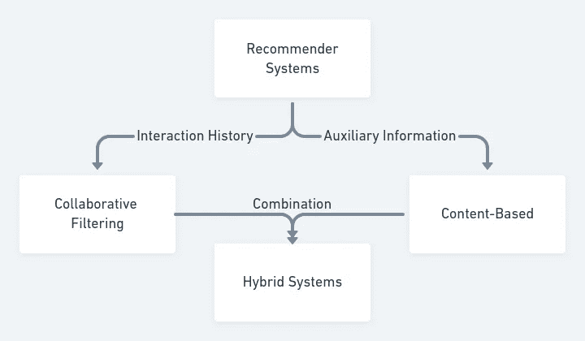
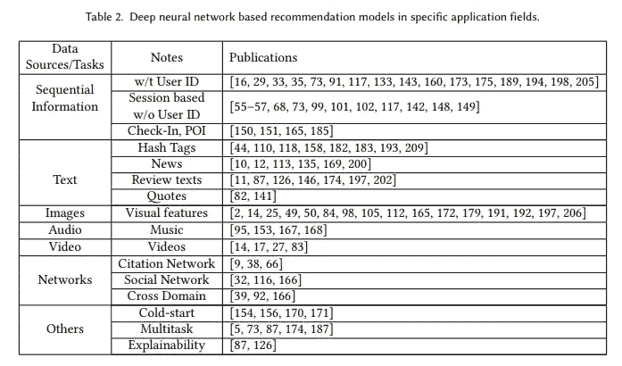

# 分解评论文章

> 原文：<https://towardsdatascience.com/breaking-down-review-articles-6a85a897c3fb?source=collection_archive---------23----------------------->

## 使用评论文章来帮助你过渡到新的研究领域

开始一个新的研究领域似乎是一项艰巨的任务。尤其是当该领域每年发表的论文数量呈指数级增长时。这种快速增长使得跟上当前的研究实践变得极其困难。更高的更替率意味着更少的公认标准，因为新的工作专注于提出下一个最好的想法，而不是重复当前的方法。如果你开始不加选择地阅读一篇又一篇被广泛引用的论文，你会感觉像一个永无止境的迷宫。

The never-ending agony of reading referenced paper after referenced paper.

那么，这是否意味着我们一旦开始努力跟上，就注定要失败呢？不，一点也不，尤其是如果你有计划的话。

评论或调查文章是了解新领域的好方法。它们包括该领域最初问题的历史信息，以及过去试图解决这些问题的研究成果。目前的方法是在某种程度上提出来与其他方法进行比较。拥有明确的问题领域可以帮助你根据你的情况或兴趣找出你应该集中精力做什么。此外，综述文章最好的部分是它们充当了一个精心策划的参考文献列表，您可以使用它来了解更多关于该方法的细节。现在我想让你向我介绍一下我是如何为我的博士研究和我的兴趣分解评论文章的。

# 我如何浏览一篇评论文章

我最近想知道更多关于当前推荐系统如何集成深度学习的信息。如果你不知道，推荐系统使用用户和商品的过去信息来预测或推荐未来用户与新商品的互动。例如，在一个电影推荐器中，电影是项目，个人可能是用户。这个问题的交互方式因格式和对不同类型数据的访问而异。它可以是一个评级系统(1-5)，也可以是一个👍或者👎，也可能只是用户之前是否看过这部电影。

# 查找评论文章

Arxiv 和[谷歌学术](https://scholar.google.com/)是寻找评论文章的好地方。谷歌学术可以绑定到一个大学账户上，这样你在校园网上可以看到的任何文章都可以在校外看到。然而，在这里，我只使用 Arxiv，因为任何人阅读这篇文章都是免费的。

> 专家提示:如果你发现一篇你无法获得的优秀科学论文，通过电子邮件联系作者，他们很可能会给你寄一份。

在搜索了 Arxiv 之后，我决定选择论文“基于深度学习的推荐系统:调查和新观点”我最终选择这篇文章有几个原因。

1.  这是最近的一篇论文。随着 2019 年 7 月发布的最新版本，它应该包含了该领域的大多数最新进展。
2.  这篇综述发表在 [ACM](https://dl.acm.org/citation.cfm?doid=3285029) 上。注意，一篇论文发表了并不代表它就是好的。在这种情况下，同行评审过程应该有助于确保没有重大贡献被遗漏。
3.  报纸的版面。作者将工作分成清晰的部分，使其更容易分析和理解所有评论文章如何适应更大的画面。

# 分解它

好了，现在我们有了一篇评论文章，我们可以开始一点一点地分解它。作为一种组织信息的方式，我通常会尝试将文章分成不同的部分。当试图将多篇文章的观点结合起来，并为将来的参考提供一个好的总结时，这是特别有用的。

## 写作原因

一些评论文章提供了他们写评论文章的动机。他们的动机是确定他们希望涵盖的研究范围以及了解你可能感兴趣的其他文章的一个很好的方式。

> 在过去的几年里，对传统推荐系统的一些调查已经被提出…然而，有一个**缺乏对基于深度学习的推荐系统**的广泛评论。就我们所知，只有两个相关的简短调查[7，97]正式发表…鉴于深度学习在推荐系统中应用的日益普及和潜力，一个**系统调查**将具有很高的科学和实用价值。我们从**不同的角度分析了这些作品，并对这一领域提出了一些新的见解**。为此，**超过 100 项研究在本次调查中入围并分类**

通过这一小段摘录，我们知道作者写这篇论文是对 100 多篇关于深度学习在推荐系统中的使用的文章的广泛系统调查。此外，它旨在提供一个不同的视角，而不是在该领域的前两个审查文件。

## 定义

检查并查看作者是否对他们在评论中涉及的主题进行了详细描述总是有好处的。明确的定义有助于消除由于该领域中的非标准术语而导致的任何可能的误解。

> 推荐系统**估计用户对项目的偏好**和**主动向他们推荐用户可能喜欢的项目**【1，121】。推荐模型通常**分为三类**【1，69】:**协同过滤**，**基于内容的**和**混合推荐系统**。

现在，我们可以将本文中介绍的每个推荐系统分为三个不同的类别。然后，他们继续定义每个类别。

> **协同过滤**通过 l **从用户-项目历史交互**中获得，或者是显性的(例如用户以前的评级)或者是隐性的反馈(例如浏览历史)来进行推荐。**基于内容的**推荐主要基于 c **跨项目的比较和用户的辅助信息**。多种多样的辅助信息，如文本、图像和视频都可以考虑在内。**混合模型**是指**整合了两种或两种以上推荐策略的推荐系统**【8，69】。

A flowchart showing the relationship between types of recommender systems.

因此，一个推荐系统，使用用户如何与项目互动的过去信息，是协同过滤。使用关于用户或项目的信息来确定不同项目或用户的相似性，然后基于该相似性进行推荐的系统是基于内容的推荐器。最后，如果推荐器结合了不同的方法，它就是一个混合系统。

## 应用程序和数据

确定所回顾的方法旨在回答的问题的种类对于理解当前和未来的研究方向是至关重要的。对于推荐系统，我们想知道当前系统的目的以及每个系统所需的数据类型。

> 在行业中，对于许多在线网站和移动应用来说，推荐系统是增强用户体验和促进销售/服务的重要工具。例如，在网飞上观看的 80%的电影来自推荐[43]，60%的视频点击来自 YouTube 的主页推荐[30] … Covington 等人[27]提出了一种基于深度神经网络的推荐算法，用于 YouTube 上的**视频推荐。Cheng 等人[20]提出了一个用于 Google Play**的具有宽 T36 深模型的 T32 应用推荐系统。Shumpei 等人[113]为雅虎新闻提出了一个基于 RNN 的 T34 新闻推荐系统 T35。

对于这些应用程序中的每一个，我们可以想象需要不同来源和格式的数据。令人欣慰的是，作者提供了一个表格，对每个来源的评审工作进行了分类。现在，我们只需要阅读四篇文章，而不是浏览所有的 100 篇评论文章，看看他们是否使用视频作为输入来源。

This table shows how the authors categorize publications based on the data source and task.

## 未来研究和未决问题

在论文的最后部分，作者讨论了该领域的开放问题和未来研究的途径。如果你是一个刚刚进入这个领域的人，这可能是一个获得未来项目和工作方向想法的好地方。

1.  从用户和项目中联合学习
2.  可解释性
3.  更深入
4.  机器推理
5.  跨域
6.  多任务学习
7.  可量测性
8.  更好、更统一、更难的评估

这些都是你感到舒适后开始新项目的好地方。

# 把所有的放在一起

通读本文后，我们对推荐系统的内容、原因和位置有了更好的理解。遗憾的是，在这一点上，我们离成为该领域的专家还差得远。然而，我们可以开始了解该领域的研究是如何分类的，以及我们可以阅读哪些论文来获得更多信息。

我希望这是一个有用的练习，看看如何将综述论文分解，以帮助更好地理解新的研究领域。虽然这肯定不是审查论文的唯一方法，但我发现这些技巧对我很有帮助。

如果你有问题或者你想分享一些你用来审阅论文的技巧，请在下面留下你的评论。

*最初发表于*[*【https://www.coreydeon.com】*](https://www.coreydeon.com/blog/breaking-down-review-articles/)*。*

## 引文

[1] S. Zhang，L. Yao，A. Sun，和 Y. Tay，[基于深度学习的推荐系统:调查和新观点](https://arxiv.org/abs/1707.07435) (2019)，ACM 计算调查(CSUR) 52.1: 5