# 用 PyTorch 和月球着陆器打破 Richard Sutton 的政策梯度

> 原文：<https://towardsdatascience.com/breaking-down-richard-suttons-policy-gradient-9768602cb63b?source=collection_archive---------8----------------------->

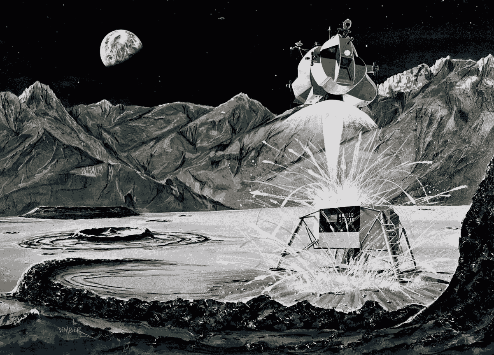

[Lunar Lander Artwork from https://70sscifiart.tumblr.com/post/157053475728/1969-nasa-concept-art-of-the-apollo-11-lunar](https://70sscifiart.tumblr.com/post/157053475728/1969-nasa-concept-art-of-the-apollo-11-lunar)

在 21 世纪初，已经发表了一些关于强化学习中的政策梯度方法(以一种或另一种形式)的论文。最值得注意的是 Richard Sutton 等人的**“利用函数逼近进行强化学习的策略梯度方法”**。

在这篇短文中，我们将试着理解带有一些怪癖的普通策略梯度算法。此外，我们将使用策略梯度算法训练一个智能体来解决 CartPole 和 LunarLander OpenAI 健身房环境。完整的代码实现可以在[这里](https://github.com/halahup/RL-Primers/tree/master/Policy%20Gradient)找到。

策略梯度算法位于策略优化深度强化学习方法家族的核心，例如(异步)优势行动者-批评家和信任区域以及近似策略优化。许多其他算法也与策略梯度算法有许多相似之处。

策略梯度和深度 Q 学习方法之间的差异是非常明显的。在策略梯度的情况下，我们优化重要的东西，即策略的性能，而不是诸如动作值之类的替代度量。此外，与确定性策略相反，策略梯度算法能够学习随机策略。最后，策略梯度是基于策略的算法，而深度 Q 学习是基于策略的算法，这使得它们的样本效率不同(策略梯度方法具有较低的样本效率)。

理查德·萨顿和安德鲁·巴尔托的《强化学习》的第 13 章详细描述了算法的策略梯度系列。此外，我发现[这个开放人工智能资源](https://spinningup.openai.com/en/latest/spinningup/rl_intro3.html)有助于所涉及的数学背后的直觉；我强烈推荐通读这两本书。

## ***理论背后的政策梯度算法***

在我们实现策略梯度算法之前，我们应该复习一下算法中涉及的具体数学知识。数学非常简单易懂，并且在很大程度上是从上面提到的 OpenAI 资源中重新解释的。

首先我们定义 **tau** 为一个轨迹或一系列动作以及执行这些动作所获得的相应奖励。

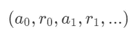

An abstraction of a trajectory

现在，我们可以将奖励函数定义为轨迹奖励的贴现或无贴现(对于情节任务)总和。在实践中，我们会发现，即使对于偶发的任务，使用奖励的折扣总额也更有益，定义如下:

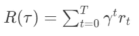

Discounted sum of the rewards, obtained from a trajectory

其次，我们将性能度量 **J** 定义为来自最近一批轨迹(在当前策略执行下获得)的报酬的某个函数的期望值。

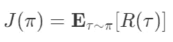

Performance measure

让我们更深入地研究一下性能指标。根据期望的定义，我们得到:

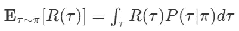

Expanding the expectation over the trajectory

重要的是要明白，我们希望使用性能测量的梯度来优化我们的策略(代理)。因此，我们得到以下结果:

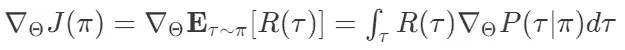

Adding the gradient wrt the parameters of the policy

现在，有一个很好的技巧或对数导数技巧，它来自下面的恒等式:

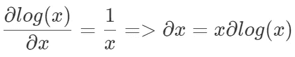

log-derivative trick

我们可以使用这个技巧，用概率和轨迹对数概率的梯度的乘积来代替轨迹概率的梯度，或者:

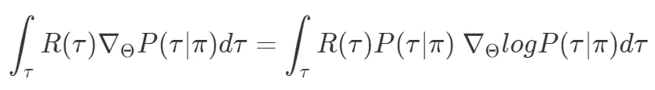

Adding the log-probability of the trajectory

如果我们仔细观察右边，我们可以注意到它本身就是一个期望:

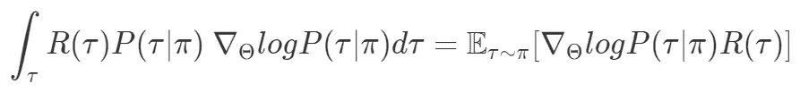

Bringing the integral back to expectation

但是轨迹的对数概率是多少呢？原来我们可以用链式法则来定义轨迹上的概率:

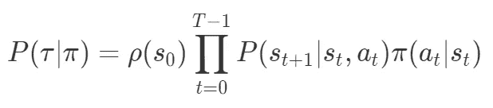

Chain rule can be used to define the probability distribution over the trajectory space

直觉上，这个链式法则很有意义。我们从一些初始状态分布中抽取初始状态。然后，由于我们的行动是随机的，我们在行动空间中选择一个有一定概率的行动，这就是我们的策略。最后，过渡模型也是随机的；因此，我们乘以从前一个状态转移到下一个状态的概率。我们继续这个过程，直到我们到达集的结尾。

现在，让我们看看轨迹空间上的对数概率分布:

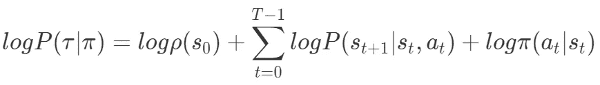

Log-probability over the trajectory space

让我们计算相对于策略参数的轨迹空间上的对数概率的梯度:

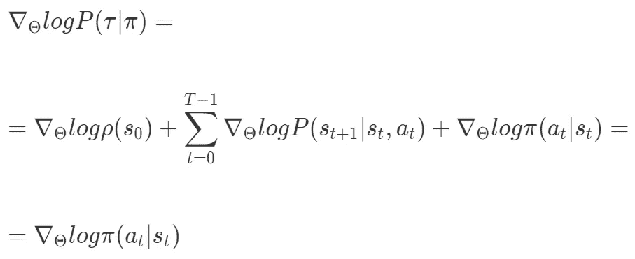

Calculating the gradient of the log-probability over the trajectory space

我们看到只有政策概率分布依赖于政策参数。因此，其余项的值为零。最后，我们可以将所有的数学计算放在一起，得出:

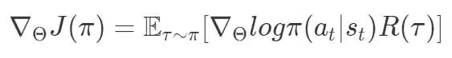

The gradient of the performance measure can be approximated by sampling

现在，由于性能度量的梯度是一个期望值，我们可以用抽样来估计它，这非常容易。我们将在当前策略下生成几个轨迹(因为策略梯度是一个策略上的算法)，然后将计算我们从代理(策略)获得的加权(通过 R(tau))对数概率的平均值。

*我们将使用从时间 ***t*** 到本集结束的折扣奖励的总和，而不是折扣奖励的总和。这些被称为奖励-继续，在政策梯度方法中更频繁地使用，因为在时间 ***t*** 之后提交的行为不应对这些行为发生之前获得的奖励产生任何影响。*

*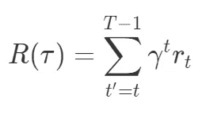*

*Rewards-to-go*

## ****熵加成****

*在代码中，我们还将使用熵加成来阻止严格的确定性。思路相对简单:我们在策略优化过程中，从“损失”中减去策略的熵。如果代理人对自己的行为过于自信，那么政策的熵就会变小，红利就会消失。策略的熵是强化学习中反复出现的主题，并用于其他算法，如软演员-评论家。*

## ****基线****

*我们还将使用一个基线。基线是在不影响期望值的情况下从 R(τ)中减去的量，因为通常基线是特定于状态的量。我们将使用特定州的轨迹回报平均值作为基线。*

*基线减少了政策梯度估计的差异。直觉上，这很有意义，尤其是在横翻筋斗的情况下。假设我们的代理可以平衡杆子 2 秒钟。这是好事还是坏事？如果在这一集之前，代理人平均平衡了 1 秒钟，那么是的，这是更好的表现。在这种情况下，策略梯度将被估计为正，并且代理将朝着进一步改进的方向迈出一步。*

*然而，如果代理在事件发生前平均平衡极点 3 秒，则策略梯度将被估计为负，并且我们仍将朝着正确的方向迈出这一步，远离使代理平衡极点 2 秒的参数。如果我们不使用基线，1 秒和 3 秒以及 10 秒的插曲都会导致相似的梯度方向；因此，培训可能需要更长的时间。*

*需要注意的是，对于像 LunarLander 这样更复杂的问题，基线不太直观，因为我们有正面和负面的奖励，奖励的规模也不同。*

# *PyTorch 实现*

*代码和算法背后的数学一样简单明了。然而，能够将数学语言翻译成代码本身就是艺术，我发现这部分有时是最困难的。*

*既然我们知道可以通过抽样来估计性能度量的梯度，我们就应该对其采取行动。我们将在当前政策下播放 N 集 LunarLander，并在这些集上累积一批轨迹。*注意，由于策略梯度是一种随机策略算法，我们将用从代理网络的逻辑中获得的相应概率来对我们的行为进行采样。**

*因此，我们将累积所有行动逻辑和行动的对数概率，以及 N 集内所有行动的回报，以计算策略梯度的近似值。我们还将计算熵奖金和奖励去。*

*以下是播放一集环境并收集所有轨迹和相应计算值的循环:*

*The play_episode method*

*在下面的要点中，你可以看到如何从你的轨迹中获得奖励来计算奖励:*

*Discounted rewards-to-go method*

*因此，在算法训练的一个时期，我们有 N 个轨迹，或者更准确地说，N 个行动对数概率数组和 N 个奖励数组。现在，我们需要做的就是用相应的奖励值来“加权”我们用当前策略收集的行动的对数概率。这样，我们获得了 N 个“加权”行动对数概率数组。通过取“加权”对数概率的平均值，我们最终可以得到政策梯度估计值:*

*Calculating the policy “loss” and the entropy bonus*

*现在，当我们拥有策略梯度算法的所有移动部分时，我们可以通过根据我们的策略梯度估计采取步骤来解决环境问题:*

*Solving the CartPole or LunarLander environments*

## ****月球着陆器截图****

*以下是我在训练月球着陆器任务的代理时捕捉到的一些截图:*

*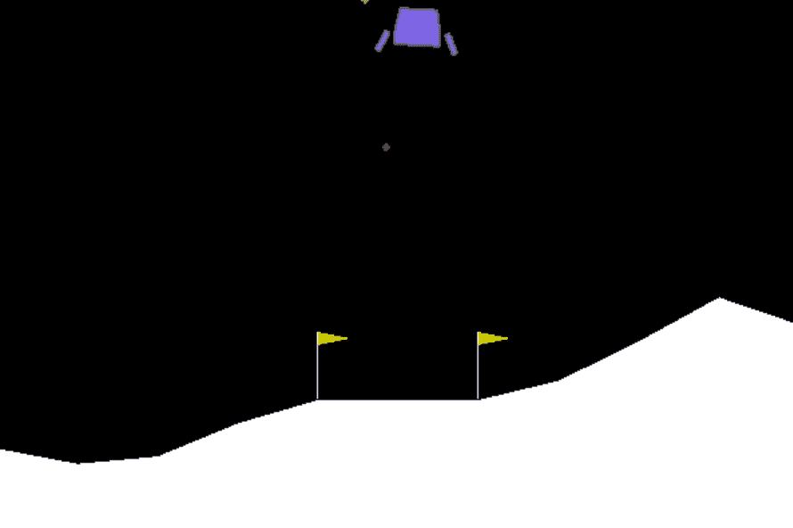**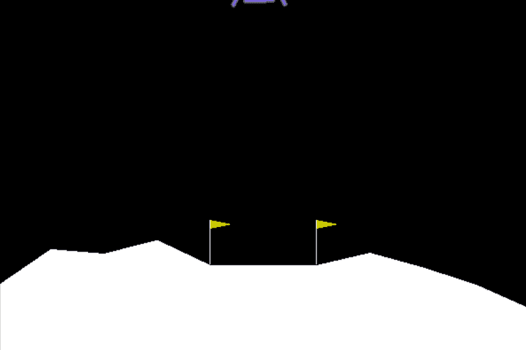*

*In the beginning of training the agent is acting maximally random as the distribution over actions is approximately uniform*

*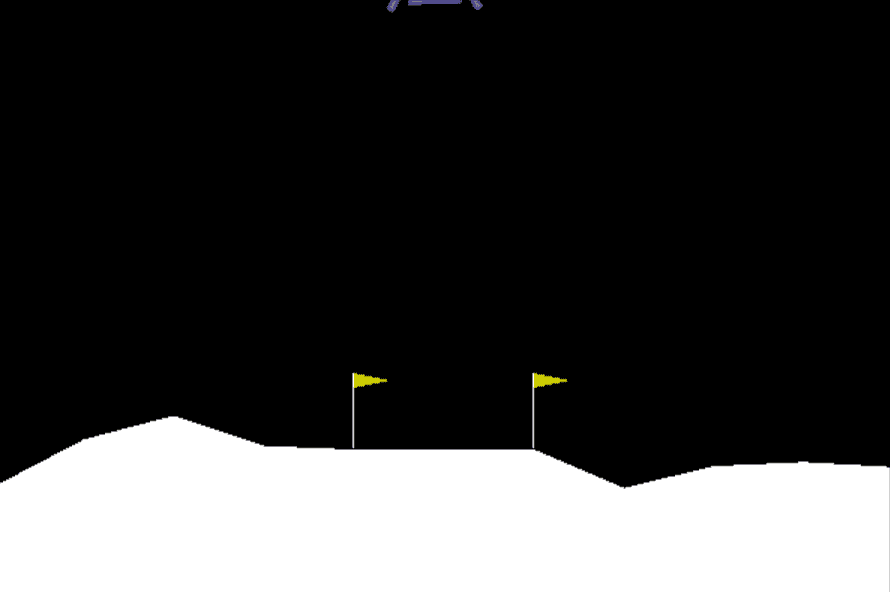**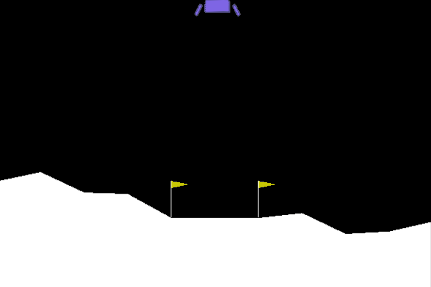**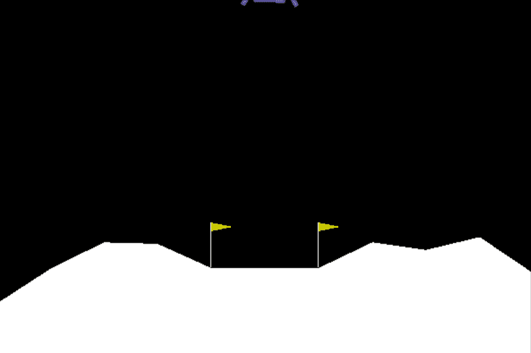*

*As training progresses the agent chooses better actions and learns how to generalize*

## *收敛度量*

*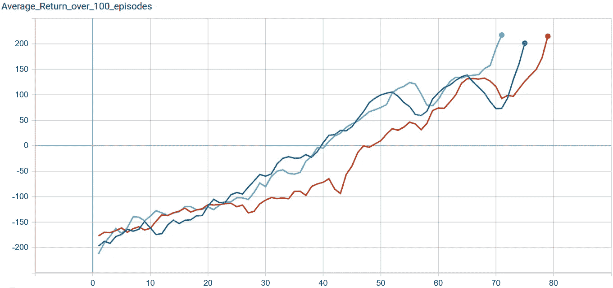*

*Average return over 100 episodes for Lunar Lander environment*

*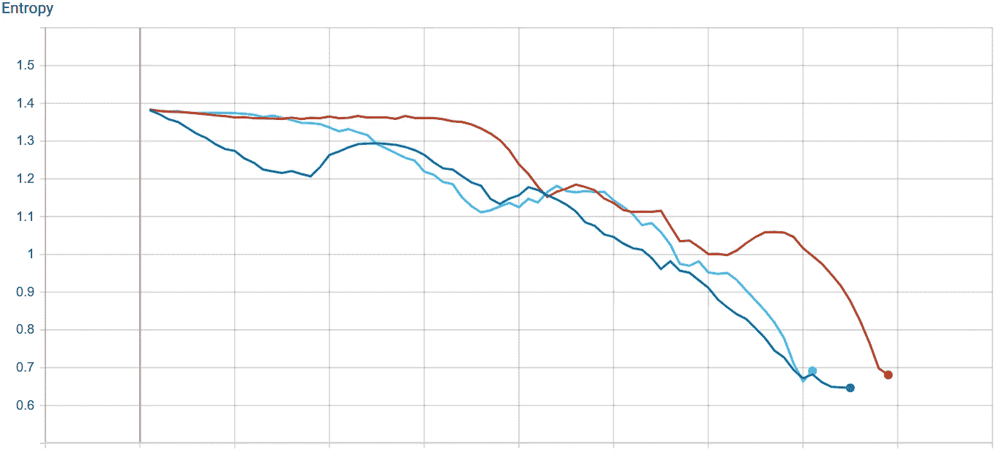*

*Policy entropy for the Lunar Lander agent. Later in the training process the agent becomes more certain about the actions it takes*

*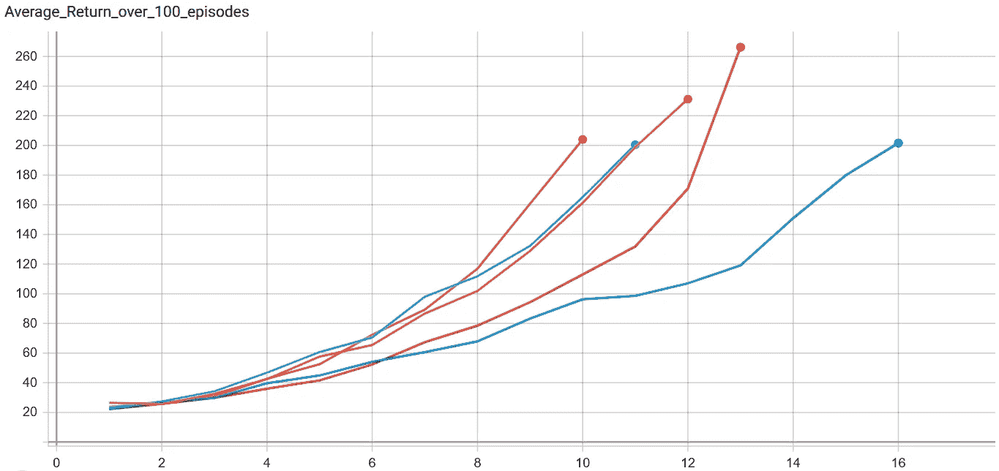*

*Average return over 100 episodes for Cart Pole environment*

*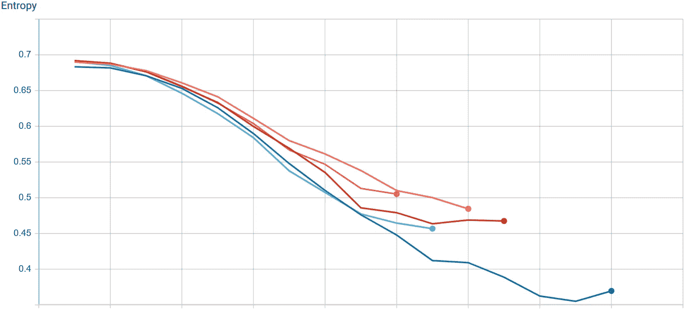*

*Policy entropy for the Cart Pole agent.*

*感谢您的阅读！*