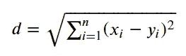

# 打破聚集的聚类过程

> 原文：<https://towardsdatascience.com/breaking-down-the-agglomerative-clustering-process-1c367f74c7c2?source=collection_archive---------9----------------------->

## 如何将聚合聚类应用于数据的详细步骤


16S rRNA species tree with Neighbour Joining Cluster method and Kimura-2 Parameter model using 1000 bootstrap from my thesis “ CHEMICAL AND MOLECULAR TAXONOMY ACTINOMYCETES ISOLATE FROM JAMBI, TIMOR, AND LOMBOK (2015)**”**

如果你没有认出上面的图片，这是意料之中的，因为这张图片大多只能在生物杂志或教科书中找到。我上面的是一个物种进化树，这是一个物种共享的历史生物树，目的是看它们彼此之间有多接近。更一般地说，如果你熟悉**层次聚类**，它基本上就是这样。准确地说，我上面所说的是**自下而上的**或**聚集聚类**方法来创建一棵被称为邻居加入的系统发育树。

准备好通过 365 Data Science 上的**折扣价向所有专家学习数据科学吧！**

[](https://365datascience.pxf.io/c/3452806/1037878/11148) [## 为数据科学夏季做好准备- 65%折扣| 365 数据科学

### 选择一条职业道路，掌握你想要的特定工作角色的技能——数据科学家、数据分析师或商业…

365datascience.pxf.io](https://365datascience.pxf.io/c/3452806/1037878/11148) 

# 凝聚聚类

## 介绍

在机器学习中，无监督学习是一种在没有任何指导或标签的情况下推断数据模式的机器学习模型。无监督学习家族中包括许多模型，但我最喜欢的模型之一是凝聚聚类。

凝聚聚类或自下而上聚类本质上是从一个**个体聚类**(每个数据点被视为一个个体聚类，也称为**叶**)开始，然后每个聚类计算它们彼此之间的**距离**。彼此距离最短的两个集群将**合并**，创建我们所谓的**节点**。新形成的集群再次计算其集群成员与该集群之外的另一个集群的距离。重复该过程，直到所有数据点都被分配到一个称为**根**的簇。结果是一个名为**树状图**的基于树的对象表示。

提醒一下，虽然我们看到了数据应该如何聚类的结果；聚集聚类并没有给出我们的数据应该如何被聚类的确切数字。应该由我们来决定分界点在哪里。


Dendrogram as the output of the Agglomerative Clustering

让我们试着更详细地分解每一步。为了简单起见，我将只使用最常见的参数来解释凝聚星团是如何工作的。

## 距离测量

我们通过测量数据点之间的距离来开始凝聚聚类过程。具体是怎么算出来的？我举一个哑数据的例子。

```
#creating dummy data
import pandas as pd
dummy = pd.DataFrame([[30,100,5],
              [18, 200, 2],
              [35, 150, 7],
             [48, 300, 4],
             [50, 200, 6]], index = ['Anne', 'Ben', 'Chad', 'Dave', 'Eric'], columns =['Age', 'Expense($)', 'Distance(KM)'])
```


Dummy data of 5 peoples with 3 dimensions

假设我们有 5 个不同的人，他们有 3 个不同的连续特征，我们想看看如何对这些人进行聚类。首先，我们需要决定我们的聚类距离度量。

最常用的距离测量方法之一叫做 [**欧几里德距离**](https://en.wikipedia.org/wiki/Euclidean_distance) 。



Euclidean distance calculation

用一个简单的术语来说，欧几里得距离是从 x 点到 y 点的直线。我将通过我们的虚拟数据中 Anne 和 Ben 之间的距离来举例说明。

在虚拟数据中，我们有 3 个特征(或尺寸)代表 3 个不同的连续特征。在这种情况下，我们可以使用下面的公式计算安妮和本之间的欧几里德距离。


如果我们把所有的数字放在一起。


使用欧几里德距离测量，我们获得安妮和本之间的欧几里德距离为 100.76。类似地，将测量应用于所有数据点将产生以下距离矩阵。

```
import numpy as np
from scipy.spatial import distance_matrix#distance_matrix from scipy.spatial would calculate the distance between data point based on euclidean distance, and I round it to 2 decimalpd.DataFrame(np.round(distance_matrix(dummy.values, dummy.values), 2), index = dummy.index, columns = dummy.index)
```


Euclidean distance matrix of the dummy data

之后，我们合并矩阵中最小的非零距离来创建我们的第一个节点。在这种情况下，是本和埃里克。


Merging event between two data point to create a node

对于新的节点或集群，我们需要更新我们的距离矩阵。


现在我们有了 Ben 和 Eric 的新聚类，但是我们仍然不知道(Ben，Eric)聚类到其他数据点之间的距离。我们如何计算新的聚类距离呢？为此，我们需要首先设置链接标准。

## 连锁标准

链接标准是精确测量距离的地方。这是我们建立的一个规则，用来定义集群之间的距离。

有许多联动标准，但这次我只使用最简单的联动，称为 [**单联动**](https://en.wikipedia.org/wiki/Single-linkage_clustering) 。它是如何工作的？我会在下面的图片中展示它。


Representation of Single linkage criterion

在单一连锁标准中，我们将我们的距离定义为聚类数据点之间的最小距离。如果我们把它放在一个数学公式里，它会是这样的。


其中聚类 X 到聚类 Y 之间的距离由分别是 X 和 Y 聚类成员的 X 和 Y 之间的最小距离定义。

让我们举一个例子。如果我们将单一连锁标准应用于我们的虚拟数据，比如 Anne 和 cluster (Ben，Eric)之间的数据，它将被描述为下图所示。


在单一连锁标准下，我们得到 Anne 到 cluster (Ben，Eric)之间的欧氏距离为 100.76。将单一连锁标准应用于我们的虚拟数据将产生以下距离矩阵。


Updated distance matrix

现在，我们有了新聚类到另一个数据点之间的距离。虽然如果你注意到，安妮和乍得之间的距离现在是最小的。在这种情况下，下一个合并事件将发生在 Anne 和 Chad 之间。


我们保持合并事件发生，直到所有的数据都聚集到一个集群中。最后，我们将获得一个树状图，其中所有数据都被合并到一个集群中。

```
#importing linkage and denrogram from scipyfrom scipy.cluster.hierarchy import linkage, dendrogram
import matplotlib.pyplot as plt#creating dendrogram based on the dummy data with single linkage criterionden = dendrogram(linkage(dummy, method='single'), 
labels = dummy.index)
plt.ylabel('Euclidean Distance', fontsize = 14)
plt.title('Dendrogram of the Dummy Data')
plt.show()
```


Final Dendrogram of the Agglomerative Clustering

## 确定聚类的数量

我们已经得到了树状图，那么我们该怎么处理它呢？我们将使用它来为我们的数据选择一些集群。记住，树状图只向我们展示了数据的层次结构；它并没有准确地给出最佳的集群数量。

确定聚类数的最好方法是目测我们的树状图，并选择某个值作为我们的分界点(手动方式)。通常，我们选择切割最高垂直线的分界点。我会用下面的图片展示一个例子。


Dendrogram with a cut-off point at 60

水平线与垂直线相交的次数将产生该组的数目。

选择 60 的截止点将给出两个不同的聚类(Dave 和(Ben，Eric，Anne，Chad))。选择不同的分界点也会给我们不同的集群数量。例如，如果我们将截止点移到 52。


Dendrogram with a cut-off value at 52

这一次，以 52 为截止点，我们将得到 3 个不同的集群(Dave，(Ben，Eric)和(Anne，Chad))。

最后，我们决定哪个聚类数对我们的数据有意义。在这种情况下，拥有数据的领域知识肯定会有所帮助。

当然，我们可以通过[特定的方法](https://en.wikipedia.org/wiki/Determining_the_number_of_clusters_in_a_data_set)自动找到集群的最佳数目；但是我相信确定聚类数的最好方法是通过观察聚类方法产生的结果。

## 凝聚聚类模型

假设我会选择值 52 作为我的分界点。这意味着我最终会有 3 个集群。有了这些知识，我们可以将它实现为一个机器学习模型。

```
from sklearn.cluster import AgglomerativeClusteringaglo = AgglomerativeClustering(n_clusters=3, affinity='euclidean', linkage='single')
aglo.fit_predict(dummy)
```

凝聚聚类模型将产生[0，2，0，1，2]作为聚类结果。然后，我们可以将聚类结果返回给虚拟数据。在我的例子中，我将其命名为“Aglo-label”。

```
dummy['Aglo-label'] = aglo.fit_predict(dummy)
```


Clustered data via Agglomerative Clustering

现在，我的数据已经被聚类，并准备进一步分析。有必要分析结果，因为无监督学习仅推断数据模式，但它产生何种模式需要更深入的分析。

# 结论

凝聚聚类是层次聚类家族中的一员，它通过合并每个单独的聚类进行工作，这一过程一直重复，直到所有数据都成为一个聚类。

聚集聚类采取步骤是:

1.  每个数据点被指定为单个聚类
2.  确定距离测量值并计算距离矩阵
3.  确定合并集群的链接标准
4.  更新距离矩阵
5.  重复该过程，直到每个数据点成为一个聚类

用一个树状图，然后我们选择我们的截止值来获得该类的数目。

最后，凝聚聚类是一种无监督的学习方法，目的是从我们的数据中学习。如何解释聚类结果仍然取决于我们。

我在这里提供笔记本的 GitHub [链接](https://github.com/cornelliusyudhawijaya/Agglomerative_Clustering/blob/master/Agglomerative%20Clustering.ipynb)作为进一步参考。

访问我的 [**社交媒体！**](https://bio.link/cornelli)

> 如果您没有订阅为中等会员，请考虑通过[我的推荐](https://cornelliusyudhawijaya.medium.com/membership)订阅。