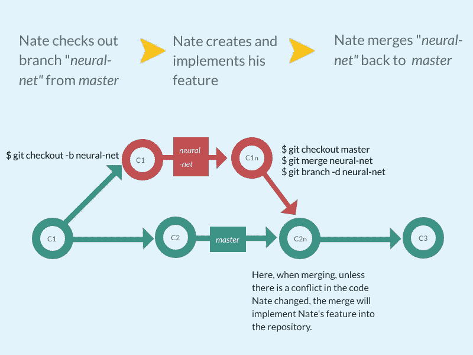

# 分解有效 Git 工作流的基础

> 原文：<https://towardsdatascience.com/breaking-down-the-basics-of-an-effective-git-workflow-a94c53c3fa99?source=collection_archive---------19----------------------->


作为一名初露头角的数据科学家，我们学到的第一件事就是如何使用而不破坏 Git。我们课程中的所有内容都是通过 GitHub Enterprise repository 提供给我们的，因此能够使用 Git repositories 并将其克隆到我们自己的机器上是一项非常重要的技能。我们将负责根据当地教师对课程的需求来更新他的作品库，并维护一个提交作品和项目的运行库。不用说，精通 Git 中的基本命令对我们来说是成败的关键。

然而，在项目进行七周后，我们开始了我们的第一个真正的团队项目，而我，这个受虐狂，想要确保我的团队制定出一个集中的 Git 存储库，以真正掌握真正的 Git 工作流是什么感觉。虽然我们熟悉 Git，但我想探索一下对于我的三人小组来说，一个易于使用但有效的 Git 工作流的元素是什么样的。这并不是详尽的指南，而是如何让 Git 和 GitHub 为较小的团队工作的基本参考。

所以，我们来分解一下步骤。在我的假想团队“Nate”和“David”中，我们决定为即将到来的项目创建一个新的神经网络模型。为了创建这个特性，我们需要在**分支**中工作。分支允许我们的团队在这个项目的几个方面工作，而不会潜在地覆盖团队成员的个人工作。



The simple Git workflow in our group, visualized.

# 合并

因此，对于 Nate 来说，创建一个特性分支并将其合并回*主*分支，他需要遵循以下步骤。

1.从远程库*原点*拉最新的*主*分支

```
$ git pull origin master
```

2.创建特征分支*神经网络*

```
$ git checkout -b neural-net
```

3.Nate 正在开发他的功能，注意其他团队成员可能正在开发的文件的变化。他添加要登台的文件，提交更改，并将它们推送到远程存储库。

```
# add all files in local repository directory, or add files individually
$ git add .# commit files to the HEAD of "neural-net"
$ git commit -m "a short but descriptive commit message"# push commits to remote repository "origin"
$ git push origin neural-net
```

4.我们现在准备好让*神经网络*跟上*主设备的速度。*在 Nate 从他的远程*神经网络*分支中取出最新的提交之后，他从远程存储库中取出 *master* 以确保对 master 的更改反映在他的合并中

```
$ git pull origin neural-net
$ git checkout neural-net
$ git pull origin master
```

在这里，内特仍然在分支*神经网络*中，但是从*主*分支中提取变化。

5.内特将*神经网络*合并到*主机。他必须首先从远程存储库中检出主分支。他可能不得不再次拉出*主机*，这取决于他的本地*主机*在提交历史中的位置。*

```
$ git checkout master
$ git pull origin master
$ git merge neural-net
$ git branch -d neural-net
```

这将提交历史保存在*神经网络*和*主*中。冲突可能会发生，但是只要团队意识到他们所做的改变，这些冲突就可以被最小化。在这个序列中，内特还在“分支”命令中添加了“-d”标记，以删除*神经网络*分支，因为他已经完成了他的特性的实现。

# 重置基础

将主分支“重新基准化”到特征分支上也是为了将分支合并在一起，并保留提交历史。Nate 不会合并，而是将提交给 *master 的*神经网络*分支重新定基。*

“Rebasing”从*主*分支引入新的提交，如果有提交还不在特性分支中，将其添加到特性分支，并将来自特性的提交添加到*主分支之上。*在本例中，Nate 的提交将是 HEAD 中的最新提交，但也将包含来自 *master* 的任何更改。例如，下面是 rebase 方法的一种更详细的工作方式:

```
# Create a new branch off of master
$ git checkout master
$ git pull
$ git checkout -b neural-net
$ git push neural-net# Add some commits
$ git commit -a -m "descriptive yet short commit message"
$ git commit -a -m "another descriptive yet short commit message"
$ git push neural-net# Get the latest changes off of master and rebase neural-net
$ git checkout master
$ git pull
$ git checkout neural-net
$ git rebase master
$ git push -f neural-net
```

从这里开始，*神经网络*现在将与*主*同步。

内特完成了他的神经网络特征。在团队的同意下，Nate 会:

```
$ git checkout master
$ git pull
$ git checkout neural-net
$ git rebase master
$ git push -f neural-net
$ git checkout master
$ git merge --no-ff neural-net
$ git push master
```

最后，内特的特征现在将成为*主*分支的一部分。

这简单吗？假设，是的，它与我们班上熟悉的 Git 工作流相对相似，任何熟悉 Git 的人都可以为他们工作。然而，正如人类做的许多事情一样，事情*发生*，而使用 Git，这些*事情*被称为“合并冲突”。

# 合并冲突

所以，让我们假设在上面的一个 merge 中，Nate 检查他的存储库的状态，Git 向 Nate 抛出这个消息:

```
$ git status 
# On branch contact-form 
# You have unmerged paths. 
#     (fix conflicts and run “git commit”) 
# 
# Unmerged paths: 
#     (use “git add <file>…” to mark resolution) 
# 
# both modified: stocks.html 
no changes added to commit (use “git add” and/or “git commit -a”)
```

Git 不喜欢 Nate 版本的“stocks.html”与当前的提交历史不同。最有可能的原因是 David 可能已经更改了“stocks.html”的内容，将这些更改提交给了 *master、*，而 Nate 在尝试合并其功能之前无法从 *master* 获得最新的提交。

好消息是这个问题可以解决。Git 很好地标记了文件中“stocks.html”中的问题区域，方法是将它包含在一个如下所示的标记中:

```
“<<<<<<< HEAD” and “>>>>>>> [other/branch/name]"
```

“HEAD”是对当前检出分支中最后一次提交的引用。你可以把“头”想象成“当前分支”。“stocks.html”中的合并冲突示例可能如下所示:

```
<<<<<<< HEAD or neural-netNate's list of stocks=======David's list of securities>>>>>>> masterA LIST OF STOCKS
```

Git 概述了哪些行不同步，并相信用户可以手动解决这些问题:

```
Nate's list of stocksA LIST OF STOCKS
```

这确保了*主*和*神经网络*拥有相同版本的 stocks.html

然后，Nate 会将这些更改提交给*主模块*。

```
$ git add stocks.html
$ git commit -m "Merged master fixed conflict."
```

注意:并非所有的文件类型或编辑器都会标记这些冲突，但是 Git 在描述终端中的合并冲突时总是会突出显示冲突存在的位置。然而，Git 有一个内置的 GUI，它可以引导您处理冲突，并允许合并冲突的相对简单的集成。