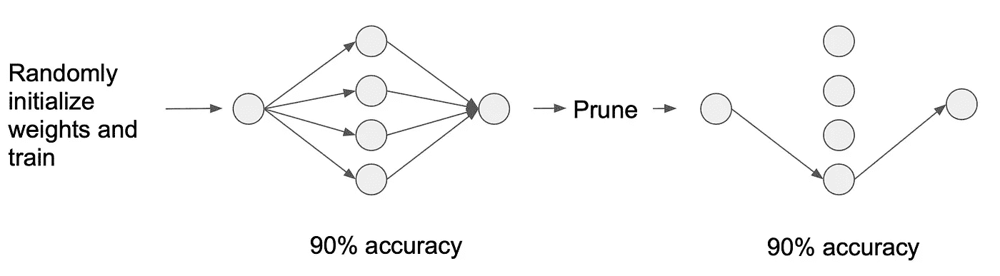
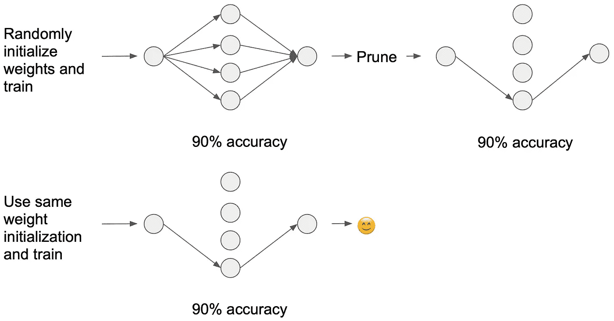

# 打破彩票假说

> 原文：<https://towardsdatascience.com/breaking-down-the-lottery-ticket-hypothesis-ca1c053b3e58?source=collection_archive---------13----------------------->

## 从麻省理工学院 CSAIL 有趣的论文中提炼思想:“彩票假说:寻找稀疏、可训练的神经网络”。

我最近读过的最有趣的论文之一是“彩票假说:寻找稀疏的、可训练的神经网络”([https://arxiv.org/abs/1803.03635](https://arxiv.org/abs/1803.03635))。我已经将内容浓缩成一篇简短的博文，这可能会帮助你快速理解文章中的观点。

# 动机

神经网络的剪枝技术可以将训练网络的参数数量减少 90%以上，而不会影响精度。具有较少参数的网络降低了存储需求，并且可以花费较少的时间来执行推断。

Simplified example of pruning a trained network. Removing a parameter is equivalent to removing a connection between neurons.

听起来不错，给我报名吧！但是训练大型网络可能非常昂贵。如果我们可以训练一个与修剪后的网络具有相同拓扑(形状)的网络，这不是很好吗？不幸的是，用修剪过的网络的拓扑来训练网络产生的网络比原始的未修剪过的网络具有更低的精度。

Simplified example of pruning a trained network (above). Simplified example of training a network with the topology of the pruned network using a new random weight initialization (below)

这篇论文的作者想问**为什么**用修剪过的网络拓扑来训练网络会产生更差的性能。

# 彩票假说

> “一个随机初始化的密集神经网络包含一个子网络，该子网络被初始化，以便在隔离训练时，它可以在最多相同次数的迭代训练后匹配原始网络的测试精度。”

他们发现，通过**保留来自未修剪网络**的原始权重初始化，可以用修剪后的网络拓扑来训练网络，并在相同次数的训练迭代内实现相同或更好的测试精度。

Simplified example of pruning a trained network (above). Simplified example of training a network with the topology of the pruned network using the original weight initialization from(below)

# 彩票类比

好吧，看起来很简单。但是彩票是怎么回事呢？假设你的目标是找到一张中奖彩票。如果你买了一张票，赢得钱的机会很小。但是如果你买了一百万张票，很可能你的一些票会赢得一些钱(虽然这可能不盈利)。

在这个类比中，购买大量门票就像为您的任务设置了一个过度参数化的神经网络。神经网络通常有超过一百万个参数！彩票中奖就相当于训练了一个神经网络，对你的任务有很高的准确率。最后，获胜的标签指的是达到高精度的修剪子网的权重初始化。

# 识别中奖彩票

本文提出了两种剪枝策略，可以找到获胜的票(达到高精度的子网)。

**一次性修剪**

1.  随机初始化神经网络
2.  训练网络
3.  将每个层中具有最低幅度的权重的 p%设置为 0(这是修剪)
4.  将修剪后的网络权重重置为其原始随机初始化

应该注意到，到输出神经元的连接以正常修剪速率的一半被修剪。

**迭代剪枝**

迭代修剪只是迭代地应用一次性修剪的步骤。作者发现迭代修剪比一次性修剪产生更小的修剪子网络。

# 结果

迭代修剪策略被应用于全连接架构、卷积架构和具有剩余连接的卷积架构(ResNet)。作者在 MNIST 和 CIFAR-10 图像分类数据集上研究了迭代剪枝技术。他们的修剪策略也适用于不同的优化器(SGD、momentum、Adam)、dropout、weight decay、batchnorm 和 residual connections。

修剪后的子网络比原来的小 10-20 %,并且在最多相同的迭代次数下达到或超过了原来的测试精度。这些结果支持彩票假说。修剪后的子网络也具有更好的泛化能力，因为训练和测试精度之间的差异更小。

# 讨论

为什么网络会收敛到使用其总参数的一小部分来解决一个任务？“获胜”的初始化已经接近完全训练的值了吗？没有。实际上，在训练过程中，它们比其他参数变化更大！作者推测，获胜的初始化可能落在损失景观中特别适合优化的
区域。他们提出了“彩票猜想”，即随机梯度下降在超参数化网络中寻找并训练一张中奖彩票(子网)。

# 限制

这篇论文展示了有趣的结果，这些结果有助于更好地理解深度神经网络是如何学习的。不幸的是，他们提出的迭代修剪策略没有提供显著的实际好处。

迭代修剪在计算上是昂贵的，因为它涉及每次尝试训练网络 15 次。这使得作者很难研究像 ImageNet 这样的大型数据集。作为未来的工作，作者希望找到更有效的剪枝策略。

通过将参数数量减少 80–90 %,降低了网络的存储需求。权重矩阵仍然具有相同的维数，但是更加稀疏。用于修剪后的子网络的前馈步骤仍然需要以相同的计算复杂度计算矩阵乘法，因此训练和推断并没有明显更有效。作为未来的工作，他们建议基于非数量级的剪枝策略可以找到更小的剪枝子网。

感谢阅读！