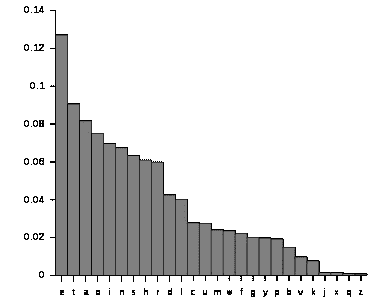
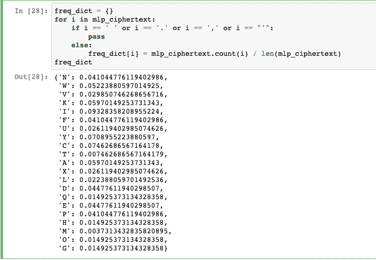

# 打破我的小马:破解密码的频率分析

> 原文：<https://towardsdatascience.com/breaking-my-little-pony-frequency-analysis-for-breaking-ciphers-68facd7e528f?source=collection_archive---------11----------------------->

在第一次成为父母之前，我花了很多时间思考我的生活将要发生的各种变化。我没有预料到的一个变化是我将会用多少代码来说话。你的孩子总是在倾听和学习，所以用不了多久，你和你的另一半就会停止在他们面前发送未加密的信息。就在今天早上，当我和妻子在我们三岁的女儿面前聊天时，我们在某个特定的上下文中将“玩具”称为“分心机制”。

我的女儿还没有足够的理解力来破解我们的小代码(尽管它即将到来)，但它确实让我开始思考密码和代码，于是一个博客诞生了。作为一门新兴的数据科学，我认为您可以使用某种统计分析来破解简单的代码，果然您可以！在这篇博客中，我们将讨论频率分析以及如何破解一个简单的密码。

**密码和代码**

首先，让我们澄清一些术语。大多数人对什么是“密码”和“代码”有一个大致的概念，但是定义一些术语是值得的。

密码和代码都是加密信息的一系列步骤。它们将明文信息转换成只能用一些辅助来源解密的信息。在密码的情况下，它通常是一个密钥，在代码的情况下，它通常是一个密码本。大多数人可以互换使用这两个术语，但还是有区别的。用密码加密的文本通常会与原始文本的字符数相同。代码通常使用一串字符或数字来表示单词或短语。

我上面的例子是一个代码，因为我用一个单词代替了一个短语。如果我们要对“玩具”这个词进行加密，我们可以改为“座位”(t=s，o=e，y=a，s=t)。

**简单替代密码**

我们要看的密码是简单的替代密码。简单的替代密码只是将字母表中的每个明文字母作为字母表中的另一个字母进行加密。这是一对一的替换，所以密文中的一个给定字母总是等同于明文中的同一个字母。这里有一个使用 [PyCipher](https://pycipher.readthedocs.io/en/master/) 库的例子:


密码使用密钥来加密数据。对于简单的替换，我们使用一个密码字母。你可以看到替换是如何工作的。每一个明文‘a’都变成了密文‘w’，每一个‘b’都变成了‘h’，以此类推……所以我们的明文‘密码’就变成了‘xwytdkl’。请注意，按照惯例，当使用简单替换进行加密时，您将返回去掉标点符号和全部大写的密文，原因很明显，您使其更难被破解。

**频率分布**

有很多可能的密码密钥(26！实际上)所以理论上简单的替代密码很难破解。即使抛开现代计算能力，如果你知道原始语言和一点频率分布，手动破译 100 或更多字符的信息实际上是非常可行的。

大多数语言都有一定的特点。一些字母和一些字母序列比其他字母出现得更频繁。在普通的英语文本中(比如说，超过 100 个字符)，' e '通常出现的频率最高，其次是' t '和' a '。字母“x”、“q”和“z”出现得最少。



[https://en.wikipedia.org/wiki/Letter_frequency](https://en.wikipedia.org/wiki/Letter_frequency)

知道了这一点，并且知道给定的密文将总是替换其对应的明文，您就可以开始有根据地猜测哪些密文字母对应于哪些明文字母。

**我的小马驹密码**

为了开始做一些频率分析并说明更多的概念，我从*我的小马:友谊是魔法* wiki 的一篇随机文章中抓取(并稍微修改)了以下文本:

```
NWVKIF UWVYC TWY AFYXAKIL CD QKIWCI UNVCCIKYEP HP EIK QEANLEDDL CDP IWKCE XDFP XDYIP. UNVCCIKYEP'Y AFACAWN LIYAMF, XVHNAYEIL DFNAFI HP UWVYC, KIUIKY CD EIK WY 'XDYIP' WY TINN. EIK QVCAI OWKG, CEKII XAFG WFL QPWF HVCCIKUNAIY, AY YAOANWK CD CEWC DU CEI XDFP YGP YGAOOIK.
```

如上所述，您不太可能得到标点和空格都完好无损的密文，但是我这样做是为了说明一些概念。首先我们可以算出每个密文字母的频率:



正如我们所看到的，看起来“I”、“C”和“Y”是出现频率最高的字母。让我们假设‘I’密码等价于明文中的‘e ’,并进行替换(替换用小写字符表示)。

```
NWVKeF UWVYC TWY AFYXAKeL CD QKIWCe UNVCCeKYEP HP EeK QEANLEDDL CDP eWKCE XDFP XDYeP. UNVCCeKYEP'Y AFACAWN LeYAMF, XVHNAYEeL DFNAFe HP UWVYC, KeUeKY CD EeK WY 'XDYeP' WY TeNN. EeK QVCAe OWKG, CEKee XAFG WFL QPWF HVCCeKUNAeY, AY YAOANWK CD CEWC DU CEe XDFP YGP YGAOOeK.
```

好不了多少，但我们还有一些锦囊妙计。例如，我们知道最常见的两个、三个和四个字母的单词。


[http://www.practicalcryptography.com/ciphers/simple-substitution-cipher/](http://www.practicalcryptography.com/ciphers/simple-substitution-cipher/)

我们这里有几个两个字母的单词要试一下。因为我们知道第二个最频繁出现的密文字符是“C”，让我们试着用“t”来代替它，它是英语中第二个最频繁出现的字符。我们有几个以“C”开头的两个字母的单词，以“t”开头的最常见的两个字母的单词是“to”，所以我们也假设密文“D”等于明文“o”。

```
NWVKeF UWVYt TWY AFYXAKeL to QKeWte UNVtteKYEP HP EeK QEANLEooL toP eWKtE XoFP XoYeP. UNVtteKYEP'Y AFAtAWN LeYAMF, XVHNAYEeL oFNAFe HP UWVYt, KeUeKY to EeK WY 'XoYeP' WY TeNN. EeK QVtAe OWKG, tEKee XAFG WFL QPWF HVtteKUNAeY, AY YAOANWK to tEWt oU tEe XoFP YGP YGAOOeK.
```

现在事情开始明朗了。我们现在正文里有' tEe '和' tEKee '，可以猜测密文' E '是明文' h '，密文' K '是明文' r '。我还没有解决这个问题，但是很明显，由于撇号的作用，Y 是 s。同样，如果“K”是“r”,“E”是“h ”,那么“eWKtE”就变成了“eWrth ”,所以“W”很可能是“a ”:

```
NaVreF UaVst Tas AFYXAreL to Qreate UNVttershP HP her QhANLhooL toP earth XoFP XoseP. UNVttershP's AFAtAaN LesAMF, XVHNAsheL oFNAFe HP UaVst, reUers to her as 'XoseP' as TeNN. her QVtAe OaKG, three XAFG aFL QPaF HVtterUNAes, As sAOANar to that oU the XoFP sGP sGAOOer.
```

等等，等等。最终我们得到了我们的信息:

```
lauren faust was inspired to create fluttershy by her childhood toy earth pony posey. fluttershy's initial design, published online by faust, refers to her as 'posey' as well. her cutie mark, three pink and cyan butterflies, is similar to that of the pony sky skimmer.
```

那怎么样？我不知道小蝶是这样的！

当然，在这种情况下，我们也有标点符号和间距的线索。显然，没有这些线索就很难破译一个文本，但是你仍然可以使用频率分析，你可以开始查看字符的*组*的频率。

一般来说，密码学家会将文本分解成二元模型、三元模型或四元模型(分别为两个、三个和四个字符组)。这些组也有频率分布。四元图“TION”出现得非常频繁，但是“QKPC”从来没有出现过。

为了编程求解，密码学家将从尝试随机密钥来解密文本开始。然后，他们将文本分割成四元组，并乘以每个四元组可能是英语中的四个字符块的概率(或适合度)，然后用稍微改变的键再试一次。因为概率非常小，而且它们可能是在大样本上计算的，所以您可以使用对数变换来防止算术下溢(算术下溢是一种计算结果，其绝对值小于计算机在其 CPU 上的内存中实际可以表示的值)。下面是一个公式示例:


这里有一个简单的换元题自己试试！我把标点符号留在了这里，如果你是手写的话，这样会更快更容易。玩得开心！

```
EIP. YD, CEI QDNDFIN TWY RVYC EIKI WFL EI CDNL OI CD CINN PDV CEWC CEI QDHKW YCKAGIY WC LWTF. NIC OI CINN PDV- EI TWY SIKP QDFLIYQIFLAFM. ISIKPCAOI CEI MIFIKWN AY WTWP EI MDIY WNN IN EIUI YVXKIOD DF OI. CVKL.

YXIWGAFM DU CEI MIFIKWN - HICTIIF PDV WFL OI A CEAFG EI'Y HIIF MICCAFM EAY CEAFM DF TACE DFI DU CEDYI QWXDY UKDO CEI OANACWKP XDNAQI. CEI HAM HKVFICCI TACE CEI CTD NWBP IPIY CEWC WKI NWBP AF DXXDYACI LAKIQCADFY. PDV GFDT CEI DFI. TEIFISIK YEI'Y AF CDTF WNN DU W YVLLIF EI EWY XKIYYAFM HVYAFIYY INYITEIKI CD WCCIFL CD WFL NIWSIY QDNDFIN CVKL AF QEWKMI. YEI WNTWPY HKAFMY OI QACKVY TEIF YEI'Y AF CDTF (NDFM YCDKP) YD A NAGI EIK, HVC A EWSI FD ALIW TEWC CEIP YII AF IWQE DCEIK.

WFPTWPY, MDCCW MD. QDHKW YCKAGIY WC LWTF. EWAN CD CEI MNDKADVY KISDNVCADF WFL NDFM NASI DVK LIWK NIWLIK!
```