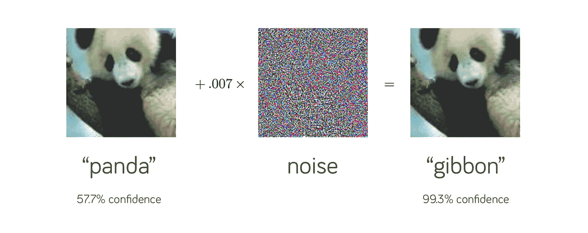
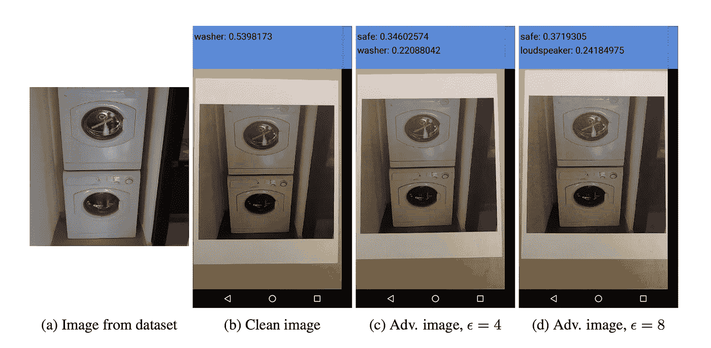
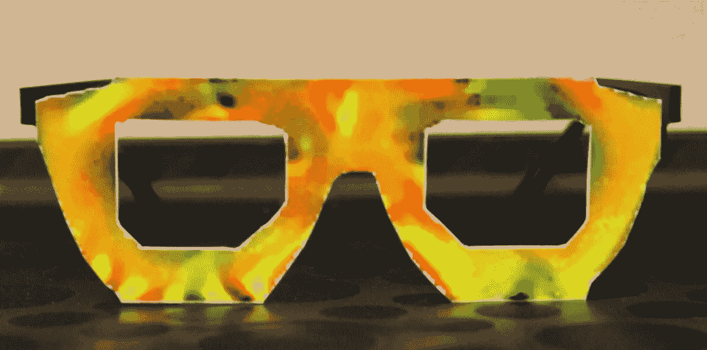
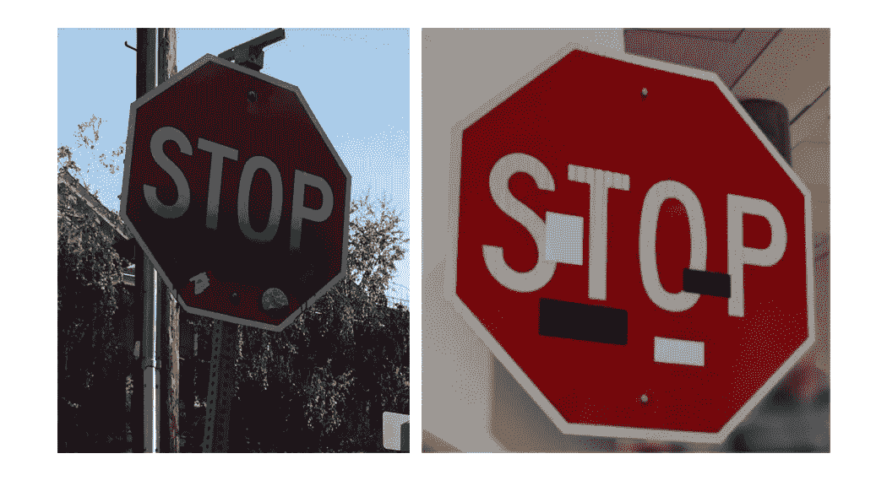
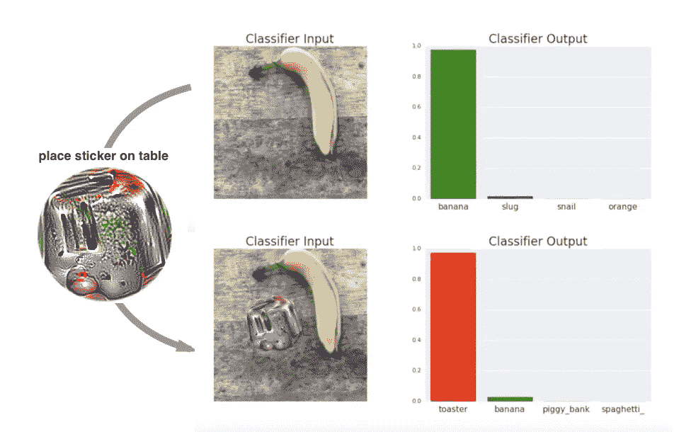
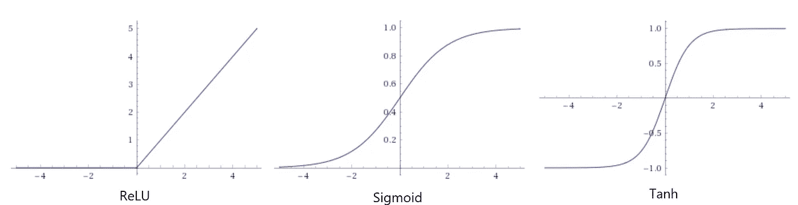

# 用对抗性攻击破坏神经网络

> 原文：<https://towardsdatascience.com/breaking-neural-networks-with-adversarial-attacks-f4290a9a45aa?source=collection_archive---------1----------------------->

## 我们使用的机器学习模型有内在缺陷吗？

正如你们许多人可能知道的那样，深度神经网络是一种高度表达的机器学习网络，已经存在了几十年。2012 年，随着计算能力的提高和工具的改进，一系列名为 *ConvNets* 的机器学习模型开始在视觉识别任务上实现最先进的性能。到目前为止，机器学习算法的工作还不够好，当它不能做正确的事情时，任何人都不会感到惊讶。

2014 年，谷歌和 NYU 的一组研究人员发现，在输入中用一种不可思议但精心构建的轻推来欺骗 ConvNets 太容易了。让我们看一个例子。我们从一个熊猫的图像开始，我们的神经网络以 57.7%的置信度正确识别出它是一只“熊猫”。添加一点精心构建的噪声，同一个神经网络现在认为这是一个有 99.3%置信度的长臂猿图像！很明显，这是一种视错觉——但是对于神经网络来说。你和我可以清楚地分辨出两幅图像看起来都像熊猫——事实上，我们甚至不能分辨出一些噪声被添加到原始图像中以构建右侧的对立示例！

Source: [*Explaining and Harnessing Adversarial Examples*](https://arxiv.org/abs/1412.6572)*, Goodfellow et al, ICLR 2015.*

2017 年，另一个小组证明了这些对立的例子可以推广到现实世界，表明当打印出来时，对立构造的图像将在不同的光照和方向下继续欺骗神经网络:

Source: [Adversarial Examples in the Physical World](https://arxiv.org/pdf/1607.02533.pdf). Kurakin et al, ICLR 2017.

另一项有趣的工作，名为*“犯罪的附属品:对最先进的面部识别技术的真实和秘密的攻击”*表明，人们可以通过构造对抗眼镜来欺骗面部识别软件，从而完全避开面部检测。这种眼镜也可以让你扮演其他人:

Source: [*Accessorize to a Crime: Real and Stealthy Attacks on State-of-the-Art Face Recognition*](https://www.cs.cmu.edu/~sbhagava/papers/face-rec-ccs16.pdf)*. Sharif et al.*

不久之后，另一个研究小组展示了各种构建停车标志的方法，这些方法可以通过在停车标志上放置各种贴纸来欺骗模型。这种干扰被设计成模仿涂鸦，因此“隐藏在人类的精神中”

The left image shows real graffiti on a Stop sign, something that most humans would not think is suspicious. The right image shows a physical perturbation applied to a Stop sign. The systems classify the sign on the right as a Speed Limit: 45 mph sign! Source: [Robust Physical-World Attacks on Deep Learning Visual Classification](https://arxiv.org/pdf/1707.08945.pdf).

*“对抗性补丁”，*NIPS 2017 上发表的一篇论文演示了如何生成一个补丁，可以放置在分类器视野内的任何地方，并使分类器输出一个目标类。在下面的视频中，香蕉被正确地归类为香蕉。贴上印有烤面包机的贴纸并不足以愚弄网络，它仍然继续将其归类为香蕉。然而，通过精心构建的“对抗性补丁”，很容易欺骗网络，使其认为这是一台烤面包机:

Source: Adversarial Patch: [https://arxiv.org/pdf/1712.09665.pdf](https://arxiv.org/pdf/1712.09665.pdf)

引用作者的话，“这次攻击意义重大，因为攻击者在构建攻击时不需要知道他们攻击的是什么图像。在生成一个对抗性补丁后，该补丁可以在互联网上广泛分发，供其他攻击者打印和使用。”

Source: Adversarial Patch: [https://arxiv.org/pdf/1712.09665.pdf](https://arxiv.org/pdf/1712.09665.pdf)

这些例子告诉我们，当我们的神经网络被对手以这种方式明确攻击时，它仍然非常脆弱。让我们潜得更深！

# 这些攻击有什么了不起的？

首先，正如我们在上面看到的，在对立例子的不正确分类中很容易获得**高置信度**——回想一下，在我们看到的第一个“熊猫”例子中，网络对看起来像熊猫的实际图像的确定度(57.7%)低于我们右边看起来像长臂猿的对立例子(99.3%)。另一个有趣的点是**如何察觉到我们需要添加的小噪音**来愚弄系统——毕竟，很明显，添加的噪音不足以愚弄我们人类。

It’s easy to attain **high confidence** in the incorrect classification of an adversarial example. Source: [*Explaining and Harnessing Adversarial Examples*](https://arxiv.org/abs/1412.6572)*, Goodfellow et al, ICLR 2015.*

第二，对立的例子不太依赖于用于该任务的特定深度神经网络——为一个网络训练的对立例子似乎也会混淆另一个网络。换句话说，多个分类器把同一个(错误的)类别分配给一个对立的例子。这种“**可转移性**”使攻击者能够在所谓的“黑盒攻击”中欺骗系统，在这种攻击中，他们无法访问模型的架构、参数甚至是用于训练网络的训练数据。

# 我们有好的防御吗？

不完全是。让我们快速看一下到目前为止已经提出的两类防御:

## 对抗训练

防御这些攻击的最简单和最暴力的方法之一是假装是攻击者，生成许多针对您自己网络的对抗性示例，然后显式地训练模型不被它们愚弄。这提高了模型的通用性，但还不能提供有意义的健壮性级别——事实上，它最终只是一个打地鼠游戏，攻击者和防御者只是试图胜过对方。

## 防御性蒸馏

在防御蒸馏中，我们“训练第二个模型，其表面在攻击者通常试图利用的方向上是平滑的，使他们难以发现导致错误分类的敌对输入调整”[6]。其工作的原因是，与第一个模型不同，第二个模型是在主模型的“软”概率输出上训练的，而不是来自真实训练数据的“硬”(0/1)真实标签。这种技术被证明在防御敌对攻击的初始变体方面取得了一些成功，但被最近的攻击击败，如 Carlini-Wagner 攻击，这是当前评估神经网络对抗敌对攻击的鲁棒性的基准。

## 为什么捍卫神经网络如此困难？

让我们试着对这里发生的事情有一个直觉。大多数时候，机器学习模型工作得很好，但只对它们可能遇到的所有可能输入中的很小一部分起作用。在高维空间中，每个单独输入像素中非常小的扰动就足以引起神经网络中点积的巨大变化。因此，很容易将输入图像推到我们的网络从未见过的高维空间中的一点。这是要记住的关键点:高维空间非常稀疏，以至于我们的大多数训练数据都集中在一个非常小的区域，称为*流形*。虽然我们的神经网络根据定义是非线性的，但我们用来训练它们的最常见的激活函数，整流器线性单元，或 ReLu，对于大于 0 的输入是线性的。

The Rectifier Linear Unit, or the ReLu compared to the Sigmoid and the Tanh activation functions.

ReLu 因其易于训练而成为首选激活功能。与 sigmoid 或 tanh 激活函数相比，它们在高激活时简单地饱和到上限值，从而使梯度“停留”在非常接近 0 的位置，ReLu 在 0 右侧的任何地方都有非零梯度，使其更加稳定，训练速度更快。但是，这也使得将 ReLu 激活函数推到任意高的值成为可能。

看看这个**在可训练性和对抗攻击的鲁棒性之间的权衡**，我们可以得出结论，我们一直使用的神经网络模型存在固有缺陷。优化的简易性是以模型容易被误导为代价的。

# 下一步是什么？

这里真正的问题是，我们的机器学习模型在训练分布之外表现出不可预测和过度自信的行为。对立的例子只是这个更广泛问题的一个子集。我们希望我们的模型在他们从未见过的地区运行时，能够表现出适当的低置信度。我们希望它们在生产中使用时“优雅地失败”。

根据该领域的先驱之一 Ian Goodfellow 的说法，“许多最重要的问题仍然悬而未决，无论是在理论上还是在应用上。我们还不知道防御敌对的例子在理论上是没有希望的努力，还是一个最优策略会给防御者一个优势。在应用方面，还没有人设计出真正强大的防御算法，可以抵御各种各样的对抗性示例攻击算法。”

如果没有别的，对立例子的话题让我们了解了大多数研究人员一段时间以来一直在说的话——尽管有了突破，但我们仍处于机器学习的初级阶段，在这方面还有很长的路要走。机器学习只是另一种工具，容易受到敌对攻击，这可能会在一个我们通过自动驾驶汽车和其他自动化将人类生命托付给它们的世界中产生巨大影响。

## 参考

这里是上面提到的论文和文章的链接。我也强烈推荐看看 Ian Goodfellow 关于这个话题的博客。

1.  [解释和利用对立的例子](https://arxiv.org/abs/1412.6572)，古德菲勒等人，ICLR 2015 年。
2.  [物理世界中的对立例子](https://arxiv.org/pdf/1607.02533.pdf)。库拉金等人，ICLR，2017 年。
3.  犯罪的附属品:对最先进的人脸识别技术的真实而隐秘的攻击。谢里夫等人。
4.  [对深度学习视觉分类的鲁棒物理世界攻击](https://arxiv.org/pdf/1707.08945.pdf)。艾克霍尔特等人。
5.  [对抗性补丁](https://arxiv.org/pdf/1712.09665.pdf)。布朗等人。
6.  [用对抗性例子攻击机器学习](https://openai.com/blog/adversarial-example-research/)。打开 AI 博客。