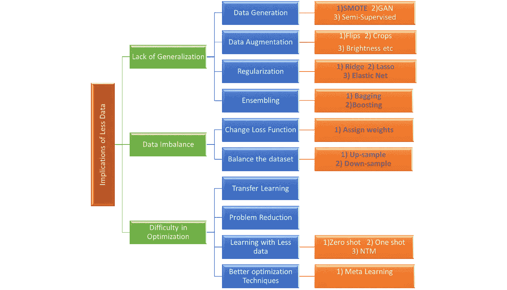
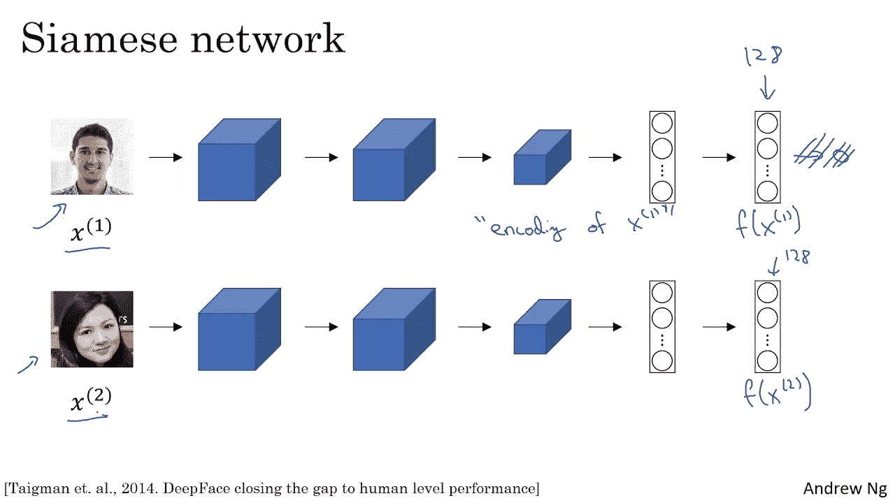
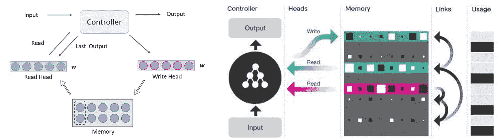
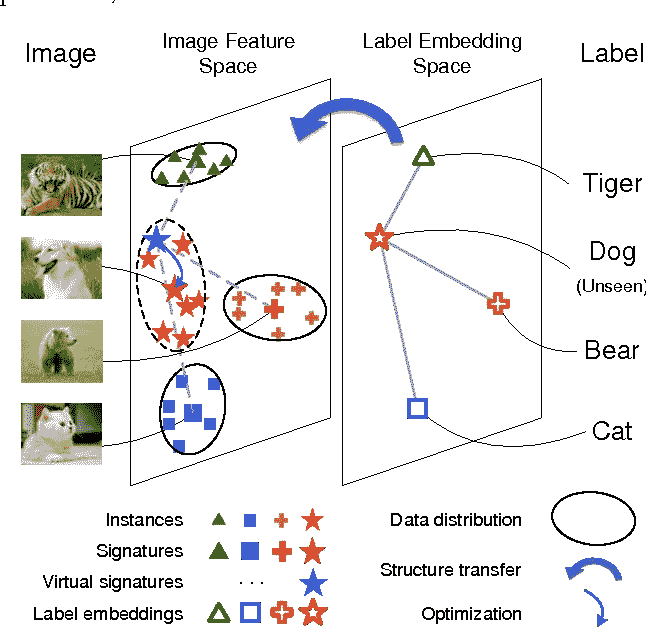
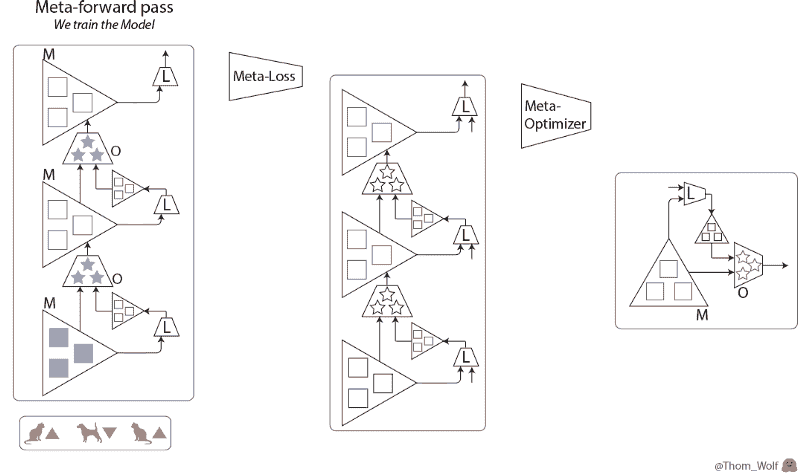
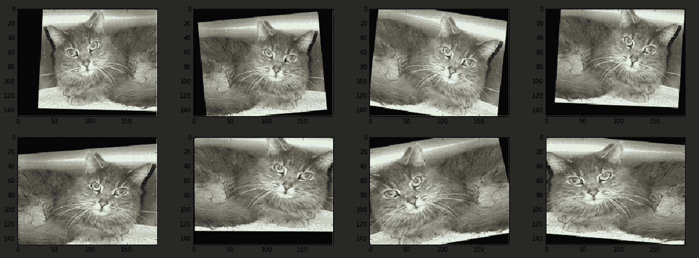
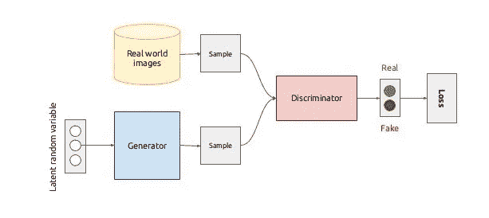

# 打破机器学习中小数据集的魔咒:第 2 部分

> 原文：<https://towardsdatascience.com/breaking-the-curse-of-small-data-sets-in-machine-learning-part-2-894aa45277f4?source=collection_archive---------2----------------------->

## [现实世界中的 DS](https://medium.com/towards-data-science/data-science-in-the-real-world/home)

## 数据大小如何影响深度学习模型，以及如何处理小数据集？

*这是打破机器学习中小数据集的诅咒系列的第二部分。在* [*第一部分*](/breaking-the-curse-of-small-datasets-in-machine-learning-part-1-36f28b0c044d) *中，我已经讨论了数据集的大小如何影响传统的机器学习算法，以及一些缓解这些问题的方法。在第 2 部分，我将讨论深度学习模型性能如何依赖于数据大小，以及如何使用较小的数据集来获得类似的性能。*

*PS:感谢* [***瑞秋托马斯***](https://www.linkedin.com/in/rachel-thomas-942a7923/) *的反馈*

**Source:** Movie Scene from Pirates of the Caribbean[[source](https://www.google.com/url?sa=i&source=images&cd=&cad=rja&uact=8&ved=2ahUKEwiWkKHplYrhAhWCqp4KHf0tBZ4QjRx6BAgBEAU&url=%2Furl%3Fsa%3Di%26source%3Dimages%26cd%3D%26ved%3D%26url%3Dhttp%253A%252F%252F7-themes.com%252F%26psig%3DAOvVaw2_Y2fkfNRd3tr8uhTsxzPo%26ust%3D1552946227084894&psig=AOvVaw2_Y2fkfNRd3tr8uhTsxzPo&ust=1552946227084894)]

# 概述

以下是我将在本文中简要讨论的话题:

1.  **影响神经网络训练的关键因素**
2.  **克服优化困难的方法**
3.  **解决缺乏普遍性的问题**
4.  **结论**

# **1。训练神经网络的关键因素**

神经网络是深度学习模型的基本构建模块。然而，深度神经网络有数百万个参数要学习，这意味着我们需要多次迭代才能找到最佳值。如果我们有少量数据，运行大量迭代会导致过度拟合。大型数据集有助于我们避免过度拟合和更好地概括，因为它可以更有效地捕捉固有的数据分布。

以下是影响网络优化过程的几个重要因素:

1.  **优化算法:**梯度下降是用于神经网络的最流行的优化算法。算法性能直接取决于训练数据的大小。我们可以尝试用较小的训练集*(随机梯度下降是我们用单个数据点进行更新时的极端情况)*来更新权重，这使得训练过程快速，但是更新具有较大的波动。用整个数据集进行训练使得训练在计算上昂贵且缓慢。 [Adam](/adam-latest-trends-in-deep-learning-optimization-6be9a291375c) 、 [RMSprop](/understanding-rmsprop-faster-neural-network-learning-62e116fcf29a) 、 [Adagrad](https://medium.com/konvergen/an-introduction-to-adagrad-f130ae871827) 、[随机梯度下降](http://wiki.fast.ai/index.php/Stochastic_Gradient_Descent_(SGD))是梯度下降的几种变体，其优化了梯度更新过程并提高了模型性能。查看这个[博客](/types-of-optimization-algorithms-used-in-neural-networks-and-ways-to-optimize-gradient-95ae5d39529f)详细了解梯度下降的各种版本。除了梯度下降之外，还有其他不同的优化技术，如进化算法(EA)和粒子群优化算法(PSO)可能有巨大的潜力。
2.  **损失函数:**损失函数在优化过程中也起着至关重要的作用，精心选择的损失函数有助于改进训练过程。[铰链损耗](http://slazebni.cs.illinois.edu/spring17/lec09_similarity.pdf)就是这样一个例子，它使得用小数据集进行训练成为可能。
3.  **参数初始化**:参数的初始状态对优化过程影响很大。选择不当的初始值会导致发散和陷入鞍点或局部最小值的问题。此外，这增加了训练过程对训练数据的要求。
4.  **数据量**:数据量是训练神经网络非常关键的一部分。更大的数据集可以帮助我们更好地学习模型参数，改进优化过程并赋予泛化能力。

# **如何用小数据集训练**

Fig 1: Basic implications of fewer data and possible approaches and techniques to solve it

我们已经在[的上一篇文章](/breaking-the-curse-of-small-datasets-in-machine-learning-part-1-36f28b0c044d)中讨论了一些上述技术。我们将在这一部分讨论与深度学习更相关的剩余技术。

# 2.**克服优化困难的方法**

## **1。转移学习:**

迁移学习是指将从一个任务学到的知识运用到另一个任务中，而不需要从头开始学习。它直接处理用于训练神经网络的智能参数初始化点。这项技术已广泛用于计算机视觉任务，并在深度学习在行业中的广泛应用中发挥了重要作用。现在公认的是，基于 [Imagenet](http://www.image-net.org/) 数据训练的 ResNet 等模型的初始层学习识别图像中的边缘和拐角，并且后续层建立在这些特征之上以学习更复杂的结构。最后一层学习将图像分类到 1000 个类别中的一个。对于任何数据看起来类似于 [Imagenet](http://www.image-net.org/) 的新问题，我们可以从预训练的 Imagenet 模型开始，更改最终的层，并根据我们的数据集对其进行微调。由于较低层的特征仍然保持相关，该过程使得优化过程更快，并且减少了训练新模型所需的数据量。

感谢 [Fast.ai](https://docs.fast.ai/) 库，我们可以使用迁移学习建立图像分类模型，只需几行代码和几百张训练图像，仍然可以获得最先进的结果。

最近，同样的方法也成功地应用于自然语言处理。[乌尔姆菲特](http://nlp.fast.ai/classification/2018/05/15/introducting-ulmfit.html)、[伯特](https://arxiv.org/abs/1810.04805)、 [AWD-LSTM](https://arxiv.org/abs/1708.02182) 、 [GPT2](https://openai.com/blog/better-language-models/) 就是几个可以用于自然语言处理中迁移学习的模型。这些模型被称为语言模型，因为它们试图学习基本的语言结构，并基于之前看到的/上下文单词来预测句子中的下一个单词。这种转移学习的想法听起来非常类似于计算机视觉，但只是在最近几年才得到尝试和完善。查看这个[牛逼的](http://ruder.io/tag/language-models/)博客，更好地理解语言模型。

## **2。问题简化:**

问题减少方法是指将新数据或未知问题修改为已知问题，以便可以使用现有技术轻松解决。假设我们有许多语音剪辑，我们希望根据声音来源将它们分成不同的类别。深度学习的最新进展表明，LSTM 或 GRU 等序列模型确实擅长此类任务。然而，小数据集可能是一个交易破坏者，并且为这种用例找到迁移学习的好模型也是非常困难的。我最近参加了 Fast.ai v3 课程，发现了一个解决这类问题的聪明方法。我们可以使用各种可用的库(如 [LibROSA](https://librosa.github.io/librosa/) )将语音剪辑转换成图像，并将其简化为图像分类问题。现在，我们可以将合适的计算机视觉架构与迁移学习结合使用，令人惊讶的是，这种方法即使在非常小的数据集上也能提供类似的性能。请查看这个[博客](https://medium.com/@etown/great-results-on-audio-classification-with-fastai-library-ccaf906c5f52)以获得更好的理解和代码。

## 3.用更少的数据学习

**a)一次学习:**人类有能力学习甚至一个单一的例子，仍然能够以非常高的精度区分新的物体。另一方面，深度神经网络需要海量的标注数据进行训练和泛化。这是一个很大的缺点，一次性学习是一种即使使用小数据集来训练神经网络的尝试。有两种方法可以实现这一点。我们可以修改我们的损失函数，使其能够识别微小的差异，并学习更好的数据表示。暹罗网络就是这样一种通常用于图像验证的方法。

Fig 2: A basic representation of Siamese network[[source](https://www.youtube.com/watch?v=6jfw8MuKwpI)]

**b)暹罗网络:**给定一组图像，暹罗网络试图找出两个给定图像有多相似。该网络具有两个相同的子网络，具有相同的参数和权重。子网由卷积块组成，并且具有完全连接的层，并且向末端提取特征向量(大小为 128)。需要比较的图像集通过网络提取特征向量，计算特征向量之间的距离。模型性能取决于训练图像对(图像对越接近，性能越好),并且模型被优化，使得我们对于相似的图像获得较低的损失，而对于不同的图像获得较高的损失。Siamese network 是一个很好的例子，说明我们如何修改损失函数，并使用更少但高质量的训练数据来训练深度学习模型。查看下面的[视频](https://www.youtube.com/watch?v=6jfw8MuKwpI)获得详细解释。

一次性学习的另一种方法是为模型创建一个类似人脑的记忆。这可能是谷歌 Deepmind 为一次性学习提出的神经图灵模型背后的灵感来源。

**c)记忆增强神经网络:**神经图灵机是记忆增强神经网络的一部分，它试图为神经网络创建一个外部记忆，这有助于短期学习。NTM 基本上由一个称为控制器的神经网络和一个称为记忆库的 2D 矩阵组成。在每个时间步，神经网络从外界接收一些输入，并向外界发送一些输出。然而，网络也具有从存储器位置读取的能力和向存储器位置写入的能力。请注意，如果我们使用索引提取内存，反向传播将不起作用。因此，控制器使用模糊操作来读取和写入，即，它在读取和写入时为每个位置分配不同的权重。控制器对存储器位置产生权重，这允许它以可区分的方式指定存储器位置。NTM 在自然语言处理任务中表现出了巨大的潜力，可以超越 LSTM，在各种任务中学习得更好。查看这个伟大的博客，深入了解 [NTM](http://rylanschaeffer.github.io/content/research/neural_turing_machine/main.html) 。

Fig 3: A basic representation of NTM[[source](https://zhuanlan.zhihu.com/p/25688171), [source](https://www.i-programmer.info/images/stories/News/2016/Oct/A/dncblock.jpg)]

**d)零投学习:**零投学习是指解决不属于训练数据的任务的方法。这确实可以帮助我们处理在培训中没有看到的类，并减少数据需求。有各种各样的方法来制定零短学习的任务，我将讨论一种这样的方法。在这种方法中，我们试图预测给定图像的语义表示，即给定一幅图像，我们试图预测图像类的 [word2vec](https://papers.nips.cc/paper/5021-distributed-representations-of-words-and-phrases-and-their-compositionality.pdf) 表示。所以简单来说，我们可以认为这是一个回归问题，深度神经网络试图通过处理其图像来预测该类的向量表示。我们可以使用标准的神经架构，如 [VGG16](https://arxiv.org/abs/1409.1556) 或 [ResNet](https://arxiv.org/abs/1512.03385) ，并修改最后几层以输出一个单词向量。这种方法有助于我们找到看不见的图像的词向量，我们可以使用它通过最近邻搜索来找到图像类别。代替回归，我们还可以将最后一层作为图像特征和词向量的点积，并找到相似性，这有助于我们学习视觉语义嵌入模型。阅读[设计文件](https://static.googleusercontent.com/media/research.google.com/en//pubs/archive/41473.pdf)了解更多详情。另外，看看这个[博客](https://medium.com/@cetinsamet/zero-shot-learning-53080995d45f)来看看零距离学习的实践。

Fig 4: Learning Label Embedding from the image features[[Souce](https://www.semanticscholar.org/paper/Zero-Shot-Learning-Posed-as-a-Missing-Data-Problem-Zhao-Wu/18a7ff041c4c716fa212632a3a165d45ecbdccb9)]

## 4.更好的优化技术

**元学习(学会学习)**:元学习处理从给定数据中寻找学习的最佳方式，即学习模型的各种优化设置和超参数。请注意，实现元学习有多种方法，让我们讨论一种这样的方法。元学习框架通常由一个网络组成，该网络有两个模型:

A)称为**优化的神经网络或学习器**，其被视为低级网络并用于预测。

b)我们有另一个神经网络，称为**优化器或元学习器或高级模型**，它更新低级网络的权重。

这导致了双向嵌套训练过程。我们采取了低级网络的多个步骤，形成了元学习者的单个步骤。我们还在低级网络的这些步骤结束时计算元损失，并相应地更新元学习器的权重。这个过程有助于我们找出最佳的训练参数，使学习过程更加有效。关注这个牛逼的[博客](https://medium.com/huggingface/from-zero-to-research-an-introduction-to-meta-learning-8e16e677f78a)详细了解和实现。

Fig 5: Meta-learning in action[[Souce](https://medium.com/huggingface/from-zero-to-research-an-introduction-to-meta-learning-8e16e677f78a)]

# **3。解决缺乏普遍性的问题**

## **1。数据扩充:**

在处理小数据集而不过度拟合时，数据扩充可以是一种有效的工具。这也是一个很好的技术，使我们的模型不变的大小，平移，视点，照明等变化。我们可以通过以下几种方式扩充我们的数据来实现这一点:

1.  水平或垂直翻转图像
2.  裁剪和/或缩放图像
3.  更改图像的亮度/清晰度/对比度
4.  将图像旋转一定角度

Fig 6: Various data augmentation techniques to create more data[[source](http://wiki.fast.ai/index.php/Lesson_3_Notes)]

Fast.ai 有一些最好的数据扩充转换函数，这使得数据扩充任务非常容易，只需要几行代码。查看这个令人敬畏的[文档](https://docs.fast.ai/vision.transform.html)，了解如何使用 [Fast.ai](https://docs.fast.ai/) 实现数据增强。

## 2.数据生成:

**a)半监督学习:**很多时候，我们有大量可用的数据，但只有其中的一部分被标记。大型语料库可以是任何公开可用的数据集或专有数据。在这种情况下，[半监督学习](https://en.wikipedia.org/wiki/Semi-supervised_learning)可以很好地解决标记数据少的问题。一种这样的方法是建立一个模型，该模型学习标记数据中的模式，并试图预测被称为伪标记的未标记数据的类别。一旦我们有了这些伪标签，我们就可以使用带标签和伪标签的数据来为我们的原始任务训练模型。我们可以使用各种监督或非监督模型来生成伪标签，并可以设置预测概率的阈值来选择合适的伪标签数据进行训练。我们还可以探索[主动学习](http://active-learning.net/)，其中模型指定哪些数据点对训练最有用，我们可以只获得一小部分数据，以便模型可以有效地学习。[合作教学](https://papers.nips.cc/paper/8072-co-teaching-robust-training-of-deep-neural-networks-with-extremely-noisy-labels.pdf)和[合作学习](https://www.cs.cmu.edu/~avrim/Papers/cotrain.pdf)也是在这种情况下有所帮助的类似方法。

**b)甘:**生成对抗网络是一种生成模型，能够生成看起来非常接近真实数据的新数据。GAN 有两个组件，称为生成器和鉴别器，它们在我们训练模型时相互作用。生成器尝试生成假数据点，鉴别器尝试识别生成的数据是真的还是假的。假设我们想要创造新的狗的形象。生成器创建假狗照片，这些照片与真狗照片一起提供给鉴别器。鉴别器的目的是正确地识别真实和伪造的图像，而发生器的目的是产生鉴别器不能辨别为伪造的图像。在模型的适当训练之后，生成器学习生成看起来像真实的狗图像的图像，并且可以用于创建新的数据集。

Fig 7: A typical representation of GAN[[source](https://sigmoidal.io/beginners-review-of-gan-architectures/)]

我们还可以使用 LSTM 的生成模型来生成文本文档或声音，这些可以用作训练数据。查看这个[博客](https://medium.com/ai-society/gans-from-scratch-1-a-deep-introduction-with-code-in-pytorch-and-tensorflow-cb03cdcdba0f)获得详细解释。

# **结论:**

在这一部分中，我们讨论了影响深度神经网络训练的各种因素，以及一些可以帮助我们用小数据集进行训练的技术。在我们的大多数用例中，我们通常没有非常大的数据集，这种技术为我们训练模型并获得令人满意的性能开辟了新的途径。在这个博客系列中，我试图列出各种常用的技术，而训练将小数据。然而，这个列表并不详尽，只能作为进一步探索的起点。请查看链接和参考资料，以获得对上面讨论的一些技术的详细理解和实现。

**关于我:**研究生，旧金山大学数据科学硕士；Trulia 从事计算机视觉的实习生&半监督学习；3 年以上使用数据科学和机器学习解决复杂业务问题的经验；有兴趣与跨职能部门合作，从数据中获得见解，并应用机器学习知识来解决复杂的数据科学问题。 [**LinkedIn**](https://www.linkedin.com/in/jyoti-prakash-maheswari/) **，** [**作品集**](https://jyotipmahes.github.io/) **，**[**GitHub**](https://github.com/jyotipmahes)**，** [**往期帖子**](https://medium.com/@jyotip)

## 参考

1.  [关于语言模型的帖子，从经典方法到最近的预训练语言模型](http://ruder.io/tag/language-models/)
2.  [利用 fastai 库在音频分类方面取得巨大成果](https://medium.com/@etown/great-results-on-audio-classification-with-fastai-library-ccaf906c5f52)
3.  [神经网络中使用的优化算法类型和优化梯度下降的方法](/types-of-optimization-algorithms-used-in-neural-networks-and-ways-to-optimize-gradient-95ae5d39529f)
4.  [甘斯从零开始 1:深度介绍。PyTorch 和 TensorFlow 中的代码](https://medium.com/ai-society/gans-from-scratch-1-a-deep-introduction-with-code-in-pytorch-and-tensorflow-cb03cdcdba0f)
5.  [深度学习专业化](https://www.coursera.org/specializations/deep-learning)
6.  [神经图灵机的解释](http://rylanschaeffer.github.io/content/research/neural_turing_machine/main.html)
7.  [设计:深度视觉语义嵌入模型](https://static.googleusercontent.com/media/research.google.com/en//pubs/archive/41473.pdf)
8.  [零距离学习](https://medium.com/@cetinsamet/zero-shot-learning-53080995d45f)
9.  [从零到研究——元学习导论](https://medium.com/huggingface/from-zero-to-research-an-introduction-to-meta-learning-8e16e677f78a)
10.  [Fast.ai 文档](https://docs.fast.ai/)