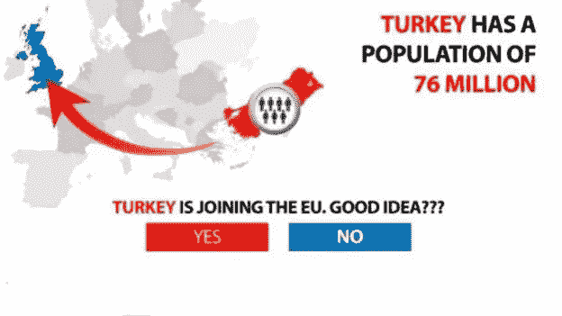
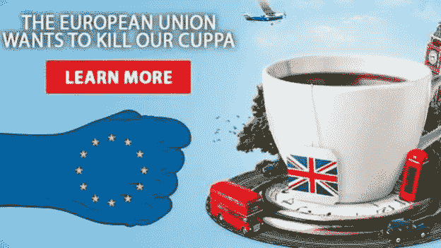
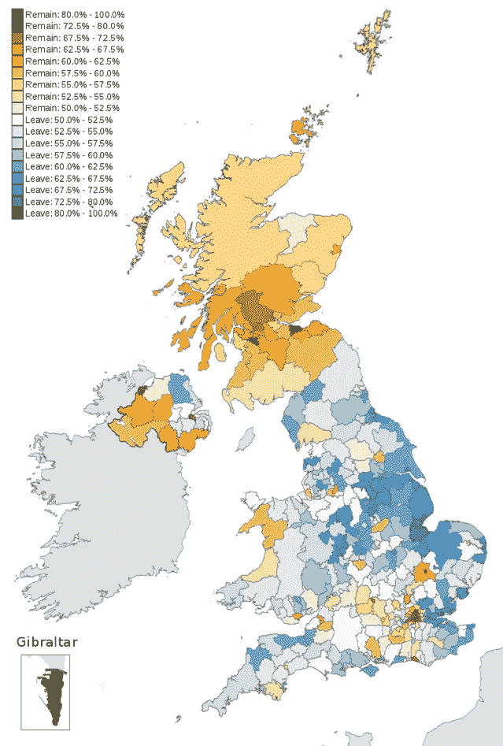

# 英国脱欧:不文明战争向我们展示了欧盟公投是如何用数据科学赢得的

> 原文：<https://towardsdatascience.com/brexit-the-uncivil-war-showed-us-how-the-eu-referendum-was-won-with-data-science-3d727ee03fc0?source=collection_archive---------8----------------------->

在第四频道/ HBO 的《英国退出欧盟:不文明的战争》上周上映后，有一件事没有得到应有的讨论，那就是数据科学的广泛使用是脱欧运动战胜所有困难的主要原因。在本文中，我将讨论数据科学如何改变政治格局。

2016 年欧盟公投时的传统民调几乎一致显示，留欧最有可能获胜。即使是像奈杰尔·法拉奇这样的脱欧支持者也在装腔作势地表示，如果失败(以及为了另一次公投),他们将继续战斗，直到结果出来，因为结果会很接近。当它到来时，所有人都感到震惊，包括政治家和政治评论家。

# **传统民调如何出错**

作为“保持自我”的坚定支持者，我记得自己在法国南部的父母家中看到选举结果，一直看到深夜，大约凌晨 3 点钟，我面无血色地上床睡觉。一觉醒来，我最担心的事情被证实了，我们将离开欧盟。我的伴侣听到这个消息后哭了，她出生在德国，但却是英国公民，她去了英国唯一的欧盟学校之一。她觉得自己的身份被剥夺了。

第二天，政治后果是巨大的，这是我们今天仍在处理的事情。结果出来后，人们广泛讨论的是[民调怎么全错了](https://www.theguardian.com/politics/2016/jun/24/how-eu-referendum-pollsters-wrong-opinion-predict-close)，这是近年来反复发生的事情，5 个月后唐纳德·川普当选白宫时又发生了一次。这再次震惊了每一位严肃的政治评论家，据迈克尔·沃尔夫称，甚至唐纳德·特朗普本人也感到震惊。

甚至 2017 年英国大选的结果也出乎意料，那次选举产生了一个无多数派议会。此后不久，我写了[传统民意调查是如何消亡的](https://www.logikk.com/articles/traditional-polling-models-time-for-data-science/)，强调唯一正确预测无多数议会结果的民意调查是[一项实验性的 YouGov 民意调查，它使用了更现代的数据科学技术](https://www.newscientist.com/article/2134144-how-yougovs-experimental-poll-correctly-called-the-uk-election/)。

简而言之，传统的民意调查定期询问统计相关数量的人(大约 2000 人)对各种问题的看法。这一选择代表了选民中不同的人口统计数据，例如年龄、性别和收入。然后，民意测验专家通过这些人口统计数据来衡量全国范围内的意见波动。

YouGov 的实验性民意调查使用了更现代的技术，他们进行了更大规模的采访样本(约 50，000 人)，而不太关心公平的人口分布。然后，他们使用多层回归和后分层来识别人口中的选民群。本质上是将选民划分为更细的人口统计数据，并在此基础上对波动进行加权。

虽然这本身是一个重要的话题，但更重要的问题不是传统的投票模型如何出错，而是为什么出错。

# **什么英国退欧:不文明战争向我们展示了数据科学在欧盟公投中的应用**

上周，第四频道播出了他们谈论已久的英国退欧:不文明的战争。对于那些还没有看过这部电影的人来说，这是一部长篇剧，基于对事件关键人物的广泛采访，从英国退出欧盟公投宣布到结果。

这部剧由詹姆斯·格拉汉姆编剧，讲述了本尼迪克特·康伯巴奇(Benedict Cumberbatch)出色地扮演了备受争议的政治战略家多米尼克·卡明斯(Dominic Cummings)，以及他是如何策划脱欧运动的。

有趣的是，它把他描绘成一个纯粹专注于赢得公投的人，而不是结果会是什么样子，以及他是否认为这是正确的。

他的政治目标似乎是，他不同意英国政治阶层管理英国的方式，并想破坏它。其他人可能称之为打倒当权派，或者在美国，抽干沼泽。他认为英国退出欧盟全民公决是实现这一目标的手段。

如果所有的报道都是准确的，那么《英国退出:不文明的战争》应该是脱欧运动如何赢得欧盟公投的不带偏见的写照。自从《不文明的战争》上映以来，大多数对《离开》的批评似乎都集中在两件事上；这出戏掩盖了 T2 的脱欧运动是如何违反选举法的。

以及竞选活动[如何依靠种族主义和反移民情绪](https://www.theguardian.com/commentisfree/2019/jan/08/vote-leave-racism-brexit-uncivil-war-channel-4)获胜。

没有更广泛讨论的是数据科学的使用如何引领整个运动，以及是什么让 Leave 比 remove 运动更具优势，并且很可能赢得了这场运动。更重要的是，这对政治的未来意味着什么。

多米尼克·卡明斯向所有批评者指出的是，他没有决定信息，而是让数据决定。这就是他们如何抓住对选民打击最大的核心信息；土耳其即将加入欧盟，我们给欧盟的 3 . 5 亿英镑应该用于资金不足的国民保健服务。这两者都没有被发现或证明是准确的。

在《英国脱欧:不文明的战争》中，我们看到多米尼克会见了扎克·马辛汉姆，他是加拿大政治咨询和技术公司 AggregateIQ 的创始人。据推测，脱欧运动在 AggregateIQ 上花费了 350 万英镑，占其 700 万英镑限额的 50%，其中花费了 7449079 英镑。

那是他们津贴的很大一部分，所以他们一定在这家公司有很多存款。此外，英国退欧:不文明的战争邪恶地描绘了多米尼克与扎克的会面，他说他们可以利用“另一方不知道存在的 300 万额外选民”。然后多米尼克说他要“黑掉系统[选民]”给一些目瞪口呆的保守派政客。

在《英国退出欧盟不文明战争》中，它向我们展示了 Dominic 如何让 AggregateIQ 的一组数据科学家被关在一个阴暗的侧室中，作为一个独立于脱欧运动其余部分的项目。

人们看到他们做的第一件事是发起一场运动，了解不同选民群体对欧盟不同问题的看法。他们通过给人们机会赢得一个集合赌注来做到这一点，这在统计上几乎不可能赢得[(50 亿分之一的机会)](https://www.bbc.co.uk/news/uk-politics-44966969)。然后，他们利用这项研究的发现，为选民中的不同部分创建行为微目标信息。

结果发现，在公投期间，他们提供了超过 10 亿条脸书广告，其中包含各种支持脱欧的信息。例如，不那么“种族主义”的选民可能收到了鲍里斯·约翰逊的照片，上面写着，“我支持移民，但最重要的是，我支持有控制的移民”。而其他人收到诸如“土耳其有 7600 万人口。土耳其正在加入欧盟。好主意？?"。

Older people were targetted with adverts on how the money we send to the UK could be spent on the NHS

People who were animal lovers would have received adverts like these

And supposed tea lovers or patriots would have received messages like these

如果他们点击了相关的广告，他们会收到一大群围绕同一主题的连续广告，强化了这一观点。[卡明斯之前曾谈到过](https://www.youtube.com/watch?v=CDbRxH9Kiy4&t=1087s)在欧盟公投前的最后 10 天，他们如何扣住大部分预算，并将其投入到这类广告中。他说，在此期间，大约有 700 万人成为目标。

在英国退出欧盟这场不文明的战争中，脱欧运动团队甚至质问为什么广告没有在电视和新闻周期中被提及，他们认为对方根本不知道发生了什么。

2016 年 6 月 23 日，17，410，742 人投票脱离欧盟，16，141，241 人投票留在欧盟。

# **为什么数据科学正在改变政治格局？**

当然，任何稍微关注西方新闻的人都可能听说过剑桥分析公司丑闻。剑桥分析公司(Cambridge Analytica)由罗伯特·默瑟(亿万富翁人工智能专家)和唐纳德·川普的财政支持者兼竞选首席执行官史蒂夫·班农(另类右翼媒体斯文加利)创建和运营。剑桥分析[揭发者 Christopher Wyle](https://edition.cnn.com/2018/03/30/politics/bannon-cambridge-analytica/index.html) 强调了 [AggregateIQ 与剑桥分析](https://www.theguardian.com/uk-news/2018/mar/24/aggregateiq-data-firm-link-raises-leave-group-questions)的密切联系。

这一丑闻向我们表明，通过滥用脸书的用户数据，他们可以对整个选民进行心理分析。使用一个名为 myPersonality 的病毒式个性应用程序，他们能够将个性类型与人们在脸书上的喜好进行交叉参考[，以高度准确地描述人们的特征](https://www.verdict.co.uk/brexit-data-misuse-ico-report/)。

收集的数据被用于描述选民的算法，成为欧盟公投和美国大选的重要武器。怀尔甚至描述了史蒂夫·班农如何在他的“心理战”中将这些工具称为武器，目的是在全世界引发民族主义民粹主义运动。

虽然有些人可能反对这种形式的政治操纵，并认为这很可怕。积极的一面是，由于唐纳德·特朗普当选后的巨大政治压力，剑桥分析公司现已关闭，脸书打击了第三方数据泄露问题，使这些数据科学工具得以建立，GDPR 保护欧洲公民意味着你现在可以更好地控制如何使用你的个人数据。下次再发生这种事，可能就不会那么容易或者不被注意了。

不幸的是，像剑桥分析公司这样的其他公司仍然存在，而且只要有足够的需求，它们还会继续存在。政客们在竞选上花了大量的钱，当然，他们会使用最新的技巧和技术来争取胜利。

# 预计这将成为新的常态

如果你对欧盟公投或唐纳德·特朗普(Donald Trump)当选的结果不满意，你可能会对这一事实感到困惑。这只是因为国家民粹主义运动抢先一步。

自从我们进入数字时代，我们分享越来越多的关于自己的数据，并创造更多的信息渠道。现代营销和广告越来越注重为不断细化的目标群体创造相关的个性化信息，政治只是这个市场的另一个客户。

数据科学将找到将我们的信息拼凑在一起的方法，以创建我们的个人资料，确保正确的信息到达我们手中。政治活动会找到方法来研究我们对特定问题的情绪状态，并创造信息来引发我们特定的投票反应。平台将继续存在，使那些有针对性的活动信息能够到达我们这里。

如果说英国退欧:不文明的战争让我明白了什么，那就是留欧运动未能拥抱数据科学爆炸中可用的最新工具和技术。他们也可能瞄准了脱欧运动的目标选民，以及那些懒得出去投票的选民。像传统的民意测验专家一样，他们使用了几十年的老技术，却没有得到正确的结果。

这是我们在人工智能的未来必须面对的众多伦理困境之一。

# **是时候让政治步入 21 世纪了**

[我们现在生活在所谓的后真相时代](https://www.uno-magazine.com/wp-content/uploads/2017/03/UNO_27_ENG_alta.pdf)，它已经不再是理性辩论中的赞成和反对，而是发射信息“手榴弹”(不管它们是真是假)，以一种情绪化的方式与选民产生共鸣，然后要求反对派“灭火”。

这可能是一条双行道，我当然不是说撒谎是可以接受的，完全有可能建立更好的事实核查工具，在未来对虚假信息进行实时核查，以帮助解决这一问题。但我要说的是，争论各方的竞选活动都需要从剑桥分析公司和 AggregateIQ 那里学到，旧的政治方式已经一去不复返，数据科学将会继续存在。赢家是在游戏中保持领先的人。

** * * * * * * * * * * * * * * * * * * * * * * * * * * * * * * * * * * * * * * * * * * * * * * * * * * * * * * * * * * * * * * *可以在 Twitter @NoWayAsh 关注我。我欢迎您的反馈、评论和意见。*