# 作为离散傅里叶变换预处理的汉明和汉宁函数简介

> 原文：<https://towardsdatascience.com/brief-introduction-of-hamming-and-hanning-function-as-the-preprocessing-of-discrete-fourier-8b87fe538bb7?source=collection_archive---------9----------------------->

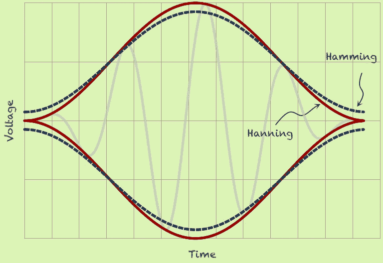

source: [https://www.tek.com/sites/default/files/u811871/hamming-t.png](https://www.tek.com/sites/default/files/u811871/hamming-t.png)

大多数人的第一个问题是，**为什么我们在离散傅里叶变换(DFT)或者快速傅里叶变换(FFT)中需要预处理？**在回答问题之前，你必须知道 DFT 和 FFT 的区别。我以前在这里讨论过这个话题，如果你想知道更多细节，你可以看看。重点是 **FFT 是做 DFT** 的最快方法。

**答案是频谱泄漏**。什么是频谱泄漏？频谱泄漏是指将“未完成的”波传递到 FFT。我说的未完成的波是指，当它像这样传递到 FFT 时，具有非整数周期的波。

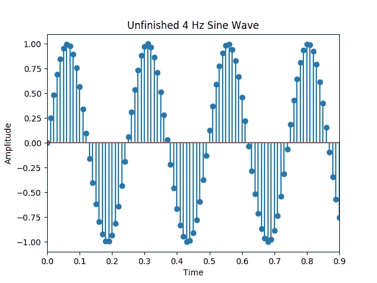

当你把这个信号传递给 FFT，结果是这样的

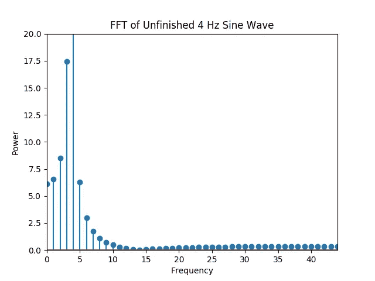

Woah，功率很高，尤其是 4 Hz 频段。这很明显，因为我们将一个纯 4 Hz 正弦波传递给 FFT。但是看起来**FFT‘认为’我们的纯信号是 4 Hz 左右**波的叠加。

如果将“完成”信号传递给 DFT，结果将会不同。这个“完整的”4 Hz 正弦波

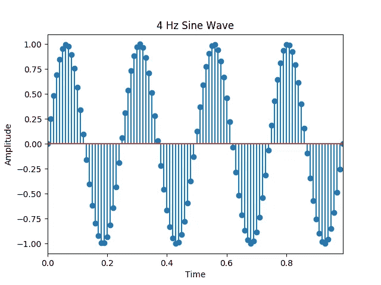

当把它传递给 FFT 时，结果会是这样的

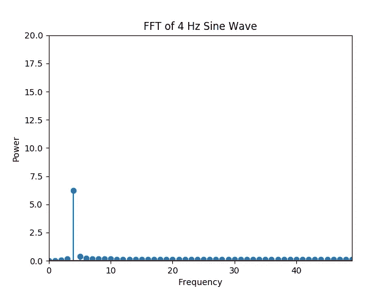

这就是预期的结果！我们的输入信号是 4 Hz 正弦波，因此 DFT 频谱图中的功率频率仅为 4 Hz。而且显示的功率也没有之前那么大。由于 python 代码对空格和制表符非常敏感，我在这里只给你一个代码的 [GitHub 链接，而不是在这里显示，因为如果我在这里提供它，所有的空格和制表符都会被弄乱。](https://github.com/genomexyz/windowing_DFT/blob/master/exp_leakage.py)

这种现象被称为光谱泄漏。这是因为 **DFT 假设我们的输入信号是一个‘完整’周期信号**。 **DFT 假设我们的信号完全按照输入**重复。所以当我们通过‘不完整’版本的 4 Hz 正弦波时，DFT 会看到这样的情况。

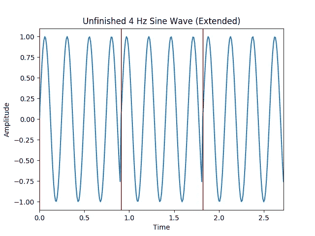

让我们检查该信号的 FFT 输出，这是结果

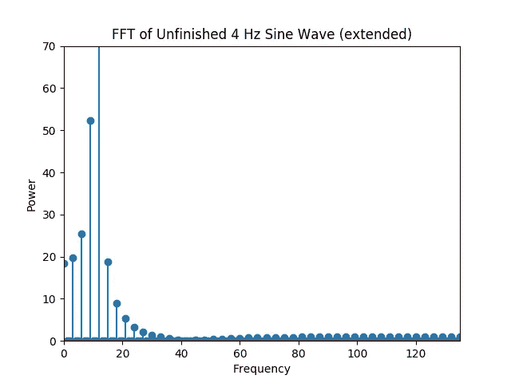

**类似于**之前未完成的 4 Hz 正弦波的 FFT 输出不是？是的，除了这个加长版的**外，功率上升更高**(看 y 轴刻度)。绘制如上图的代码是通过[这个链接](https://github.com/genomexyz/windowing_DFT/blob/master/plot_wave_extended.py)完成的。

为了清除噪声并获得理想的输出(参见“4 Hz 正弦波的 FFT”图)是**，我们必须知道信号的周期并在正确的时间**对其进行切割(正好在信号周期结束时切割)。但是，**在现实世界中，我们不知道信号的周期，而且现实世界中的信号充满了噪声和干扰**，所以在正确的时间切割它是不可能的。**解决方案是开窗函数**。

傅立叶变换中的窗口函数是**，调整 FFT 信号输入的起点和终点的尝试与此类似**。在这个故事中，我们将涵盖 2 窗口函数，汉宁函数，和汉明函数。

汉宁函数是这样写的

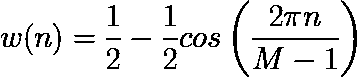

汉明函数是这样的

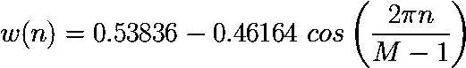

其中 M 是 FFT 的数据集输入中的数据量，n 是从 0 到 M-1 的数。

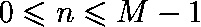

所以 Hanning 和 Hamming 将输出一个数组，这个数组中的数字与数据集中的数据数量成正比。如果我们绘制汉宁和汉明函数的输出，我们将得到如下两个图

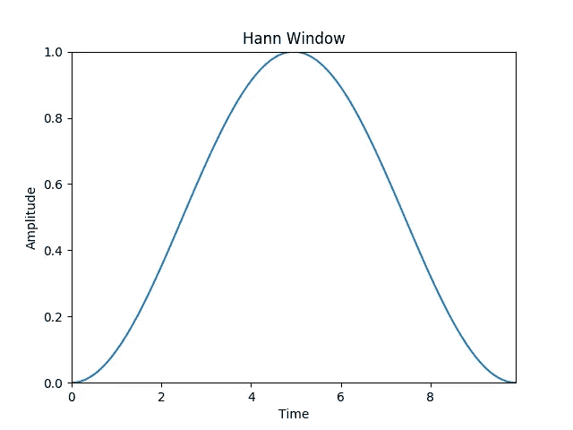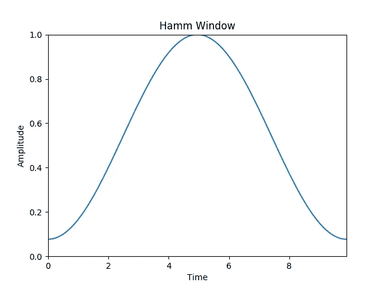

这里是[代码的链接](https://github.com/genomexyz/windowing_DFT/blob/master/plot_hann_hamm.py)来创建上面的情节。

为了调整信号，**我们将信号乘以汉恩和哈姆**的输出。作为一个例子，我们乘以我们未完成的 4 赫兹正弦波对汉恩和哈姆，然后我们的波形将是这样的。

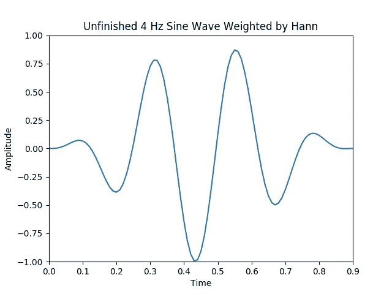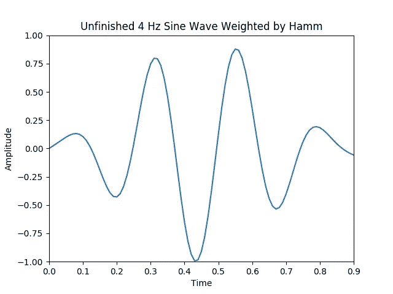

让我们进行 FFT 处理，我们会得到这样的图形。

看，FFT 中错误频带的功率降低了(包括正确频带，它正在接近“正确”值)。我们可以看到**错误频段的功率并没有完全消除，只是可以降低**。如果我们在这个实验中观察 FFT 的结果，那么在汉明函数和汉宁函数之间没有真正的区别。这里的[是代码的链接](https://github.com/genomexyz/windowing_DFT/blob/master/multiply_hann_hamm.py)，用于创建汉宁/汉明函数处理的信号图及其 FFT 结果。

重要的一点是，无论**是否经过窗函数处理，FFT 图中最主要的频率始终相同**，为 4 Hz。所以，**如果你只是想知道信号中占主导地位的一个频率是什么，我认为你不需要加窗函数**。当您想要在数据集中找到一个以上的主导信号时，我认为这些窗口函数会有很大的帮助，因为当存在泄漏时，主导信号周围的一些频带的功率会盖过您想要找到的第二个、第三个或 etc 信号。当然，如果你想平滑 FFT 的结果，你需要一个窗口函数。

参考资料:

[https://www . crystal instruments . com/dynamic-signal-analysis-basics](https://www.crystalinstruments.com/dynamic-signal-analysis-basics)，2019 年 9 月 29 日访问