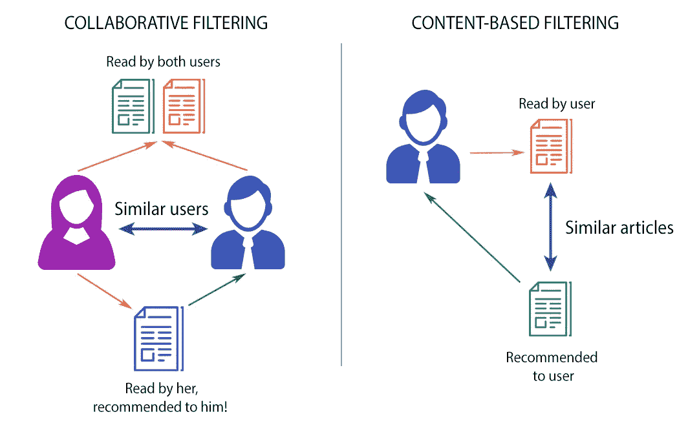
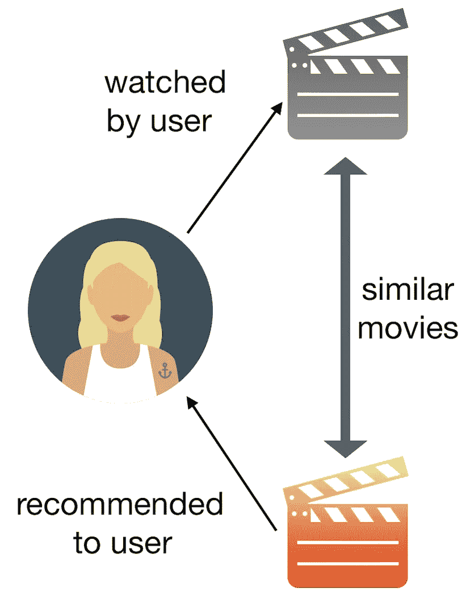
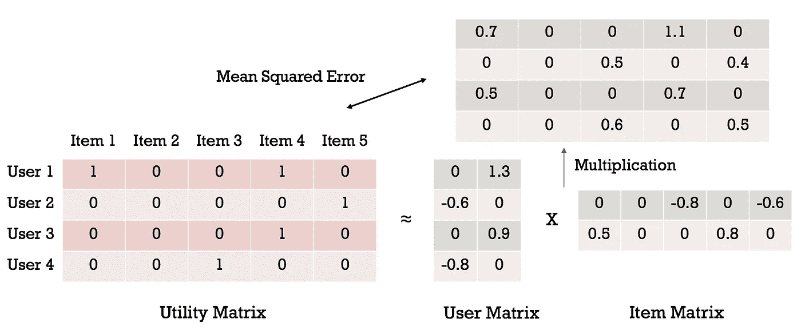
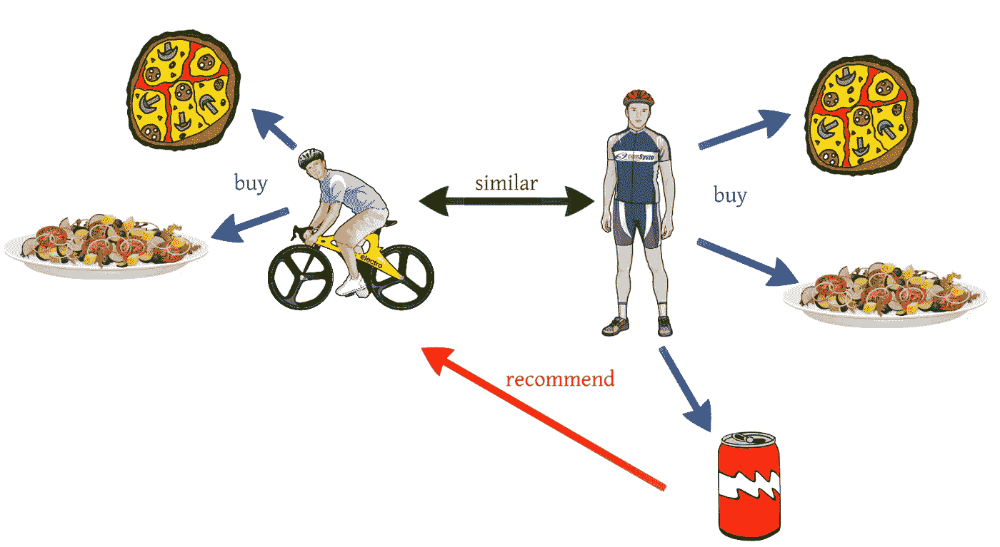
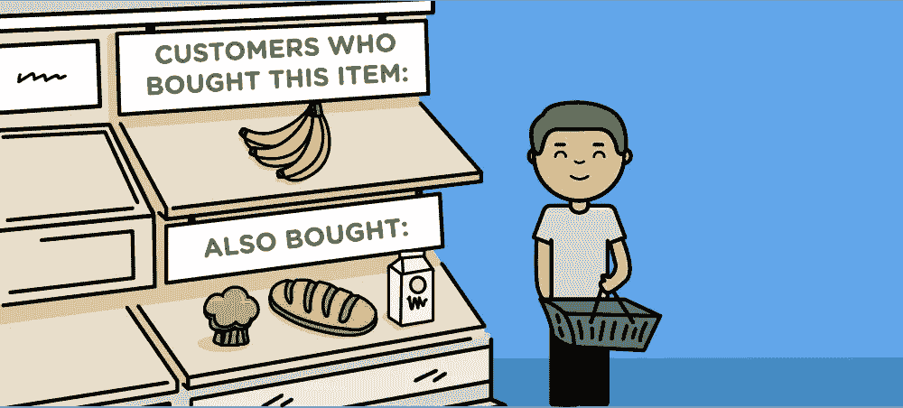
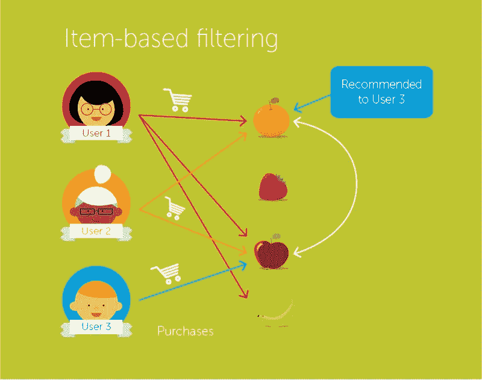

# 推荐系统简介

> 原文：<https://towardsdatascience.com/brief-on-recommender-systems-b86a1068a4dd?source=collection_archive---------6----------------------->

## 行业中使用的不同类型的推荐方法。

如今，人们过去更多地在网上购买产品，而不是从商店购买。以前，人们习惯于根据亲戚或朋友的评论来购买产品，但现在随着选择的增加，我们可以通过数字方式购买任何东西，我们需要向人们保证产品是好的，他们会喜欢。为了增强购买产品的信心，推荐系统应运而生。

Recommendation techniques

推荐系统是机器学习技术在商业中最成功和最广泛的应用之一。推荐系统有助于增加商业收入，帮助顾客购买最适合他们的产品。

# **什么是推荐引擎？**

推荐引擎根据特定客户以前的购买历史筛选出他/她感兴趣或愿意购买的产品。关于客户的可用数据越多，推荐就越准确。

但是，如果客户是新客户，这种方法将会失败，因为我们没有该客户以前的数据。因此，为了解决这个问题，使用了不同的方法；比如经常推荐最受欢迎的产品。这些建议不一定准确，因为它们不依赖于客户，对所有新客户都一样。一些企业会询问新客户的兴趣，以便他们能够更准确地推荐。

现在，我们将关注推荐引擎使用的不同类型的过滤。

# 基于内容的过滤

这种过滤基于为该产品提供的描述或一些数据。系统根据产品的上下文或描述找到产品之间的相似性。用户的先前历史被考虑在内，以找到用户可能喜欢的类似产品。

例如，如果用户喜欢像《碟中谍》这样的电影，那么我们可以向他推荐《汤姆·克鲁斯》或《动作片》。

Content-based filtering

在这种过滤中，使用了两种类型的数据。首先，用户的喜好，用户的兴趣，用户的个人信息，如年龄，有时用户的历史。该数据由用户向量表示。第二，与产品相关的信息被称为项目向量。项目向量包含所有项目的特征，基于这些特征可以计算它们之间的相似性。

使用余弦相似度来计算推荐。如果“A”是用户向量,“B”是项目向量，则余弦相似度由下式给出

cosine similarity formula

cosine similarity calculation

余弦相似性矩阵中计算的值按降序排序，并且为该用户推荐顶部的项目。

## **优势**

1.  向用户推荐他们喜欢的商品类型。
2.  用户对推荐的类型感到满意。
3.  可以推荐新品；只需要该项目的数据。

## 不足之处

1.  用户将永远不会被推荐不同的项目。
2.  由于用户不尝试不同类型的产品，业务无法扩展。
3.  如果用户矩阵或项目矩阵被改变，余弦相似性矩阵需要被再次计算。

# 协同过滤

推荐是基于用户的行为来完成的。用户的历史起着重要的作用。例如，如果用户 A 喜欢“酷玩”、“林肯公园”和“布兰妮·斯皮尔斯”，而用户 B 喜欢“酷玩”、“林肯公园”和“泰勒·斯威夫特”，则他们具有相似的兴趣。因此，很有可能用户 A 会喜欢“泰勒·斯威夫特”，而用户 B 会喜欢“布兰妮·斯皮尔斯”。这就是协同过滤的工作方式。

user-user Collaborative filtering

使用两种类型的协同过滤技术:

1.  用户-用户协同过滤
2.  项目-项目协同过滤

## 用户-用户协同过滤

在这种情况下，用户向量包括用户购买的所有商品以及对每个特定产品给出的评级。使用 n*n 矩阵计算用户之间的相似性，其中 n 是在场用户的数量。使用相同的余弦相似性公式计算相似性。现在，计算推荐矩阵。在这种情况下，评级乘以已经购买了该项目的用户和必须向其推荐该项目的用户之间的相似性。该值针对该用户的所有新项目进行计算，并按降序排序。则向该用户推荐顶部的项目。

Collaborative filtering

如果新用户到来或者老用户改变他或她的评级或者提供新的评级，那么推荐可能改变。

## 项目-项目协同过滤

在这种情况下，不考虑相似的用户，而是考虑相似的项目。如果用户“A”喜欢“盗梦空间”,他可能喜欢“火星人”,因为主角是相似的。这里，推荐矩阵是 m*m 矩阵，其中 m 是存在的项目的数量。

Item-Item collaborative filtering

## 优势

1.  新产品可以介绍给用户。
2.  生意可以扩大，可以推广新产品。

## 不足之处

1.  根据所用协作方法的类型，需要用户以前的历史记录或产品数据。
2.  如果没有用户购买该新项目或对其评级，则不能推荐该新项目。

两种推荐算法各有优缺点。如今，为了进行更精确的推荐，使用了混合推荐算法；也就是说，同时使用基于内容的过滤和协同过滤来推荐产品。混合推荐算法更高效、更有用。