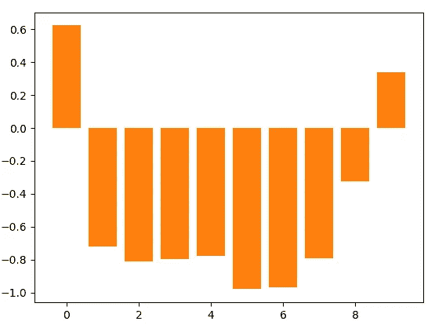
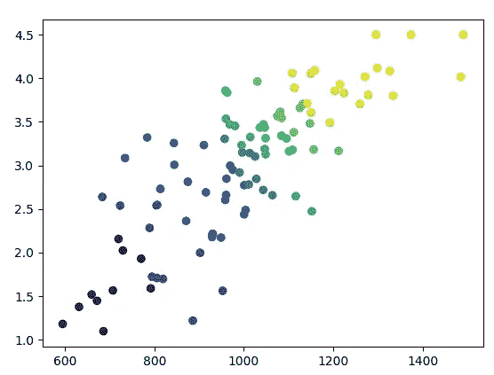

# 聪明的混蛋，疯狂的辣妹，和其他范围限制的文物

> 原文：<https://towardsdatascience.com/brilliant-jerks-crazy-hotties-and-other-artifacts-of-range-restriction-c53785ae249f?source=collection_archive---------3----------------------->

当人们写史蒂夫·乔布斯时，他们会提到他才华横溢但刻薄:他可以立即解决困扰他的团队数月的设计问题，但他会立即解雇犯了小错误的人。因为很多人都想成为史蒂夫·乔布斯那样的人，而且成为天才很难，所以一些雄心勃勃的人夸大了他们的鲁莽行为。

但是乔布斯在很多方面都是个异类。他也是这样的异类吗？

无聊的答案是肯定的:智商和宜人性之间没有很强的联系，所以在科学上可以问聪明人是不是混蛋，答案是“不超过平均水平。”

当然，怪人和天才的关联并不是唯一的民间关联。有[热疯规模](https://how-i-met-your-mother.fandom.com/wiki/Hot/Crazy_Scale)，运动员/书呆子二分法，等等。如果有什么不同的话，美丽和精神稳定应该有更好的相关性，因为足够疯狂的人在基本卫生方面都有问题，而突变负荷会影响面部对称和精神疾病。从经验上来看，成为运动员和成为书呆子确实相关，因为[锻炼是益智的](https://www.nytimes.com/2018/02/21/well/move/how-exercise-may-help-the-memory-grow-stronger.html)和[聪明人更健康](https://www.project-syndicate.org/commentary/why-do-smart-people-live-longer?barrier=accesspaylog)。从经验上来说，傻瓜/铅笔脖子连续体实际上是健康/聪明的人和不健康/迟钝的人之间不公平的连续体。[1]

那么，为什么我们有这么多关于特征之间权衡的民间智慧，而这些权衡并不普遍存在呢？

答案并不令人惊讶；这只是统计数据。在第一个近似值中，期望性状之间的任何强负相关都是由范围限制驱动的。

# 让我们测试一下

直觉很简单:如果你在看 A 和 B 的特征如何相关，但你只是在看一个人的子集，而这个子集是由人们的 A 和 B 的水平决定的，子集内的相关性将低于子集外的相关性。

考虑标准化考试分数和 GPA，两种不同的衡量学术能力的方法。总的来说，它们之间有很好的相关性是有道理的:如果你在 SAT 考试中得了满分，你可能在其他考试中也表现不错；如果你在一个问题上挣扎，你在两个问题上都挣扎。但是大学综合考虑两者，因为他们测量不同的东西。SAT 是对原始推理能力的更好的衡量；GPA 也是衡量你愿意努力学习的一个标准。如果学校根据学生的 GPA *和* SAT 来录取学生，那么这种正相关关系在一所学校内就消失了:SAT 高分的学生 GPA 较低，反之亦然。

我们可以模拟一下。

我们将从产生一群假设的学生开始。我们通过获取每个人的 SAT 分数的标准差并应用一些噪声来确定每个人的 GPA:

```
import pandas as pd
import numpy as np
import scipy.stats
import matplotlib.pyplot as pltdef gen_students(noise=0.5):
    """Create a set of students with a hypothetical GPA and SAT distribution"""
    scores = np.random.normal(1000,195,100)
    scores = [400 if x < 400 else 1600 if x > 1600 else x for x in scores]
    zs = scipy.stats.zscore(scores)
    gpas_raw = [3.0 + # median GPA
                x * 0.75 # GPA std dev
                + np.random.normal(0, noise) # some normally-distributed noise
                for x in zs]
    gpas = [0 if x < 0 else 4.5 if x > 4.5 else x for x in gpas_raw]
    df = pd.DataFrame(list(zip(scores,gpas)), columns = ['SAT','GPA'])
    df['GPA_Percentile'] = df.GPA.rank(pct=True)
    df['SAT_Percentile'] = df.SAT.rank(pct=True)
    df['Ranking'] = (df.SAT_Percentile + df.GPA_Percentile) / 2
    return df
```

如果我们运行`df['SAT'].corr(df['GPA'])`，我们看到相关系数是 0.80。换句话说，sat 和 GPA 紧密相关。

现在，让我们送这些孩子去学校:

```
def choose_schools(df, count=10):
    quantiles = pd.qcut(df.Ranking, count)
    key = dict(zip(list(quantiles.cat.categories), range(10)))
    df['Quantiles'] = pd.qcut(df.Ranking, count)
    df['School'] = [key[x] for x in df.Quantiles]
    return df
```

这只是根据学生的 SAT 分数+ GPA 分数将他们分成不同的组。我刚刚给学校编号，从 0 到 9。学校 0 的 SAT 平均成绩约为 700，高中平均绩点为 1.6，而学校 9 的 SAT 平均成绩为 1325，平均绩点为 4.15。

但是真正有趣的是在学校中观察 SAT/GPA 相关性*的结果。我们可以通过以下方式快速运行:*

```
for i in range(10):
    print(df[df['School']==i]['GPA'].corr(df[df['School']==i]['SAT']))
```

对大多数学校来说，这种相关性是非常负的。例如，在第五学校，GPA 和 SAT 之间有-0.98 的相关性。以下是总体总结:



SAT-GPA correlation by school

和学生的视觉表现，由学校用颜色编码:



SAT vs GPA, color-coded by school

该图的一个显著特征是，在范围的高端和低端，相关性更接近真实世界的相关性。这在一定程度上是我使用的分布函数，因为 sat 和 GPA 是有上限的。但是*和*是真实世界的反映。有些特征衡量起来微不足道，比如身高，但是对于 SAT 分数和 GPA 到底衡量什么却存在严重分歧。(GPA 是衡量你有多努力，还是衡量你有多愿意为毫无意义的任务努力？SAT 测试的是你有多聪明，还是你擅长做选择题？在分布的中间，很容易概括，但在极端情况下，测试是不完美的。)

所有这些的结果是，如果你处于某个分布的极端——上哈佛，参加奥运会，在死囚区——我们测量的绝对下限和上限意味着样本实际上较少受到范围限制。然而，我们其他人必须敏锐地意识到范围限制。

# 使用范围限制

一个令人高兴的结果是，它给你一个更好的方法来处理冒名顶替综合症。或许，你擅长的事情比你不擅长的事情更不容易被你发现。“大家都比我聪明！”你认为，在公司里，每个人都被你的职业道德所震撼。“这里的每个人都比我有更好的时间管理技巧，”公司最聪明的人说。“每个人都比我工作努力，也比我聪明得多，”办公室里最擅长社交的人说。

事实上，唯一应该感到骗子综合症的人是那些最擅长推销自己的人。但是因为推销自己需要一些自我欺骗，他们自然会认为自己被懒惰的白痴包围。

另一个要点是，如果你在一个按照一个指标积极排序的团队中，但是团队中的成就依赖于其他指标，那么这些指标将是预测排序后成功的唯一指标。因此，在顶级科技公司， [STEM 专业知识是最不可预测的成功衡量标准](https://www.washingtonpost.com/news/answer-sheet/wp/2017/12/20/the-surprising-thing-google-learned-about-its-employees-and-what-it-means-for-todays-students/)，但这只是因为他们已经把成为世界 STEM 专家作为招聘的条件。(更黑暗的一点是，“人际交往能力”是反社会者绝对具备的；被认为是一个有效的领导者的一个方法是，对进展顺利的事情邀功，对进展不顺利的事情有效地推卸责任。突然，你“领导”的一切都成功了！)

不过，你应该从范围限制中得出的主要结论是，与你互动的人不是一个代表性样本，但显而易见的统计工具——无论是正式的还是非正式的观察——都隐含地假设了一个随机样本。

有些心地善良的人头脑异常敏锐。有漂亮的人也有精神稳定的。但是对于我们中的绝大多数人来说，这些人是如此的与我们格格不入，以至于我们视而不见。随着软件蚕食世界，根据人们可观察到的特征对他们进行分类变得越来越容易，所以你越来越多地被那些总体上和你一样优秀的人所包围，不管哪种版本的“优秀”最经得起数字运算。

如果你在本行业最好的公司工作，或者在最高级的约会场所，你会发现好的品质之间的相关性通常是积极的。如果你没有，坏消息是:你不是百分之 99.99。不过，你可以对此保持冷静:如果你在你所做的事情上不是世界上最好的，你观察到你的同龄人之间可取的特质之间的权衡，至少你知道这个世界是相当公平的。

不要错过下一个故事。报名参加我的 [*邮箱快讯*](https://diff.substack.com) *。或者查看* [*关于/常见问题*](https://medium.com/@byrnehobart/about-best-of-faq-25df97a74467) *页面了解更多。*

[1]当然，这两种情况都有很大的可变性；我说的是非常宽泛的平均值，而不是对任何一个人都有意义的东西。此外，这些概括很难做出，因为人们经常选择夸大人格特征。作为一个在许多不同方面都略高于平均水平的人，很难让人印象深刻，所以通常的模式是在一两个特质上全押。