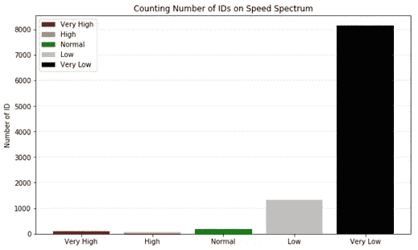

# 用于交通管理的空间数据分析

> 原文：<https://towardsdatascience.com/brilliant-sim-cards-traffic-management-90982691fa94?source=collection_archive---------15----------------------->

SIM 卡有助于车辆交通管理吗？简短的回答是**是的**。在这篇文章中，我将总结我在**空间数据分析**的一次最好的经历。事实上，感谢[沙特电信公司(STC)的业务团队](https://www.stc.com.sa/wps/wcm/connect/english/individual/static/html/contest)，他们在利雅得发起了交通管理数据通活动。他们邀请了 50 个数据极客团队来展示他们的肌肉，只需给他们模拟数据来进行分析和解决。我和我的兄弟穆罕默德·卡西姆(Mohammed Qassim)与其他 49 支队伍一起组队参赛。幸运的是，我们队在其他十支队伍中进入了决赛，并获得了比赛的第二名。

在这里，我将介绍什么是数据集，我们的方法和策略，然后展示一些分析和结论。

## 资料组

1.  **第一个文件:**四列，包含 9868 辆独特车辆的记录和 2，011，774 个相关联的位置报告，跨越 24 小时的时间段。这些列是:
    SAM:报告位置的时间(以午夜后的秒为单位)
    经度:以十进制度表示的经度坐标
    纬度:以十进制度表示的纬度坐标
    ID:加密 ID
2.  **Roads 数据**来自三个文件:
    Roads.shp
    Roads.dbf 和
    Roads.shx

## 我们的战略和方法

对于比赛，我们使用了三个工具:微软 SQL Server 2017、微软 Power BI 和带有 Python 3 设置的 Jupyter Notebook。每个工具发生的一些活动有:

My brother and I holding the second prize

## 分析和结果

在许多清理和特性工程步骤之后，我们最终得到了 11 列和 9805 行(ID)。主要功能有:计算每辆车的行驶时间、距离，从而计算速度。主要的挑战是处理坐标或 GPS 漂移中的一些噪声！但是，这里我将展示一些对数据集进行的绘图和分析:

**绘制“距离”和“平均速度”栏的直方图**

**24 小时内 ID 在各条道路上的计数和分配**

条形图很有意义。早上是道路交通的高峰时间。交通活动在早上 6:00 学校值班时开始，在早上 8:00 工人值班时达到高峰。

**计算 ID 的一般速度**

只要把它们分成五大类:非常高速、高速、正常速度、低速和非常低速。

**在速度谱上绘制每小时的数据**

上午 8:00 交通拥堵最严重，上午 11:00 违章率最高。令人惊讶的是，大多数汽车在午夜和午夜后都安全行驶。

**可视化两条主干道起点处的每小时交通密度:**

