# 使用交互式小部件，让您的 Jupyter 笔记本栩栩如生

> 原文：<https://towardsdatascience.com/bring-your-jupyter-notebook-to-life-with-interactive-widgets-bc12e03f0916?source=collection_archive---------0----------------------->

## [现实世界中的数据科学](https://medium.com/towards-data-science/data-science-in-the-real-world/home)

## 如何使用 ipywidgets 创建动态仪表板

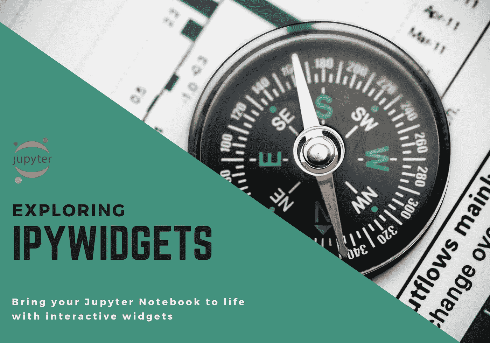

# 扩展 Jupyter 的用户界面

传统上，每次需要修改笔记本单元格的输出时，都需要更改代码并重新运行受影响的单元格。这可能是麻烦的、低效的和容易出错的，并且在非技术用户的情况下，这甚至是不可行的。这就是 [ipywidgets](https://ipywidgets.readthedocs.io/en/stable/user_guide.html) 发挥作用的地方:它们可以嵌入到笔记本中，并提供一个**用户友好的**界面来收集用户输入，并查看更改对数据/结果的影响，而不必与代码进行交互；您的笔记本可以从静态文档转变为动态仪表盘，非常适合展示您的数据故事！

> **⚠️范围:**ipywidgets 上的资源是有限的，现有的极少数教程要么不完整，要么专注于`interact`函数/装饰器。这是一个**完整的教程**，告诉你如何完全控制小部件来创建强大的仪表板。
> 
> 我们将从基础开始:添加一个小部件并解释事件如何工作，我们将逐步开发一个仪表板。
> 我将一步一步地指导你，在我们进行的过程中，以示例为基础。

## 什么是 widget？

如果你曾经创建过**图形用户界面** (GUI)，那么你就已经知道什么是小部件了。但是让我们快速定义一下:
widget 是一个 GUI 元素，比如按钮、下拉菜单或文本框，它驻留在浏览器中，允许我们通过响应事件和调用指定的处理程序来控制代码和数据。

这些 GUI 元素可以被组装和定制以创建复杂的仪表板。

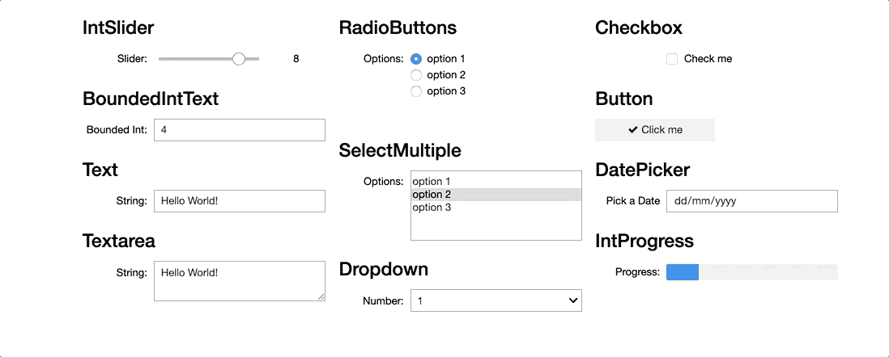

Demo: A few of the most popular widgets

在整篇文章中，我们将看到它们中的一些在起作用。

> ***准备好了吗？🏁***

# ❶入门

要开始使用这个库，我们需要安装 **ipywidgets** 扩展。如果使用 conda，我们在终端中键入以下命令:

```
conda install -c conda-forge ipywidgets
```

对于 pip，这将是一个两步过程:1 .安装和 2。启用:

```
pip install ipywidgetsjupyter nbextension enable --py widgetsnbextension
```

## 添加小部件

为了将小部件合并到笔记本中，我们必须导入模块，如下所示:

```
import ipywidgets as widgets
```

要添加滑块，我们可以定义最小值和最大值、间隔大小(步长)、描述和初始值:

```
widgets.IntSlider(
    min=0,
    max=10,
    step=1,
    description='Slider:',
    value=3
)
```

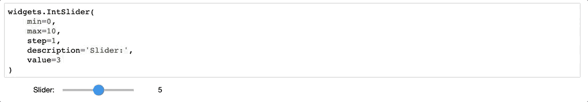

Demo: Slider

## 展示它

`display()`函数在输入单元格中呈现一个小部件对象。
首次导入:

```
from IPython.display import display
```

然后在 display()函数中将小部件作为参数传递:

```
slider = widgets.IntSlider()
display(slider)
```

## 获取/设置其值

为了读取小部件的值，我们将查询它的`value`属性。类似地，我们可以设置小部件的值:

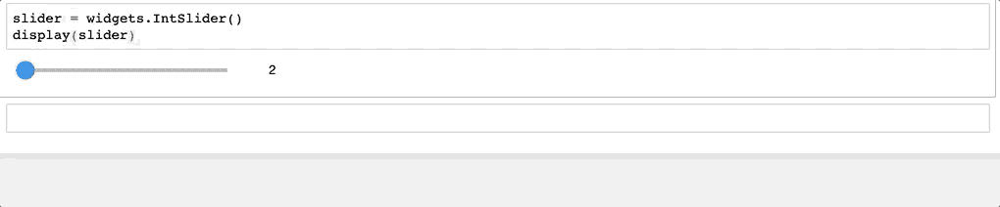

Demo: Value

## 链接两个小部件

我们可以通过使用`jslink()`函数来同步两个小部件的值。

```
slider = widgets.IntSlider()
text = widgets.IntText()
display(slider, text)widgets.jslink((slider, 'value'), (text, 'value'))
```

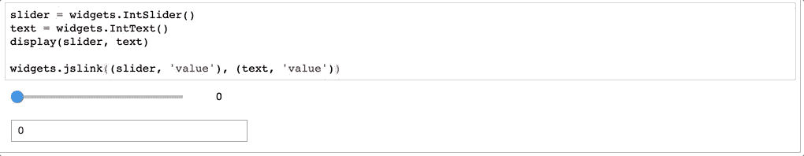

Demo: Linking

## 小组件列表

要获得小部件的完整列表，您可以查看[文档](https://ipywidgets.readthedocs.io/en/stable/examples/Widget%20List.html)，或者运行以下命令:

```
print(dir(widgets))
```

# ❷处理窗口小部件事件

小部件可以响应事件，这些事件是在用户与它们交互时引发的。一个简单的例子是点击一个按钮——我们期待一个动作发生。

让我们看看这是如何工作的…

根据其具体特性，每个小部件公开不同的事件。每次触发事件时，都会执行一个**事件处理程序**。

> 事件处理程序是响应事件的回调函数，它异步运行并处理接收到的输入。

这里我们将创建一个简单的按钮，名为`btn`。点击按钮时会调用`on_click`方法。

我们的事件处理程序`btn_eventhandler`将打印一条带有按钮标题的短消息——注意处理程序的输入参数`obj`是按钮对象本身，它允许我们访问它的属性。

为了将事件与处理程序绑定，我们将后者分配给按钮的`on_click`方法。

```
btn = widgets.Button(description='Medium')
display(btn)def btn_eventhandler(obj):
    print('Hello from the {} button!'.format(obj.description))btn.on_click(btn_eventhandler)
```


Demo: Button Event Handler

让我们进入下一部分的是，输出出现在按钮本身所在的**单元格**中。因此，让我们继续看看如何为我们的笔记本电脑增加更多的灵活性！

# ❸控制小部件输出

在这一节中，我们将探索如何使用小部件来控制数据帧。我选择的样本数据集是“[伦敦国际游客数量](https://data.london.gov.uk/dataset/number-international-visitors-london)”，它显示了伦敦游客在住宿、参观和消费方面的总数，按年份、季度、目的、持续时间、方式和国家细分。

最初，我们将获取数据并将其加载到数据帧中:

```
import pandas as pd
import numpy as npurl = "[https://data.london.gov.uk/download/number-international-visitors-london/b1e0f953-4c8a-4b45-95f5-e0d143d5641e/international-visitors-london-raw.csv](https://data.london.gov.uk/download/number-international-visitors-london/b1e0f953-4c8a-4b45-95f5-e0d143d5641e/international-visitors-london-raw.csv)"df_london = pd.read_csv(url)
```

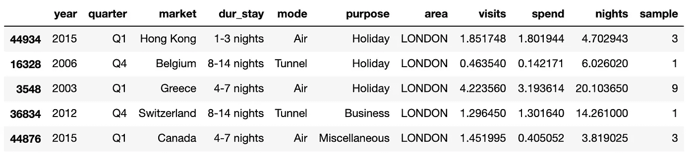

df_london.sample(5)

假设我们想按*年*过滤数据帧。我们将首先定义一个下拉列表，并用唯一年份值的列表填充它。

为了做到这一点，我们将创建一个通用函数`unique_sorted_values_plus_ALL`，它将找到唯一的值，对它们进行排序，然后在开头添加`ALL`项，这样用户就可以删除过滤器。

```
ALL = 'ALL'def unique_sorted_values_plus_ALL(array):
    unique = array.unique().tolist()
    unique.sort()
    unique.insert(0, ALL)
    return unique
```

现在我们将初始化下拉菜单:

```
dropdown_year = widgets.Dropdown(options =    unique_sorted_values_plus_ALL(df_london.year))
```

dropdown 小部件公开了`observe`方法，该方法采用一个函数，当 dropdown 的值改变时，该函数将被调用。因此，我们接下来将创建 observer 处理程序，通过所选的值来过滤数据帧——注意，处理程序的输入参数`change`包含关于所发生的更改的信息，这允许我们访问`new`值(`change.new`)。
如果新值是`ALL`，我们移除过滤器，否则我们应用它:

```
def dropdown_year_eventhandler(change):
    if (change.new == ALL):
        display(df_london)
    else:
        display(df_london[df_london.year == change.new])
```

然后，我们将处理程序绑定到下拉列表:

```
dropdown_year.observe(dropdown_year_eventhandler, names='value')
```

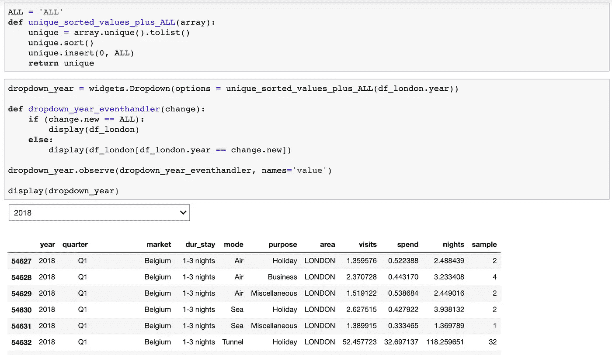

Using a dropdown to filter a dataframe

到目前为止还不错，但是所有查询的输出都是*在同一个单元格中累积*；也就是说，如果我们从下拉列表中选择一个新的年份，一个新的数据框架将呈现在第一个数据框架的下面，在同一个单元格中。
理想的行为是**每次刷新**数据帧的内容。

## 捕获小部件输出

对此的解决方案是在一种特殊的小部件中捕获单元格输出，即`Output`，然后在另一个单元格中显示它。

我们将稍微调整一下代码:

*   创建一个新的`Output`实例

```
output_year = widgets.Output()
```

*   调用事件处理程序中的`clear_output`方法来清除每次迭代中的前一个选择，并在`with`块中捕获 dataframe 的输出。

```
def dropdown_year_eventhandler(change):
    output_year.clear_output()
    with output_year:
        display(df_london[df_london.year == change.new])
```

然后，我们将在新的单元格中显示输出:

```
display(output_year)
```

它是这样工作的:

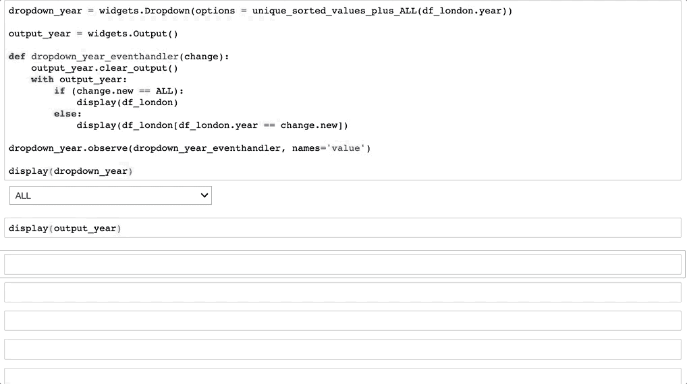

Demo: Capturing output in a new cell

正如您所看到的，输出呈现在一个新的单元格中，过滤工作正常！👍

# ❹链接小部件输出

继续前面的例子，让我们假设我们也想通过*目的*进行过滤。

如果我们继续添加另一个下拉列表，我们将很快意识到数据帧只响应最近更改的下拉列表的过滤器。我们需要做的是**将两者**链接在一起，这样它就可以同时处理两个值(即年份和目的)。

让我们看看它应该如何工作:

首先，我们需要两个下拉菜单的公共输出:

```
output = widgets.Output()
```

这是两个下拉菜单:

```
dropdown_year = widgets.Dropdown(options =    unique_sorted_values_plus_ALL(df_london.year))dropdown_purpose = widgets.Dropdown(options = unique_sorted_values_plus_ALL(df_london.purpose))
```

然后我们创建一个新函数`common_filtering`，它将被两个事件处理程序调用。该函数将对两年的数据帧应用过滤器`*AND*`目的:
我们正在清除输出，然后我们检查是否有任何值为`ALL`，在这种情况下，我们认为相应的过滤器已被移除。当两个过滤器都存在时，在`else`语句中，我们在两个过滤器中应用`&`操作。最后，我们捕获输出:

```
def common_filtering(year, purpose):
    output.clear_output()

    if (year == ALL) & (purpose == ALL):
        common_filter = df_london
    elif (year == ALL):
        common_filter = df_london[df_london.purpose == purpose]
    elif (purpose == ALL):
        common_filter = df_london[df_london.year == year]
    else:
        common_filter = df_london[(df_london.year == year) & 
                                  (df_london.purpose == purpose)]

    with output:
        display(common_filter)
```

我们修改事件处理程序来调用`common_filtering`函数并传递`change.new`值以及另一个下拉菜单的当前`value`:

```
def dropdown_year_eventhandler(change):
    common_filtering(change.new, dropdown_purpose.value)def dropdown_purpose_eventhandler(change):
    common_filtering(dropdown_year.value, change.new)
```

我们将处理程序绑定到下拉菜单，就这样！

```
dropdown_year.observe(
dropdown_year_eventhandler, names='value')dropdown_purpose.observe(
dropdown_purpose_eventhandler, names='value')
```

代码片段:

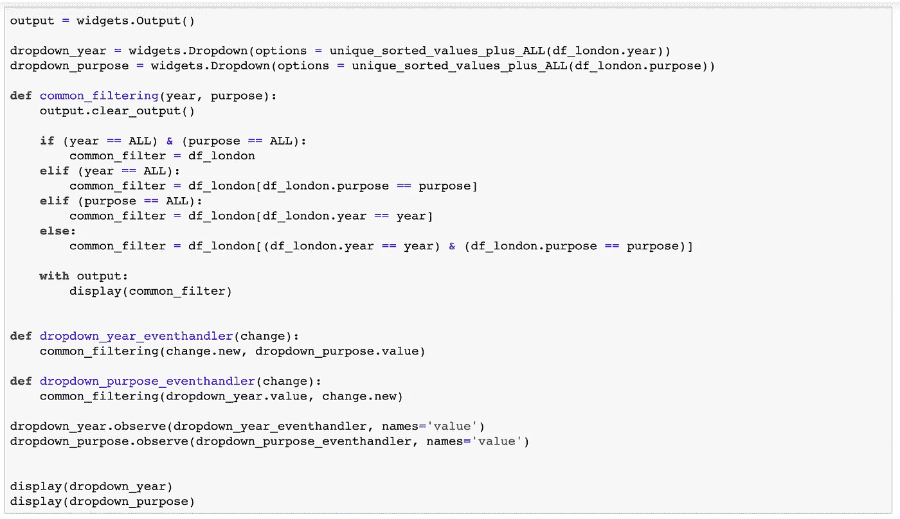

Filter a dataframe based on two values

这是演示:

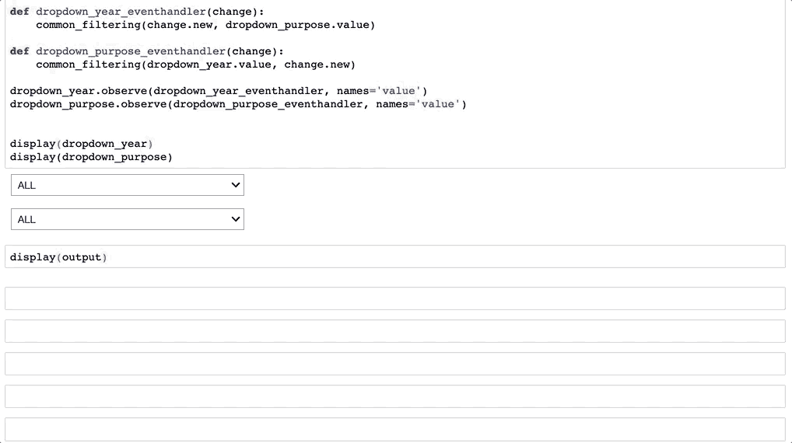

Demo: Filter a dataframe based on two values

# ❺创建仪表板

到目前为止，我们已经通过过滤和显示伦敦数据集的数据为我们的仪表板奠定了基础。我们将继续根据用户选择的值对数值进行着色。

一个有用的数字小部件是`BoundedFloatText`；我们将赋予它一个`min`、`max`和初始`value`，以及增量`step`。

```
bounded_num = widgets.BoundedFloatText(
min=0, max=100000, value=5, step=1)
```

为了给数据框单元格着色，我们将定义此函数:

```
def colour_ge_value(value, comparison):
    if value >= comparison:
        return 'color: red'
    else:
        return 'color: black'
```

现在我们将最低限度地修改`common_filtering`函数为:

*   添加新的`num`输入参数:

```
def common_filtering(year, purpose, num):
```

*   通过为三个数字列调用`colour_ge_value`函数来应用样式:

```
with output:
        display(common_filter
                .style.applymap(
                    lambda x: colour_ge_value(x, num),
                    subset=['visits','spend', 'nights']))
```

需要调整现有的事件处理程序以通过`bounded_num.value`:

```
def dropdown_year_eventhandler(change):
    common_filtering(change.new, dropdown_purpose.value,
                     bounded_num.value)def dropdown_purpose_eventhandler(change):
    common_filtering(dropdown_year.value, change.new, 
                     bounded_num.value)
```

最后，我们将插入新部件的事件处理程序:

```
def bounded_num_eventhandler(change):
    common_filtering(dropdown_year.value, dropdown_purpose.value, 
                     change.new)bounded_num.observe(bounded_num_eventhandler, names='value')
```

代码片段:

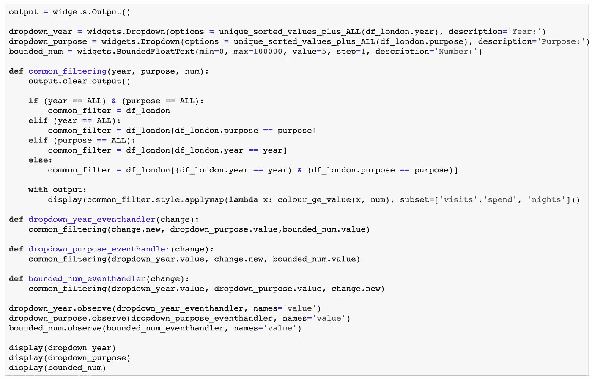

Colour dataframe values

这是演示:

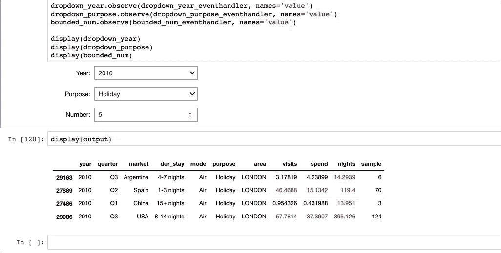

Demo: Colour dataframe values

## 测绘

接下来，我们将添加一个新的图表来绘制访问次数的基本单变量密度(KDE →核密度估计)。我们将使用 seaborn，所以让我们导入库:

```
import seaborn as sns
import matplotlib.pyplot as plt
```

继续之前的用例，我们将在一个新的输出变量中捕获图形:

```
plot_output = widgets.Output()
```

我们现在将修改`common_filtering`函数来绘制新图表:

*   首先，我们清除输出:

```
plot_output.clear_output()
```

*   然后我们通过传递访问次数来调用 seaborn 的`kdeplot`方法:

```
with plot_output:
    sns.kdeplot(common_filter['visits'], shade=True)
    plt.show()
```

最后，我们需要做的唯一一件事是在一个新的单元格中显示输出:

```
display(output)
display(plot_output)
```

代码片段:

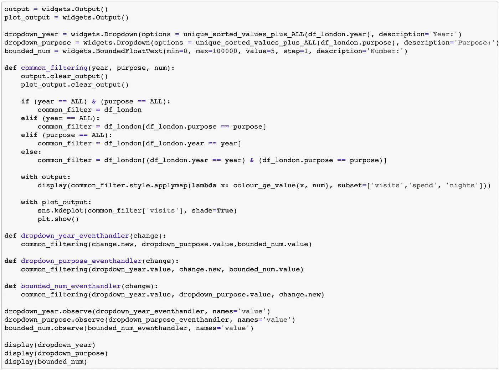

Controlling a graph

这是演示:

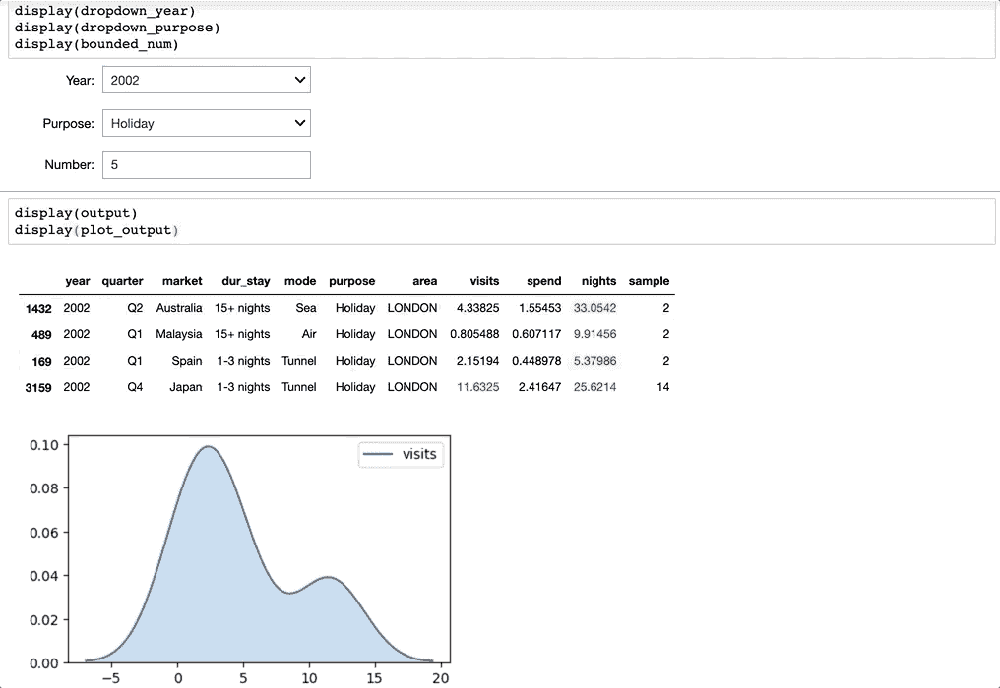

Demo: Controlling a graph

# ❻仪表板布局

到目前为止，我们的用户界面是功能性的，但是占用了很多空间。

我们将首先**水平排列**输入部件。`HBox`将从左到右一次添加一个小部件:

```
input_widgets = widgets.HBox(
[dropdown_year, dropdown_purpose, bounded_num])display(input_widgets)
```


HBox

接下来我们将为输出创建一个**容器**。`Tab`对此大有裨益。第一个选项卡将存放数据框架，第二个选项卡将存放图表。

```
tab = widgets.Tab([output, plot_output])
tab.set_title(0, 'Dataset Exploration')
tab.set_title(1, 'KDE Plot')display(tab)
```

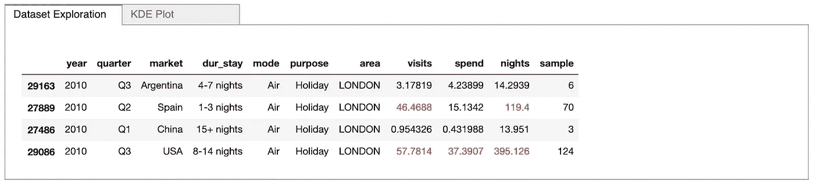

Tab

最后，我们将用一个`VBox`将输入部件和选项卡堆叠在一起。

```
dashboard = widgets.VBox([input_widgets, tab])display(dashboard)
```

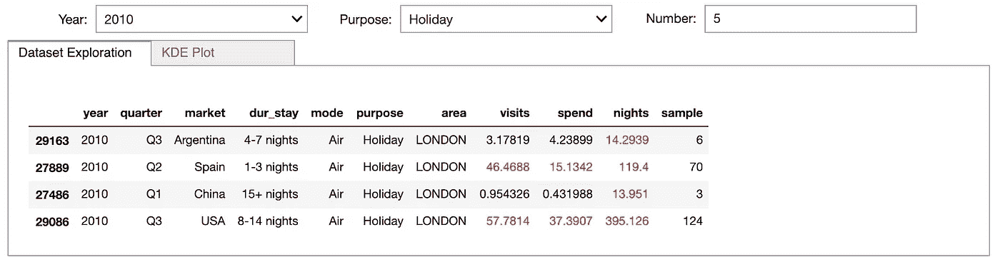

VBox

感觉有点“拥挤”,所以作为最后一步，我们将**通过添加一些空间来打磨**我们的仪表板。我们将定义一个`Layout`，在项目之间给出 50px 的边距。

```
item_layout = widgets.Layout(margin='0 0 50px 0')
```

我们将每个项目的布局称为:

```
input_widgets = widgets.HBox(
[dropdown_year, dropdown_purpose, bounded_num],
layout=item_layout)tab = widgets.Tab([output, plot_output],
layout=item_layout)
```

还有哒哒…我们的成品仪表板:

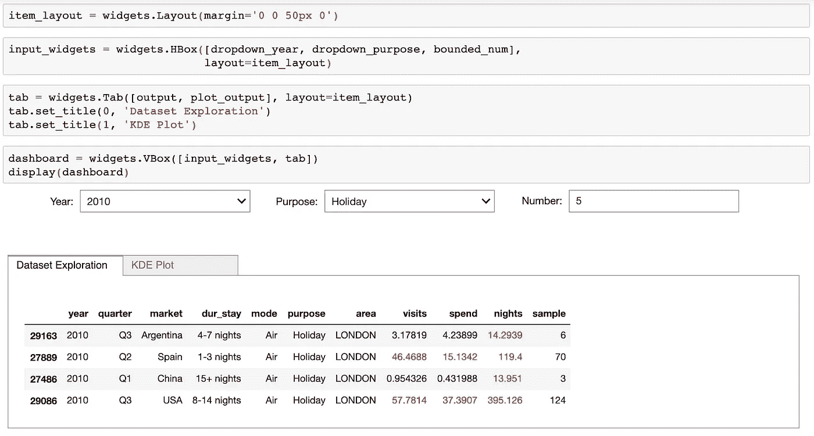

Dashboard

## 最终演示


Demo: Final Dashboard

> **PS** :出于演示的目的，在一些演示中，我使用了数据集的一个子集，即:`df_london = *df_london*.sample(250)`。

# 更进一步

您也可以使用一些第三方小部件，其中最流行的是:
二维图表: [bqplot](https://github.com/bloomberg/bqplot)
三维可视化:[pytreejs](https://github.com/jupyter-widgets/pythreejs)和 [ipyvolume](https://github.com/maartenbreddels/ipyvolume)
映射: [ipyleaflet](https://github.com/jupyter-widgets/ipyleaflet) 和 [gmaps](https://github.com/pbugnion/gmaps) 。

您还可以构建自己的自定义小部件！欲了解更多信息，请点击查看[。](https://ipywidgets.readthedocs.io/en/stable/examples/Widget%20Custom.html)


# 概述

我们看到了各种各样的小部件，但是我们仍然只是触及了表面——我们可以使用 ipywidgets 构建非常复杂和广泛的 GUI。我希望你们都同意，它们应该在任何数据科学家的工具箱中占有一席之地，因为它们提高了我们的生产力，并在数据探索过程中增加了很多价值。

感谢阅读！

*我定期在媒体上写关于技术的&数据——如果你想阅读我未来的帖子，请*[*‘关注’我*](https://medium.com/@semika) *！*