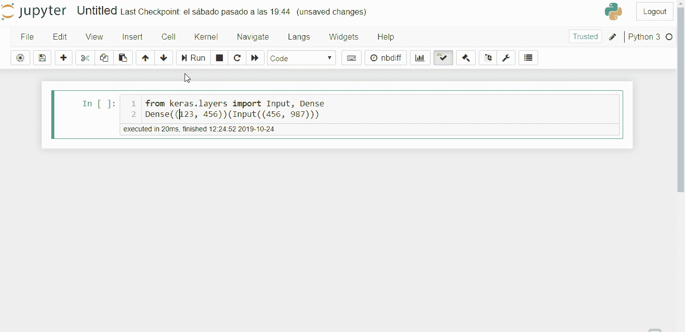

# 将 Colab 带到您身边的 Jupyter 笔记本电脑上…

> 原文：<https://towardsdatascience.com/bringing-colab-to-a-jupyter-notebook-near-you-3f326f89fae7?source=collection_archive---------13----------------------->



## Google 在 Colab 中构建了一些不错的功能。现在你可以从 Jupyter 笔记本中受益。

# 一直以来都是错误

当用 Python 编程时，当您在嵌套函数调用的堆栈中遇到错误时，这可能会令人不知所措。Python 的优势之一是它有大量高质量的可用库，并且这些库的源代码很容易获得。有时候，为了能够理解正在发生的事情，能够深入了解它是很有用的。

为了帮助您做到这一点，Google Colab 会在堆栈跟踪中自动显示指向源文件的可点击链接，以及一个方便的按钮来搜索堆栈溢出中的错误。如果 Jupyter 笔记本也能这样不是很好吗？我也是这么想的，所以我决定创建一个笔记本扩展来实现这个功能。

# 转到错误笔记本扩展

如果你还没有安装 [Jupyter 笔记本扩展](https://jupyter-contrib-nbextensions.readthedocs.io/en/latest/install.html)，你可以通过输入

```
pip install jupyter_contrib_nbextensions
```

从 GitHub 下载 [Goto 错误](https://github.com/teticio/nbextension-gotoerror)代码

```
git clone git://github.com/teticio/nbextension-gotoerror
```

像这样安装它

```
jupyter nbextension install nbextension-gotoerror
```

最后，让它如此

```
jupyter nbextension enable nbextension-gotoerror/main
```

如果一切按计划进行，您应该能够在 Jupyter 记事本的 nbextensions 选项卡中配置 Goto 错误扩展。

由于 Jupyter 服务器只能访问运行它的目录或子目录中的文件，为了使笔记本能够打开源文件，有必要提供一个到源文件目录的软链接。例如，如果您不使用虚拟环境，在 Jupyter 启动目录中创建到您的 Python 安装的 site-packages 目录的软链接(例如`~/lib/python3.6/site-packages`)，并将其称为`site-packages`。然后将 nbextension 配置中的前缀参数设置为`~/lib/python3.6`。

如果您确实使用虚拟环境，那么将软链接指向`envs`目录，并相应地设置前缀参数。

要在 Linux 中创建软链接:

```
ln -s ~/.local/lib/python3.6/site-packages site-packages
```

要在 Windows 中创建软链接:

```
mklink -d envs C:\users\teticio\Anaconda\python\envs
```

它现在应该像下面的例子一样工作。


# 你还要吗？

Google Colab 还有其他一些很棒的功能(除了免费访问 GPU 和 TPU！).例如，如果你在行尾添加一个`#@param`注释，它会自动创建一个允许用户输入值的表单。例如

`fred = 123 #@param {type : 'number'}`

弹出一个有“弗雷德”和数字 123 的表格。例如，如果您将表单中的数字更改为 456，代码将更改为

`fred = 456 #@param {type : 'number'}`

我想为 Jupyter Notebook 开发一个做同样事情的扩展，当我在做的时候，把这两个扩展都移植到 Jupyter 实验室。请让我知道，如果这是你会使用的东西。