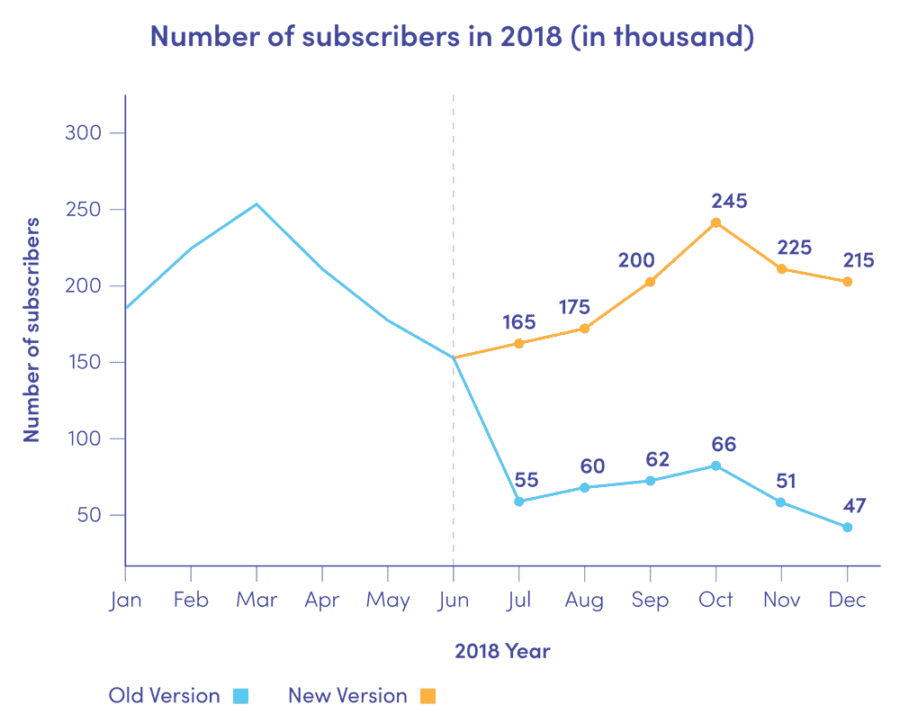
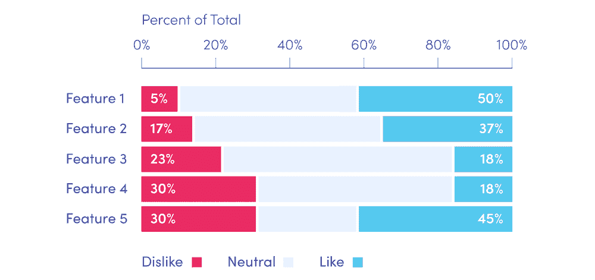
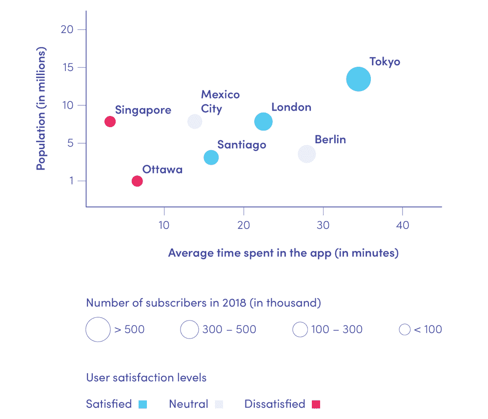

# 将数据带入生活—让他们通过数据可视化讲述他们的故事

> 原文：<https://towardsdatascience.com/bringing-data-to-life-let-them-tell-their-story-with-data-visualisation-13e71f6553a6?source=collection_archive---------7----------------------->

有人可能会认为，数据科学，由于其名称以及与统计学和软件开发的密切关系，是一个纯粹的技术领域。但是当一个人深入挖掘现代数据分析的应用时，他们可能会发现清晰而公正地呈现分析结果几乎和分析本身一样重要。正确的数据可视化不仅需要一些高级图表类型的技术技能和知识，还需要绘制图片和用数据讲述故事的能力，这使它成为数据科学的一个“艺术”部分。

数据可视化在商业中起着特别重要的作用，在商业中数据分析被广泛应用。数据建模和分析的结果通常会影响利益相关者的想象力并激发他们的决策，因此他们正确理解分析的结果是至关重要的。然而，最高管理层很少对预测模型和统计有深入的了解(或者有时间去钻研它们的数学细节)。以清晰、全面和吸引人的方式直观地呈现数据，对他们以数据为导向的决策过程有很大帮助。在这篇短文中，我们提出了一些如何将数据转化为有效的、发人深省的故事的技巧。

# 了解业务

在商业领域，数据科学家的工作是通过数据分析帮助公司发展和解决问题。数据科学家可以对战略业务决策和公司发展方式产生巨大影响。随着数据科学对公司运营方式的影响越来越大，其对财务结果的影响也将增加。这意味着数据科学家了解他们工作的行业并了解他们公司的当前目标至关重要。他们需要知道最关键的问题是什么，以及可以应用什么实际手段来解决这些问题。这样，数据科学家的注意力将总是最有效地集中，他们的工作成果将在实践中适用。

# 消除杂乱

在一张图上放太多的视觉元素会使它变得复杂和难以理解。如果一个图表太混乱，你可能会失去你的听众的注意力，他们会专注于“解读”它，而不是听你想告诉他们的故事。这样，非但不会强化，反而会模糊你的信息。因此，你应该再三考虑你想在你的图表上放什么，以及每一项的目的是什么。确保你演讲的每一个元素都有助于观众理解你想告诉他们的信息。

Chart 1\. *The number of subscribers of two versions of a mobile app (illustrative data).* Additional elements can help tell the story of the data. The vertical line in the graph above splits its area into two parts corresponding to time periods before and after the release of a new version of an application. Displaying number values only on the right-hand side of the line focuses the attention on what happened after the upgrade, and eliminates unnecessary clutter on the left-hand side.

# 将注意力集中在你想要的地方

为了集中你的观众的注意力，重要的是你要思考他们是谁，他们的背景是什么，以及他们如何看待这个世界。对于一个非常技术性的工程师小组，以及一个教室里的一群中学生，你可能会使用不同的图表。您可以使用大小、颜色、形状和在页面上的位置等属性，使图表引人入胜，并将受众的注意力吸引到您希望他们看到的区域。这将有助于你以你认为最好的方式引导他们完成你的演示。不要害怕偏离一些“标准”的数据呈现方式，或者添加额外的元素，如箭头、圆圈甚至文本框。如果有东西可以讲述你的数据的故事，那就使用它！

Chart 2\. The *share of opinions of 5 selected features of a mobile app (illustrative data).* A stacked horizontal bar is a good choice for presenting percentage data in groups. Choosing the right order and position of groups (‘Features’ in the above graph), as well as color and order of bar segments (‘Dislike’/’Neutral’/’Dislike’), we can focus the audience’s attention on the selected elements and — more importantly — facts they represent. Note that in the above graph, using contrasting colors, and specifying numerical values highlights extreme bar segments, and tells the central message at first glance at the chart.

# 像设计师一样思考

在进行数据可视化的时候，把它当成你想卖给观众的产品。像设计师一样思考，并回答你的观众将如何与你的演示互动的问题。布局是否清晰？图表中是否有可能引起混淆的内容？随后的图表是否按逻辑顺序排列，从而创建一个易于理解的演示文稿？另一方面，观众是会对他们看到的提出问题，还是只听你的解释？他们可能会对你的工作进行评论或补充吗？

Chart 3\. *The number of subscribers, user satisfaction level, and average time spent daily in an application for selected cities, along with information about the cities’ population (illustrative data, except population values).* Bubble chart can help tell a comprehensive data story with only one picture. Adding colors based on one of the data features to each of the bubbles, increases the dimensionality of the graph, broadening and enriching its message. Just remember to keep it all visually clear, and to add a complete legend, to keep your audience from getting lost in the abyss of the presented data.

# 讲故事

故事是神奇的。用一个故事与你的听众交流，并从情感上吸引他们。通过在演示开始时给你的听众一点提示，让他们对你将要演示的结果感到兴奋。但是不要一开始就告诉他们一切！悬念是抓住和保持注意力的关键。因此，在此基础上，让你的观众对接下来的内容感到好奇和兴奋。

此外，从更实际的角度来说，事先想想你的听众在看你的演讲时可能会有什么问题，然后把这些问题的答案融入到你的叙述中。这样你的故事会更完整，你的陈述会更少被打断。

# 总结:

每个数据集中都有一个隐藏的故事。你讲这个故事讲得有多好，你如何激励你的观众采取行动，都取决于你自己。请记住，要格外注意你在故事中绘制数据的方式，因为*“一张图胜过千言万语”*。伟大的故事激发伟大的思想。确保你的听众不仅记得他们所听到的，而且被数据可视化的神奇魅力所激励。

## 参考资料:

科尔努斯鲍默克纳弗利克，*用数据讲故事。面向商业专业人士的数据可视化指南*

作者:michahrabia，Miquido
的数据科学家，合著者/致谢: [Karolina Holewa](https://medium.com/@karolina.holewa) ，Miquido 的初级数据科学家