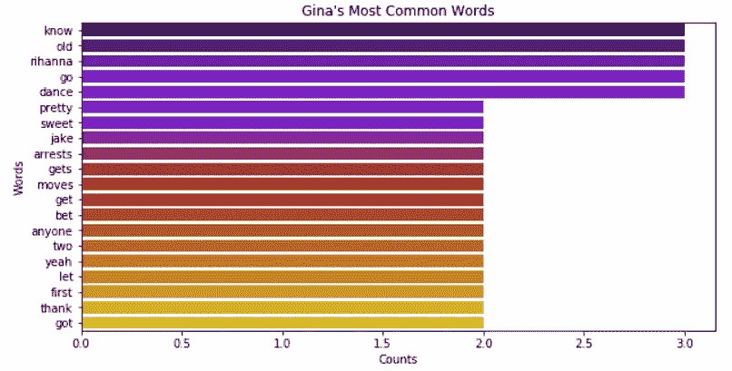

# 布鲁克林九九遇上数据科学

> 原文：<https://towardsdatascience.com/brooklyn-nine-nine-meets-data-science-d846a901e12c?source=collection_archive---------24----------------------->

## 探索布鲁克林九九的试播集的 Seaborn 可视化

> 这份工作(数据科学家)正在活生生地吞噬我。我不能再呼吸了。这些年来我一直想做个好人，戴白帽子的人。我没有变得像他们一样…我就是他们——杰克·佩拉尔塔，飞行员

我最近疯狂地看了网飞的一个名为**的节目，我真的很喜欢。当我急切地等待下一季的发布时，我认为对《T4》试播集进行探索性的数据分析和情感分析会很有趣。**

我在网上找到了脚本，并将文本提取为 CSV 文件格式。您可以在我的 [Github 资源库](https://github.com/melozap/Brooklyn-99-Pilot-Analysis)中找到本文的所有代码。

# 我们开始吧！

*试播里哪个角色台词最多？*

Of course, Jake has the most lines

Image of Jake Peralta, played by Andy Samberg

考虑到杰克·佩拉尔塔是我们的主要主角和主角，他在该剧的试播集里拥有最多台词是有道理的。

接下来，我们将探索并可视化这一集的单词分布。

*试播中哪些人物平均用词最多***？**

**

*Gina… What does this mean?*

*非常有趣…虽然 Gina 的台词比 Jake 少，但当她有机会说话时，她平均使用更多的单词。*

**试播中哪些人物使用最多的词语***？***

****

**现在我们已经很好地理解了单词在试验中的分布，我们可以继续下一步了。我们应该清理我们的文本，看看我们的角色在对话中是否使用了有意义的词语。**

****

**Image of Gina Linetti, played Chelsea Peretti**

**该`clean`过程包括:**

*   **标记和降低文本**
*   **删除标点符号**
*   **删除字母数字字符**
*   **移除停用字词(不提供意义的常用字词，如'*、*或' *a'* )**

***每个字符的总字数与干净字数***

****

**有意思。即使采用我们的`clean`流程，吉娜平均仍在使用更多的单词。**

**她的秘密是什么？**

**我们应该通过探索情感分析来更深入地研究文本分析。情感分析是一种非常流行的文本分析方法，用于确定文本中单词的态度或情感。**

****

**Image of Captain Raymond Holt, played by Andre Braugher**

**一些流行的情感分析工具包括:**

*   **维德情绪**
*   **AFINN 词典**
*   **文本 Blob**

**有关情感分析的更多信息，请查看下面的链接:**

** [## 情感和情绪分析:NLP - KDnuggets 实践指南

### 情感分析被广泛使用，特别是作为任何领域的社交媒体分析的一部分，无论是商业，还是文化

www.kdnuggets.com](https://www.kdnuggets.com/2018/08/emotion-sentiment-analysis-practitioners-guide-nlp-5.html) 

*试播中普遍情绪如何？*

*我们人物台词的感悟是什么？*

最后一步，我们现在可以深入单词本身。我们来看看杰克、吉娜和霍尔特船长使用的最常见的词语。

*杰克最常用的单词是什么？*

*吉娜最常说的话是什么？*

*霍尔特最常用的词是什么？*

耶，我们完成了！如果你喜欢这个，请随时查看我下面的参考资料。

参考资料:

【飞行员】*布鲁克林九九*。2013 年 9 月 17 日。电视。

 [## 如何用 Python 清理机器学习的文本

### 你不能直接从原始文本去拟合机器学习或深度学习模型。你必须清理你的文字…

machinelearningmastery.com](https://machinelearningmastery.com/clean-text-machine-learning-python/)  [## 水平条形图- seaborn 0.9.0 文档

### 编辑描述

seaborn.pydata.org](https://seaborn.pydata.org/examples/horizontal_barplot.html)  [## 飞行员成绩单

### 我们从杰克·佩拉尔塔走出汽车开始。我们听到了他的画外音，当他跳过一些磁带，走向…

brooklyn99.fandom.com](https://brooklyn99.fandom.com/wiki/Pilot_Transcript)  [## 非常简单的 Python 脚本，用于从故事中提取最常见的单词

### 人们经常需要快速检查和绘制像故事这样的大型文本文件中最常用的单词。怎么做？

towardsdatascience.com](/very-simple-python-script-for-extracting-most-common-words-from-a-story-1e3570d0b9d0)**