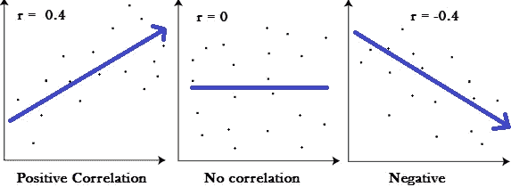

# 分类问题中变量选择的强力技术

> 原文：<https://towardsdatascience.com/brute-force-variable-selection-techniques-for-classification-problems-5bca328977e5?source=collection_archive---------7----------------------->

变量选择是建立准确可靠的预测模型的重要一步，需要大量的创造力、直觉和经验。你一定看到过数百篇讨论变量选择技术的文章，其中很多都是关于理解数据，从统计学的角度感受数据。检查哪些变量具有低方差，哪些变量彼此之间以及与目标变量之间高度相关，等等。所有这些都是有用的技术，除非您遇到一个包含大约 20k 个变量的数据集，而没有全面的元数据！我以数据科学家的身份为一家大型汽车公司工作，并试图使用 ADAS(自动驾驶辅助系统)生成的内部信号建立一个模型。这些信号通常包括不同的速度、加速度、与被检测物体的距离、制动踏板状态和系统的许多状态变量。

现在，我有许多需要预测建模的用例，但我们将考虑其中一个，以便我们可以更好地关联。ADAS 有一个碰撞警告系统，每当它检测到可能与附近的物体发生碰撞时，就会发出警告。该警告通常是正确的或真实的，但有时它给出错误的警告，这对驾驶员来说是不方便的。我们的目标是建立一个模型，可以预测碰撞警告是否是假的。让我们不要被问题所左右，把注意力集中在数据上。我们的目标变量是二元的，我们有大约 20，000 个变量，包括连续变量、分类变量和离散变量。

因此，基于我们的需求，我们的变量选择技术将有两个方向——我们需要能够向最终用户详细解释我们的模型，并陈述我们的模型所基于的变量吗？还是我们只想得到最大的准确性？如果是前者，我们需要根据变量的预测能力或对目标变量的影响来筛选变量。

## 点双列相关

如果目标变量是二元的，点双列相关是选择变量的一个好方法。点双列相关用于测量一个连续变量和一个二分变量之间的关联强度和方向。这是[皮尔逊积差相关](https://statistics.laerd.com/spss-tutorials/pearsons-product-moment-correlation-using-spss-statistics.php)的一个特例，适用于有两个连续变量的情况，而在这种情况下，其中一个变量是名义二进制变量。和其他[相关系数](https://www.statisticshowto.datasciencecentral.com/probability-and-statistics/correlation-coefficient-formula/)一样，点双列的范围从 0 到 1，其中 0 表示没有关系，1 表示完全关系。

我们用目标变量计算每个连续变量的系数，然后根据阈值系数(例如 0.5)选择最高的高度相关变量。使用这个，我能够从我的数据集中的大约 15，000 个变量中过滤出 50 个变量。

## 卡方

下一项技术是卡方检验——用于检验两个事件的独立性。如果给定两个事件的数据集，我们可以得到观察到的计数和预期的计数，这个测试测量两个计数相互之间的偏差。卡方统计通常用于测试分类变量之间的关系。卡方检验的无效假设是总体中的分类变量之间不存在关系。你可以在这里阅读更多关于如何进行测试的信息:[https://www . statistics solutions . com/using-chi-square-statistic-in-research](https://www.statisticssolutions.com/using-chi-square-statistic-in-research/)。所以，我不会深入测试的细节，但这个想法是使用测试过滤独立的分类变量。

## **特性差异**

另一种用于过滤掉不会给我们的模型增加价值的变量的技术是方差阈值方法，该方法移除方差不满足某个阈值的所有特征。该方法可以在上述任何方法之前使用，作为一个起点，并且与目标变量没有太大关系。通常，它会移除所有零方差特征，这意味着所有样本中具有相同值的所有特征。

## 特征重要性

我们可以使用基于树的分类器模型的特征重要性特征来获得每个特征相对于目标变量的重要性:

我们可以基于特征重要性选择前 n 个特征，这对于我们可能想要使用的任何分类算法都会给出好的结果。

## 线性判别分析

接下来，让我们看看一些转换技术，在这些技术中，我们不能保留原始变量，但可以获得更高的精度。LDA 和 PCA 是两种这样的技术，尽管已知 PCA 在许多情况下表现良好，但我们将主要关注 LDA 及其应用。但是首先，让我们快速看一下 LDA 和 PCA 之间的一些主要区别:

当类别标签已知时，线性判别分析在多类别分类任务中通常优于 PCA。然而，在某些情况下，PCA 表现得更好。这通常是当每个类的样本量相对较小时。一个很好的例子是图像识别技术中使用的分类精度之间的比较。线性判别分析 Python 有助于将高维数据集降低到低维空间。我们的目标是做到这一点，同时在类之间有一个体面的分离，并减少资源和计算成本。我们可以使用 LDA 类的解释方差比属性来决定最适合我们需要的组件数量。看一看:

如果我们对保留原始特征集不感兴趣，LDA 提供了一种很好的方法来将我们的数据转换到选定数量的新维度空间，这是分类算法的更好输入。

现在，让我们把我们为非转换情况讨论的所有技术放在一起，作为代码形式的一系列步骤:

函数 variable_selection 返回一个新的 dataframe，其中只包含通过各种过滤器后选择的列。应该仔细选择函数的输入，例如方差阈值、点双列系数阈值、卡方统计阈值和特征重要性阈值，以获得期望的输出。

请注意，这只是一个变量选择的框架，而本质上在很大程度上是一个手动练习。我写这段代码是因为我觉得很多过程可以自动化或半自动来节省时间。我的建议是使用这个函数作为起点，对特定的数据集和问题陈述进行任何您认为合适的更改，然后使用它。

祝你好运！