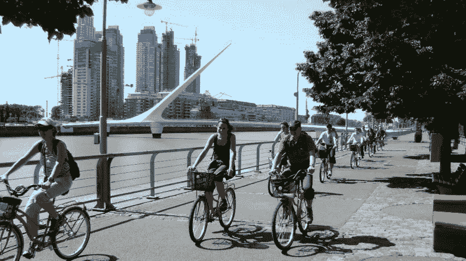
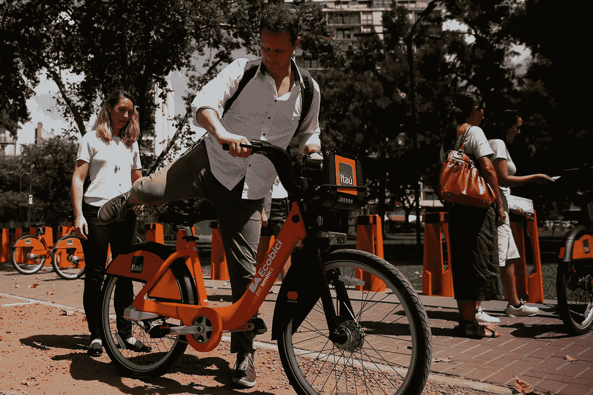
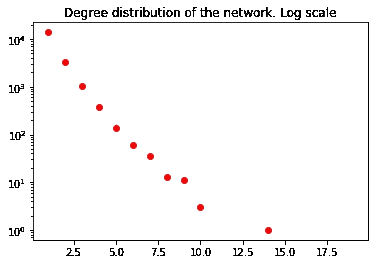
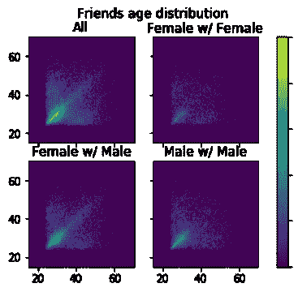
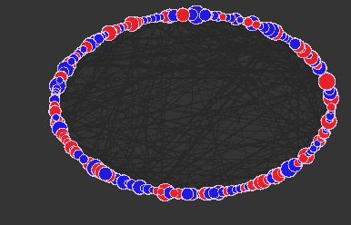
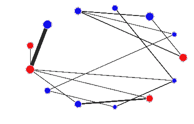
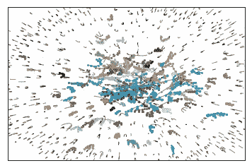
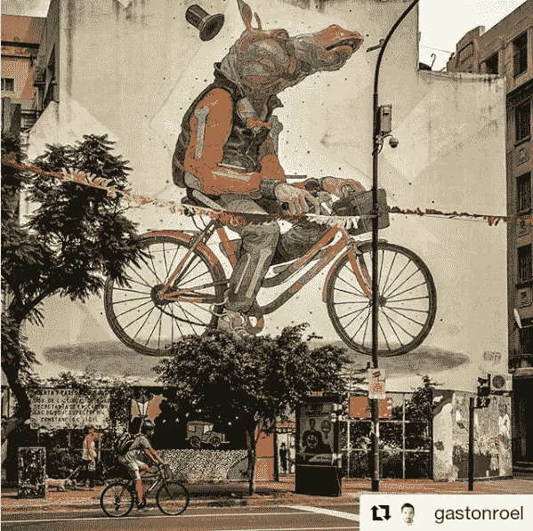

# 布宜诺斯艾利斯自行车道:让我们一起去兜风

> 原文：<https://towardsdatascience.com/buenos-aires-bicycle-lanes-ii-1a40b13ccc25?source=collection_archive---------18----------------------->

Riding a bike in BA. Isn’t the Women’s Bridge beautiful?

谁不喜欢在公园里骑自行车呢？布宜诺斯艾利斯人(“porteos”，这个词指的是我们的港口)，显然喜欢它。

在本文中，我们将继续进行一些分析，目的是识别和理解隐藏在布宜诺斯艾利斯 Ecobicis [公开数据](https://data.buenosaires.gob.ar/dataset/bicicletas-publicas)中的社会模式。

该数据集提供了自行车站点的地理定位和以下方面的数据点:

*   谁(当然是匿名的)骑了一辆自行车。
*   他们从哪里拿走的，又放在哪里。
*   确切的时间。
*   全程旅行。

我的好朋友[费德·卡塔拉诺](https://medium.com/u/4e5cebb88a6c?source=post_page-----1a40b13ccc25--------------------------------)谈了很多关于这个数据集[的特征，并展示了一些不错的统计分布。它是西班牙语的，但你不需要懂这种语言就能欣赏美丽的情节。](https://medium.com/@fcatalano/bicisendas-en-buenos-aires-a29f62bc9e7c?postPublishedType=repub)

他关注的是上下班的人。我们要分析一些隐藏在数据中的社会聚类。也就是说，我们将尝试检测一起使用自行车的人群。

考虑到这个目标，我们应该将数据限制在人们将自行车归还给他们从那里拿走的同一个站点的事件上。通过这种方式，我们清理了数据，只考虑与人们骑自行车出行相关的事件。

一个人去兜风很有趣，但我也很喜欢朋友和我一起去。为了检查其他人是否同意我的观点，我们建立了一个图表，其中两个用户共享一个链接，当且仅当他们中的至少一个人在几乎相同的时间从同一个车站骑走了一辆自行车，并一起归还(也是到同一个车站)。

5%的事件是人们把自行车归还到他们把自行车拿走的地方。那些事件。90%的人是一个人去的。但是另外 10%的人是一起去的。由此，模式开始出现。

网络具有幂律度分布，就像大多数真实世界的网络一样。

The person with 15 different friends to go for a ride with must be having a great time!

我们还可以检查人们的年龄与友谊的关系。不出所料，年龄相同的人更有可能一起出去玩:

Heat map for relations based on age and gender.

也许你希望看到家庭，但不幸的是，孩子们很难为这项服务创建用户。在我们的实验中，最小的人是 15 岁。

我们从图表中可以观察到的是 40 岁以上的男女关系的强烈模式，这是同性友谊所缺乏的。也许，由于异性性关系在统计上比其他性关系更丰富，我们所看到的是已婚夫妇在一起的快乐？我打赌我们是！

# 团体

如果我们把网络分成相连的部分，结果是——正如你可能怀疑的那样——许多人只是成对外出，但也有许多团体！我们找到了 300 个 5 人以上的小组。连通分量的大小分布也遵循幂律，最大的组是大小为 195 的异常值。这是:

Bicycle users and friendships.

*   节点颜色等于性别，红色为雌性，蓝色为雄性。
*   节点大小与年龄成正比。
*   边缘宽度与共享的行程量成比例。

查看我的笔记本(即将推出)了解其他小组。好，再来一个:

That pair are really good friends!

然而，连接组件并不是检测社区的好方法(也许我会在另一篇文章中详细讨论)。

检测社区的一个好方法是[卢万算法](https://en.wikipedia.org/wiki/Louvain_modularity)。对于这个项目，我们使用了简单有效的 [Python 实现](https://python-louvain.readthedocs.io/en/latest/api.html)。结果如下——你可以想象成群结队的骑自行车者在布宜诺斯艾利斯各处享受他们的闲暇时光:

Cyclists’ communities — social interaction is everywhere

这些社区在地理上是如何分布的？它们是如何随着时间进化的？更多将在新的职位。

# 附录

最后一件事。费德里科是社会科学家，我是数学家。但是，为了这个项目，我们交换了帽子。如你所见，他处理了数据集的大部分数字分析——他在这方面很棒——而我处理了隐藏的社会模式。

永远不要害怕换帽子，只是去兜风。

Credit: gastonroel