# 通过机器学习构建免佣金的 Algo 交易机器人季度收益报告[完整指南]

> 原文：<https://towardsdatascience.com/build-a-commission-free-algo-trading-bot-by-machine-learning-quarterly-earnings-reports-full-b414e5d759e8?source=collection_archive---------11----------------------->

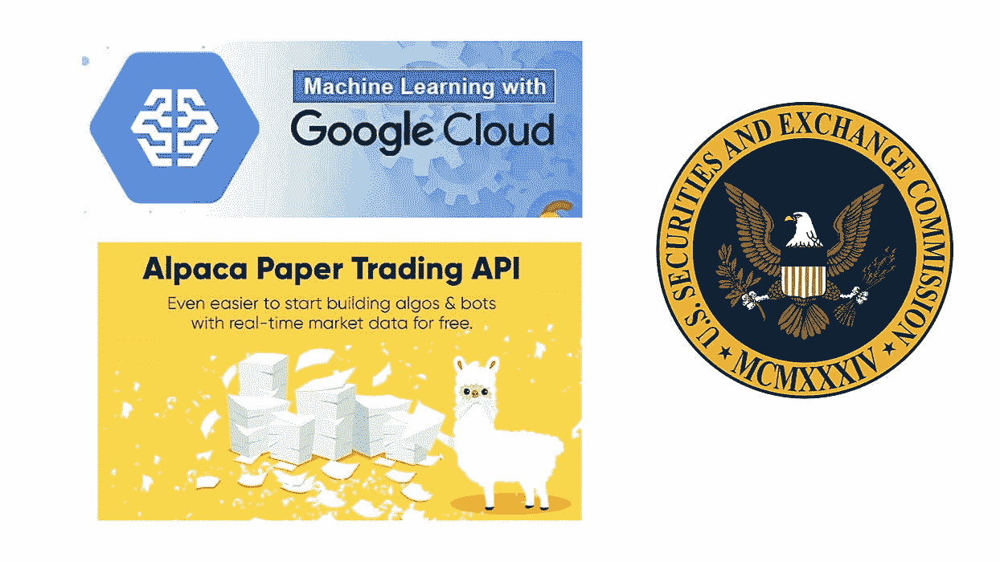

**简介**

以下是一个完整的指南，将教你如何创建自己的算法交易机器人，它将根据美国上市公司提交给 SEC 的季度收益报告(10-Q)进行交易。我们将涵盖从下载历史 10-Q 文件，清理文本，并建立您的机器学习模型的一切。ML 模型的训练集使用来自这些历史归档的文本和归档后的第二天价格动作作为特征标签。

然后，我们下载并清理每天的 10-Q 文件，并使用我们训练有素的模型对每个文件进行预测。根据预测，我们将自动在该公司的股票代码上执行免佣金交易。

# 属国

0.**我们的项目代码:**

[https://github . com/plator solutions/quarterly-income-machine-learning-algo](https://github.com/PlatorSolutions/quarterly-earnings-machine-learning-algo)

1.**基础依赖:Python 3.4，Pandas，BeautifulSoup，yfinance，fuzzywuzzy，ntlk**

对于这样的项目，Python 一直是我首选的语言，原因与许多其他人选择它的原因相同——快速的开发、可读的语法和大量可用于大量任务的高质量库。

Pandas 是任何数据科学项目存储、操作和分析数据框架表中的数据的经典之作。

yfinance 是一个 python 库，用于从 Yahoo Finance 检索股票价格。

fuzzywuzzy 为创建我们的 10-Q 差异提供了模糊文本相似性结果。

Ntlk 允许我们根据句子拆分 10-Q 报告的文本。

2.**羊驼免佣金交易 API(**[**https://alpaca.markets/**](https://alpaca.markets/)**)**

我研究并尝试了几个股票经纪人的解决方案，这些经纪人声称为散户交易者提供 API。羊驼是最容易使用的，文档最清晰。(我与他们没有关系)我测试的其他经纪人有:

**互动经纪人**

在网上搜索，这些家伙似乎有一个在该领域的“黄金标准”的声誉。然而，在测试他们的软件时，它真的让大多数零售交易 API 的可悲状态大开眼界。事实证明，他们没有你所期望的实际 API，而是一个令人震惊的古老桌面应用程序，供你安装，然后库自动控制桌面应用程序。

他们的文件杂乱而复杂。在几次尝试运行他们的示例代码和尝试一些测试交易后，我可以说，将 IB 作为 algo 交易机器人的稳定部分是可能的，但这本身就是一个重要的项目。

TD Ameritrade 思考或游泳

很明显，ToS 的 API 比互动经纪人的更新更好用。然而，同样明显的是，这不是一个成熟的解决方案。虽然我确实让它工作了，但是甚至使用 API 的初始认证过程也很奇怪，并且需要在各种论坛上找到的未记录的信息才能让它工作。交易执行 API 本身看起来很容易使用，但是关于它们的书面文档非常少。

3.**谷歌云 AutoML 自然语言**

由于其作为搜索引擎的业务性质，Google 自然在 ML 自然语言处理方面拥有丰富的经验和投资。在尝试了其他几种 ML 技术和解决方案后，Google 的商业解决方案产生了模型的最佳准确性，同时提供了一种足够容易使用的解决方案，该项目不会陷入对各种 ML 算法进行无休止的手动调整和测试的学术练习中。

**测试了其他 ML 库**:最初我尝试了以下 ML 库，并从归档文本中创建了一个二元模型包用作特性集:h2o.ai、Keras、auto-sklearn 和 AWS Sagemaker。

这种技术的一个大挑战是，对来自二元模型包的文本进行矢量化，会为训练集的每个数据点创建大量的特征。有各种技术可用于处理这种情况，但预测质量可能会或不会有不同程度的损失。

4.Python-edgar :一个整洁的小 Python 库，用于批量下载 SEC 历史文件列表([https://github.com/edouardswiac/python-edgar/](https://github.com/edouardswiac/python-edgar/))

# 第一步。下载历史 10-Q SEC 文件列表

为此，我们将从 https://github.com/edouardswiac/python-edgar/[下载并安装 python-edgar](https://github.com/edouardswiac/python-edgar/)

使用 run.py 将目录切换到文件夹，并使用以下命令下载历史归档:

> *>python run . py-y 2010*

我选择下载近 10 年的数据(从 2010 年开始)来构建我们的 ML 模型。您可以一直下载到 1993 年，也可以用不同的年份参数少下载一些。

完成后，我们可以将结果编译成一个主文件:

> *>猫*。tsv > master.tsv*

现在使用 quarterly-earnings-machine-learning-algo/download _ raw _ html . py 下载我们刚刚创建的索引中列出的所有原始 html 10-Q 文件:

> *>python download _ raw _ html . py path/to/master . tsv*

这将需要大量的时间来运行，因为它将从 SEC.gov 网站下载许多 GB 的数据。每个文件平均有几十兆的数据。当它完成时，我们将有一个文件夹`"./filings"` 包含所有文件的原始 html。

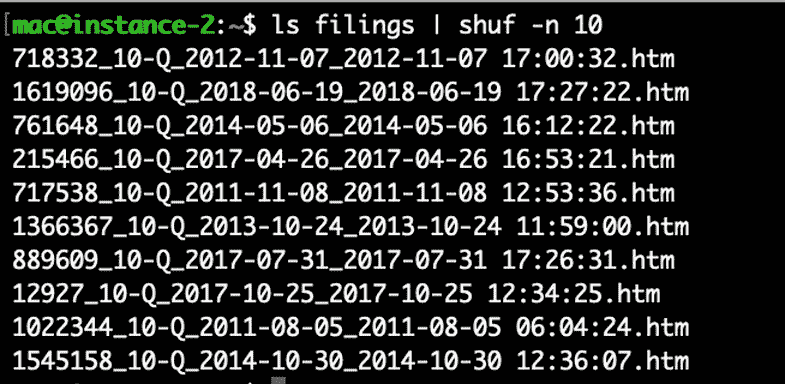

文件名的格式为: <cik number="">_ <filing type="">_ <filing date="">_ <acceptance date="">。超文本标记语言</acceptance></filing></filing></cik>

# 第二步。清理锉屑

我们将运行 quarterly-earnings-machine-learning-algo 项目中的以下命令，将每个文件中的 html 清理为准备好的文本:

> *>python filing _ cleaner . py*

这将使用上一步中创建的“归档”目录中的 html 文件，并输出到包含已清理文本文件的“清理 _ 归档”目录中。

这将进行以下清理，为自然语言处理准备文本:

1.  条带 HTML
2.  删除通常包含定量财务数据的大部分数字表格
3.  移除链接
4.  去除空白
5.  删除有限数量的停用字词(特定日期、数字等)
6.  规范化文本

这也将根据美国证券交易委员会用来识别公司的 CIK 号码来查找交易的股票代码。

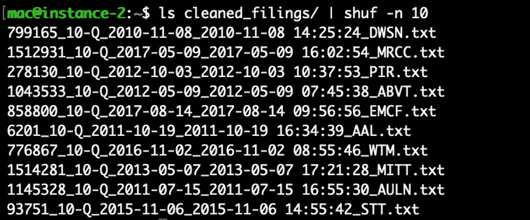

文件名的格式为: <cik number="">_ <filing type="">_ <filing date="">_ <acceptance date="">_ <ticker symbol="">。文本文件（textfile）</ticker></acceptance></filing></filing></cik>

# 第三步。下载财务数据

在这一步中，我们下载公司在每次 SEC 备案后当天的股票市场开盘价，然后下载备案后两天的开盘价。我们使用这个百分比价格变化作为我们想要为我们的机器学习数据点预测的目标标签。最初，我创建了一个算法，以开盘价和当天收盘价进行交易。然而，在实时交易中使用它需要一个日内交易账户，对于一些读者来说，25，000 美元的最低账户可能是遥不可及的。

此外，我们将使用的 SEC 备案文件限制在收盘后提交的文件。在盘后发布季度收益是大多数公司普遍采用的做法。我们有大量的数据点可以使用，所以我们将把它限制在这些数据点上，因为对市场时段发布的季度收益使用价格行为会在我们的数据样本中产生异质性。

如果在运行这个命令之前您还没有安装 yfinance，请使用 pip 来安装它。

> *>python add _ financial . py*

它从上一步创建的“cleaned_filings”目录中读取带有股票代码的文件名，并输出 financials.pkl，这是一个 Pandas 数据帧，包含每个文件的所有次日价格变化。

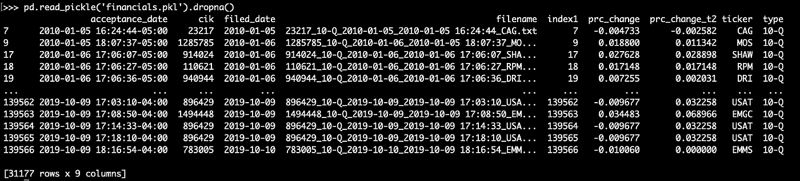

**第四步。从公司最近的 10 季度报告中产生每个季度收益的文本增量**

在这一步中，我们将获取每一份清理过的季度收益报告，并逐句对该公司上一份 10-Q 文件进行模糊区分，以删除也出现在他们上一份文件中的文本。这是一个重要的步骤，它去除了大量多余的文本，并创建了一个清晰的报告，说明该公司自上一季度收益报告以来增加了什么。

这为我们建立机器学习模型创造了一个非常干净的信号，因为只有公司认为足够重要的信息才会添加到他们的最新文件中，才会成为我们训练数据的一部分。

记得在运行之前使用 pip 安装 nltk 和 fuzzywuzzy 依赖项。

> *>python diff _ cleaned _ filings . py*

该命令将从“cleaned_filings”目录中获取已清理的文本文件，并输出“whole_file_diffs”目录中每个已清理文本文件的文本增量。

# 第五步。准备我们的训练数据的 CSV 以上传到 Cloud AutoML 自然语言

现在，我们将整理 10-Q diffs(培训功能),并将其与第二天的价格变化(培训标签)一起编译成 CSV。我们将通过在每个第 20 百分位将价格变化分成 5 个时段来创建谨慎的培训标签。因此，我们的 0 桶将有底部的 20%(最显著的价格下降)，我们的 4 桶将有顶部的 20%(最显著的价格上升)。

> *python cloudml _ prepare _ local _ CSV . py*

这将在当前目录中输出一个名为“training_data.csv”的文件，准备上传到 Google。

# 第六步。在 Cloud AutoML 自然语言上上传、训练和评估我们的 ML 模型

如果你还没有谷歌云平台账户，你可以在这里注册:【https://cloud.google.com/free/ 

一旦你有了一个帐户，我们就可以在这里访问 Cloud AutoML 自然语言控制台:[https://console.cloud.google.com/natural-language/dashboard](https://console.cloud.google.com/natural-language/dashboard)

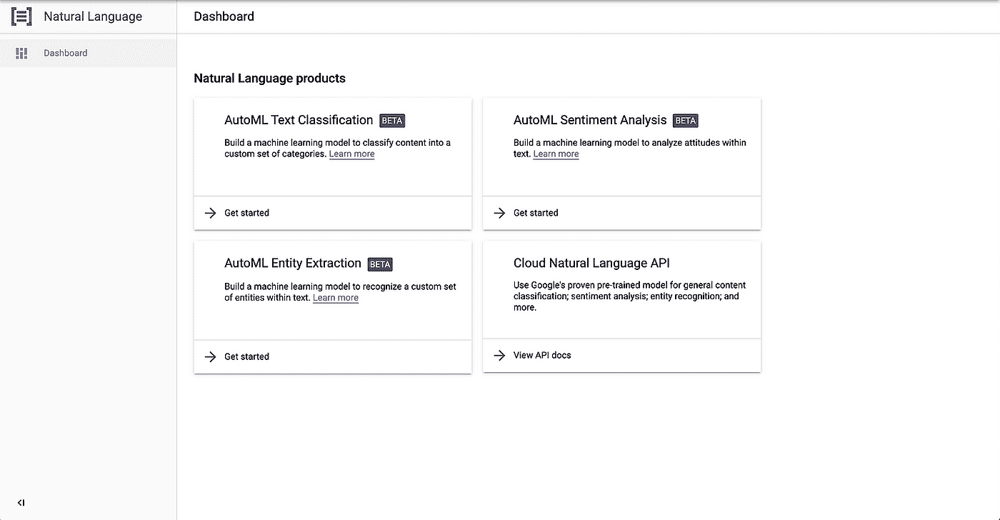

在这里，我们将点击“自动情感分析”。虽然我们不是在分析文本的情绪，但本质上，我们将使用股票价格反应作为季度收益报告“情绪”的衡量标准，将此建模为情绪分析问题。

单击“new dataset”，选择情绪分析，并将最大情绪得分设置为 4，因为我们有在上一步中创建的 5%价格变化时段。

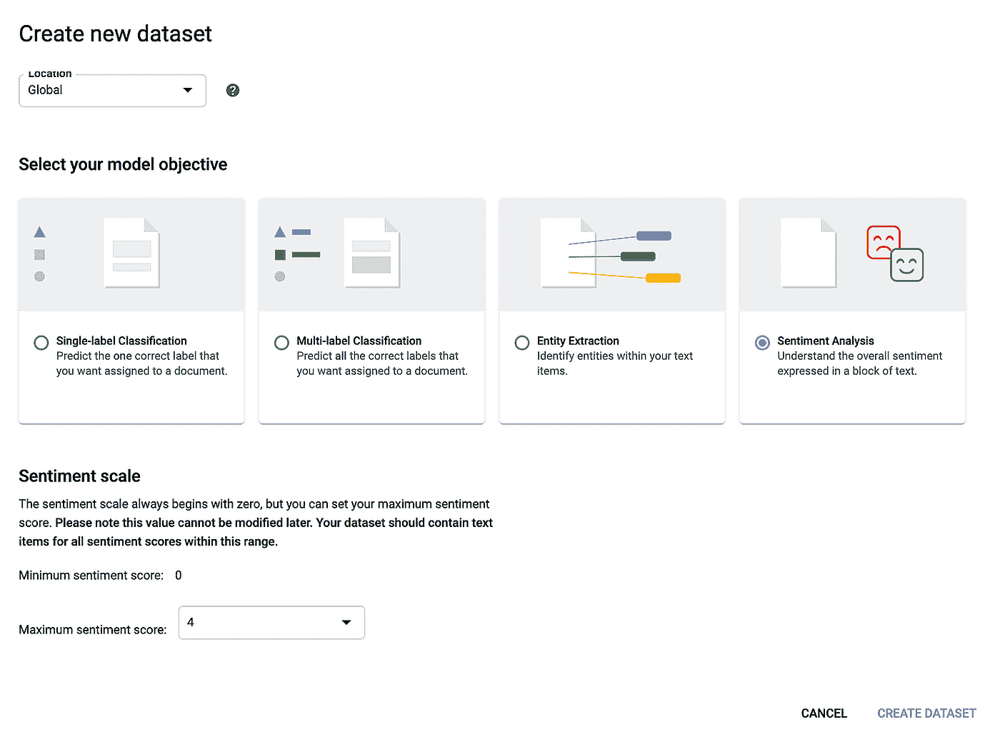

我们现在将导入在上一步中创建的 CSV 文件，然后单击 import。导入完成后，您将收到一封电子邮件。然后，您可以返回到仪表板，并单击培训。如果你有任何问题，你可以参考谷歌的文件在这里:[https://cloud . Google . com/natural-language/automl/sensation/docs/](https://cloud.google.com/natural-language/automl/sentiment/docs/?_ga=2.2649267.-2046989433.1573506374)

该模型将需要几个小时的训练，当它完成时，我们会收到一封电子邮件。然后我们可以分析结果:

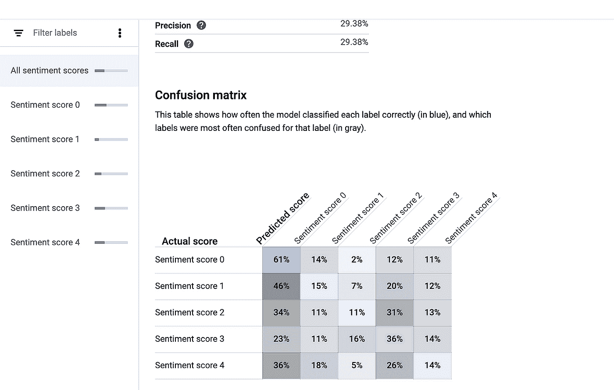

这里我们看到了模型的混淆矩阵。如果你不确定如何解释，你可以谷歌一下“困惑矩阵”。我们可以看到，我们实现了近 30%的准确率和召回率，而由于我们有 5 个存储桶，随机机会应该是 20%。那比随机几率好 50%！

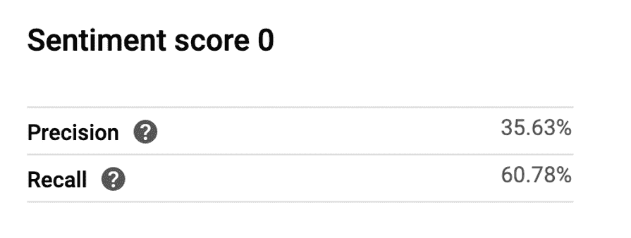

如果我们看一下情绪得分为 0 的结果(记住这是价格变化最负的 20 个百分点)，我们会看到我们得到了最好的准确性。当我们使用我们的模型预测季度收益报告将产生最剧烈的价格下跌时，我们将有 35.63%的时间是正确的。这比随机机会好了 75%以上！

我们用这个桶做得最好是有道理的。它告诉我们，当一份季度收益报告包含某些负面指标语言时，它将更可预见地产生戏剧性的股价下跌。这符合一句古老的谚语“卖新闻”。

# 第七步。下载今天的 10-Q 文件，进行在线预测，并开始交易！

注册羊驼经纪人账户开始交易:【https://alpaca.markets/ 

他们允许你快速方便地在纸币账户上交易，而不需要输入任何银行信息，这非常好。我们可以用这个纸币账户开始。

注册后，您需要从仪表板中检索您的 API 密钥:

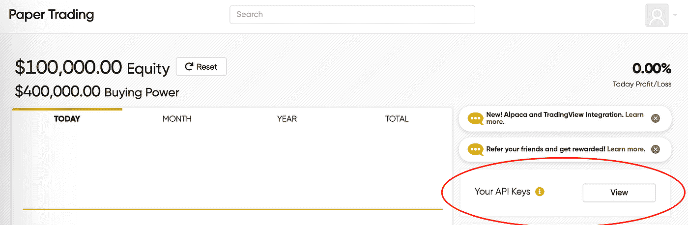

我们还需要从谷歌控制台检索我们的模型名称。在与上一步相同的仪表板上，单击您训练过的机器学习模型。

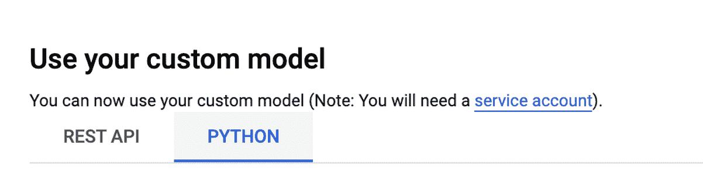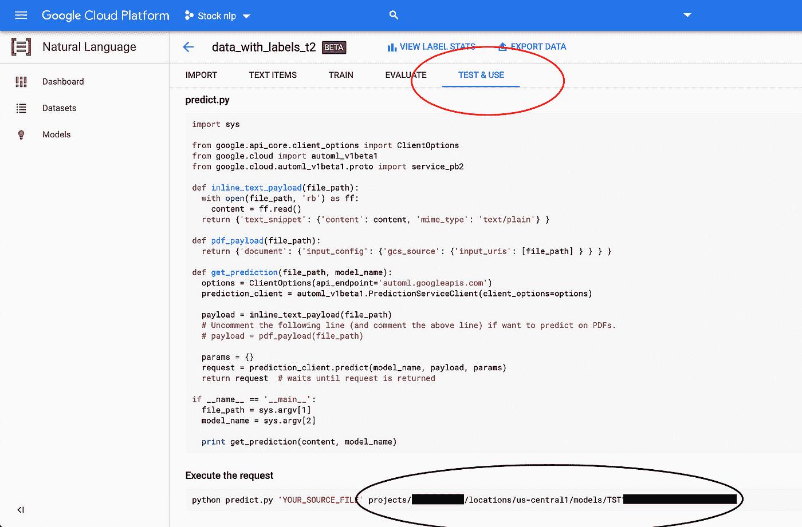

转到“测试和使用”选项卡。单击“使用您的自定义模型”下的“Python”选项卡。记下上面用黑色圈出的型号名称。

我们现在可以使用以下命令行参数运行我们的命令:

> *> python MakeTrades.py <羊驼 API 密钥 ID > <羊驼秘钥> <谷歌型号名称>*

该命令将:

1.从美国证券交易委员会网站[https://www.sec.gov/cgi-bin/current?q1=0&Q2 = 1&Q3 =](https://www.sec.gov/cgi-bin/current?q1=0&q2=1&q3=)下载最新的上市日 10-Q 文件

这应该只在交易日晚些时候运行，因为这是当天所有文件都可用的时候。如果你想早点运行它，它会给你昨天的文件。

2.清理每一份 10-Q 文件，并与公司最近的 10-Q 文件进行比较，就像我们在培训准备中所做的那样。如果该公司在过去 3 个月左右没有 10-Q 文件，它将跳过它。

3.提交文本 delta，用我们的 ML 模型做一个在线预测。

4.如果我们的模型返回的预测值为 0(它预测的是最剧烈的价格下跌类别)，那么它将使用羊驼 API 为该股票下一个空头订单，该订单将在第二天的开市时执行。

你应该记得在持有空头头寸一天后平仓。如果你愿意，你可以为此写一个脚本。您还可以将该命令与 cron 作业一起安排在每个交易日结束时运行，以实现完全自动化。

# 第八步。翻转它来生活，让金钱滚滚而来

希望，这个指南是有价值的，可以被使用，并扩大到现场交易盈利。如果有什么不清楚或者你需要任何帮助，请联系我。

***注来自《走向数据科学》的编辑:*** *虽然我们允许独立作者根据我们的* [*规则和指导方针*](/questions-96667b06af5) *发表文章，但我们不认可每个作者的贡献。你不应该在没有寻求专业建议的情况下依赖一个作者的作品。详见我们的* [*读者术语*](/readers-terms-b5d780a700a4) *。*

**原载:**[【https://www.platorsolutions.com/】T21](https://www.platorsolutions.com/)

我可以为贵公司的任何项目提供软件咨询。点击此处免费预约初诊:[**https://www.platorsolutions.com/book-online**](https://www.platorsolutions.com/book-online)