# 为快乐和利润建立一个公司 R 包

> 原文：<https://towardsdatascience.com/build-a-corporate-r-package-for-pleasure-and-profit-78b73ce4ff4b?source=collection_archive---------12----------------------->

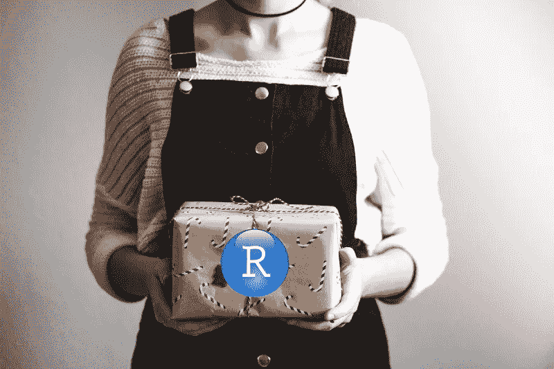

我们的经济正在进行“大重组”。这是我们所知道的正在发生的事情的官方名称:最好的正在上升到顶端，而平庸的正在沉入底部。这是[马太效应](https://en.wikipedia.org/wiki/Matthew_effect)在起作用。

在 Brynjolfsson 和 McAfee 2011 年的著作*与机器赛跑*中，他们详细描述了这种新经济将如何有利于那些拥有技能或资本来对接和投资深度学习和机器人等新技术的人，这些新技术正变得越来越普遍。

Cal Newport 的*深度作品*概述了在新经济中蓬勃发展的两个核心能力:

> 1.能够快速掌握难的东西
> 
> 2.能够在质量和速度方面达到精英水平。这种对速度的需求(抱歉)将是我们关注的重点。

**不要重复自己(干)**是软件开发中众所周知的格言，大多数 R 程序员都遵循这个规则，构建函数以避免重复代码。但是你多久会:

*   在不同的分析中引用相同的数据集
*   创建到数据库的相同 ODBC 连接
*   在 ggplot 中修补相同的颜色和主题
*   从同一模板生成降价文档

诸如此类？注意到模式了吗？“同”字撒在每一个要点里。我嗅到了干敷的机会！

如果你像我一样在公司或学术机构工作，你可能会经常做这些事情。我将向你展示如何将所有这些任务打包成一个极简的 R 包来节省你的时间，正如我们所知，这是你在新经济中取得成功的关键之一。

# 工具

首先做一些基础工作。如果你用 R 工作，我假设你用的是 RStudio，这是必须的。我用的是 Windows 10 机器上的 R 版本 3.5.1(啊，美国公司…)。请注意，我们将要开发的包是极简主义的，这是一种说我们要抄近路来制造最小可行产品的方式。我们不会深入讨论文档和依赖项，因为我们在新包中需要的包很可能已经在您的本地机器上了。

# 创建空的包项目

我们将为咨询公司 [Ketchbrook Analytics](https://www.ketchbrookanalytics.com/) 创建一个包，这是一家来自康涅狄格州的精品店，他们比任何人都更了解自己的道路。

打开 RStudio 并在新目录中创建一个项目:

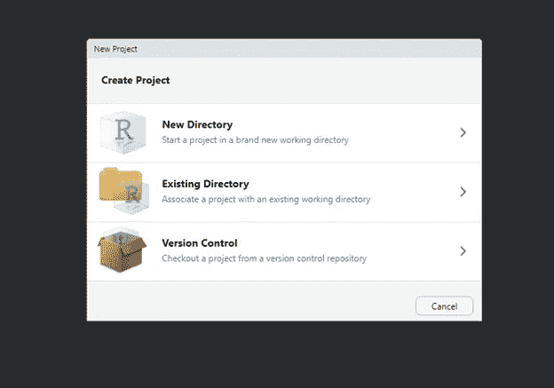

选择 **R 包**并命名。我叫我的凯彻。


RStudio 现在将使用示例“hello”函数启动一个新会话。看来我们准备好进入正题了。

# 自定义功能

让我们从向我们的包中添加一个函数开始。Ketchbrook 的一项常见任务是将客户数据与市场区域或足迹的轮廓对应起来。我们可以很容易地把它包装成一个简单的函数。

创建一个新的 R 文件，并将其命名为 ketchR.R。我们将把所有的函数放在这里。

所以我们所做的是创建一个函数，利用 tigris 包来获取我们足迹中各州的 shapefiles。然后，该函数将这些状态合并成一个连续的多边形，这样我们就可以很容易地使用传单、ggmap 等来覆盖它。

尝试你的新功能:

你会看到一个漂亮的西部小海岸:

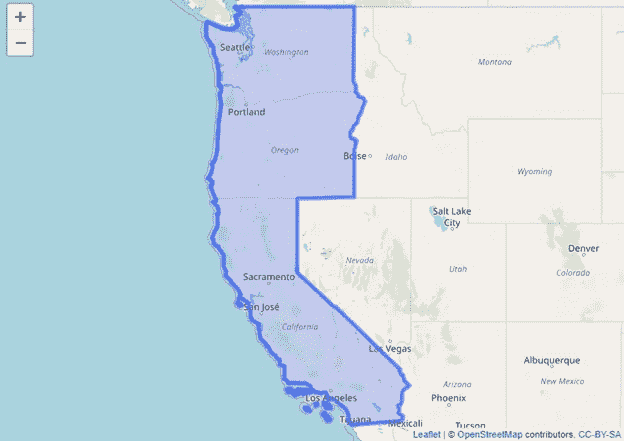

您可以在包中添加的自定义函数的种类没有限制。机器学习算法，客户细分，无论你想要什么，你都可以在你的包中放入一个易于访问的功能。

# 数据集

让我们继续我们的地理空间爱好。分公司或商店级别的分析在分布于一个大的地理区域的公司中很常见。在我们的例子中，Ketchbrook 的客户从提华纳到西雅图有八家分行。每次我们需要引用这些位置时，不用手动存储和导入 CSV 或 R 数据文件，我们可以简单地将数据集保存到我们的包中。

为了将数据集添加到我们的包中，我们首先需要通过读取 csv 或从其他地方获取数据集，将它放入我们的本地环境中。我只是从本地电脑上读取了一个 csv 文件:

这是数据集的样子:

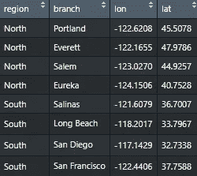

现在，我们必须将这些数据放在一个非常具体的地方，否则我们的包将无法找到它。就像当我妻子把洗碗机藏起来的时候，我被迫不情愿地把脏盘子放在柜台上。

首先，在当前目录中创建一个名为“data”的文件夹顺便说一句，你的目录现在应该是这样的:

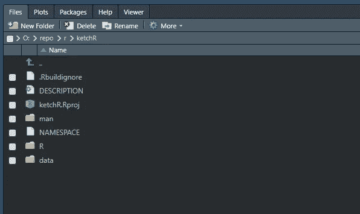

额外好处:使用 RStudio 中的终端功能可以轻松创建目录:


现在我们需要将这个分支数据集作为。RData 文件:

## 现在，我们建造

让我们测试一下这个包，因为我们很有可能没有搞砸任何事情。当我们构建这个包时，我们正在把它编译成我们所知道的实际的包。在 RStudio 中，这非常简单。导航到“构建”选项卡，然后单击“安装并重启”

如果您已经完成了，您应该不会看到任何错误，但是如果您确实看到了错误，请尝试更新您的本地包。

现在，我们应该能够直接调用我们的包并使用我们的分支数据集:

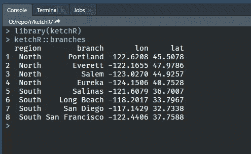

酷，这很有效。现在让我们用传单快速绘制我们的分支，以确保 footprint_poly()有效:

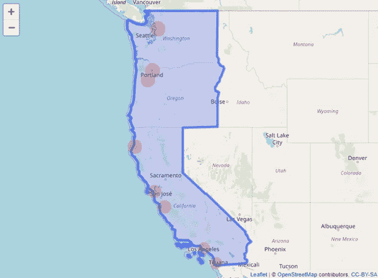

尼利斯。

# 数据库连接

数据科学中最常见的任务之一是从数据库中提取数据。假设 Ketchbrook 将数据存储在 SQL 服务器中。与其手动复制和粘贴连接脚本或依赖 RStudio 会话来缓存连接字符串，不如让我们直接创建一个该死的函数。

在这里，我们构建了一个函数，让我们可以输入任何我们想要针对这个 SQL Server 的查询。该函数创建连接，每次都提示我们输入密码(我们不在代码中存储密码……)，并在连接完成时关闭连接。

让我们更进一步。很多时候，您可能会使用一个通用的 SELECT *查询来利用 dplyr 进行真正的数据管理。在这种情况下，更简单的方法就是创建一个这样的函数。

让我们创建另一个从客户那里提取 SELECT *的函数。

啊，当我开始在自己的实践中使用它时，仅这一项就为我每周节省了 15 分钟。仔细想想你可能经常复制和粘贴的任何一段代码——那是你的函数包的候选者。

# 品牌 ggplot 可视化

好了，现在我们进入了最重要的部分，真正节省时间的部分，我们一揽子计划中给分析师留下深刻印象的部分。我们将使产生一致的数据可视化变得容易，这些数据可视化用定制的颜色和主题来反映公司的形象。

虽然我个人认为绿色调色板是有史以来最好的配色方案，但它并不一定符合凯奇布鲁克公司的调色板。所以让我们自己制作一套函数来使用凯奇布鲁克的调色板是一种‘懒惰’的方式。(非常感谢这篇 [Simon Jackson 的伟大文章](https://www.r-bloggers.com/creating-corporate-colour-palettes-for-ggplot2/))。

## 获取颜色

让我们直接从[他们的网站上下载颜色。我们可以使用 Chrome 插件](https://www.ketchbrookanalytics.com/) [Colorzilla](https://chrome.google.com/webstore/detail/colorzilla/bhlhnicpbhignbdhedgjhgdocnmhomnp) 来获取我们需要的颜色。

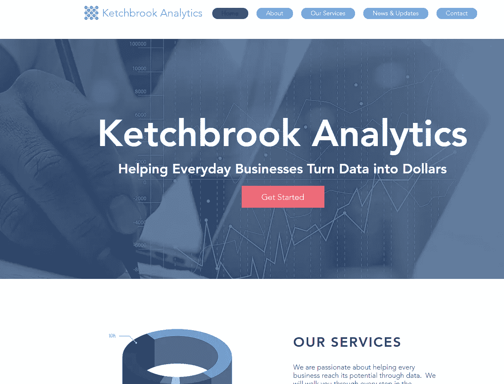

将这些十六进制颜色代码粘贴到这个块中，就像这样:

这将给我们一个很好的调色板，对于分类数据有足够不同的颜色，对于连续数据有足够相似的颜色。为此，我们甚至可以将它分成两个单独的子调色板:

## 创建函数

我不打算一行一行地介绍这些函数；如果您有任何问题，请发邮件至 bradley . lindblad[at]Gmail[dot]com 联系我，在 [Github repo](https://github.com/bradlindblad/ketchR) 上创建一个问题。以下是完整的代码片段:

让我们来测试一下:

生产:

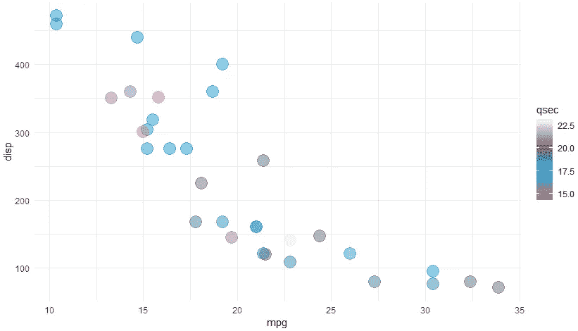

很好。在 Ketchbrook 的视觉效果中使用一致的颜色将有助于为他们的品牌建立知名度，并在市场上更快地得到认可。

# 降价模板

现在我们已经更快地获取数据并绘制数据，最后一步是交流我们的分析结果。同样，我们希望能够快速、一致地做到这一点。定制降价模板已准备就绪。

我发现这一部分是最难做对的，因为所有的东西都需要在文件结构中的正确位置，所以请密切关注。(大部分功劳归于切斯特·伊斯梅的这篇文章。)

## 1.创建框架目录

这将创建一个嵌套目录来保存我们的模板。Rmd 和。yaml 文件。您的目录中应该有一个名为“ketchbrookTemplate”的新文件夹:

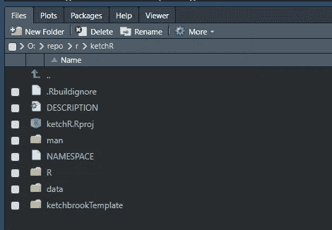

## 2.创建骨架。中矢状直径之比

接下来，我们创建一个新的 RMarkdown 文件:

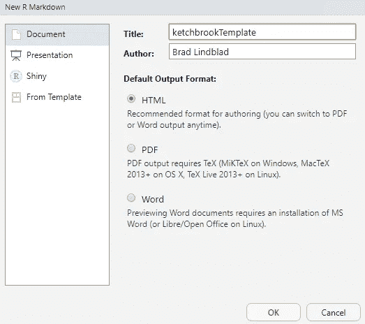

这将为我们提供一个基本的 RMarkdown 文件，如下所示:

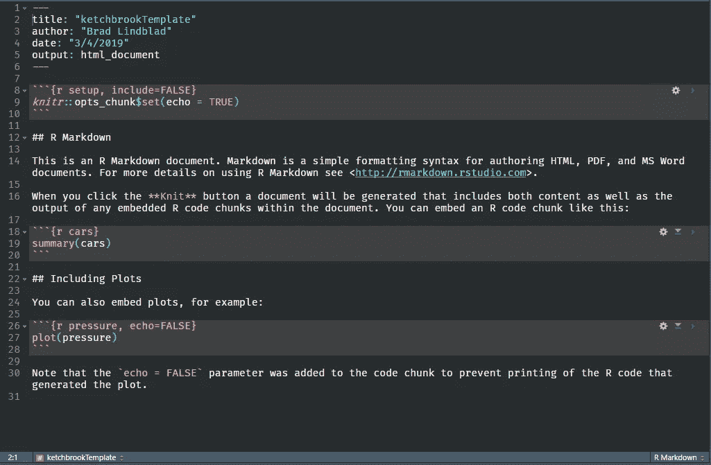

现在，让我们修改模板来满足我们的需求。首先，我会用一个我觉得很适合我的主题来替换顶部的内容，你可以随意撕掉它:

我喜欢遵循分析模板，因此这是结合我的基本 EDA 模板的首要问题:

将这个文件保存在 skeleton 文件夹中，我们就完成了。

## 3.创建 yaml 文件

接下来，我们需要创建一个 yaml 文件。只需在 RStudio 中创建一个名为“template.yaml”的新文本文档，并保存它，如下图所示:

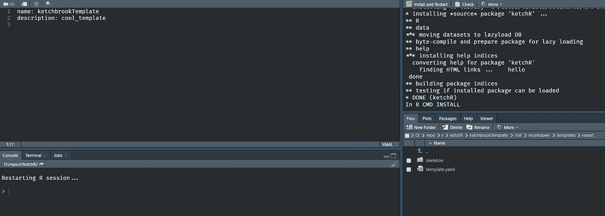

重新构建包并打开一个新的 RMarkdown 文档，选择“From Template ”,您应该会看到您的新模板可用:

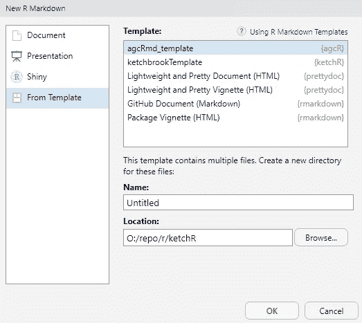

太好了。您现在可以编织 html pretty，并得到如下甜美的输出:


如果遇到问题，请确保您的文件结构与此匹配:

```
 ├───inst
│   └───rmarkdown
│       └───templates
│           └───ketchbrookTemplate
│               │   template.yaml
│               │
│               └───skeleton
│                       skeleton.nb.html
│                       skeleton.Rmd
```

# 下一步是什么？

因此，我们基本上做了一个炸弹包，让你做任何事情都快一点，好一点:拉数据，引用公共数据，创建数据和交流结果。

从这里，您可以在本地使用这个包，或者将它推送到一个远程 Github 仓库，在您的团队中传播代码。

这个包的完整代码可以在为它设立的 [Github repo](https://github.com/bradlindblad/ketchR) 获得。随意分叉，让它成为自己的。我不擅长说再见，所以我要走了。

*我可以在有限的基础上提供数据科学咨询。通过 gmail[dot]com* 联系我


## 感谢阅读！