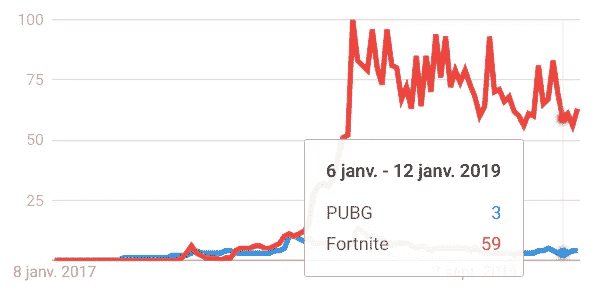
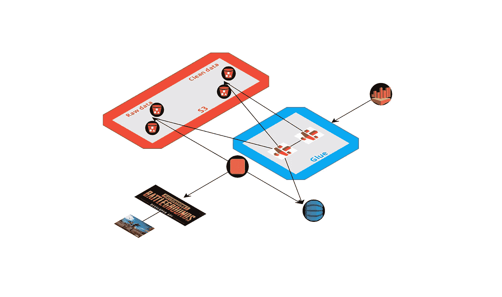
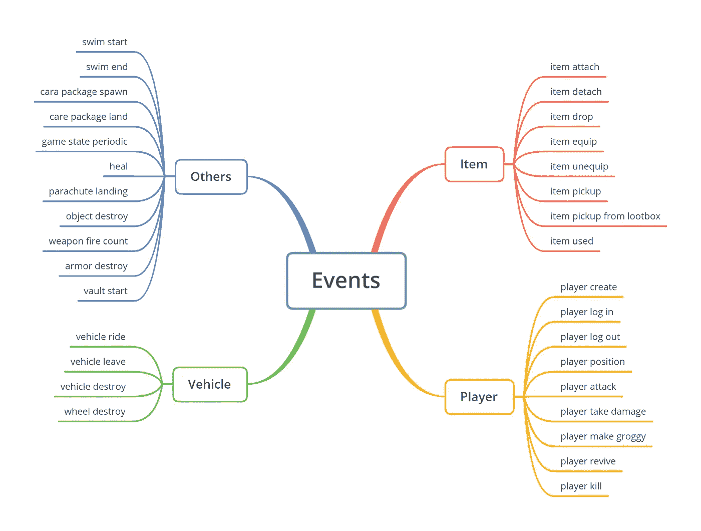
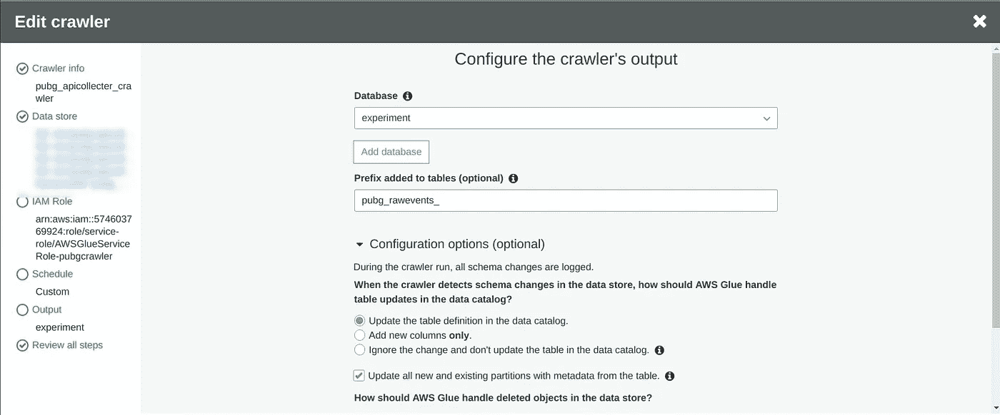
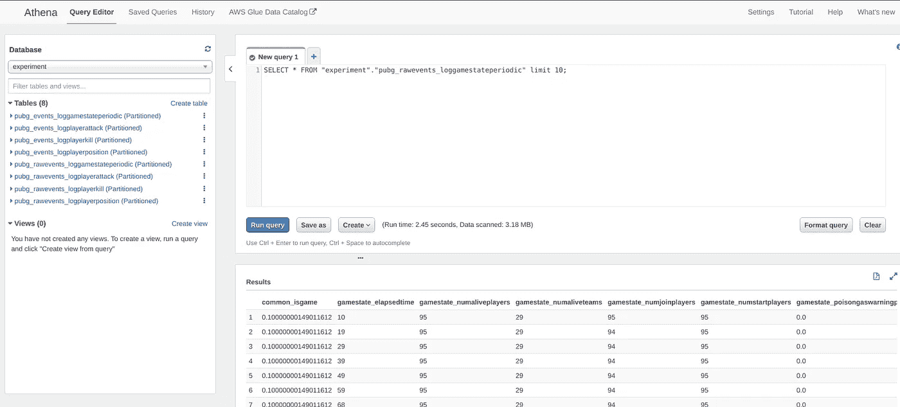
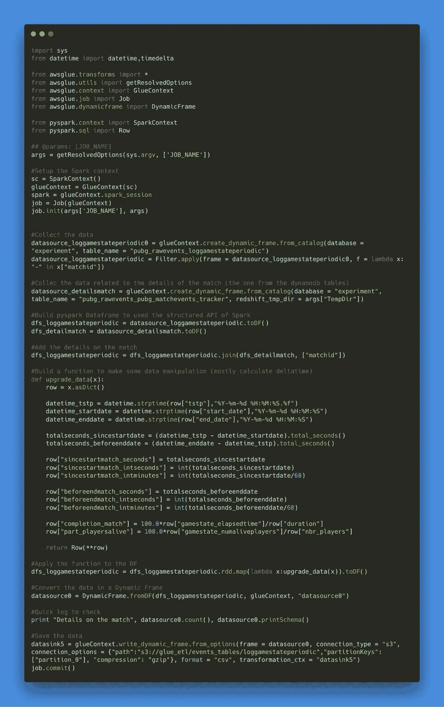
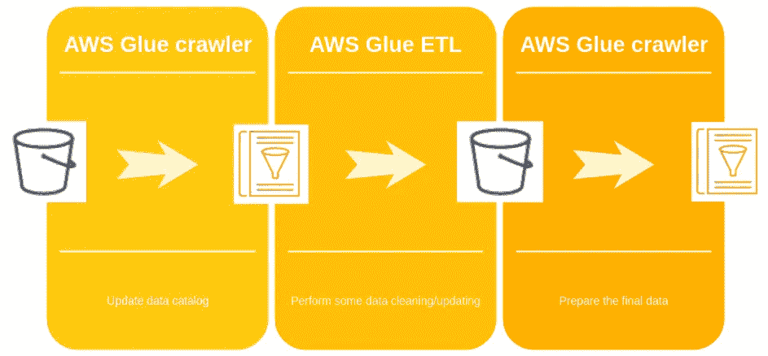
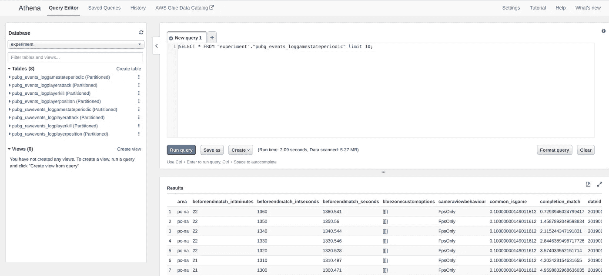

# 在 AWS 上构建一个数据管道来收集 PUBG 数据

> 原文：<https://towardsdatascience.com/build-a-data-pipeline-on-aws-to-collect-pubg-data-5b222ba4e2cc?source=collection_archive---------11----------------------->

Photo by [Quinten de Graaf](https://unsplash.com/@quinten149?utm_source=medium&utm_medium=referral) on [Unsplash](https://unsplash.com?utm_source=medium&utm_medium=referral)

我在与 PUBG 相关的 [Kaggle 竞赛](https://www.kaggle.com/c/pubg-finish-placement-prediction)中开始了这个项目，目标是根据一些比赛结束时的统计数据(如比赛中跑的距离等)来预测比赛中的球员排名。我想了解数据源(看看是否有一些故意遗漏的统计数据/信息),并尝试亚马逊的一些服务，如 AWS Glue 和 Athena，以在 AWS 中建立一个数据管道。

在这篇文章中，我将解释:

*   什么是 PUBG，游戏的原理等等
*   项目的方法
*   数据的收集和清理

# PUBG 的描述

PUBG 是一款名为 battle royale 的视频游戏类型的旗舰之一(首先也是最受欢迎的之一)，主要是 100 名玩家(或多或少)被丢在一个岛上，没有装备，他们必须通过收集材料，武器，装备和车辆在这个岛上生存。

为了促使人们去战斗，随着游戏的进行，可用的区域变得越来越小，所以这种形式促使人们互相战斗，因为最终只能有一个幸存者。有两个非常受欢迎的游戏支持这一运动，它们是 PUBG 和堡垒之夜，它们可以在所有可能的平台上使用(主机上的 PUBG 不好)，现在你可以看到所有其他受欢迎的游戏(使命召唤，战场)都想在里面添加自己的皇家战役模式，但让我们诚实地说，堡垒之夜正在击败所有人(查看谷歌趋势 PUBG VS Fornite)

我对这类游戏的看法是，原则很酷，你可以在游戏过程中建立一些紧张的令人惊讶的情况，但我认为你不能出售(全价)一个只是皇家战役的游戏。Epic 对堡垒之夜很聪明，因为他们通过提出一个免费的独立应用程序，将一个制作时间长且销售情况不好的项目变成了一个非常有利可图的项目，该应用程序使用的资产与原始游戏相同，但只专注于皇家战役(我希望有想法的人能加薪)。

让我们看看数据收集的项目。

# 项目方法

这个项目背后的想法是:**建立一个系统，从 PUBG 公司提供的 API 收集数据清洁数据，使所有的数据可用，而不是下载我的机器上的一切**

为了建立管道，我决定使用 AWS，因为与微软、谷歌等相比，我更喜欢他们的服务，但我确信同样的系统也可以在这些平台上建立。

为了完成任务，我决定使用以下服务:

*   EC2 实例运行一台机器来进行收集
*   S3 存储收集到的数据并进行处理
*   粘合使数据清晰可用
*   Athena 是 S3 数据存储的接口

这是 AWS 上不同步骤的流程部署的高级视图。

我们来详细看看过程。

# 从 PUBG API 收集数据

PUBG 公司已经建立了一个非常好的开放的 API，有多个端点开放不同的数据源。为了简单起见，您可以访问与以下内容相关的数据:

*   由他们的帐户 id 定义的 PUBG 播放器
*   由其 matchid 定义的匹配

有来自不同地区(美洲、欧洲和亚洲)的多个平台(pc、xbox 和 ps4)的数据。在这篇文章中，我将重点介绍 PC 平台和北美地区。这个 API 有多个端点，但让我们把重点放在:

*   [样本端点](https://documentation.playbattlegrounds.com/en/samples-endpoint.html):提供对每天更新的一些 matchid 的访问
*   [匹配端点](https://documentation.playbattlegrounds.com/en/matches-endpoint.html):给出了匹配的细节，比如最终结果，更重要的是下载事件压缩包的链接。

你可以找到一个[仓库](https://github.com/jeanmidevacc/pubg-datacollection)，里面有我构建的收集、清理和发送数据的函数。这个笔记本能让你深入了解收集到的数据。有三种类型的数据:

*   结束比赛统计数据，它们存储在 s3 存储桶的“文件夹”中
*   存储在另一个文件夹中的完整事件
*   存储在单独文件夹中的分解事件

关于事件包，API 上有多个可用的事件，有一个模式包含这些事件的详细信息。

我计划每天在 EC2 实例上运行一个脚本，该脚本触发了从样本中获取新数据，并将其存储在正确的文件夹和 day 文件夹中。

为了获得一般信息，比赛的细节被收集到一个 dynamodb 表中(比如人数，地图名称等)。

**当你存储数据时，我能给你的一些建议是:**

*   **妥善保存。gz 文件**
*   **明确分隔符、空格符和引号符**
*   **删除索引**
*   **对于 Dynamodb，将浮点数据转换为十进制数据**

这是关于我如何收集数据的简单概述，现在让我们看看云部分。

# 用胶水抓取 S3 和 Dynamodb 中的数据数据(这么多名字掉线)

AWS glue setup 仪表板分为两个部分，分别是数据目录部分和 ETL 部分(我将重点介绍仪表板的上部)。

让我们首先关注数据目录。

# 数据目录和爬虫部分

在这一部分中，您可以找到一个 database 选项卡，它包含所有数据库和您用 Glue 创建的相关表。为了这个项目，我创建了我的第一个数据库。有趣的部分是爬虫标签，在那里你可以设置爬虫在 S3 导航，Dynamodb 和 AWS 的一些其他服务(像 RDS)。在上图中，有一个我为这个项目创建的所有爬虫的列表。让我们看看爬虫里面有什么。

因此，当您设置爬虫时，需要:

*   为你的爬虫取一个名字
*   定义数据源，在本例中，我将关注三个事件和我的 Dynamodb 表
*   为您的 crawler 定义一个 AWS 角色，使其能够访问所有要被爬网的数据源
*   定义爬虫的执行频率，我决定让它每周运行一次
*   定义爬虫的输出

我强烈建议激活复选框，用表中的元数据更新所有新的和现有的分区，以避免在读取数据期间出现一些分区问题，如果你不像我一样控制你正在接收的内容。

瞧，你只需要从 AWS Glue 的主页运行爬虫程序，现在你就可以通过 Athena 中的爬虫程序访问你的数据摘录(SQL 方式访问数据)。

但是数据仍然很原始，所以我决定给爬虫添加一个新的层来清理数据和添加一些信息。

# ETL 部分

对于 ETL 部分，这是管道的数据处理部分。我本来可以在数据到达 S3 存储桶时对其进行分析，但是我注意到一些记录不太好(比如说损坏了)，所以我想为这些数据应用一个转换状态:

*   删除损坏的记录(带有错误的 matchid 格式)
*   使用 dynamodb 表中收集的匹配细节进行连接(并在之前进行爬网)
*   计算事件和比赛开始之间的时间差(秒和分)
*   在事件函数中进行一些简单的字符串操作(比如清除武器的名称)

这里有代码的插图，你可以在[库](https://github.com/jeanmidevacc/pubg-datacollection/blob/master/etl_example.py)中找到这段代码。

我尝试了代码方法，但有一个选项 ETL 配置，您可以有更多的图表方法来进行数据操作，因为我想使用 rdd 映射和 spark 的数据帧，我决定不使用此功能，但我做了一些简单的测试，它工作得很好。所以现在只需要构建一个爬虫来用 ETL 部分生成的新数据更新数据目录。

在下面的模式中，有 AWS Glue 中操作的时间表。

现在让我们在 AWS 上做一个快速测试，从 web 界面请求流程数据。

这些数据可以从 Athena 访问，但你可以连接 AWS quicksight，它有更像 Tableau 的体验(我不喜欢的是，我不喜欢所有这些对我来说太黑的 BI 工具)，更重要的是，你可以从笔记本上访问这些数据(在[库](https://github.com/jeanmidevacc/pubg-datacollection/blob/master/environnement.yml)中有一个 python 环境的副本)。

这是对我从 PUBG API 收集数据的数据管道的描述，系统每天收集大约 1000 个匹配，这不是一个很大的数量，但我想从小的开始。

**我是一个好人，你可以在这个** [**kaggle 数据集**](https://www.kaggle.com/jeanmidev/pubgevents) **中找到我为这个项目建立的表格的摘录(这是 2019 年 1 月 27 日的数据摘录)。**

我希望你喜欢阅读，如果你有任何意见，请不要犹豫。

*原载于 2019 年 2 月 1 日 the-odd-dataguy.com***。**