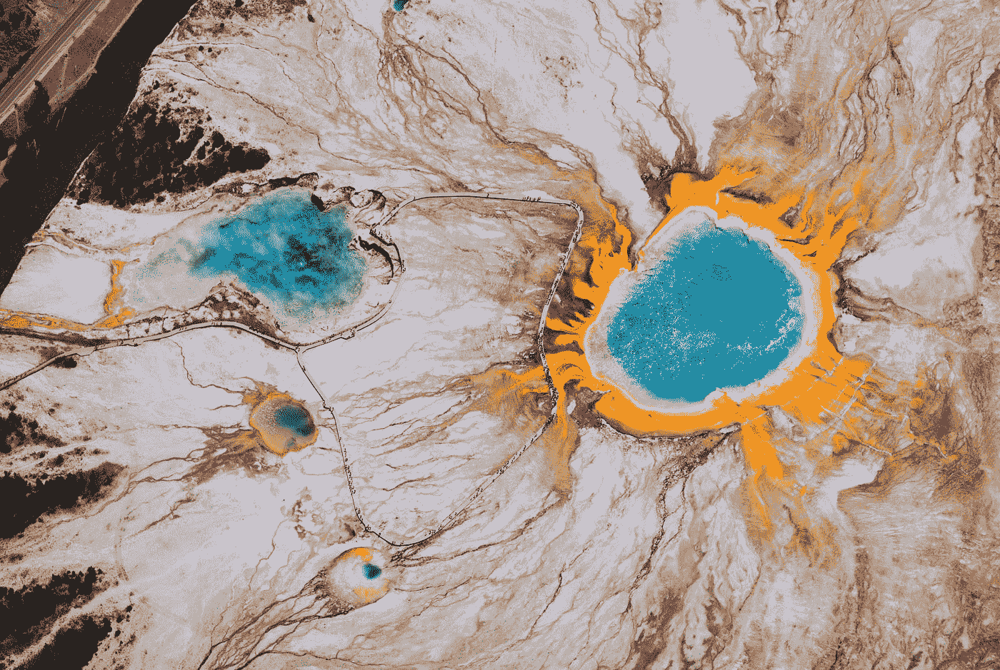

# 用你的机器学习模型构建一个 Docker 容器

> 原文：<https://towardsdatascience.com/build-a-docker-container-with-your-machine-learning-model-3cf906f5e07e?source=collection_archive---------3----------------------->

## Docker 初学者模板脚本完全指南



Photo by [Chris Leipelt](https://unsplash.com/@cleipelt?utm_source=medium&utm_medium=referral) on [Unsplash](https://unsplash.com?utm_source=medium&utm_medium=referral)

作为一名数据科学家，我没有太多的软件工程经验，但是我肯定听过很多关于容器的很棒的评论。我听说过与传统虚拟机相比，它们是多么的轻量级，它们在确保您的代码有一个安全一致的环境方面有多好，以及我的 devops 工作如何节省，以便您可以专注于您的代码。

然而，当我试图将我自己的模型分类时，我很快意识到它并不那么直观。这一点也不像在 EC2 引导脚本前面加上`RUN`那么简单。我发现不一致和不可预测的行为经常发生，学习调试一个新工具可能会令人沮丧。

所有这些促使我创建了这篇文章，其中包含了将 Python 中的 ML 模型分解到 Docker 容器所需的所有代码片段。我将指导您安装您需要的所有 pip 包，并构建您的第一个容器映像。在这篇文章的第二部分的[中，我们将设置所有必要的 AWS 环境，并在这个系列的第三部分也是最后一部分开始批处理容器。](/configure-cloud-environment-for-batch-ml-job-on-aws-82edb5631540)

*免责声明 1:我这里说的模型是单个实例上的批处理作业，不是有 API 端点的 web 服务，不是分布式并行作业。如果您遵循本教程，将代码放入容器的整个过程应该不会超过 25 分钟。*

*免责声明 2:如果这是你第一次阅读关于容器的文章，这篇文章可能不会提供理解容器如何工作的必要信息，我强烈建议你在继续之前查阅一些在线教程。*

# 先决条件

*   [AWS 账户](https://aws.amazon.com/account/)
*   安装了 AWS CLI
*   [Docker](https://docs.docker.com/install/) 已安装，账户设置在 [DockerHub](https://hub.docker.com)
*   [Python 3](https://www.python.org/downloads/) 已安装

# 创建 Dockerfile 文件👷🏻‍♀️

要将您的代码放入容器，您需要创建一个`Dockerfile`，它告诉 Docker 您在应用程序中需要什么。

> 一个`Dockerfile`是一个文本文档，它包含了用户可以在命令行上调用的所有命令来组合一个图像。

(您可以从`Dockerfile`或`docker-compose.yml`构建 Docker 映像。如果你的代码可以被重构为一个多容器 Docker 应用程序，你可能想看看`docker compose`，但是现在一个`Dockerfile`应该足够了。)

Docker 映像从基础映像开始，由只读层构建而成，每一层都添加了一些依赖关系。最后，您告诉容器如何触发您的模型。

minimal Dockerfile for a Python application

在上面的 other 文件中，我从基本的 Python 3.6 伸展映像开始，`apt-get`更新了系统库，安装了一些`make`和`build`的东西，检查了我的 Python 和`pip`版本以确保它们是好的，建立了我的工作目录，将`requirements.txt`复制到容器中，pip 在其中安装了所有的库，最后将所有其他代码文件复制到容器中，列出了所有文件以确保我需要的都在那里，并触发了我的入口点`main.py`文件。

如果你的代码文件夹结构是这样的，这个`Dockerfile`应该对你有用。

```
- app-name
     |-- src
          |-- main.py
          |-- other_module.py
     |-- requirements.txt
     |-- Dockerfile
```

如果您的代码还没有一个`main.py`或 shell 脚本来触发模型训练/推理，那么您可能想要首先重构您的代码。还记得用`pipreqs path/to/project`将库依赖关系冻结到一个`requirements.txt`文件中。我推荐使用`pipreqs`而不是`pip freeze`，因为当你运行`pip freeze > requirements.txt`时，它会输出该环境中所有已安装的包，而`pipreqs`只给你这个项目实际导入的包。(如果还没有`pip(3) install pipreqs`安装`pipreqs`

如果你的代码已经有了一个入口点，你需要做的就是把`<app- name>`改成你的应用程序的名字，我们就可以把它构建成一个图像了。

有很多让`Dockerfile`变得更小更高效的[最佳实践](https://docs.docker.com/develop/develop-images/dockerfile_best-practices/)，但是大多数都超出了本文的范围。但是，您可能需要注意以下几点:

## 1.1 使用 Python 拉伸作为基础图像

人们说不要从一个普通的 Ubuntu 镜像开始，而是使用一个官方的基础镜像，比如 Alpine Python。Alpine Python 是一个基于 Alpine Linux 的非常小的 Python Docker 映像，比默认的 docker python 映像小得多，但仍然拥有最常见的 Python 项目所需的一切。但是我发现使用它非常困难，尤其是在安装包的时候。

另一方面，Ubuntu 基础映像将提供更可预测的行为，但是您需要自己安装所有 Python 的东西。

所以我建议你从 Python 3.6 stretch 开始，这是基于 Debian 9(又名 stretch)的官方 Python 镜像。Python stretch 附带了 Python 环境和 pip 安装，并且是最新的，如果你选择 Ubuntu，你需要弄清楚如何安装所有这些。

## 1.2 仅安装您需要的东西

复制和粘贴一些网上发布的`Dockerfile`模板也很有诱惑力，尤其是如果这是你的第一个 Docker 项目。但是建议只安装你实际需要的东西来控制图像的大小。如果你看到其他人安装了一大堆`make`和`build`的东西，试着先不要包括它们，看看你的容器是否能工作。较小的映像通常意味着构建和部署速度更快。(你应该试试我上面的极简主义模板的另一个原因！)

同样为了保持图像尽可能的简洁，使用`.dockerignore`，它的工作方式和`.gitignore`完全一样，忽略那些不会影响模型的文件。

an example .dockerignore file

## 1.3 在代码前增加`requirements.txt`

在您的`Dockerfile`中，总是在复制源代码之前添加您的`requirements.txt`文件。这样，当您更改代码并重新构建容器时，Docker 将重用缓存层，直到安装了包，而不是在每次构建时执行`pip install`命令，即使库依赖关系从未更改。没有人愿意仅仅因为你在代码中添加了一个空行就多等几分钟。

如果你有兴趣了解更多关于`Dockerfile`的信息，在附录 I 中有我们使用的一些基本命令的快速总结。或者你可以在这里查看 Dockerfile 文档。

现在可以随意跳到第 2 步，用刚刚创建的`Dockerfile`构建一个容器。

# 第二步——用你的 docker 文件建立一个图像👩🏻‍🍳

准备好`Dockerfile`之后，就该构建容器映像了。`docker build`根据`Dockerfile`中给出的指令创建图像。你所需要做的就是给你的图像一个名字(一个可选的版本标签)。

```
$ docker build -t IMAGE_NAME:TAG .
$ # or
$ docker build -t USERNAME/IMAGE_NAME:TAG .
```

这两个命令的唯一区别是图像名称前是否有一个`USERNAME/`。映像名称由斜杠分隔的名称组成，通常前缀是注册表主机名。`USERNAME/IMAGE_NAME`一般不是指定图像名称的强制格式。但是亚马逊 ECR 存储库中的图像确实遵循完整的`REGISTRY/REPOSITORY:TAG`命名约定。比如`aws_account_id.dkr.ecr.region.amazonaws.com/my-web-app:latest`。

上面的命令中发生了一些事情。

首先，我们告诉 Docker 守护进程获取当前目录中的`Dockerfile`(这就是末尾的`.`所做的)。

接下来，我们告诉 Docker 守护进程构建图像并给它指定标签。标记对我来说一直很困惑。通常标记图像就像给它一个别名。这与给现有图像指定另一个名称来引用它是一样的。这有助于区分 Docker 图像的版本。

指定标记名不是强制性的。在没有指定特定标签的情况下运行构建时，`:latest`标签是默认标签。因此，如果您想维护一个好的版本历史，建议您在每次构建之后都明确地标记您的映像。

```
$ docker build -t USERNAME/IMAGE_NAME .
$ docker tag USERNAME/IMAGE_NAME USERNAME/IMAGE_NAME:1.0
$ ...
$ docker build -t USERNAME/IMAGE_NAME .
$ docker tag USERNAME/IMAGE_NAME USERNAME/IMAGE_NAME:2.0
$ ...
```

您可以在使用`docker build -t USERNAME/IMAGE_NAME:TAG .`构建图像时标记图像，或者在构建后像`docker tag SOURCE_IMAGE:TAG TARGET_IMAGE:TAG`一样显式标记图像。

现在，如果您运行`docker images`，您应该看到本地存在一个图像，它的存储库是`USERNAME/IMAGE_NAME`，标签是`TAG`。

```
$ docker images
```

我还建议您此时在本地机器上测试您的容器，以确保一切正常。

```
$ docker run USERNAEM/IMAGE_NAME:TAG
```

请随意查看附录 II，获取一些基本 Docker CLI 命令的快速摘要，或在此处查看官方文档。

恭喜你！您只是将您的模型放入一个可以在任何安装了 Docker 的地方运行的容器中。请加入我这篇文章的第二部分，来配置您的 AWS 环境，以满足调度批处理作业的先决条件。

# 附录 I — Dockerfile 命令👩🏻‍🏫

*   `FROM`启动`Dockerfile`。要求`Dockerfile`必须以`FROM`命令开始。图像是在层中创建的，这意味着您可以使用另一个图像作为您自己的基础图像。`FROM`命令定义了你的基础层。作为参数，它采用图像的名称。可选的，你可以添加维护者和镜像版本的 Docker Cloud 用户名，格式 `username/imagename:version`。
*   `RUN`用于构建您正在创建的图像。对于每个`RUN`命令，Docker 将运行命令，然后创建一个新的图像层。这样，您可以轻松地将映像回滚到以前的状态。`RUN`指令的语法是将 shell 命令的全文放在`RUN`之后(例如`RUN mkdir /user/local/foo`)。这将在一个`/bin/sh`外壳中自动运行。您可以像这样定义一个不同的 shell:`RUN /bin/bash -c 'mkdir /user/local/foo'`。
*   `COPY`将本地文件复制到容器中。
*   `CMD`定义启动时将在图像上运行的命令。与`RUN`不同，这不会为图像创建一个新层，而只是运行命令。每个 Dockerfile/Image 只能有一个`CMD`。如果您需要运行多个命令，最好的方法是让`CMD`运行一个脚本。`CMD`要求你告诉它在哪里运行命令，不像`RUN`。
*   `EXPOSE`为镜像用户创建一个提示，提示哪些端口提供服务。它包含在可通过`docker inspect <container-id>`检索的信息中。
*   注意:`EXPOSE`命令实际上并没有让主机访问任何端口！相反，这需要在使用`docker run`时通过`-p`标志发布端口。
*   将您的映像推送到私有或云注册表。

# 附录 II — Docker CLI 命令👩🏻‍🏫

一些基本的 Docker CLI 命令包括:

*   `docker build`从 Dockerfile 文件构建图像
*   `docker images`显示机器上的所有 Docker 图像
*   启动一个容器并在其中运行命令
*   `docker run`选项:
*   `-p`指定主机和 Docker 容器中的端口
*   `-it`打开交互式控制台
*   `-d`以守护模式启动容器(在后台运行)
*   `-e`设置环境变量
*   `docker ps`显示所有正在运行的容器
*   `docker rmi`删除一个或多个图像
*   `docker rm`移除一个或多个容器
*   `docker kill`杀死一个或多个运行中的容器
*   `docker tag`用别名标记图像，以便以后参考
*   `docker login`登录您的 Docker 注册表

# 关于作者

*我是一名机器学习工程师，除了技术教程之外，我还撰写关于生产力和自我发展的文章。我在 7 月 4 日参观了黄石公园，这就是封面图片。*