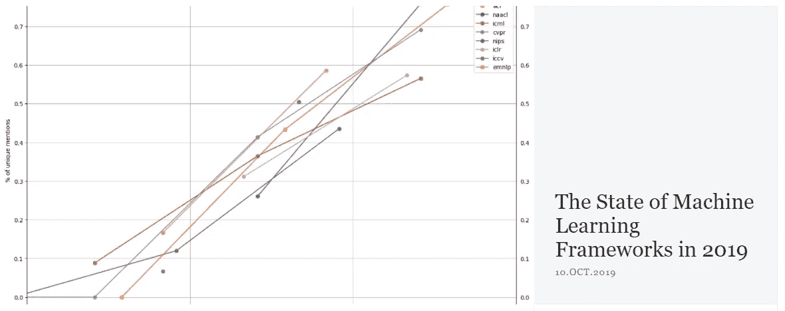
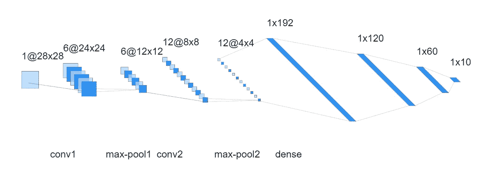
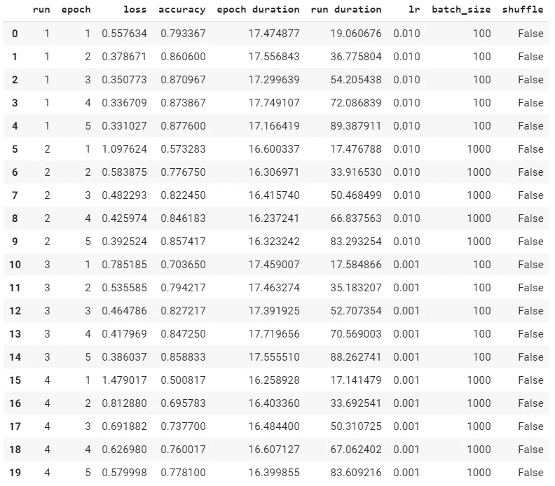
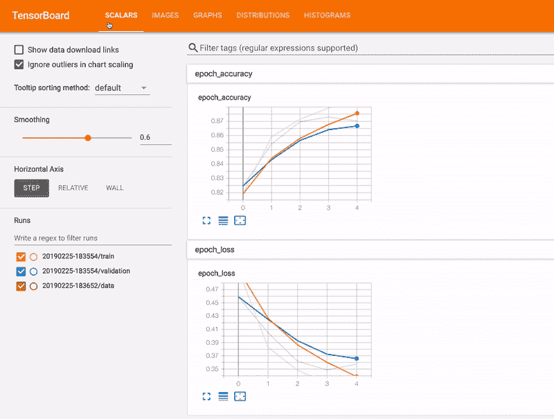
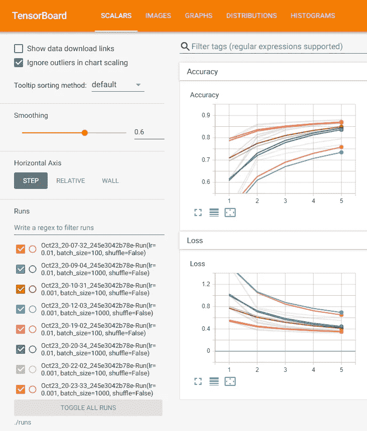
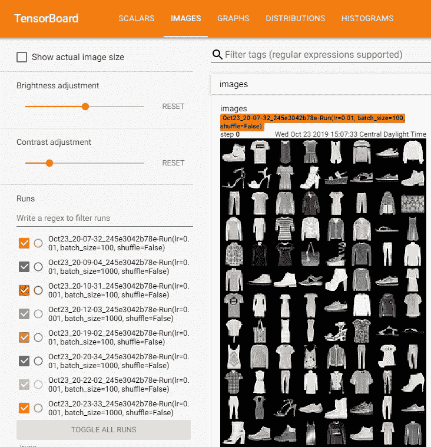
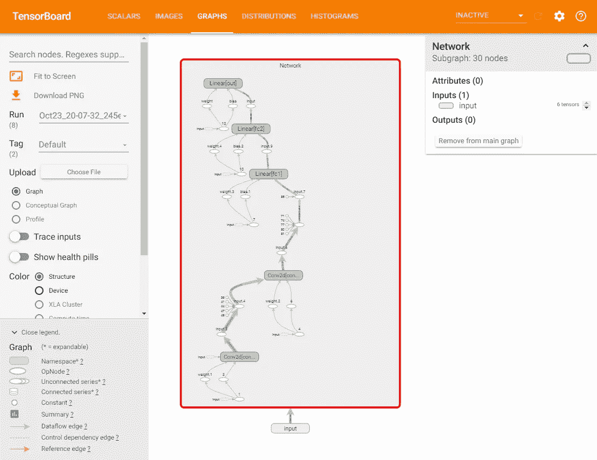

# 让我们建立一个时尚-MNIST 有线电视新闻网，PyTorch 风格

> 原文：<https://towardsdatascience.com/build-a-fashion-mnist-cnn-pytorch-style-efb297e22582?source=collection_archive---------2----------------------->

## 如何使用 Google Colab 和 TensorBoard 从头开始构建 PyTorch ML 项目的逐行指南


当谈到技术中的框架时，一件有趣的事情是，从一开始，似乎总是有各种各样的选择。但随着时间的推移，竞争将演变为只剩下两个强有力的竞争者。典型的例子有“PC vs Mac”、“iOS vs Android”、“React.js vs Vue.js”等。而现在，我们在机器学习方面有了‘py torch vs tensor flow’。

由谷歌支持的 [TensorFlow](https://github.com/tensorflow/tensorflow) 无疑是这方面的领跑者。它于 2015 年作为开源机器学习框架发布，迅速获得了大量关注和接受，特别是在生产准备和部署非常关键的行业。 [PyTorch](https://github.com/pytorch/pytorch) 由脸书在 2017 年推出，但由于其动态计算图和'[python 式](https://legacy.python.org/dev/peps/pep-0020/)'风格，很快获得了从业者和研究人员的喜爱。



Image from [The Gradient](https://thegradient.pub/state-of-ml-frameworks-2019-pytorch-dominates-research-tensorflow-dominates-industry/)

[The Gradient](https://thegradient.pub/state-of-ml-frameworks-2019-pytorch-dominates-research-tensorflow-dominates-industry/) 最近的研究表明，PyTorch 在研究人员中表现出色，TensorFlow 在业界占据主导地位:

> 2019 年，ML 框架的战争还有两个主要竞争者:PyTorch 和 TensorFlow。我的分析表明，研究人员正在放弃 TensorFlow，成群结队地涌向 PyTorch。与此同时，在行业中，Tensorflow 是目前的首选平台，但这种情况可能不会持续太久。— [坡度](https://thegradient.pub/state-of-ml-frameworks-2019-pytorch-dominates-research-tensorflow-dominates-industry/)

最近发布的 PyTorch 1.3 引入了 PyTorch Mobile、quantization 和其他好东西，它们都朝着缩小差距的正确方向前进。如果你对神经网络基础有点熟悉，但想尝试 PyTorch 作为一种不同的风格，那么请继续阅读。我将尝试解释如何使用 PyTorch 为时尚-MNIST 数据集从头构建一个卷积神经网络分类器。如果你没有强大的本地环境，这里的代码可以在 Google Colab 和 Tensor Board 上使用。事不宜迟，我们开始吧。您可以在下面找到 Google Colab 笔记本和 GitHub 链接:

[📙**谷歌 Colab 笔记本**](https://colab.research.google.com/drive/1YWzAjpAnLI23irBQtLvDTYT1A94uCloM)

👽 [**GitHub**](https://github.com/wayofnumbers/SideProjects/blob/master/PyTorch_Tutorial_Basic_v1.ipynb)

# 导入

首先，让我们导入必要的模块。

```
# import standard PyTorch modules
import torch
import torch.nn as nn
import torch.nn.functional as F
import torch.optim as optim
from torch.utils.tensorboard import SummaryWriter # TensorBoard support

# import torchvision module to handle image manipulation
import torchvision
import torchvision.transforms as transforms

# calculate train time, writing train data to files etc.
import time
import pandas as pd
import json
from IPython.display import clear_output

torch.set_printoptions(linewidth=120)
torch.set_grad_enabled(True)     # On by default, leave it here for clarity
```

PyTorch 模块非常简单。

## 火炬

`torch`是主模块，包含了**张量**计算所需的所有东西。您可以单独使用张量计算来构建一个全功能的神经网络，但这不是本文要讨论的内容。我们将利用更强大、更方便的`torch.nn`、`torch.optim`和`torchvision`类来快速构建我们的 CNN。对于那些有兴趣知道如何从“从*抓到*开始做这件事的人，请访问这个[奇妙的 PyTorch 官方 tutoria](https://pytorch.org/tutorials/beginner/nn_tutorial.html) l 作者[杰瑞米·霍华德](https://medium.com/u/34ab754f8c5e?source=post_page-----efb297e22582--------------------------------)。

## torch.nn 和 torch.nn 功能


Photo by [Alphacolor](https://unsplash.com/@duck58cth?utm_source=medium&utm_medium=referral) on [Unsplash](https://unsplash.com?utm_source=medium&utm_medium=referral)

`torch.nn`模块提供了许多构建神经网络的类和函数。你可以把它想象成神经网络的基本构件:模型、各种层、激活函数、参数类等等。它允许我们像组装乐高玩具一样来建造模型。

## 火炬. optim

`torch.optim`提供所有优化器，如 SGD、ADAM 等。，这样就不用从头开始写了。

## 火炬视觉

`torchvision`包含大量流行的数据集、模型架构和计算机视觉的常见图像转换。我们从中获取时尚 MNIST 数据集，并使用其变换。

## 摘要记录器(张量板)

`SummaryWriter`使 PyTorch 能够为张量板生成报告。我们将使用 Tensor Board 查看我们的训练数据，比较结果并获得直觉。张量板曾经是 TensorFlow 相对于 PyTorch 的最大优势，但是现在从 v1.2 开始 PyTorch 正式支持张量板。

我们还引入了其他一些实用模块，如`time`、`json`、`pandas`等。

# 资料组

`torchvision`已经有了时尚 MNIST 数据集。如果你不熟悉时尚 MNIST 数据集:

> `Fashion-MNIST`是一个由 [Zalando](https://jobs.zalando.com/tech/) 的文章图像组成的数据集，由 60，000 个示例的训练集和 10，000 个示例的测试集组成。每个示例都是 28x28 灰度图像，与 10 个类别的标签相关联。我们打算将`Fashion-MNIST`作为原始 [MNIST 数据集](http://yann.lecun.com/exdb/mnist/)的直接替代，用于机器学习算法的基准测试。它共享训练和测试分割的相同图像大小和结构。— [来自 Github](https://github.com/zalandoresearch/fashion-mnist)


Fashion MNIST Dataset — [From GitHub](https://github.com/zalandoresearch/fashion-mnist)

```
# Use standard FashionMNIST dataset
train_set = torchvision.datasets.FashionMNIST(
    root = './data/FashionMNIST',
    train = True,
    download = True,
    transform = transforms.Compose([
        transforms.ToTensor()                                 
    ])
)
```

这个不需要过多解释。我们指定根目录来存储数据集，抓取训练数据，如果本地机器上没有，允许下载它，然后应用`transforms.ToTensor`将图像转换成**张量**，这样我们就可以在我们的网络中直接使用它。数据集存储在名为`train_set.`的`dataset`类中

# 网络

在 PyTorch 中构建实际的神经网络既有趣又简单。我假设你对卷积神经网络的工作原理有一些基本的概念。如果没有，可以参考 deeplizard 的这个视频:

时尚 MNIST 只有 28x28 px 大小，所以我们实际上不需要非常复杂的网络。我们可以像这样建立一个简单的 CNN:



我们有两个卷积层，每个卷积层有 5x5 个内核。在每个卷积层之后，我们有一个跨度为 2 的最大池层。这允许我们从图像中提取必要的特征。然后我们展平张量，将它们放入密集层，通过多层感知器(MLP)来执行我们的 10 个类别的分类任务。

现在我们已经清楚了网络的结构，让我们看看如何使用 PyTorch 来构建它:

```
# Build the neural network, expand on top of nn.Module
class Network(nn.Module):
  def __init__(self):
    super().__init__()

    # define layers
    self.conv1 = nn.Conv2d(in_channels=1, out_channels=6, kernel_size=5)
    self.conv2 = nn.Conv2d(in_channels=6, out_channels=12, kernel_size=5)

    self.fc1 = nn.Linear(in_features=12*4*4, out_features=120)
    self.fc2 = nn.Linear(in_features=120, out_features=60)
    self.out = nn.Linear(in_features=60, out_features=10)

  # define forward function
  def forward(self, t):
    # conv 1
    t = self.conv1(t)
    t = F.relu(t)
    t = F.max_pool2d(t, kernel_size=2, stride=2)

    # conv 2
    t = self.conv2(t)
    t = F.relu(t)
    t = F.max_pool2d(t, kernel_size=2, stride=2)

    # fc1
    t = t.reshape(-1, 12*4*4)
    t = self.fc1(t)
    t = F.relu(t)

    # fc2
    t = self.fc2(t)
    t = F.relu(t)

    # output
    t = self.out(t)
    # don't need softmax here since we'll use cross-entropy as activation.

    return t
```

首先 PyTorch 中所有的网络类都是在基类上扩展的:`nn.Module`。它包含了所有的基础知识:**权重、偏差、正向方法**以及一些实用属性和方法，如`.parameters()`和`.zero_grad()`，我们也将使用它们。

我们的网络结构在`__init__` dunder 函数中定义。

```
def __init__(self): 
  super().__init__()   # define layers 
  self.conv1 = nn.Conv2d(in_channels=1, out_channels=6, kernel_size=5)
  self.conv2 = nn.Conv2d(in_channels=6, out_channels=12, kernel_size=5)
  self.fc1 = nn.Linear(in_features=12*4*4, out_features=120)
  self.fc2 = nn.Linear(in_features=120, out_features=60)
  self.out = nn.Linear(in_features=60, out_features=10)
```

`nn.Conv2d`和`nn.Linear`是在`torch.nn`模块中定义的两个标准 PyTorch 层。这些都是不言自明的。需要注意的一点是，我们在这里只定义了实际的层。激活和最大池化**操作**包含在下面解释的转发功能中。

```
# define forward function  
def forward(self, t):  
  # conv 1  
  t = self.conv1(t)  
  t = F.relu(t)  
  t = F.max_pool2d(t, kernel_size=2, stride=2)     # conv 2  
  t = self.conv2(t)   
  t = F.relu(t)  
  t = F.max_pool2d(t, kernel_size=2, stride=2)     # fc1   
  t = t.reshape(-1, 12*4*4)  
  t = self.fc1(t)  
  t = F.relu(t)     # fc2  
  t = self.fc2(t)  
  t = F.relu(t)    # output  
  t = self.out(t)    # don't need softmax here since we'll use cross-entropy as activation.   
  return t
```

一旦定义了层，我们就可以使用层本身来计算每一层的转发结果，加上激活函数(ReLu)和最大池操作，我们可以很容易地编写我们的网络的转发函数，如上所述。注意，在`fc1`(完全连接第 1 层)上，我们使用 PyTorch 的张量运算`t.reshape`来展平张量，这样它就可以传递给后面的致密层。此外，我们没有在输出层添加 softmax 激活函数，因为 PyTorch 的 **CrossEntropy** 函数会为我们处理这个问题。

# 超参数

通常情况下，我们可以只手动选择一组超参数，并用它们做一些实验。在这个例子中，我们想通过引入一些结构化来做更多的事情。我们将构建一个系统来生成不同的超参数组合，并使用它们来执行训练“运行”。每次“运行”使用一组超参数组合。将每次跑步的训练数据/结果导出到 Tensor Board，以便我们可以直接比较并查看哪个超参数集表现最佳。

我们将所有的超参数存储在一个 [**有序指令**](https://www.geeksforgeeks.org/ordereddict-in-python/) 中:

```
# put all hyper params into a OrderedDict, easily expandable
params = OrderedDict(
    lr = [.01, .001],
    batch_size = [100, 1000],
    shuffle = [True, False]
)
epochs = 3
```

`lr`:学习率。我们想为我们的模型尝试 0.01 和 0.001。

`batch_size`:批量，加速训练过程。我们会用 100 和 1000。

`shuffle` : Shuffle toggle，我们是否在训练前洗牌。

一旦参数下降。我们使用两个助手类:`RunBuilder`和`RunManager`来管理我们的超参数和训练过程。

## 运行生成器

类`RunBuilder`的主要目的是提供一个静态方法`get_runs`。它将 OrderedDict(其中存储了所有超参数)作为一个参数，并生成一个名为元组 `Run`的[，每个`run`元素代表超参数的一种可能组合。这个命名元组稍后由训练循环使用。代码很容易理解。](https://www.youtube.com/watch?v=GfxJYp9_nJA)

```
# import modules to build RunBuilder and RunManager helper classes
from collections  import OrderedDict
from collections import namedtuple
from itertools import product

# Read in the hyper-parameters and return a Run namedtuple containing all the 
# combinations of hyper-parameters
class RunBuilder():
  @staticmethod
  def get_runs(params):

    Run = namedtuple('Run', params.keys())

    runs = []
    for v in product(*params.values()):
      runs.append(Run(*v))

    return runs
```

## 运行管理器

`RunManager` 类有四个主要目的。

1.  计算并记录每个时期和运行的持续时间。
2.  计算每个历元和运行的训练损失和准确度。
3.  记录训练数据(如损耗、准确度、重量、梯度、计算图等)。)并运行，然后将它们导出到张量板以供进一步分析。
4.  将所有训练结果保存在`csv`和`json`中，以备将来参考或提取 API。

如你所见，它帮助我们处理后勤工作，这对我们成功训练模型也很重要。让我们看看代码。这有点长，请原谅:

```
# Helper class, help track loss, accuracy, epoch time, run time, 
# hyper-parameters etc. Also record to TensorBoard and write into csv, json
class RunManager():
  def __init__(self):

    # tracking every epoch count, loss, accuracy, time
    self.epoch_count = 0
    self.epoch_loss = 0
    self.epoch_num_correct = 0
    self.epoch_start_time = None

    # tracking every run count, run data, hyper-params used, time
    self.run_params = None
    self.run_count = 0
    self.run_data = []
    self.run_start_time = None

    # record model, loader and TensorBoard 
    self.network = None
    self.loader = None
    self.tb = None

  # record the count, hyper-param, model, loader of each run
  # record sample images and network graph to TensorBoard  
  def begin_run(self, run, network, loader):

    self.run_start_time = time.time()

    self.run_params = run
    self.run_count += 1

    self.network = network
    self.loader = loader
    self.tb = SummaryWriter(comment=f'-{run}')

    images, labels = next(iter(self.loader))
    grid = torchvision.utils.make_grid(images)

    self.tb.add_image('images', grid)
    self.tb.add_graph(self.network, images)

  # when run ends, close TensorBoard, zero epoch count
  def end_run(self):
    self.tb.close()
    self.epoch_count = 0

  # zero epoch count, loss, accuracy, 
  def begin_epoch(self):
    self.epoch_start_time = time.time()

    self.epoch_count += 1
    self.epoch_loss = 0
    self.epoch_num_correct = 0

  # 
  def end_epoch(self):
    # calculate epoch duration and run duration(accumulate)
    epoch_duration = time.time() - self.epoch_start_time
    run_duration = time.time() - self.run_start_time

    # record epoch loss and accuracy
    loss = self.epoch_loss / len(self.loader.dataset)
    accuracy = self.epoch_num_correct / len(self.loader.dataset)

    # Record epoch loss and accuracy to TensorBoard 
    self.tb.add_scalar('Loss', loss, self.epoch_count)
    self.tb.add_scalar('Accuracy', accuracy, self.epoch_count)

    # Record params to TensorBoard
    for name, param in self.network.named_parameters():
      self.tb.add_histogram(name, param, self.epoch_count)
      self.tb.add_histogram(f'{name}.grad', param.grad, self.epoch_count)

    # Write into 'results' (OrderedDict) for all run related data
    results = OrderedDict()
    results["run"] = self.run_count
    results["epoch"] = self.epoch_count
    results["loss"] = loss
    results["accuracy"] = accuracy
    results["epoch duration"] = epoch_duration
    results["run duration"] = run_duration

    # Record hyper-params into 'results'
    for k,v in self.run_params._asdict().items(): results[k] = v
    self.run_data.append(results)
    df = pd.DataFrame.from_dict(self.run_data, orient = 'columns')

    # display epoch information and show progress
    clear_output(wait=True)
    display(df)

  # accumulate loss of batch into entire epoch loss
  def track_loss(self, loss):
    # multiply batch size so variety of batch sizes can be compared
    self.epoch_loss += loss.item() * self.loader.batch_size

  # accumulate number of corrects of batch into entire epoch num_correct
  def track_num_correct(self, preds, labels):
    self.epoch_num_correct += self._get_num_correct(preds, labels)

  @torch.no_grad()
  def _get_num_correct(self, preds, labels):
    return preds.argmax(dim=1).eq(labels).sum().item()

  # save end results of all runs into csv, json for further analysis
  def save(self, fileName):

    pd.DataFrame.from_dict(
        self.run_data, 
        orient = 'columns',
    ).to_csv(f'{fileName}.csv')

    with open(f'{fileName}.json', 'w', encoding='utf-8') as f:
      json.dump(self.run_data, f, ensure_ascii=False, indent=4)
```

`**__init__**`:初始化必要的属性，如计数、丢失、正确预测数、开始时间等。

`**begin_run**`:记录运行开始时间，以便当运行结束时，可以计算运行的持续时间。创建一个`SummaryWriter`对象来存储我们在运行过程中想要导出到张量板的所有内容。将网络图和样本图像写入`SummaryWriter`对象。

`**end_run**`:运行完成后，关闭 SummaryWriter 对象，并将历元计数重置为 0(准备下一次运行)。

`**begin_epoch**`:记录历元开始时间，以便在历元结束时计算历元持续时间。复位`epoch_loss`和`epoch_num_correct`。

这个函数是大多数事情发生的地方。当一个时期结束时，我们将计算时期持续时间和运行持续时间(直到这个时期，而不是最后的运行持续时间，除非是运行的最后一个时期)。我们将计算这个时期的总损耗和精确度，然后将损耗、精确度、权重/偏差、梯度导出到张量板中。为了便于在 Jupyter 笔记本中跟踪，我们还创建了一个 **OrderedDict** 对象`results`，并将我们所有的运行数据(损失、准确度、运行计数、历元计数、运行持续时间、历元持续时间、所有超参数)放入其中。然后我们将使用**熊猫**来读取它，并以整洁的表格格式显示出来。

`**track_loss**` **、** `**track_num_correct**` **、** `**_get_num_correct**`:这些是累计损失的效用函数，每批的正确预测数，以便以后计算历元损失和精度。

`**save**`:将所有运行数据(所有运行的`results` **OrderedDict** 对象列表)保存为`csv`和`json`格式，以便进一步分析或 API 访问。

这门课有很多东西要学。恭喜你走到这一步！最困难的部分已经过去了。从现在开始，一切都会变得有意义。

# 培养

终于，我们准备好进行一些训练了！在我们的`RunBuilder` 和`RunManager`课程的帮助下，培训过程变得轻而易举:

```
m = RunManager()

# get all runs from params using RunBuilder class
for run in RunBuilder.get_runs(params):

    # if params changes, following line of code should reflect the changes too
    network = Network()
    loader = torch.utils.data.DataLoader(train_set, batch_size = run.batch_size)
    optimizer = optim.Adam(network.parameters(), lr=run.lr)

    m.begin_run(run, network, loader)
    for epoch in range(epochs):

      m.begin_epoch()
      for batch in loader:

        images = batch[0]
        labels = batch[1]
        preds = network(images)
        loss = F.cross_entropy(preds, labels)

        optimizer.zero_grad()
        loss.backward()
        optimizer.step()

        m.track_loss(loss)
        m.track_num_correct(preds, labels)

      m.end_epoch()
    m.end_run()

# when all runs are done, save results to files
m.save('results')
```

首先，我们使用`RunBuilder`创建超参数的迭代器，然后遍历每个超参数组合来执行我们的训练:

```
for run in RunBuilder.get_runs(params):
```

然后，我们从上面定义的`Network`类创建我们的`network`对象。`network = Network()`。这个`network`物体承载了我们需要训练的所有重量/偏差。

我们还需要创建一个`DataLoader` 对象。它是一个 PyTorch 类，保存我们的训练/验证/测试数据集，它将遍历数据集，并按指定的`batch_size`批量给我们训练数据。

```
loader = torch.utils.data.DataLoader(train_set, batch_size = run.batch_size)
```

之后，我们将使用`torch.optim`类创建一个优化器。`optim`类获取网络参数和学习率作为输入，将帮助我们逐步完成训练过程并更新梯度等。我们将使用 Adam 作为优化算法。

```
optimizer = optim.Adam(network.parameters(), lr=run.lr)
```

好的。现在我们已经创建了网络，准备好了数据加载器，选择了优化器。让我们开始训练吧！

我们将遍历所有我们想要训练的纪元(这里是 3 个),所以我们将所有东西都放在一个“纪元”循环中。我们还使用我们的`RunManager`类的`begin_run`方法来开始跟踪跑步训练数据。

```
m.begin_run(run, network, loader)    
for epoch in range(epochs):
```

对于每个时期，我们将遍历每批图像来进行训练。

```
m.begin_epoch()    
for batch in loader:              
  images = batch[0]      
  labels = batch[1]      
  preds = network(images)      
  loss = F.cross_entropy(preds, labels)

  optimizer.zero_grad()  
  loss.backward()      
  optimizer.step()

  m.track_loss(loss)      
  m.track_num_correct(preds, labels)
```

上面的代码是真正的训练发生的地方。我们从批处理中读入图像和标签，使用`network`类进行前向传播(还记得上面的`forward`方法吗？)并得到预测。通过预测，我们可以使用`cross_entropy`函数计算该批次的损失。一旦计算出损失，我们用`.zero_grad()`重置梯度(否则 PyTorch 会累积梯度，这不是我们想要的)，使用`loss.backward()`方法进行一次反向传播，以计算权重/偏差的所有梯度。然后，我们使用上面定义的优化器来更新权重/偏差。现在网络已经为当前批次更新，我们将计算正确预测的损失和数量，并使用我们的`RunManager`类的`track_loss`和`track_num_correct`方法累积/跟踪它们。

一旦全部完成，我们将使用`m.save('results')`将结果保存在文件中。

笔记本中运行的输出如下所示:



# 张量板



Image from Tensorboard.org

传感器板是一个 TensorFlow 可视化工具，现在 PyTorch 也支持它。我们已经努力将所有内容输出到。/runs '文件夹，Tensor Board 将在其中查找要使用的记录。我们现在需要做的只是启动张量板并进行检查。由于我在 Google Colab 上运行这个模型，我们将使用一个名为`ngrok`的服务来代理和访问我们在 Colab 虚拟机上运行的张量板。先安装`ngrok` :

```
!wget https://bin.equinox.io/c/4VmDzA7iaHb/ngrok-stable-linux-amd64.zip!unzip ngrok-stable-linux-amd64.zip
```

然后，指定我们要从中运行张量板的文件夹，并启动张量板 web 界面。/runs 是默认值):

```
LOG_DIR = './runs'get_ipython().system_raw('tensorboard --logdir {} --host 0.0.0.0 --port 6006 &'.format(LOG_DIR))
```

启动`ngrok`代理:

```
get_ipython().system_raw('./ngrok http 6006 &')
```

生成一个 URL，以便我们可以从 Jupyter 笔记本中访问我们的张量板:

```
! curl -s http://localhost:4040/api/tunnels | python3 -c \"import sys, json; print(json.load(sys.stdin)['tunnels'][0]['public_url'])"
```

正如我们在下面看到的，TensorBoard 是一个非常方便的可视化工具，让我们可以深入了解我们的训练，并可以极大地帮助超参数调整过程。我们可以很容易地找出哪个超参数组件表现最好，然后用它来做我们真正的训练。



# 结论

正如你所看到的，PyTorch 作为一个机器学习框架是灵活的、强大的和富有表现力的。你只需要写 Python 代码。由于本文的主要重点是展示如何使用 PyTorch 构建一个卷积神经网络，并以结构化的方式对其进行训练，因此我没有完成整个训练时期，精度也不是最佳的。你可以自己试试，看看模型表现如何。

这篇文章很大程度上受到了 deeplizard 在 YouTube 上的 PyTorch 视频系列的启发。甚至大部分代码片段都是直接抄袭过来的。我想感谢他们的伟大内容，如果你觉得有必要深入研究，随时去看看，并订阅他们的频道。

觉得这篇文章有用？在 Medium 上关注我([李立伟](https://medium.com/u/72c98619a048?source=post_page-----efb297e22582--------------------------------))或者你可以在 Twitter [@lymenlee](https://twitter.com/lymenlee) 或者我的博客网站[wayofnumbers.com](https://wayofnumbers.com)上找到我。你也可以看看我下面最受欢迎的文章！

[](/this-is-cs50-a-pleasant-way-to-kick-off-your-data-science-education-d6075a6e761a) [## “这是 CS50”:开始数据科学教育的愉快方式

### 为什么 CS50 特别适合巩固你的软件工程基础

towardsdatascience.com](/this-is-cs50-a-pleasant-way-to-kick-off-your-data-science-education-d6075a6e761a) [](/two-sides-of-the-same-coin-fast-ai-vs-deeplearning-ai-b67e9ec32133) [## 一枚硬币的两面:杰瑞米·霍华德的 fast.ai vs 吴恩达的 deeplearning.ai

### 如何不通过同时参加 fast.ai 和 deeplearning.ai 课程来“过度适应”你的人工智能学习

towardsdatascience.com](/two-sides-of-the-same-coin-fast-ai-vs-deeplearning-ai-b67e9ec32133) [](https://medium.com/datadriveninvestor/thoughts-on-andrew-ngs-machine-learning-course-7724df76320f) [## 我完成了吴恩达的机器学习课程，感觉棒极了！

### 好的，坏的，美丽的

medium.com](https://medium.com/datadriveninvestor/thoughts-on-andrew-ngs-machine-learning-course-7724df76320f)