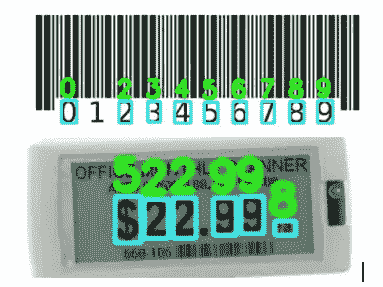

# 用 Keras 和 OpenCV 构建多位数检测器

> 原文：<https://towardsdatascience.com/build-a-multi-digit-detector-with-keras-and-opencv-b97e3cd3b37?source=collection_archive---------2----------------------->

## 用数据做很酷的事情！

# 介绍

数字在我们身边无处不在。无论是闹钟、健身追踪器还是条形码，甚至是亚马逊精心包装的快递包裹，数字无处不在。通过 [MNIST](http://yann.lecun.com/exdb/mnist/) 数据集，机器学习被用来读取单个手写数字。现在我们可以扩展到读取多个数字，如下所示。底层神经网络既进行手指定位又进行手指检测。这在各种 ML 应用中非常有用，比如读取商店中的标签、车牌、广告等。

Reading multiple digits

但是为什么不仅仅使用 OCR 呢？是的，OCR 可以是自动检测数字的一个很好的起点，但 OCR 并不总是有效，有时我们需要为我们的特定任务训练一个神经网络。

# **数字检测流水线**

数字检测问题可以分为两个部分

1.  数字本地化
2.  数字识别

**数字本地化:**

图像可以在任何位置包含数字，对于要检测的数字，我们需要首先找到包含这些数字的区域。数字可以有不同的大小和背景。

有多种方法可以检测手指的位置。我们可以利用简单的图像形态学操作，如二值化、腐蚀、膨胀来提取图像中的数字区域。然而，由于阈值、内核大小等调整参数的存在，这些可能变得对图像过于具体。我们还可以使用复杂的无监督特征检测器、深度模型等。

**数字识别:**

定位的手指区域用作手指识别过程的输入。 [**MNIST** 数据集](http://yann.lecun.com/exdb/mnist/)是手写数字识别的规范数据集。大多数数据科学家都用这个数据集做过实验。它包含大约 60，000 个用于训练的手写数字和 10，000 个用于测试的数字。一些例子看起来像:

MNIST Images

然而，现实生活场景中的数字通常非常不同。它们有不同的颜色，通常像下面的箱子一样印刷。

Day to day digit images

稍加研究，我们就可以看到另一个公共数据集[**SVHN——街景门牌号数据集**](http://ufldl.stanford.edu/housenumbers/) 。该数据集由从谷歌街景中收集的门牌号图像组成，并附有注释。下面是来自 SVHN 的示例图像:

SVHN Images

该数据集具有针对许多背景的各种数字组合，并且将更好地用于通用模型。

# **在 Keras 中建模**

我们选择这个 [repo](https://github.com/penny4860/SVHN-deep-digit-detector) 来实现多位数检测器。它写得很好，容易理解。

使用作为稳定特征检测器的**最大稳定极值区域(MSER)** 方法进行手指定位。MSER 主要用于图像中的斑点检测。斑点是像素的连续集合，其外部边界像素强度比内部边界像素强度高(给定阈值)。如果这些区域在变化的强度范围内没有太大的变化，那么这些区域被认为是最稳定的。MSER 的运行时复杂度较低，为 O(nlog(log(n)))，其中 n 是图像上的像素总数。该算法对模糊和缩放也是鲁棒的。这使得它成为提取文本/数字的良好候选。想了解更多关于 MSER 的信息，请点击[链接](https://www.toptal.com/machine-learning/real-time-object-detection-using-mser-in-ios)。

使用具有卷积、最大池和 FC 层的 CNN 来完成数字识别，这些层将每个检测到的区域分类成 10 个不同的数字。该分类器在测试集上达到 95%的准确率。

我们在各种例子上测试了回购，发现它运行得相当好。见上面分享的例子。

有一些差距，要么是定位器没有完美地工作(没有检测到数字 1 的位置)，要么是检测器失败了(检测为 5)。

# **结论**

我们希望这篇博客能成为理解多位数检测管道如何工作的良好起点。我们分享了一个很好的 github 链接，可以用来在 SVHN 数据集上建立模型。如果这种模式效果不好。你可以收集自己的数据，对训练好的模型进行微调。

我有自己的深度学习咨询公司，喜欢研究有趣的问题。我已经帮助许多初创公司部署了基于人工智能的创新解决方案。请到 http://deeplearninganalytics.org/[来看看我们。如果你有一个我们可以合作的项目，那么请通过我的网站或在**info@deeplearninganalytics.org**联系我](http://deeplearninganalytics.org/)

你也可以在[https://medium.com/@priya.dwivedi](https://medium.com/@priya.dwivedi)看到我的其他作品

**参考文献:**

*   [SVHN 数据集](http://ufldl.stanford.edu/housenumbers/)
*   [了解 MSER](https://en.wikipedia.org/wiki/Maximally_stable_extremal_regions)
*   [多位检测器代码](https://github.com/penny4860/SVHN-deep-digit-detector)