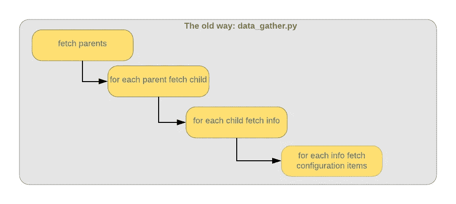

# 构建一个收集中顶级作者数据的渠道

> 原文：<https://towardsdatascience.com/build-a-pipeline-for-harvesting-medium-top-author-data-c4d7ed73729f?source=collection_archive---------9----------------------->

## 如何使用 Luigi 和 Docker 为 Medium 构建简单的数据工程管道


# 介绍

当我为数据工程管道编写的一些 Python 脚本失去控制时，这个项目的想法开始了:

*   管道需要数千个 API 调用 REST 服务，每个调用下载一个 JSON 文件。
*   管道的某些部分需要很长时间来运行，并且该过程有时会失败。

我的过程是这样的:



这些累积的 API 调用累积起来:

*   获取父对象( *1 请求*
*   对于每个父节点获取子节点( *150 个请求*
*   为每个孩子获取信息( *5000 个请求*)
*   对于每个 info fetch 配置项( *14，000 个请求……这已经很多了！)*

这是我使用的 API 的一个怪癖；没有办法进行批量请求。有许多问题:

*   这个序列运行了几个小时
*   如果出现故障，很难确定从哪里重新开始
*   没有办法检查进度；如果脚本已经运行了一个小时，它们是不是就要完成了？

咨询谷歌，我发现我的设计与[这个不做事的例子](https://marcobonzanini.com/2015/10/24/building-data-pipelines-with-python-and-luigi/)非常相似:


这东西已经长成了一个怪物。

# 路易吉来救援了

我四处寻找一个轻量级的数据工程框架，它可以支持:


A famous plumber

*   工作流程编排
*   并行处理
*   简单部署
*   快速学习曲线

考虑到这些要求， [Spotify Luigi](https://github.com/spotify/luigi) 看起来刚刚好:

> *Luigi 是一个 Python 模块，帮助您构建批处理作业的复杂管道。它处理依赖性解析、工作流管理、可视化等。*

Spotify 使用 Luigi 进行推荐音乐的数据工程批处理工作，例如 Discover Weekly 播放列表(尽管最近流行迪斯科，但我对 Discover Weekly 的选择还是很满意)。


*My face when I saw Luigi do all the things*

与 Luigi 一起工作令人惊讶地满足，我想知道如何在我的日常工作之外再次使用它。我想到在管道中重用这种方法来收集关于顶级媒体作者的数据，下面的文本描述了一个可以在其他领域重用的数据工程管道的简单框架。

这是面向[数据工程和](https://www.oreilly.com/ideas/data-engineers-vs-data-scientists)数据科学的，尽管 Luigi 的模块化架构应该可以直接添加分析组件。换句话说，这是一个用于提取数据的系统设计，而不是一种用于分析和从数据中获得洞察力的方法(可能是未来故事的主题)。


Luigi gets to work on the pipes

# 从媒体中获取有趣的顶级作者数据

我们的管道将收集出版物中顶级作者的数据:

1.  这位顶级故事作者关注的作者列表
2.  他们写的故事总数
3.  每个故事获得了多少掌声
4.  他们故事的平均标题长度
5.  他们故事的平均字数
6.  他们为之写作的出版物

关于 Medium API 的一个简短说明。API 本身相当有限。然而，您可以将`?format=json`附加到许多标准的中型 URL，这将返回通常显示在页面上的数据的 JSON 表示，以及一些额外的元数据。例如，[《走向数据科学》](https://towardsdatascience.com/)的首页用`?format=json`参数渲染成这样:

```
{"success":true,"payload":{"collection":{"id":"7f60cf5620c9","name":"Towards Data Science","slug":"towards-data-science","tags":["DATA SCIENCE","MACHINE LEARNING","ARTIFICIAL INTELLIGENCE","BIG DATA","ANALYTICS"],"creatorId":"895063a310f4","description":"Sharing concepts, ideas, and codes.","shortDescription":"Sharing concepts, ideas, and codes.","image":{"imageId":"1*F0LADxTtsKOgmPa-_7iUEQ.jpeg","filter":"","backgroundSize":"","originalWidth":1275,"originalHeight":1275,"strategy":"resample","height":0,"width":0},"metadata":{"followerCount":171879,"...etc
```

感谢 [Radu Raicea](https://medium.com/u/d540942266d0?source=post_page-----c4d7ed73729f--------------------------------) 的精彩文章[我如何使用 Python 找到有趣的人来关注 Medium](https://medium.freecodecamp.org/how-i-used-python-to-find-interesting-people-on-medium-be9261b924b0) 为我指出了这个特性。

JSON 结果需要一点清理:

Remove invalid characters from the response

# 具体细节

一个关键需求是使我的 Luigi 工作流的部署非常简单。关于部署环境，我只想假设一件事；Docker 守护进程是可用的。有了 Docker，我就不需要担心 Python 版本不匹配或其他环境差异。

不过，我花了一点时间才弄明白如何在 Docker 中运行 Luigi。

第一步是在它自己的容器中启动中央调度程序。你可以用一张现有的图片来做这件事，比如这张。

您可以向调度程序提交作业，如下所示:

```
PYTHONPATH='.' luigi --module top_artists Top10Artists  --date-interval 2012-07
```

这是用 Luigi docs 里的一个例子。

所以对于部署，这是我采取的方法；一个 docker 编写文件，包括:

*   Luigi 中央调度程序
*   Luigi 任务的独立的基于 Python 的容器
*   公开报告的 nginx 容器

tasks 容器的入口点休眠一段时间，然后启动 Luigi 管道，这个`sleep`代替了 cron 作业。

## 使用 Luigi 进行并行处理

我的脚本非常慢，我需要一种方法来并行运行多个 URL 获取过程，这导致了这样的设计:

*   一个`WrapperTask`包装了管道的所有组件
*   第一次 URL 获取获得需要单独查询的许多项目的列表(这是一个单独的请求)
*   这些块在工人之间划分，他们的工作结果被放入一个以每个工人 id 命名的文件中(例如`1.json`)
*   从这一点来看，这些文件被下游工人使用

该方法改编自[这篇文章](http://engineering.pivotal.io/post/luigi-data-science/)。

## 数据收集任务

对于中型数据采集管道，`WrapperTask`如下所示:

Pipeline wrapper

`requires()`方法完成了这里的大部分工作，建立了一个在`PipelineTask`被认为完成之前需要完成的任务列表。

流水线中的第一个任务是`FetchUserList`。这将从媒体出版物的首页获取媒体作者的列表。作者列表放在一个文件中，供下游任务使用。

Fetch a list of authors from a publication

在《走向数据科学》出版物上运行它，会给我们一个页面上提到的作者列表:

A list of publication authors

您可能会注意到，此结果中返回的作者列表与页面上显示的不匹配；那是怎么回事？原来，页面在加载时会向 Medium API 提交一系列请求，每个返回的 JSON 结果都包含一个指向该系列中下一组结果的指针。我们需要在获取数据时处理这种分页行为:

Handle Medium API paging

这个实现很大程度上借用了 Radu Raicea 的文章。

注意，在一个给定的管道中，只有一个`FetchUserList`任务将被执行，因为我们没有包含一个`file_number`参数。

下一个任务是`FetchUserFollowings`。这个任务将由许多工作器并发执行，并行化由`workers`配置参数控制。当任务开始执行时，它决定负责处理 JSON 文件的哪个部分。确定截面的逻辑由`get_part_of_list()`控制:

Split the whole list, so we can delegate a chunk to each worker

`ExtractUserMetrics`任务从帖子数据中挑选出一些有趣的数据点，例如每篇文章的总鼓掌次数:

Extract metrics

然后，我们可以从提取的故事数据中得出几个平均值:

Calculate averages

最后，这一行启动了这个过程:

```
luigi.build([PipelineTask()], workers=worker_count)
```

## 公开结果

您可能希望向最终用户公开这些报告，例如向您团队中的数据科学家公开。一个简单的方法是添加一个 nginx web 服务器，并列出输出目录的内容。这将允许任何人点击一个 URL 并下载报告，每天都有一个报告目录。

# 尝试一下

好吧，让我们踢轮胎这件事…

首先，通过在 luigi.conf 文件中指定一个`collection_id`来指定 URL 抓取的起点。

配置完成后，有几种方法可以运行代码:

1.  开发时，可以直接运行`__main__.py`。如果你想这样做，你需要先启动 Luigi。
2.  您还可以使用 docker-compose 运行整个应用程序堆栈:

```
docker-compose up -d
```

这将启动 Luigi、nginx 和任务容器，这将触发`__main__.py`。

检查总结报告，我们可以获得一些关于目前为《走向数据科学》撰写文章的一些顶级作者的信息。例如，我们可以获得当前顶级作者之一 [Will Koehrsen](https://medium.com/u/e2f299e30cb9?source=post_page-----c4d7ed73729f--------------------------------) 的一些汇总统计数据:

Some example metrics

干得好，威尔！

# 单元测试

我选择了 [pytest](https://docs.pytest.org/en/latest/contents.html) 作为测试框架。我喜欢 pytest 有两个主要原因:

*   它需要更少的样板代码
*   您可以使用常规的 assert 语句，而不需要记住特殊的语法

为了使用与生产版本不同的配置进行测试，您可以在测试中使用`luigi.configuration.add_config_path()`。这将从特定位置加载配置:

Find and load test configuration

我使用了`MockTarget`类，这样我可以以可重复的方式运行测试。我不希望一个测试依赖于前一个测试创建的数据，或者测试在完成运行后留下结果文件。`MockTarget`模拟一个 Luigi 目标，它将结果存储在内存中，而不是将它们写到文件系统中。

最后，为了允许在不要求端点可用的情况下测试 URL 请求，我使用了`[requests_mock](https://pypi.org/project/requests-mock/)`库。

Github 上提供了该示例管道的完整源代码:

[](https://github.com/lucrussell/docker-luigi) [## 吕克拉塞尔/多克尔-路易吉

### 从 Medium 获取顶级作者数据的数据工程管道— lucrussell/docker-luigi

github.com](https://github.com/lucrussell/docker-luigi) 

# 结论

这个项目是一个 Luigi 管道，用于从 Medium 收集顶级作者数据。该项目一开始只是一个简单的框架，用于编排一个有问题的数据工程过程。管道通过抓取出版物首页的 URL 来提取关于作者及其故事的信息，然后收集关于顶级作者的一些基本指标。它使用 Luigi 来协调 Python 逻辑，使用 Docker 来简化部署。