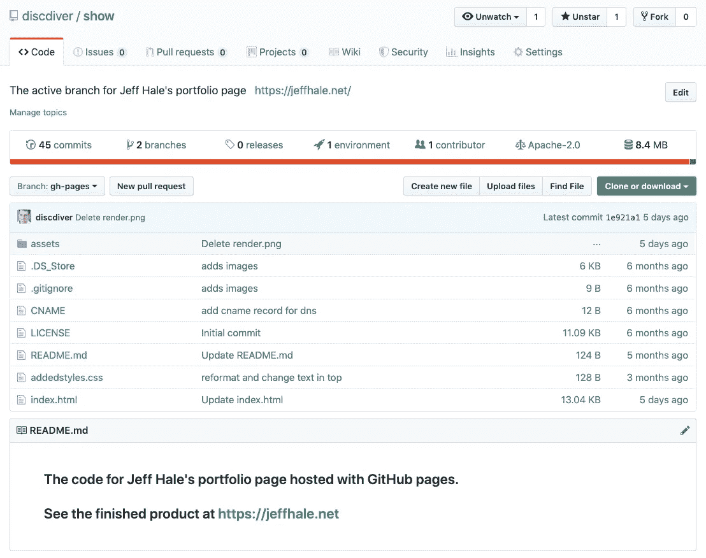
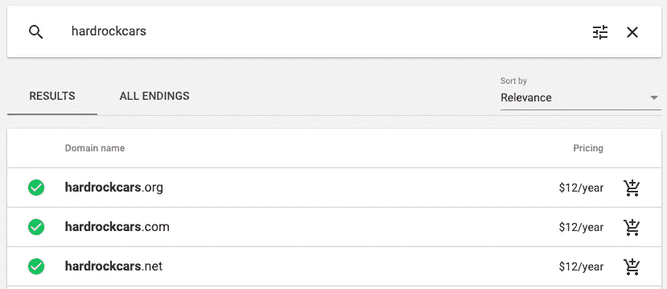
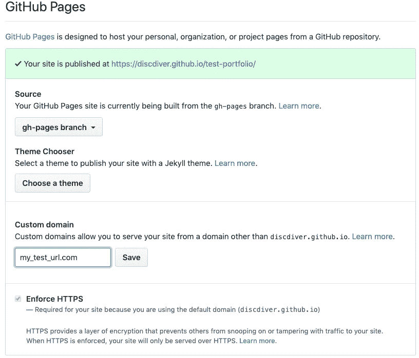
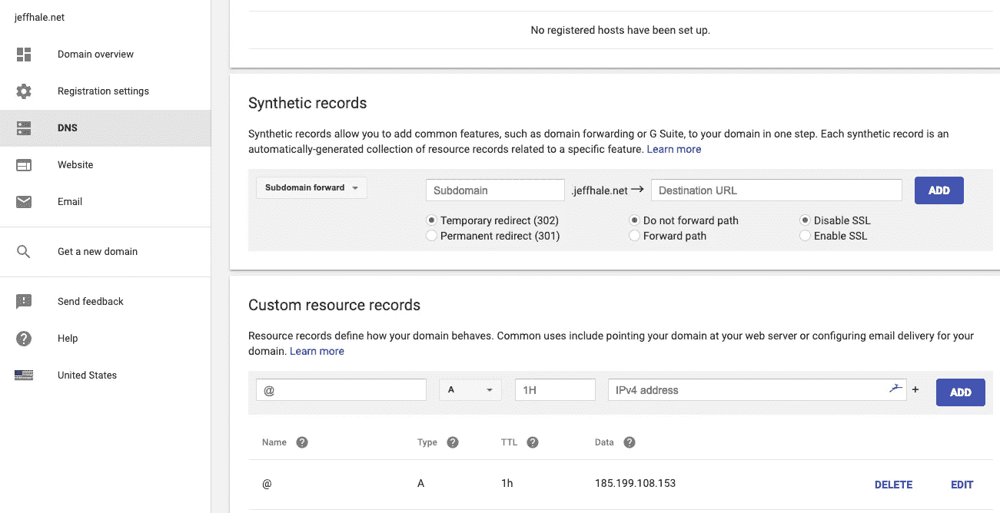
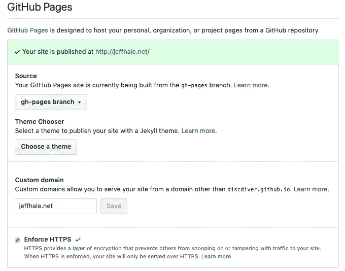
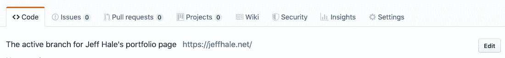

# 快速建立投资组合网站

> 原文：<https://towardsdatascience.com/build-a-portfolio-website-in-a-flash-9d5ec30a73a7?source=collection_archive---------16----------------------->

## 使用 GitHub 页面和 Google 域名创建静态网站的 12 个步骤

如果你是一名开发人员、数据科学家或设计师，你可能会被建议建立一个作品集网站。你的作品集向其他人展示了你能做什么，以及为什么他们应该与你合作发展一项事业、一个副业或一项新的事业。

但是导航选项来创建一个安全、便宜、响应迅速的网站是一个障碍，它经常阻止人们将他们的网站投入使用。我已经做了研究，建立了一个网站，将与您分享如何快速制作作品集网站。好消息是只需要 12 个步骤。😁

这是我网站的截图:

[https://jeffhale.net/](https://jeffhale.net/)

我不是说我的设计很壮观。😀我的重点是帮助你通过这个过程，让你可以在瞬间建立一个网站。然后，您可以对其进行样式化，并包含您喜欢的任何内容。

我们开始吧！🚀

# 12 步

1.  制作 GitHub repo
2.  克隆回购
3.  做一个 *gh-pages* 分公司
4.  创造 index.html
5.  添加引导启动代码
6.  添加内容
7.  本地查看网站
8.  推送至 GitHub
9.  在网上查看
10.  从谷歌域名购买自定义网址(可选)
11.  将您的自定义域指向 GitHub 页面(可选)
12.  启用 SSL(如果使用自定义 URL)

迭代！🔃

# 制作 GitHub Repo

如果您没有 GitHub 帐户，请参阅我的 [GitHub 工作流文章](/learn-enough-git-to-be-useful-281561eef959?source=friends_link&sk=549f0155d272316b6f06fa6f7818beee)了解如何获得一个。给你的回购命名。创造。gitignore、README.md 和许可证文件。

# 克隆回购

在本地机器上克隆您的 repo。如果您的本地机器上没有 git，请参考上面的文章获取它。

切换到您的本地存储库。创建一个名为 *gh-pages* 的新分支。

默认情况下，GitHub Pages 会根据名为 *gh-pages* 的分支中的内容自动更新您的站点。默认情况下，GitHub Pages 不会从您的主分支自动更新。

# 创造 index.html

移动到您的项目目录。用`touch index.html`做一个名为`index.html`的文件。如果你想学习 shell 常用命令，比如`touch`，请点击这里查看我的文章[。](/rock-the-command-line-52c4b2ea34b7?source=friends_link&sk=2fe341246739c30555246d4c3c552420)

在代码编辑器中打开您的`index.html`文件。

# 添加引导启动代码

我们将使用超级流行的 [Bootstrap](https://getbootstrap.com/docs/4.0/getting-started/introduction/) 框架，以最小的努力提供响应性 CSS 功能。

从 Bootstrap 复制并粘贴 starter 模板代码。如果你不需要 JavaScript 功能，那就去掉这一部分来加速你的站点。我在下面的代码片段中省略了 JavaScript 代码。

Bootstrap starter code without JavaScript

引导文档非常好。如果你以前没有用过 Bootstrap，我建议你花几分钟时间使用 [Bootstrap grid docs](https://getbootstrap.com/docs/4.0/layout/grid/) ，这样你就知道如何修改页面布局了。如果您需要提神剂(或清新剂😃)在 HTML 和 CSS 方面，建议你去看看 w3schools.com 的。

# 添加内容

将*标题*标签和*正文*标签的内容更改为 *Your_name 的作品集—* 或您喜欢的任何内容。

添加您的 HTML。我使用了三栏布局，在移动设备上切换到一栏。

如果你想制作其他的 CSS 样式，创建 *addedstyles.css* 并在你的 index.html*head*标签中包含`<link rel=”stylesheet” href=”addedstyles.css”>`。

我的代码可在[本回购](https://github.com/discdiver/show)获得。再说一次，我不是说我的设计很棒。我的重点是帮助你快速建立一个网站。

# 本地查看网站

您的网站可以在本地查看，而无需提供任何服务，因为这是一个静态网站。只要双击你电脑上的*index.html*文件，然后**砰！**你应该会在浏览器中看到你的投资组合。

# 推送至 GitHub

在 Git 中添加文件并提交您的工作。然后用`git push origin HEAD:gh-pages`推送到你的 *gh-pages* 分支。

[GitHub Repo](https://github.com/discdiver/show)

# 在网上查看

导航到*http://your _ git hug _ username . github . io/your _ repo _ name*。例如，我的站点在 http://discdiver.github.io/show/(现在它被转发到一个自定义域名)。您应该会看到与您在本地看到的相同的网页。

如果你想要一个每年 12 美元(税前，在美国是美元)的个性化网址，你可以这么做。

# 从谷歌域名购买自定义网址(可选)

如果你想要一个自定义域名，而不是 GitHub 页面的网址，我建议你从谷歌域名购买一个域名。多年来，我尝试了很多域名注册商，发现谷歌域名是目前最好的。

用你的谷歌账户登录，开始搜索域名。

Probably not what you want for your portfolio URL. 🚗

完成您的交易。您将在一分钟后回来管理 DNS 设置。

# 将您的自定义 URL 指向 GitHub 页面(可选)

GitHub 最近使得创建一个 CNAME 文件来链接你的自定义域名变得更加容易。👍

转到您的存储库的*设置选项卡*。向下滚动到 *GitHub 页面*，在*自定义域名*字段输入你的域名，按*保存*。GitHub 现在会自动为你的回购协议中的 DNS 创建一个 CNAME 记录。

Adding a custom url. Note that the Enforce HTTPS checkbox will be unchecked after you save.

现在我们需要修改连接的 Google Domains 端的内容。

在您的 Google Domains 帐户中，选择 *DNS* 选项卡并向下滚动到*自定义资源记录*。留着@。在 IPv4 地址字段中键入以下内容:*185.199.108.153*。

After updating Google Domains DNS tab.

然后添加一个 CNAME 记录，这样就可以解析你的 url 的版本。将 *www* 放入第一个字段，从下一个下拉字段中选择 *CNAME* ，并将 *@* 放入 *IPv4 地址*字段。

应该可以了！拿一杯水🚰当您的更改传播时。然后导航到 *http://your_custom_url* 。你应该看看你的网站。酷！

# 启用 SSL(如果使用自定义 URL)

启用 SSL 是个好主意，这样你的站点会更安全，你的 https 前缀也会起作用。启用 SSL 只需在您的 repo 的*设置*选项卡中点击一下。我不知道为什么添加自定义域时设置会关闭。

在 GitHub 页面部分，点击*强制 HTTPS* 的复选框。请注意，选中复选框后，您不必保存任何内容。

Check the box for HTTPS

现在当你导航到 *https://your_url* 时，你应该会看到你的站点，而不是一个错误。你有一个功能正常的投资组合网站。酷毙了。😀

不要忘记更新你的 GitHub master 分支中的自述文件，这样人们就知道在哪里可以找到你的 live 站点。GitHub 上的*编辑*按钮也可以让你包含一个网站链接。👍

Note the *Edit* button on the right

是时候让你的网站变得更漂亮了。

# 重复

有许多关于如何建立你的作品集内容的文章。这是一个有很多好建议的人。

有些人推荐大项目，有些人推荐小项目，有些人推荐混合项目。我不打算参加这场辩论，但我将提出一些一般性建议。

*   添加一些链接和图片。如果你不是设计师，你不需要走极端——只要确保你的作品集看起来干净专业。
*   确保你的作品集在手机和桌面上都很好看。Bootstrap 的响应式设计让这变得相当简单。
*   除非你在自述文件、博客帖子或 Jupyter 笔记本中讨论一个项目，否则我建议你在文件夹中谈一谈。
*   如果你把你的投资组合放在一起，发现它有缺口，开始填补这些缺口。如果你正在做你的第一个项目，不要气馁。每个人都从第一个项目开始了他们的旅程。😁
*   将你的作品集交给几个你信任的人，他们会给出诚实的反馈。
*   当你准备好与全世界分享你的作品集时，用你作品集的 URL 更新你的 LinkedIn 个人资料。
*   如果你怀疑自己有冒名顶替综合症，担心你的作品集永远不会准备好，当你认为已经完成 95%的时候，分享你的作品集。您可能会发现设置上线截止日期很有帮助。
*   记住你的作品集是一项正在进行的工作。更新它，因为你有更多的项目要添加。

随意给你的网站添加更多的复杂性:杰基尔、T2、盖茨比。你可能想用 [Sass](https://sass-lang.com/) 来管理风格。

我网站的代码可以在 GitHub repo 中找到。随意叉它去镇上。🍴

# 包装

在这篇文章中，你看到了如何用 12 个步骤建立你的投资组合网站。我希望这个指南对你有用。如果你有，请在你最喜欢的社交媒体上分享，这样其他人也可以找到它。😀

你可以用同样的方法建立任何静态网站，而不仅仅是作品集网站。

我撰写关于数据科学、Python、云计算和其他技术主题的文章。如果你对其中的任何一个感兴趣，请查看它们并在这里跟随我。

为了确保你不会错过精彩的内容，请加入我的[邮件列表](https://dataawesome.com)。👍

如果你用这个指南做一个项目或作品集——我很想看看你会做些什么——在 [Twitter @discdiver](https://twitter.com/discdiver) 上给我加标签。

快乐组合！😁

