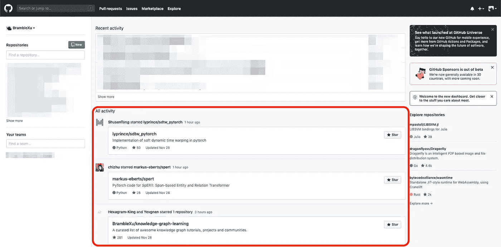
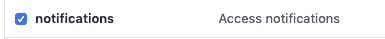
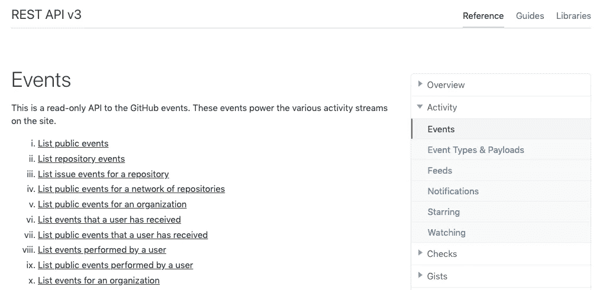
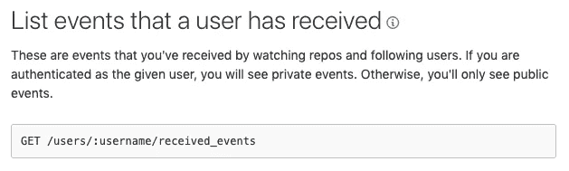
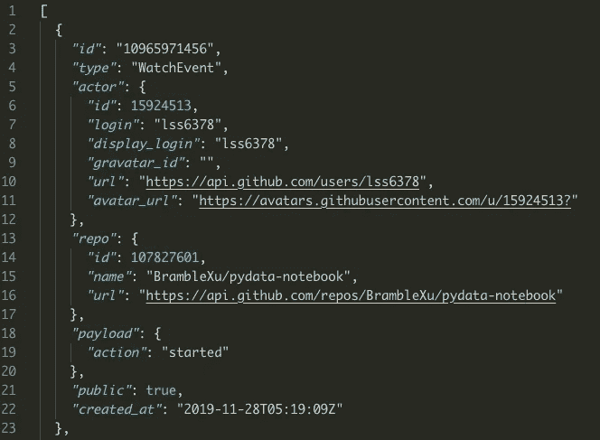

# 用 GitHub API 构建一个 Python 爬虫来获取活动流

> 原文：<https://towardsdatascience.com/build-a-python-crawler-to-get-activity-stream-with-github-api-d1e9f5831d88?source=collection_archive---------21----------------------->

## 从头做起


在我之前的文章[用一个简单的 Python 爬虫](/download-course-materials-with-a-simple-python-crawler-94e06d5f84b5)下载课程资料中，我介绍了一个简单的 Python 爬虫来下载文件。要构建这样一个爬虫，我们必须自己找到文件的模式。但是如果我们想从著名的网站收集数据，比如 Twitter 和 GitHub，事情可能会简单一些。因为通常，这些网站都提供了 API，我们可以直接获取我们想要的数据。在这篇文章中，我将构建一个 Python 爬虫来用 GitHub API 获取活动流。

# 1 个目标

[活动流](https://www.wikiwand.com/en/Activity_stream)显示用户最近的活动，例如下面显示的是我在 GitHub 中的活动。



activity stream in GitHub

我想得到如下这些活动

```
ShusenTang starred lyprince/sdtw_pytorch
chizhu starred markus-eberts/spert
Hexagram-King starred BrambleXu/knowledge-graph-learning
Yevgnen starred BrambleXu/knowledge-graph-learning
......
```

# 2 用 GitHub API 获取数据

## 2.1 GitHub API

首先，我们来看看 [GitHub API 文档](https://developer.github.com/v3/)。如果您**没有启用** [**双因素认证**](https://help.github.com/en/github/authenticating-to-github/configuring-two-factor-authentication) ，您可以运行下面的命令来测试 API。输入密码后，您应该会看到响应。

```
$ curl -u '<usename>' [https://api.github.com](https://api.github.com)
Enter host password for user '<usename>': <password>{
  "current_user_url": "[https://api.github.com/user](https://api.github.com/user)",
  "current_user_authorizations_html_url": "[https://github.com/settings/connections/applications{/client_id](https://github.com/settings/connections/applications{/client_id)}",
  "authorizations_url": "[https://api.github.com/authorizations](https://api.github.com/authorizations)",
 ......
```

但是**如果您已经启用了** [**双因素认证**](https://help.github.com/en/github/authenticating-to-github/configuring-two-factor-authentication) **，我们需要使用** [**个人访问令牌**](https://help.github.com/articles/creating-a-personal-access-token-for-the-command-line) **来进行认证**。按照帮助页面创建个人令牌。至于访问权限/范围，因为我们只想获得活动流，选择*通知*就足够了。



如果一切顺利，我们现在应该有一个令牌。按照[认证指令](https://developer.github.com/v3/#authentication)使用以下命令测试令牌。

```
$ curl -H "Authorization: token <TOKEN>" [https://api.github.com](https://api.github.com)

{
  "current_user_url": "[https://api.github.com/user](https://api.github.com/user)",
  "current_user_authorizations_html_url": "[https://github.com/settings/connections/applications{/client_id](https://github.com/settings/connections/applications{/client_id)}",
  "authorizations_url": "[https://api.github.com/authorizations](https://api.github.com/authorizations)",
  .......
```

## 2.2 获取激活流

在[其他认证方式](https://developer.github.com/v3/auth/#via-oauth-and-personal-access-tokens)中，我们可以使用下面的命令直接获取用户数据。

```
$ curl -u <usename>:<TOKEN> [https://api.github.com/user](https://api.github.com/user){
  "login": "xxxx",
  "id": xxxxx,
  "node_id": "xxxx",
  "avatar_url": "[x](https://avatars1.gi)xxx",
  ......
```

接下来，我们需要浏览 API 文档来找到与活动相关的 API。在右侧的切换列表中，“活动”下有“事件”、“提要”、“通知”。但是我们需要确定哪个适合我们的需求。



浏览文档后，我们可以知道“事件”下的“[列出用户收到的](https://developer.github.com/v3/activity/events/#list-events-that-a-user-has-received)的事件是我们需要的。



我们可以用这个 API 命令测试`curl`命令。

```
$ curl -u <usename>:<TOKEN> https://api.github.com/users/<usename>/received_events
```

这会返回很多消息，所以最好将响应保存为 JSON 文件。

```
$ curl -u <usename>:<TOKEN> https://api.github.com/users/<usename>/received_events > github_stream.json
```

# 3 分析 JSON 文件

我们可以查看 JSON 数据来熟悉格式。



似乎有不同种类的事件类型。我们可以编写一个简单的脚本来获取各种事件类型。

```
import jsonwith open('github_stream.json', 'r') as f:
  data_string = f.read() # read object as string
  data = json.loads(data_string) # convert JSON (str, bytes or bytearray) to a Python object# Get all event types
events = set()
for event in data:
  events.add(event['type'])
print(events)# output
{'IssueCommentEvent', 'ForkEvent', 'PushEvent', 'PullRequestEvent', 'WatchEvent', 'IssuesEvent'}
```

通过比较我们在 GitHub 主页上看到的活动流，我们可以看到只存在三种事件类型，WatchEvent(星号)、ForkEvent(分叉)、PushEvent(推送)。

所以我们只需要从这三种事件类型中获取活动。下面是剧本。

```
# github-api-json-parse.pyimport jsonwith open('github_stream.json', 'r') as f:
  data_string = f.read() # read object as string
  data = json.loads(data_string) event_actions = {'WatchEvent': 'starred', 'PushEvent': 'pushed to'}for event in data:
  if event['type'] in event_actions:
    name = event['actor']['display_login']
    action = event_actions[event['type']] 
    repo = event['repo']['name'] 
    print('{name} {action} {repo}'.format(name=name, action=action, repo=repo))if event['type'] == 'ForkEvent':
    name = event['actor']['display_login']
    repo = event['repo']['name']  
    forked_repo = event['payload']['forkee']['full_name'] 
    print('{name} forked {forked_repo} from {repo}'.format(name=name, forked_repo=forked_repo,repo=repo))
```

运行脚本，我们可以得到下面的输出。

```
ShusenTang starred lyprince/sdtw_pytorch
chizhu starred markus-eberts/spert
Hexagram-King starred BrambleXu/knowledge-graph-learning
icoxfog417 pushed to arXivTimes/arXivTimes
icoxfog417 pushed to arXivTimes/arXivTimes
Yevgnen starred BrambleXu/knowledge-graph-learning
......
```

# 4 实时获取激活流

直到现在，我们都可以通过 API 获取 JSON 数据文件，解析 JSON 文件得到活动流。接下来，我们将消除 JSON 文件，直接获得活动流。

> ***查看我的其他帖子*** [***中等***](https://medium.com/@bramblexu) ***同*** [***一分类查看***](https://bramblexu.com/posts/eb7bd472/) ***！
> GitHub:***[***荆棘徐***](https://github.com/BrambleXu) ***领英:*** [***徐亮***](https://www.linkedin.com/in/xu-liang-99356891/) ***博客:***[](https://bramblexu.com)

# ***参考***

*   *[用一个简单的 Python 爬虫下载课程资料](/download-course-materials-with-a-simple-python-crawler-94e06d5f84b5)*
*   *[https://developer.github.com/v3/](https://developer.github.com/v3/)*
*   *[https://developer . github . com/v3/auth/# via-oauth-and-personal-access-tokens](https://developer.github.com/v3/auth/#via-oauth-and-personal-access-tokens)*
*   *[https://developer . github . com/v3/activity/events/# list-events-a-user-has-received](https://developer.github.com/v3/activity/events/#list-events-that-a-user-has-received)*