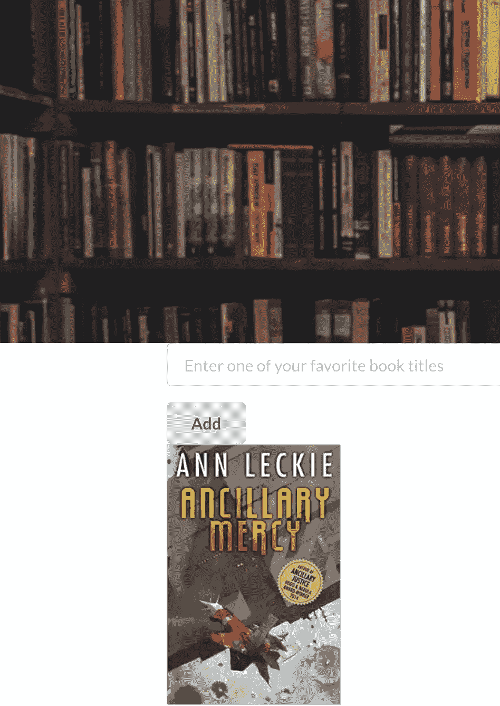

# 构建一个 React + Flask 应用程序，用 Python 图形推荐小说

> 原文：<https://towardsdatascience.com/build-a-react-flask-app-that-suggests-novel-novels-with-a-python-graph-9491e714bbdf?source=collection_archive---------12----------------------->

Photo by [Kourosh Qaffari](https://unsplash.com/@kqpho?utm_source=medium&utm_medium=referral) on [Unsplash](https://unsplash.com?utm_source=medium&utm_medium=referral)

**项目总结**:

*   建立一个用户和他们阅读的书籍的图表数据库
*   开发一个 Flask 应用程序，根据用户提交的收藏夹向用户提供稀有、有趣的书籍
*   实现一个与 Flask +我们的 Graph 集成的 React 应用程序，向用户展示他们下一本最喜欢的书

有很多学习数据科学技术的好资源:MOOCS、博客、教程和训练营都是学习的途径。就我个人而言，我通过从事我觉得有趣和吸引人的项目学习得最好。没有什么比解决一个有趣的问题更能激励我把自己的理解水平推向新的高度了。我如何确定我可以探索的新途径？一般靠看别人的作品！

这个项目的想法最初是通过阅读维基·博伊基斯在伟大的[博客](https://vicki.substack.com/p/big-recsys-redux-recs-at-netflix)上发表的关于*网飞*推荐引擎性质变化的帖子而实现的。简而言之(抱歉，维基)，通过矩阵分解或深度学习来最小化用户评级偏好的 RMSE 的日子已经一去不复返了。推荐在一定程度上仍然是一种艺术形式，上下文、细微差别和设计都在为用户提供良好体验方面发挥着重要作用。此外，推荐的商业价值不仅仅是为用户提供最好的内容。在*网飞*的情况下，可能是为了给用户提供最好的*网飞*内容。

我很高兴参加今年在哥本哈根举行的 RecSys 2019 大会。[最佳论文](https://arxiv.org/abs/1907.06902)的获胜者是*而不是*最先进的神经网络方法。相反，它是对以前的开源推荐系统、公共数据集以及它们在面对面比赛中的实际表现的仔细检查。结果，你可能会问？简单模型(基于图形、用户/项目最近邻居、热门项目)几乎总是优于最佳深度神经网络。

可以肯定地说，鉴于这些启示，我一直在重新思考推荐系统。作为一个用户，我想从 *YouTube* 的推荐引擎中得到什么？像 [Ecosia](http://ecosia.org) /DuckDuckGo 这样的搜索引擎呢？在前一个例子中，我可能想看在那个时刻娱乐/通知我的视频。在后一个例子中，我希望快速找到最相关的信息，而不用担心利益冲突。在这两种情况下，返回的项目可能不是最受欢迎的，最高评级的，或有争议的。广告商有时发现病毒式传播是有利可图的，但我可能不是一个粉丝。

那么我真正想要的是什么？我怎样才能建立一个系统来优化这个难以实现的、无利可图的目标呢？有一天，当我步行去图书馆时，我的脑海中出现了一个具有里程碑意义的清晰时刻:当我找到一个我从未考虑过或听说过的新作者或新书时，我绝对喜欢。当我翻阅书页时，那个时刻的纯粹发现和新奇感可以激发几个星期的快乐。

花在阅读一本书上的时间是一种投资，因此尝试任何新事物(探索与利用)可能是一个困难的命题。一个仅仅推荐随机项目的系统可能会提供意想不到的结果，但它们可能不是好的结果。我想鱼和熊掌兼得。我想找到我以前从未考虑过的好书。

这个想法很简单:

*   和我阅读和喜欢相同书籍的人可能和我有大致相似的品味
*   这些邻居可能读过很多书，其中一些我没有读过
*   这些未读的书中，有些可能是如此晦涩/冷门，以至于我不太可能自己去发现它们

以上陈述都不会让你感到惊讶，尤其是前两点。当然，最后一点对这项工作来说是最基本的。如果我建立一个图书、作者和读者的图形数据库，然后沿着图形的节点寻找这些隐藏的图书瑰宝，会怎么样？

GoodReads 网站已经发布了一个包含 10，000 本书、50，000+用户和近 600 万个书籍评级(1-5 星)的数据集。我肯定能在这个宝藏中找到一些有趣的东西！我从来没有建立过真正的图形，所以我认为这将是一个伟大的尝试。节点和边，能有多难？这个图的节点是`Users`、`Books`和`Authors:`

边缘是与每个`(User, Book, Author, rating)`元组相关联的评级:

我首先创建了 4 个类来解释我的图形组件。每个节点还会有一个与之关联的列表:`Users`会有一个`Books`的书架，`Authors`会有他们的参考书目，`Books`会有他们的受众。`Graph`将把所有这些对象连接成一个可以被遍历的内聚单元。

上面的代码块很大，里面有很多方法，这里就不探讨了。我们将关注一个可以直接与一个简单的、面向消费者的 React 应用程序 API 一起使用的 API: `_book2book`。所以让我们说，我们现在可以绕着我们的图走，一切都编译好了。我们如何才能找到有意义的`Books`呈现给`User`？在我们看来，让我们假设一下:

1.  作为一个`User`，你喜欢一个`Author`的`Book`(例如，五星评级)
2.  这个`Author`粉丝很多，她也写过类似的`Books`你可能也会喜欢。这些不是小说，你可能已经知道了。
3.  这个`Author`有很多粉丝，有些可能和你差不多
4.  这些`Users`中的一个被随机选中，将会有一个收藏`Books`的架子
5.  从这个货架上选择最不受欢迎的五星级`Book`
6.  要么将此提交给`User`，要么返回步骤 1，继续浏览图表

Simplistic example of our graph

现在我们只需要将这个`Book`返回给我们的`User`作为一个可能的伟大发现！不过，我们遗漏了这个项目的关键要素。我们需要应用程序来提供这些有趣的`Book`。为了熟悉起见，让我们从仍然基于 Python 的部分开始:我们需要构建处理 API 请求的应用程序后端，因此，当然，我们将使用 [Flask](https://franckjay.github.io/blog/2019/11/02/%22https://palletsprojects.com/p/flask/%22) 。Flask 允许我们用 Python 制作一个小型的 web 服务器，而且非常容易使用。我发现两个教程非常有用，它们很好地链接在一起:一个 Flask [教程](https://franckjay.github.io/blog/2019/11/02/%22https://www.youtube.com/watch?v=Urx8Kj00zsI&t=421s%22)和一个调用前面提到的 Flask 应用的 [React 应用](https://franckjay.github.io/blog/2019/11/02/%22https://www.youtube.com/watch?v=06pWsB_hoD4&t=233s%22)。

所以我们首先创建一个新目录，我们称之为`api/`。在这个文件夹中，我们将有两个 python 文件。`__init__.py`将建立我们的烧瓶应用程序的基础，导入必要的变量等。：

然后是一个`app.py`(或者随便你怎么称呼):

app.py Example

在`app.py`里面，我们正在做一些重要的事情。首先，我们调用 python 代码来构建我们的图形数据库，以查找新书。它还设置了我们后端的`Blueprint`，所以当我们对这个服务进行 API 调用时，我们指向了正确的方向。让我们从最基本的层面解开这些东西:

*   我们的应用程序名称被初始化为`@main`，但是我们也可以在这里有其他的东西
*   我们在我们的`@main`应用中托管了两个`.routes`:`/input_book`和`/novel_novel`
*   你可以把它们想象成我们 Web 应用程序上的独立页面，它们都处理不同的行为
*   `GET`和`POST`的 HTTP 方法，它们从我们的后端获取一些东西或者向它发送一些东西(好术语！)

对于`/input_book`调用，我们正在做的是从网页上的`User`接收一个原始文本输入，将其打包成一个看起来像`{"book": "book_title"}`的 JSON，然后更新后端服务器。在这种情况下，我们使用这本书来寻找`User`可能喜欢的类似的稀有书籍。我们用这个输入调用 Graph，并将一个`global` python 变量设置为输出图书的图像 URL。

现在你可以想象 WebApp 会对 Flask App 进行第二次 API 调用，说“那个输入的输出是什么？”。这是我们在`/novel_novel`中的`GET`调用，它也返回一个 JSON。对你们大多数人来说，这听起来很合理，对我来说也是如此。你可能以前用过 Flask。但是你以前做过`React` App 吗？

React 是一个脸书赞助的开源 JavaScript 库，旨在使用户界面更容易编码。我仍然花了一些时间来学习一些 JavaScript 基础知识，理解 React 的语法，并试图让一切看起来体面。我使用的两个重要资源是[之前提到的 YouTube](https://franckjay.github.io/blog/2019/11/02/%22https://www.youtube.com/watch?v=06pWsB_hoD4&t=233s%22) 和[这篇](/create-a-complete-machine-learning-web-application-using-react-and-flask-859340bddb33)关于数据科学的文章。视频指南利用了第二个 React 库`semantic-ui-react`，这使得应用程序的构建更加容易，所以我基本上遵循了他们的建议。老实说，你也应该这样。安装必要的工具、构建样板文件`App.js`以及解释编写函数的基础工作最好留给 JavaScript 专业人员去做。

不过，我将详细介绍一下实际的 React 组件，这些组件是我为了与我们的图表集成在一起而组装的。这里的主要函数是`App.js`文件，所以我们将首先解包它。我们导入必要的库，初始化`App()`，然后返回一些类似 HTML/JavaScript 的实体(部门、容器、图像等)。):

App.js

你会注意到在`Container`里面我们有两个组件:`<BookEntry/>`和`<GrabBook/>`。这些对应于我们 Flask 应用程序中的两个 API 调用，这是我们的图形理解的标题`POST`，然后执行一个`GET`调用来为用户抓取我们感兴趣的新小说。让我们先来看看更复杂的组件`BookEntry`:

我们从这个组件`{ Form, Input, Button }`中的`semantic-ui-react`导入了一些额外的包。我们希望用户将文本输入到与他们喜欢的书名对应的`Form`中，然后点击提交`Button`。首先，我们初始化几个变量(`const [title, setTitle]`)并设置默认值`= useState('');`，一个空字符串。

接下来，我们构建`<Form.Field>`，并添加一个`placeholder`值，为用户提供做什么的指示。一旦用户输入了一些文本，我们将`title`的`useState`设置为输入的文本。轻松点。

接下来，我们添加一个形状为`Button`的新`<Form.Field>`，用户可以在文本输入的正下方点击它。单击按钮(`<Button onClick= ...`)，我们通过`await fetch("/input_book"`调用对我们的 API 进行第一次调用。回想一下，在我们的 Flask 应用程序中，我们的蓝图有`@main.route('/input_book'`，所以这个调用在这个接触点上到达我们的后端。这个`POST`调用的返回值只是一个`response`,表示当且仅当我们在图中找到标题时一切正常。否则我们返回一个`400`并要求用户提交一个新的标题。有可能我们的数据库没有标题，或者可能拼写不同，等等。，所以我们不希望我们的应用程序在这些情况下崩溃。

在进入下一个组件之前，我鼓励任何试图构建这些 web 应用程序的人在代码中到处使用`console.log()`调用。它们不仅有注释的双重作用，在调试代码时也很有帮助。回想一下，你只需右键点击 Chrome 中的任何网页，`Inspect`，然后打开`console`标签，你就可以看到正在发生的一切。

所以，让我们假设一切进展顺利，我们已经找到了相关的标题。现在我们实际上必须在我们的`GrabBook`组件中为用户返回一本新书:

这里我们通过一个`fetch("/novel_novel")`对`POST`端点进行另一个 API 调用。请记住，我们正在返回一个类似于`{"image_url": "http://image_of_book.png"}`的 JSON 对象。然后，我们将它传递给一个`<Image>`块，该块呈现图像并将其返回给我们的应用程序。酷！

The input was Neuromancer by William Gibson. The output is a great book!

公平地说，这个页面看起来不怎么样。如果你是 React 专家，请告诉我如何才能让布局看起来更好:

*   提交请求后，需要刷新页面以显示正确的图像。
*   我也更喜欢背景图片覆盖整个页面，并且表单域在它的前景中。

**这项工作并不打算成为一个商业化、生产就绪的系统。这是一次有趣的学习冒险，并且在它的范围内发人深省。如果你有兴趣查看的话，这里有一个[回购](https://github.com/franckjay/GoodReadsGraph)的链接。**

谢谢你的来访！欢迎在下面评论，求书。我个人已经从图表中找出了 10 多条建议，我几乎总是对结果感到惊讶。我很高兴我研究了这些建议，虽然有些不是我喜欢的，但其他的都是很棒的发现。