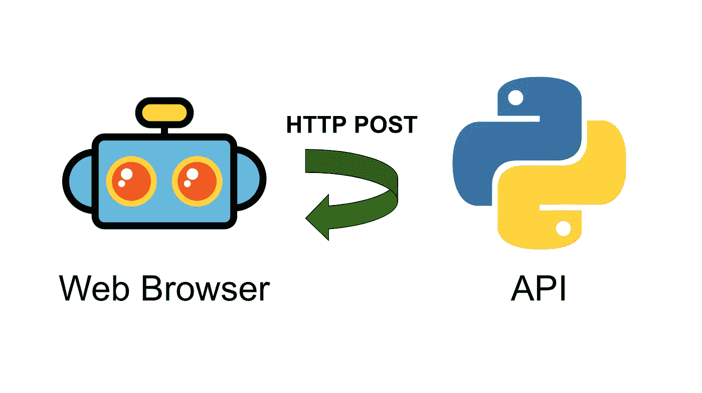

# 用 Python 和 Google Search 构建一个简单的聊天机器人

> 原文：<https://towardsdatascience.com/build-a-simple-chatbot-with-python-and-google-search-c000aa3f73f0?source=collection_archive---------1----------------------->


Build a Simple Python ChatBot from Scratch Using Google Search

今天我们要构建一个 Python 3 聊天机器人 API 和 web 界面。聊天机器人很难构建，因为有无限多的输入。正因为如此，一个能够不断给出好答案的聊天机器人需要大量的知识。

开发人员通常会将机器学习算法、NLP 和预定义答案的语料库应用到他们的聊天机器人系统设计中。我们将保持我们的代码基本，所以我们将绕过为我们的聊天机器人创建一个复杂的“大脑”。

我们不会建立一个人工智能大脑，而是使用一个免费的和已经建立的大脑:谷歌搜索。

我们的聊天机器人将对用户的查询执行 Google 搜索，从第一个结果中抓取文本，并用该页面文本的第一句话回复用户。

我们开始吧！顺便说一下，所有提到的代码都在 [Python ChatBot GitHub 库](https://github.com/lmzach09/Python_ChatBot_Google)中。

# 用 Python 在 Google 中查询聊天机器人回复

为了用 omniscience(无限知识)编写简单的聊天机器人，我们将在 Python API 中进行 Google 搜索。幸运的是，有一个 [Google search Python 库](https://pypi.org/project/google/)，我们可以用 pip 安装它。

在本地安装了 Google 库之后，您可以像这样编写 Python 代码:

一旦我们从搜索结果中获得了一个 URL 列表，我们就可以使用 [Python 请求库](https://pypi.org/project/requests/)对该网页进行 GET 请求。我们也可以通过使用来自 [lxml](https://pypi.org/project/lxml/) 的`html`和 [BeautifulSoup](https://pypi.org/project/beautifulsoup4/) 来解析 HTML。

这个项目的所有 Python 依赖项都可以在 GitHub 存储库的`[requirements.txt](https://github.com/lmzach09/Python_ChatBot_Google/blob/master/requirements.txt)` [文件中找到。](https://github.com/lmzach09/Python_ChatBot_Google/blob/master/requirements.txt)

这是一个完整的文件，我们的 HTTP 服务器可以将它作为一个依赖项导入。我制作了一个方法，它可以进行 Google 搜索，获取网页上的第一个`<p>`，并以字符串形式返回其内容。如果搜索以任何方式失败，聊天机器人将回复“对不起，我想不出答案。”

现在我们可以接受用户输入并进行谷歌搜索。我们将对搜索的第一个结果发出一个 HTTP GET 请求。然后我们解析返回的 HTML，分离出该页面上第一个`<p>`中的第一句话。这是我们聊天机器人的回复算法，不需要机器学习。

# 一个简单聊天机器人的 Python API

接下来，我们需要建立一个服务器应用程序，这将是我们的聊天机器人查询的 API。它将响应 HTTP 请求。首先，这些请求将来自一个简单的 HTML 页面，我们稍后会制作这个页面。



首先，我们将导入 Python 3 HTTP 服务器和 socket 服务器库，以及我们之前创建的 Google 搜索文件。

我们的 API 将在端口 8080 上提供服务，我们将从项目的父目录中名为`public`的文件夹中提供网页资产。接下来，我们将为 GET 和 POST 请求创建自己的处理程序。

HTTP GET 请求将尝试从`public`文件夹中返回相应的文件。这些将是我们 web 浏览器界面的 HTML、CSS 和 JavaScript 文件。帖子请求将用于聊天机器人查询。

最后，我们将启动服务器并使用我们的处理程序。这是整个文件，包括上面的代码片段。

我们可以使用 CURL 来测试带有 POST 请求的聊天机器人 API。

```
curl -d "how old is samuel l jackson" [http://localhost:8080](http://localhost:8080)
```


Screenshot of POST request output of the ChatBot API

接下来我们将制作一个可以查询这个 API 的 HTML 页面。最终，我们将拥有一个端到端的聊天机器人，提供复杂的答案。

# 构建聊天机器人网页

我们的网页将非常简单。它将包含一个机器人的图片，一个文本输入字段和一个提交按钮。每当用户提交一个输入，chatbot API 就会通过 POST 请求到达。从 API 返回的文本答案将被填入网页。

这是 HTML 页面。将此作为`index.html`保存在我们之前提到的`public`文件夹中。机器人的图像文件也在完整的 [Python ChatBot GitHub 库](https://github.com/lmzach09/Python_ChatBot_Google)中。

接下来，我们将为这个网页做一些快速的样式。将这个 CSS 文件也保存在`public`文件夹中。它已经在 HTML 文件的`<head>`部分被引用。

现在，您应该有一个简单的聊天机器人网页可供用户输入。以下是截图:


ChatBot Web Page Screenshot

网页还没有完全为用户准备好。它需要 JavaScript。

我们将编写一些 JS 来检测用户按下回车键并点击提交按钮。当这些事件中的任何一个发生时，我们将获得用户输入字段中的文本，并将其作为我们的 Python 服务器的 POST 主体。

我们将使用`fetch`方法向 Python API 服务器发出 HTTP POST 请求。现代网络浏览器现在默认包含了获取 API 。

这是我们与 3 个 HTML 元素交互的简单 JavaScript。将此作为`app.js`保存在[公共文件夹](https://github.com/lmzach09/Python_ChatBot_Google/tree/master/public)中。

我们几乎准备好将我们的 Python 聊天机器人投入生产了。

# 运行我们从头开始制作的简单 Python 聊天机器人

现在我们已经写完了所有的代码，在运行全栈 Python 聊天机器人之前，我们还有一个步骤。如果还没有，在项目的父目录中创建一个`requirements.txt` [文件，与 2 个 Python 文件放在一起。该文件是一个 Python 范例，用于轻松安装项目的依赖项。](https://github.com/lmzach09/Python_ChatBot_Google/blob/master/requirements.txt)

使用命令行转到 ChatBot 项目的父目录。运行 Python 库安装命令。

```
pip install -r requirements.txt
```

您的机器现在拥有运行聊天机器人所需的所有库！让我们运行全栈应用程序。

```
python server.py
```

接下来打开你的网络浏览器，进入 [http://localhost:8080/](http://localhost:8080/) 。如果你看到聊天机器人的图像，它正在工作。

尝试一些输入！

> 谁扮演了钢铁侠
> 
> 塞缪尔·杰克逊多大了
> 
> 火星上的天气怎么样

你可以看到，我们的聊天机器人回复并不完美，但对于几分钟的工作来说已经很不错了。

我会继续用 Python 探索 AI 和机器学习，我会分享我的发现。[查看我的媒体页面](https://medium.com/@lelandzach)的 JavaScript、 [Dart](https://medium.com/@lelandzach/dart-isolate-2-way-communication-89e75d973f34) 和 Python 指南。